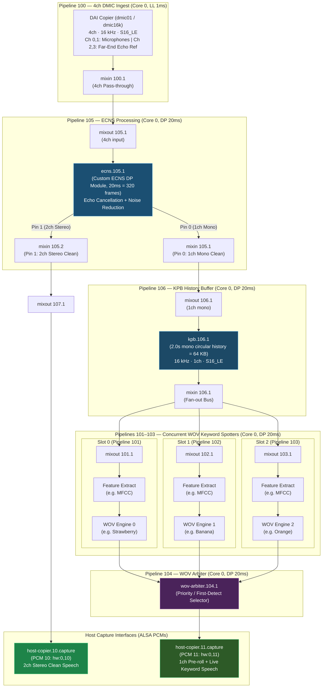
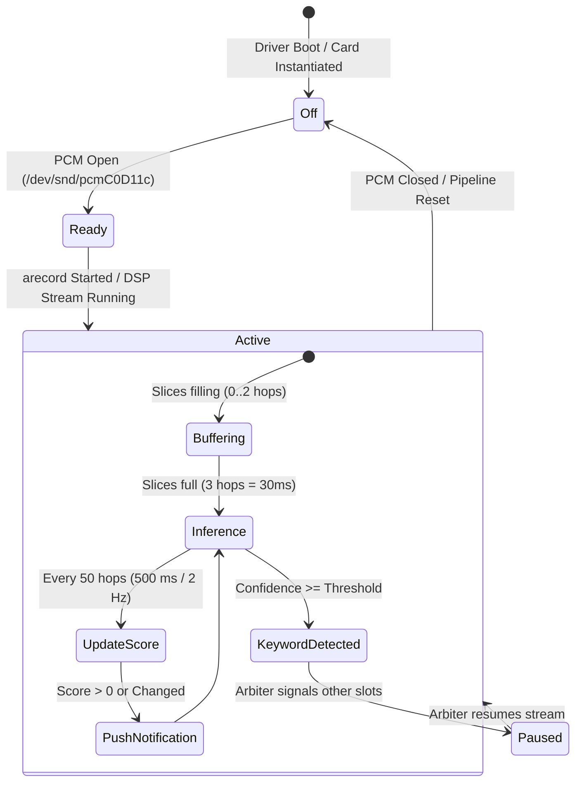
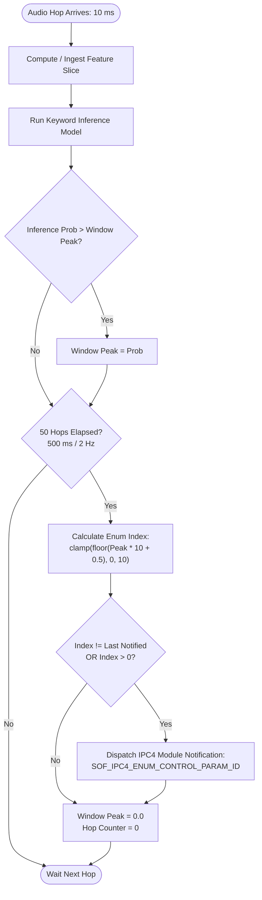

# Developer Integration Guide: Custom WOV & ECNS Algorithms

This guide provides step-by-step instructions, architectural blueprints, process flowcharts, and configuration details for developers integrating custom **Echo Cancellation & Noise Suppression (ECNS)** and **Wake-on-Voice (WOV)** algorithms into the Sound Open Firmware (SOF) multi-slot audio pipeline.

The reference topology establishes a unified 4-channel native 16 kHz architecture supporting concurrent multi-keyword spotting and acoustic front-end processing across **Panther Lake (PTL)**, **Tiger Lake (TGL)**, and **Wildcat Lake (WCL)**.

---

## Table of Contents
1. [System Architecture Overview](#1-system-architecture-overview)
2. [Developing a Custom ECNS Module](#2-developing-a-custom-ecns-module)
3. [Developing a Custom WOV Keyword Spotter](#3-developing-a-custom-wov-keyword-spotter)
4. [WoV Arbiter & Multi-Slot Coordination](#4-wov-arbiter--multi-slot-coordination)
5. [Real-Time Volatile Scoring Controls (2 Hz)](#5-real-time-volatile-scoring-controls-2-hz)
6. [Topology2 Pipeline Configuration](#6-topology2-pipeline-configuration)
7. [Process Flows & State Machines](#7-process-flows--state-machines)
8. [Step-by-Step Integration Recipe](#8-step-by-step-integration-recipe)
9. [Common Pitfalls & Troubleshooting](#9-common-pitfalls--troubleshooting)

---

## 1. System Architecture Overview

The pipeline separates real-time audio ingest into two primary scheduling domains:
- **Low-Latency (LL) Domain (1 ms period)**: Ingests 4-channel 16 kHz microphone and echo reference data directly from the DMIC DAI without frame jitter.
- **Data Processing (DP) Domain (20 ms period)**: Runs block-based processing for acoustic echo cancellation, noise suppression, circular buffering, feature extraction, and neural network keyword classification.



---

## 2. Developing a Custom ECNS Module

An ECNS component acts as a multi-sink Data Processing (DP) block. It consumes interleaved multi-channel input (speech + echo reference) and emits cleaned audio on two independent output pins.

### Audio Data Interface Contract
- **Input Pin 0 (Source)**:
  - Channels: 4 (Ch 0,1: Near-end mic inputs; Ch 2,3: Far-end playback echo references).
  - Rate: 16,000 Hz.
  - Sample Format: `S16_LE` (or `S32_LE` if configured).
  - Frame Period: 20 ms (320 samples per channel = 2,560 bytes per period).
- **Output Pin 0 (Sink 0 — Clean Voice to KPB / WOV)**:
  - Channels: 1 (Mono beamformed / echo-canceled speech).
  - Frame Period: 20 ms (320 samples = 640 bytes).
- **Output Pin 1 (Sink 1 — Clean Voice to Host)**:
  - Channels: 2 (Stereo speech capture for host applications).
  - Frame Period: 20 ms (640 samples = 1,280 bytes).

### C Implementation Skeleton (`src/audio/ecns/custom_ecns.c`)

```c
#include <sof/audio/module_adapter/module/generic.h>
#include <sof/audio/component.h>
#include <sof/audio/buffer.h>

struct custom_ecns_data {
    uint32_t period_bytes_in;
    uint32_t period_bytes_out0; // Mono clean
    uint32_t period_bytes_out1; // Stereo clean
    void *algo_state;           // Vendor algorithm state handle
};

static int custom_ecns_init(struct processing_module *mod)
{
    struct custom_ecns_data *cd = mod_zalloc(mod, sizeof(*cd));
    if (!cd)
        return -ENOMEM;

    mod->priv.private = cd;
    // Initialize vendor AEC/NR algorithm instance
    return 0;
}

static int custom_ecns_process(struct processing_module *mod,
                               struct sof_source **sources, int num_of_sources,
                               struct sof_sink **sinks, int num_of_sinks)
{
    struct custom_ecns_data *cd = module_get_private_data(mod);
    const int16_t *src_buf;
    int16_t *sink0_buf = NULL;
    int16_t *sink1_buf = NULL;
    size_t in_avail, out0_free, out1_free;
    int ret;

    // 1. Check input buffer availability (20 ms @ 16kHz 4ch = 2560 bytes)
    in_avail = source_get_data_available(sources[0]);
    if (in_avail < 2560)
        return 0;

    // 2. Check independent output buffer space
    out0_free = (num_of_sinks > 0 && sinks[0]) ? sink_get_free_size(sinks[0]) : 0;
    out1_free = (num_of_sinks > 1 && sinks[1]) ? sink_get_free_size(sinks[1]) : 0;

    // Must have space on Pin 0 (KPB path) if connected
    if (sinks[0] && out0_free < 640)
        return 0;

    // 3. Acquire buffer pointers
    source_get_data(sources[0], 2560, (const void **)&src_buf, NULL, NULL);
    if (sinks[0])
        sink_get_buffer(sinks[0], 640, (void **)&sink0_buf, NULL, NULL);
    if (sinks[1] && out1_free >= 1280)
        sink_get_buffer(sinks[1], 1280, (void **)&sink1_buf, NULL, NULL);

    // 4. Run Vendor DSP AEC + NR Algorithm
    // - Consumes src_buf (4ch: 0,1 mic, 2,3 ref)
    // - Writes 1ch mono clean speech to sink0_buf
    // - Writes 2ch stereo clean speech to sink1_buf (if active)
    vendor_aec_nr_process(cd->algo_state, src_buf, sink0_buf, sink1_buf, 320);

    // 5. Commit & release buffers
    source_release_data(sources[0], 2560);
    if (sink0_buf)
        sink_commit_buffer(sinks[0], 640);
    if (sink1_buf)
        sink_commit_buffer(sinks[1], 1280);

    return 0;
}
```

### Module Registration & UUID
Declare the module interface and assign a unique GUID registered in `uuid-registry.txt`:
```c
static const struct module_interface custom_ecns_interface = {
    .init = custom_ecns_init,
    .prepare = custom_ecns_prepare,
    .process = custom_ecns_process,
    .set_configuration = custom_ecns_set_config,
    .get_configuration = custom_ecns_get_config,
    .reset = custom_ecns_reset,
    .free = custom_ecns_free
};

DECLARE_MODULE_ADAPTER(custom_ecns_interface, custom_ecns_uuid, custom_ecns_tr);
SOF_MODULE_INIT(custom_ecns, sys_comp_module_custom_ecns_interface_init);
```

---

## 3. Developing a Custom WOV Keyword Spotter

Each keyword spotter pipeline occupies a dedicated dynamic pipeline slot (`custom-capture` in Topology2).

### Architectural Requirements
1. **Multi-Instance Isolation**: Support concurrent instantiation (Slot 0, Slot 1, Slot 2) within a single codebase or distinct modules without sharing global state or conflicting static memory.
2. **KPB Draining Notification**: When a keyword threshold is breached, signal the Key Phrase Buffer to begin draining pre-roll audio to host.
3. **Arbiter Detection Notification**: Notify the WOV Arbiter which slot triggered.
4. **Pause / Resume Handling**: Listen to arbiter control broadcasts so non-triggered slots pause inference and release compute cycles.

### Notification Mechanics

```c
#include <sof/audio/kpb.h>
#include <sof/audio/wov_arbiter/wov_arbiter.h>

static void custom_wov_trigger(struct processing_module *mod, uint8_t slot_id)
{
    struct comp_dev *dev = mod->dev;
    struct custom_wov_data *cd = module_get_private_data(mod);

    comp_info(dev, "Keyword detected on slot %u!", slot_id);

    // 1. Notify KPB to start history buffer draining (pre-roll)
    cd->client_data.r_ptr = NULL;
    cd->client_data.sink = NULL;
    cd->client_data.id = slot_id;
    cd->client_data.drain_req = 2000; // 2000 ms pre-roll
    cd->event_data.event_id = KPB_EVENT_BEGIN_DRAINING;
    cd->event_data.client_data = &cd->client_data;

    notifier_event(dev, NOTIFIER_ID_KPB_CLIENT_EVT,
                   NOTIFIER_TARGET_CORE_ALL_MASK,
                   &cd->event_data, sizeof(cd->event_data));

    // 2. Notify WOV Arbiter of detection
    struct wov_detect_notif detect_payload = {
        .slot_id = slot_id
    };
    notifier_event(dev, NOTIFIER_ID_WOV_DETECT,
                   NOTIFIER_TARGET_CORE_ALL_MASK,
                   &detect_payload, sizeof(detect_payload));
}
```

### Arbiter Control Callback (Pause / Resume)
Register a notifier callback during `prepare()`:
```c
static void on_wov_ctrl(void *arg, enum notify_id id, void *data)
{
    struct comp_dev *dev = arg;
    struct processing_module *mod = comp_mod(dev);
    struct custom_wov_data *cd = module_get_private_data(mod);
    const struct wov_ctrl_notif *n = data;

    if (n->cmd == WOV_ARB_CMD_PAUSE && n->slot_id != cd->slot_id) {
        comp_info(dev, "Slot %u paused: slot %u is active", cd->slot_id, n->slot_id);
        cd->paused = true;
    } else if (n->cmd == WOV_ARB_CMD_RESUME) {
        comp_info(dev, "Slot %u resumed by arbiter", cd->slot_id);
        cd->paused = false;
        vendor_wov_reset(cd->algo_state);
    }
}
```

---

## 4. WoV Arbiter & Multi-Slot Coordination

The `wov_arbiter` component synchronizes multi-slot pipelines and multiplexes detected streams onto `host-copier.11`:

```mermaid
sequenceDiagram
    autonumber
    participant WOV0 as WOV Slot 0 (Strawberry)
    participant WOV1 as WOV Slot 1 (Banana)
    participant KPB as KPB (Pipeline 106)
    participant ARB as WOV Arbiter (Pipeline 104)
    participant HOST as Linux ALSA Driver (PCM 11)

    Note over WOV0,WOV1: Both slots actively running 20ms inference
    WOV0->>WOV0: Keyword Match (Prob >= 0.70)
    WOV0->>KPB: notifier_event(NOTIFIER_ID_KPB_CLIENT_EVT, BEGIN_DRAINING)
    WOV0->>ARB: notifier_event(NOTIFIER_ID_WOV_DETECT, slot=0)
    
    rect rgb(40, 20, 60)
        Note over ARB: Arbiter latches Slot 0 as active winner
        ARB->>WOV1: notifier_event(NOTIFIER_ID_WOV_CTRL, PAUSE slot=0)
        ARB->>HOST: SOF_IPC4_MODULE_NOTIFICATION (wov_active_slot = 'Slot 1')
    end
    
    Note over WOV1: Slot 1 pauses inference (saves DSP MIPS)
    KPB->>ARB: Drains 2.0s Pre-roll audio history
    ARB->>HOST: Streams audio to /dev/snd/pcmC0D11c
    Note over ARB,HOST: Keyword phrase + post-trigger command audio streaming
```



### Arbiter Control State Enum
The arbiter exposes the `wov_active_slot` ALSA mixer enum control:
- `Item #0 'Listening'`: All slots actively scanning input.
- `Item #1 'Slot 1'`: Slot 0 detected keyword; sibling slots paused.
- `Item #2 'Slot 2'`: Slot 1 detected keyword; sibling slots paused.
- `Item #3 'Slot 3'`: Slot 2 detected keyword; sibling slots paused.

---

## 5. Real-Time Volatile Scoring Controls (2 Hz)

To give users and applications immediate feedback on speech confidence and keyword proximity, each WOV slot exposes a volatile read-only scoring kcontrol (e.g. `MWW 101 Score`, `MWW 102 Score`, `MWW 103 Score`).

### Kernel Dynamic Widget Constraint
> [!IMPORTANT]
> In the Linux SOF driver (`sound/soc/sof/topology.c`), dynamic widgets (`custom-capture` pipelines) are **prohibited** from including `SNDRV_CTL_ELEM_ACCESS_VOLATILE` in their topology configuration:
> ```c
> if (pipe_widget->dynamic_pipeline_widget) {
>     if (scontrol->access & SNDRV_CTL_ELEM_ACCESS_VOLATILE)
>         return -EINVAL; // Rejects topology loading!
> }
> ```
> **Solution**: Omit `volatile` from the topology `access []` list. Real-time updates are pushed asynchronously by the DSP firmware using `SOF_IPC4_MODULE_NOTIFICATION` with `SOF_IPC4_ENUM_CONTROL_PARAM_ID`. The kernel notification handler updates `cdata->chanv[channel].value` directly in the local cache and triggers `snd_ctl_notify()`.

### Discrete Enum Mapping (0% to 100%)
ALSA topology limits enum text items to `SND_SOC_TPLG_NUM_TEXTS = 16`. Eleven 10% interval items fit well within this bound:
```
Item #0: 0%  | Item #1: 10% | Item #2: 20% | Item #3: 30% | Item #4: 40%
Item #5: 50% | Item #6: 60% | Item #7: 70% | Item #8: 80% | Item #9: 90% | Item #10: 100%
```

### Pushing Asynchronous 2 Hz Notifications from DSP

```c
#if CONFIG_IPC_MAJOR_4
static void custom_wov_notify_score(const struct comp_dev *dev, uint32_t score_idx)
{
    struct sof_ipc4_notify_module_data *msg_module_data;
    struct sof_ipc4_control_msg_payload *msg_payload;
    struct ipc_msg *msg;
    uint32_t data_size = sizeof(struct sof_ipc4_notify_module_data) +
                         sizeof(struct sof_ipc4_control_msg_payload) +
                         sizeof(struct sof_ipc4_ctrl_value_chan);
    struct ipc4_voice_cmd_notification notif;

    memset_s(&notif, sizeof(notif), 0, sizeof(notif));
    notif.primary.r.notif_type = SOF_IPC4_MODULE_NOTIFICATION;
    notif.primary.r.type = SOF_IPC4_GLB_NOTIFICATION;
    notif.primary.r.rsp = SOF_IPC4_MESSAGE_DIR_MSG_REQUEST;
    notif.primary.r.msg_tgt = SOF_IPC4_MESSAGE_TARGET_FW_GEN_MSG;

    msg = ipc_msg_w_ext_init(notif.primary.dat, 0, data_size);
    if (!msg)
        return;

    msg_module_data = (struct sof_ipc4_notify_module_data *)msg->tx_data;
    msg_module_data->instance_id = IPC4_INST_ID(dev->ipc_config.id);
    msg_module_data->module_id = IPC4_MOD_ID(dev->ipc_config.id);
    msg_module_data->event_id = SOF_IPC4_NOTIFY_MODULE_EVENTID_ALSA_MAGIC_VAL |
                                SOF_IPC4_ENUM_CONTROL_PARAM_ID;
    msg_module_data->event_data_size = sizeof(struct sof_ipc4_control_msg_payload) +
                                       sizeof(struct sof_ipc4_ctrl_value_chan);

    msg_payload = (struct sof_ipc4_control_msg_payload *)msg_module_data->event_data;
    msg_payload->id = 0; // Control index on this widget
    msg_payload->num_elems = 1;
    msg_payload->chanv[0].channel = 0;
    msg_payload->chanv[0].value = score_idx;

    ipc_msg_send(msg, NULL, false);
}
#endif
```

### Periodic Tracking in Process Loop (500 ms Windows)
```c
// Track peak probability across 50 hops (500 ms @ 10ms/hop = 2 Hz)
cd->score_hop_counter++;
if (cd->score_hop_counter >= 50) {
    cd->score_hop_counter = 0;
    uint32_t s_idx = (uint32_t)(cd->window_peak_prob * 10.0f + 0.5f);
    if (s_idx > 10) s_idx = 10;
    cd->current_score_idx = (uint8_t)s_idx;
    cd->window_peak_prob = 0.0f;

#if CONFIG_IPC_MAJOR_4
    if (cd->current_score_idx != cd->last_notified_score_idx || cd->current_score_idx > 0) {
        cd->last_notified_score_idx = cd->current_score_idx;
        custom_wov_notify_score(dev, cd->current_score_idx);
    }
#endif
}
```

---

## 6. Topology2 Pipeline Configuration

### Component Include: Scoring Enum Control (`score_enum.conf`)
Path: `tools/topology/topology2/include/components/mww/score_enum.conf`
```conf
Class.Control.enum."score_enum" {
    # Omitting 'volatile' access flag to satisfy Linux dynamic widget validation
    access [
        read
        tlv_read
    ]

    enum_texts [
        "0%"
        "10%"
        "20%"
        "30%"
        "40%"
        "50%"
        "60%"
        "70%"
        "80%"
        "90%"
        "100%"
    ]

    IncludeByKey.NUM_ELEMS {
        "1" {
            ControlEnumObject [
                {
                    channel "all"
                    texts [
                        $enum_texts
                    ]
                }
            ]
        }
    }
}
```

### Pipeline Instantiation in Manifest (`dmic-wov-multi-ptl-4ch-manifest.conf`)

#### 1. ECNS Pipeline (Pipeline 105)
```conf
Object.Pipeline.custom-processing."105" {
    index 105
    period 20000        # 20 ms
    time_domain "timer"
    core 0

    Object.Widget.mixout."1" {
        index 105
    }

    Object.Widget.ecns."1" {
        index 105
        uuid $ECNS_UUID
        num_input_pins 1
        num_output_pins 2
    }

    Object.Widget.mixin."1" { # Pin 0 Mono Clean
        index 105
    }

    Object.Widget.mixin."2" { # Pin 1 Stereo Clean
        index 105
    }
}
```

#### 2. Detection Slot Pipeline (Pipeline 101)
```conf
Object.Pipeline.custom-capture."101" {
    index 101
    period 20000
    core 0

    Object.Widget.mixout."1" {
        index 101
    }

    Object.Widget.mfcc."1" {
        index 101
    }

    Object.Widget.mww."1" {
        index 101
        Object.Control.enum."1" {
            name "MWW 101 Score"
            IncludeByKey.SCORE_ENUM {
                "score_enum" "include/components/mww/score_enum.conf"
            }
        }
    }
}
```

---

## 7. Process Flows & State Machines

### A. Lifecycle State Machine for Dynamic WOV Widgets


### B. Scoring Engine Update Loop


---

## 8. Step-by-Step Integration Recipe

Follow this step-by-step checklist to integrate your own algorithms:

### Step 1: Implement DSP Module C/C++ Code
1. Place source code under `src/audio/<your_algo>/`.
2. Implement standard `module_interface` (`init`, `prepare`, `process`, `set_configuration`, `get_configuration`, `reset`, `free`).
3. For ECNS, handle 4ch in, 1ch out (Pin 0), 2ch out (Pin 1).
4. For WOV, implement multi-instance state isolation, 2 Hz scoring notification, and register for `NOTIFIER_ID_WOV_CTRL`.

### Step 2: Register Module UUID
1. Generate a UUID (e.g. `uuidgen`).
2. Add definition to `uuid-registry.txt` and `tools/rimage/config/<platform>.toml.h`.
3. In `CMakeLists.txt` and `Kconfig`, register the component with `sof_audio_module()`.

### Step 3: Define Topology Components
1. Create Topology2 component definitions in `tools/topology/topology2/include/components/<your_algo>.conf`.
2. Reference the scoring enum in `score_enum.conf` (ensuring no `volatile` access flag).
3. Connect widgets in the platform manifest files:
   - Panther Lake: `tools/topology/topology2/dmic-wov-multi-ptl-4ch-manifest.conf`
   - Tiger Lake: `tools/topology/topology2/dmic-wov-multi-4ch-manifest.conf`
   - Wildcat Lake: `tools/topology/topology2/dmic-wov-multi-wcl-4ch-manifest.conf`

### Step 4: Compile Topology & Firmware
1. Build topologies with `alsatplg -p`:
   ```bash
   /home/lrg/work/sof-tgl/tools/bin/alsatplg \
       -I tools/topology/topology2 \
       -p -c tools/topology/topology2/dmic-wov-multi-ptl-4ch-manifest.conf \
       -o /tmp/sof-ptl-dmic-wov-multi-4ch.tplg
   ```
2. Build firmware with Zephyr SDK GCC:
   ```bash
   export ZEPHYR_SDK_INSTALL_DIR=/home/lrg/zephyr-sdk-1.0.1
   ./sof/scripts/xtensa-build-zephyr.py -z ptl
   ```

### Step 5: Deploy & Validate on Hardware
1. Copy firmware and topology to DUT:
   ```bash
   scp build-sof-staging/sof/intel/sof-ipc4/ptl/community/sof-ptl.ri root@<dut>:/lib/firmware/intel/sof-ipc4/ptl/community/
   scp /tmp/sof-ptl-dmic-wov-multi-4ch.tplg root@<dut>:/lib/firmware/intel/sof-ipc4-tplg/
   ```
2. Reload driver:
   ```bash
   ssh root@<dut> 'rmmod snd_sof_pci_intel_ptl && modprobe snd_sof_pci_intel_ptl'
   ```
3. Verify controls:
   ```bash
   ssh root@<dut> 'amixer -c 0 controls | grep -E "Score|wov"'
   ```

---

## 9. Common Pitfalls & Troubleshooting

| Symptom / Error | Root Cause | Fix |
|---|---|---|
| `error: volatile control found for dynamic widget` (`-EINVAL` / `-22`) | Topology sets `access [ read volatile ]` on a dynamic widget control. | Remove `volatile` from `access []` in `score_enum.conf`. Rely on DSP IPC4 module notifications. |
| Topology compile fails with `-ENOMEM` on Enum | Enum texts exceed `SND_SOC_TPLG_NUM_TEXTS` (16 items). | Keep discrete score intervals $\le 16$ items (e.g. 11 items for 0%–100% in 10% steps). |
| Kernel drops scoring notification | Control parameter ID is not recognized by `sof_ipc4_control_notification`. | Use `SOF_IPC4_ENUM_CONTROL_PARAM_ID` (201) and format payload as `sof_ipc4_control_msg_payload`. |
| Second / third keyword slot crashes | Global static state collision across multiple instances. | Isolate state per instance inside an array (`g_instances[kMaxSlots]`) indexed by slot ID. |
| Score sticks at old value across stream runs | DSP reset does not push reset notification to kernel cache. | Call `custom_wov_notify_score(mod->dev, 0)` in `reset()` or stream startup. |
