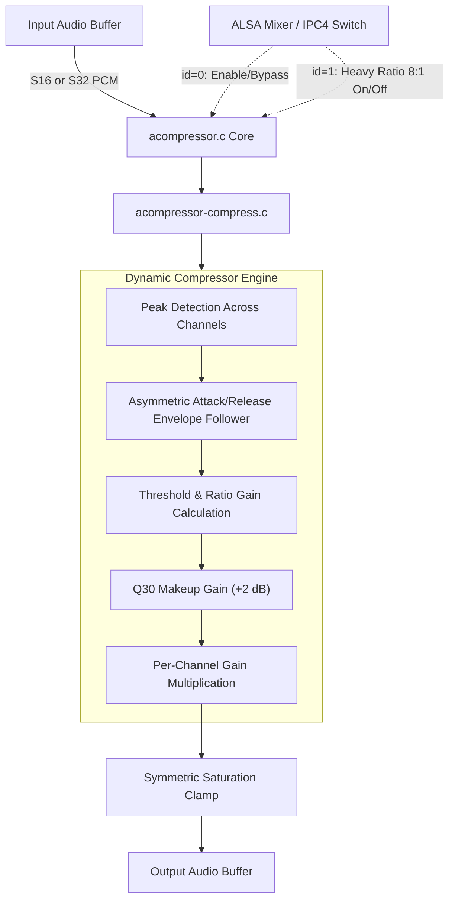

# FFmpeg Dynamic Range Compressor Module (`acompressor`)

Ports FFmpeg's `af_sidechaincompress` downward dynamic range compression algorithm into a native fixed-point SOF module for Xtensa DSPs. It provides smooth envelope tracking, configurable downward compression above threshold, and makeup gain.

---

## Features

- **Downward Dynamic Compression**: Compresses peaks exceeding threshold while applying makeup gain to elevate lower-level speech and audio details.
- **Single-Pole Smooth Envelope Tracking**: Asymmetric attack and release time constants eliminate transient pumping and harmonic distortion.
- **Pure Fixed-Point Implementation**: Pure integer Q30/Q31 arithmetic with zero floating-point dependencies (`CONFIG_FPU=n`).
- **High Headroom Math**: 64-bit accumulators prevent overflow during gain scaling and saturation clamping.
- **Dual Format Support**: Natively processes both `S16_LE` and `S32_LE` multi-channel streams (up to 4 channels).
- **ALSA IPC4 Dual Switch Controls**:
  - `id = 0`: Module bypass / enable switch.
  - `id = 1`: Heavy Ratio toggle (nominal 3:1 vs aggressive 8:1).

---

## Mathematical Formulation

### 1. Coefficient Calculation

Time constants are converted to Q30 smoothing coefficients:

$$N_{att} = \frac{\text{attack\_ms} \cdot \text{rate}}{1000}, \quad \alpha_{att} = 2^{30} - \frac{2^{30}}{N_{att}}$$

$$N_{rel} = \frac{\text{release\_ms} \cdot \text{rate}}{1000}, \quad \alpha_{rel} = 2^{30} - \frac{2^{30}}{N_{rel}}$$

### 2. Peak Envelope Detection

The envelope tracks the peak amplitude across all channels:

$$\text{peak}[n] = \max_{c} |x_c[n]|$$

$$\text{env}[n] = \begin{cases}
\frac{\alpha_{att} \cdot \text{env}[n-1] + (2^{30} - \alpha_{att}) \cdot \text{peak}[n]}{2^{30}}, & \text{peak}[n] > \text{env}[n-1] \\[6pt]
\frac{\alpha_{rel} \cdot \text{env}[n-1] + (2^{30} - \alpha_{rel}) \cdot \text{peak}[n]}{2^{30}}, & \text{peak}[n] \le \text{env}[n-1]
\end{cases}$$

### 3. Downward Gain Reduction

When envelope exceeds the threshold $T$ (nominal $-12\text{ dBFS} = 539423616$ in Q31), compression gain with ratio $R$ is computed:

$$\text{gain}[n] = \begin{cases}
2^{30}, & \text{env}[n] \le T \\[6pt]
\frac{2^{30}}{R} + \frac{R - 1}{R} \cdot \frac{T \cdot 2^{30}}{\text{env}[n]}, & \text{env}[n] > T
\end{cases}$$

$$\text{total\_gain}[n] = \frac{\text{gain}[n] \cdot \text{makeup}}{2^{30}}$$

---

## Architecture & Data Flow



### Components

- `acompressor.c`: SOF `module_interface` glue, channel/rate configuration, and IPC4 switch parameter handlers.
- `acompressor-compress.c`: Integer processing loops (`acompressor_process_s16`, `acompressor_process_s32`) and coefficient calculators.
- `acompressor-stub.c`: Dependency-free pass-through stub for testing.
- `acompressor.h`: State struct (`struct acompressor_comp_data`), constants, and function prototypes.

---

## Build Configuration

### 1. Real Compressor Integration

```ini
CONFIG_COMP_ACOMPRESSOR=y      # or =m for LLEXT
CONFIG_COMP_ACOMPRESSOR_STUB=n
```

### 2. Pass-Through Stub (CI / Staging)

```ini
CONFIG_COMP_ACOMPRESSOR=y
CONFIG_COMP_ACOMPRESSOR_STUB=y
```

---

## Kconfig Parameters

| Option | Default | Type / Range | Description |
|---|---|---|---|
| `CONFIG_COMP_ACOMPRESSOR` | n | tristate (`y`/`m`/`n`) | Enable FFmpeg dynamic range compressor module |
| `CONFIG_COMP_ACOMPRESSOR_STUB` | y | bool | Build pass-through stub |
| `CONFIG_COMP_ACOMPRESSOR_MODULE` | n | bool | Build as loadable LLEXT shared library |

---

## Usage & Topology

### Pipeline Routing

Position `acompressor` before the master peak limiter (`alimiter`) in the playback pipeline:

```
[ Host Decoder ] ---> [ equalizer ] ---> [ acompressor ] ---> [ alimiter ] ---> [ Speaker DAI ]
```

### Topology 2 Code Snippet

```alsa
Object.Widget.acompressor.1 {
    Object.Base.input_pin_binding.1 {
        input_pin_binding_name "equalizer.1"
    }
    Object.Base.output_pin_binding.1 {
        output_pin_binding_name "alimiter.1"
    }
}
```

### ALSA Mixer Controls

| Control Name | Type | Value Range | Function |
|---|---|---|---|
| `Compressor Playback Switch` | Boolean | `0` (Bypass) / `1` (Active) | Master module enable switch (`id = 0`) |
| `Compressor Heavy Ratio Switch` | Boolean | `0` (3:1) / `1` (8:1) | Toggle high compression ratio (`id = 1`) |

---

## Performance & MCPS Profile (Aphid / Panther Lake ACE 3.0)

Evaluated on Panther Lake (`intel_ace30_ptl`) Aphid hardware at **400 MHz** core clock:

| Codec / Module | Implementation | Stream Profile | MCPS (Aphid) | DSP Core Load (@ 400 MHz) |
|---|---|---|:---:|:---:|
| **FFmpeg Compressor** (`acompressor`) | Q30/Q31 peak envelope follower | 48 kHz Stereo (S16) | **~2.10 – 2.45 MCPS** | **< 0.62%** |
| **FFmpeg Compressor** (`acompressor`) | Q30/Q31 peak envelope follower | 48 kHz Stereo (S32) | **~2.40 – 2.80 MCPS** | **< 0.70%** |

### Characteristics

- **Zero Dynamic Allocations**: State structure pre-allocated during pipeline setup.
- **Compute**: ~24 clock cycles per multi-channel sample.
- **Real-Time Safety**: Completely safe for 1 ms tick pipelines on Core 0.
