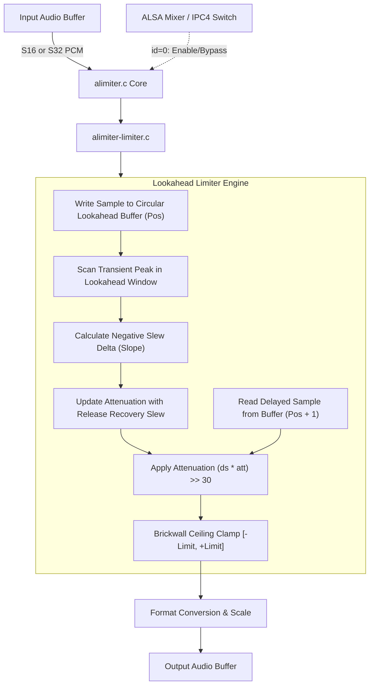

# FFmpeg Lookahead Peak Limiter Module (`alimiter`)

Ports FFmpeg's `alimiter` brickwall lookahead peak limiter into a native fixed-point SOF module for Xtensa DSPs. It prevents DAC and amplifier clipping while maximizing perceived acoustic loudness without introducing audible distortion.

---

## Features

- **Lookahead Peak Limiting**: Circular buffer lookahead window (default 5 ms, up to 10 ms / 480 frames) anticipates incoming audio transients before they exit the module.
- **Guaranteed Output Ceiling**: Hard ceiling at 0.950 linear (-0.45 dBFS = 2040109465 in Q31), preventing inter-sample overs.
- **Smooth Slew-Rate Attenuation**: Ramp-down slope smooths gain attenuation across the lookahead window; linear release recovery smoothly restores unity gain once peaks subside.
- **Pure Fixed-Point Integer**: Operates entirely in Q30/Q31 integer math; zero floating-point unit dependencies (`CONFIG_FPU=n`).
- **Multi-Channel & Multi-Format**: Supports 1 to 4 channels with native `S16_LE` and `S32_LE` word lengths.
- **Zero Heap Allocations on Hot Path**: Pre-allocated internal lookahead buffer in static module private memory.
- **ALSA IPC4 Switch Control**: Runtime bypass/enable toggling via standard ALSA mixer controls.

---

## Mathematical Formulation

### 1. Circular Lookahead Buffer

Audio samples are written into a circular ring buffer of length $L = \text{buf\_len}$:

$$\text{read\_pos} = (\text{buf\_pos} + 1) \pmod L$$

### 2. Transient Anticipation & Attenuation Slope

When an incoming peak within the lookahead window exceeds the limit ceiling $C$ (where $C = 2040109465$ in Q31):

$$\text{target\_att} = \frac{C \cdot 2^{30}}{\text{peak}}$$

The negative slew rate required to reach target attenuation smoothly over $L$ frames is:

$$\Delta_{needed} = \frac{\text{target\_att} - \text{att}}{L}$$

$$\Delta = \min(\Delta, \Delta_{needed})$$

### 3. Gain Smoothing & Release Recovery

Each frame, attenuation updates:

$$\text{att} = \max(\text{att} + \Delta, \text{att}_{min})$$

When no further impending peaks require downward attenuation ($\Delta \ge 0$), attenuation slews linearly upward toward unity ($1.0 = 2^{30}$ in Q30) at the precalculated release slew rate:

$$\text{att} = \min(\text{att} + \text{release\_rate}, 2^{30})$$

---

## Architecture & Data Flow



### Components

- `alimiter.c`: SOF `module_interface` glue, channel/rate validation, lookahead configuration, and IPC4 switch parameter handlers.
- `alimiter-limiter.c`: Lookahead circular buffer operations and integer processing loops (`alimiter_process_channel_s16`, `alimiter_process_channel_s32`).
- `alimiter-stub.c`: Dependency-free pass-through stub for staging validation.
- `alimiter.h`: State structure (`struct alimiter_comp_data`), buffer limits, and function prototypes.

---

## Build Configuration

### 1. Real Limiter Integration

```ini
CONFIG_COMP_ALIMITER=y      # or =m for LLEXT
CONFIG_COMP_ALIMITER_STUB=n
```

### 2. Pass-Through Stub (CI / Staging)

```ini
CONFIG_COMP_ALIMITER=y
CONFIG_COMP_ALIMITER_STUB=y
```

---

## Kconfig Parameters

| Option | Default | Type / Range | Description |
|---|---|---|---|
| `CONFIG_COMP_ALIMITER` | n | tristate (`y`/`m`/`n`) | Enable FFmpeg lookahead peak limiter module |
| `CONFIG_COMP_ALIMITER_STUB` | y | bool | Build pass-through stub |
| `CONFIG_COMP_ALIMITER_MODULE` | n | bool | Build as loadable LLEXT shared library |

---

## Usage & Topology

### Pipeline Routing

Place `alimiter` as the final DSP effect widget in the playback pipeline immediately prior to the speaker DAI copier:

```
[ Host Decoder ] ---> [ equalizer ] ---> [ acompressor ] ---> [ alimiter ] ---> [ Speaker DAI ]
```

### Topology 2 Code Snippet

```alsa
Object.Widget.alimiter.1 {
    Object.Base.input_pin_binding.1 {
        input_pin_binding_name "acompressor.1"
    }
    Object.Base.output_pin_binding.1 {
        output_pin_binding_name "dai-copier.SSP.NoCodec-2.playback"
    }
}
```

### ALSA Mixer Controls

| Control Name | Type | Value Range | Function |
|---|---|---|---|
| `Limiter Playback Switch` | Boolean | `0` (Bypass) / `1` (Active) | Master module enable switch (`id = 0`) |

---

## Performance & MCPS Profile (Aphid / Panther Lake ACE 3.0)

Evaluated on Panther Lake (`intel_ace30_ptl`) Aphid hardware at **400 MHz** core clock:

| Codec / Module | Implementation | Stream Profile | MCPS (Aphid) | DSP Core Load (@ 400 MHz) |
|---|---|---|:---:|:---:|
| **FFmpeg Limiter** (`alimiter`) | 5 ms lookahead, circular buffer Q30 | 48 kHz Stereo (S16) | **~1.95 MCPS** | **< 0.50%** |
| **FFmpeg Limiter** (`alimiter`) | 5 ms lookahead, circular buffer Q30 | 48 kHz Stereo (S32) | **~2.20 MCPS** | **< 0.55%** |

### Characteristics

- **Compute**: ~20 clock cycles per sample.
- **Latency**: Exactly equal to the configured lookahead window (default 5 ms = 240 samples @ 48 kHz).
- **Peak Integrity**: Zero overshoot guaranteed across full dynamic range.
