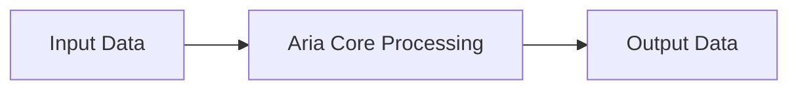

# Aria Audio Component Architecture

This directory contains the implementation of the Aria audio component.

## Overview

The Aria component implements an automatic regressive input amplifier that applies variable input gain, reducing gain for high-level signals to prevent clipping while introducing about 1 ms of processing latency.

## Architecture Diagram

## Configuration and Scripts

- **Kconfig**: Enables the ARIA (Automatic Regressive Input Amplifier Module) component. It applies a variable gain (target: 0, 6, 12, 18 dB) that is reduced for high-level signals to prevent clipping, introducing a 1ms latency. Users can choose HIFI optimization levels (HIFI3, HIFI4, Max, Generic).
- **CMakeLists.txt**: Handles the build integration. Depends on `IPC_MAJOR_4`. If built modularly (`CONFIG_COMP_ARIA="m"`), it uses a loadable extension (`llext`); otherwise, it compiles `aria.c` and HIFI-specific files locally.
- **aria.toml**: Defines the topology parameters for the module (UUID, affinity, pin configuration) and an array of `mod_cfg` configurations defining processing constraints for various setups.
- **Topology (.conf)**: Derived from `tools/topology/topology2/include/components/aria.conf`, it defines the `aria` widget object for topology generation. It exposes attributes like `cpc` (cycles per chunk) and `is_pages`. It sets up an `extctl` byte control with a maximum payload of 4096 bytes and defaults to UUID `6d:16:f7:99:2c:37:ef:43:81:f6:22:00:7a:a1:5f:03` (type `effect`).
- **MATLAB Tuning (`tune/`)**: Contains `.m` scripts (e.g., `sof_aria_blobs.m`) which generate ALSA control binary blobs, text formats, and M4 configuration fragments used at topology creation or runtime to supply operational parameters like attenuation settings (e.g., `param_1.conf`, `param_2.conf`).
