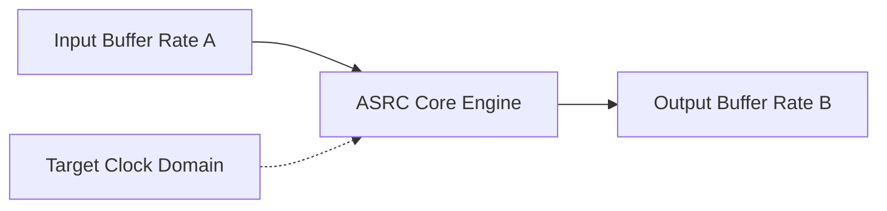

# Asynchronous Sample Rate Converter (ASRC) Architecture

This directory contains the ASRC component implementation.

## Overview

The ASRC component converts the sample rate of an incoming audio stream to a different outgoing sample rate, independently of any synchronous clocks. This is commonly used when crossing clock domains.

## Architecture Diagram

## Configuration and Scripts

- **Kconfig**: Controls the ASRC component. ASRC tracks a slave DAI out of sync with firmware timers and uses less RAM than synchronous SRC. It also supports granular configuration of downsampling ratios (from 24kHz/48kHz to lower rates) to optimize memory footprint (about 1.5-2.1 kB per conversion ratio).
- **CMakeLists.txt**: Manages source inclusion (`asrc.c`, `asrc_farrow.c`, etc.). Handles modular builds (`llext`) and chooses IPC abstraction (`asrc_ipc3.c` vs `asrc_ipc4.c`) based on the active IPC major version.
- **asrc.toml**: Holds topology module entry parameters. Features pre-defined `mod_cfg` parameter arrays specifically tailored for `CONFIG_METEORLAKE`, `CONFIG_LUNARLAKE`, and `CONFIG_SOC_ACE30`/`40` SOC platforms.
- **Topology (.conf)**: Derived from `tools/topology/topology2/include/components/asrc.conf`, defining the `asrc` widget object. It introduces parameters like `rate_out` (target sample rate) and `operation_mode`. Defaults to UUID `2d:40:b4:66:68:b4:f2:42:81:a7:b3:71:21:86:3d:d4` and type `asrc`.
