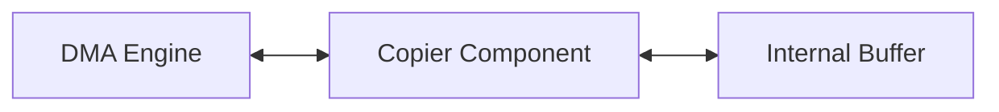

# Copier Architecture

This directory contains the Copier component.

## Overview

The Copier is a versatile component responsible for moving data smoothly between hardware endpoints (DAIs, Host APIs) and internal buffers. It may also apply simple format conversions (e.g., 16-bit to 32-bit).

## Architecture Diagram

## Configuration and Scripts

- **Kconfig**: Enables the `COMP_COPIER` component (depends on IPC 4). Also defines `COMP_DAI`, options to reverse DMA/DAI trigger stop ordering (`COMP_DAI_STOP_TRIGGER_ORDER_REVERSE`), DAI grouping, and an optional copier gain feature (`COPIER_GAIN`) for static gain, mute, or transition gain (fade-in/fade-out).
- **CMakeLists.txt**: Includes base copier implementations (HIFI, generic, host, DAI). If `CONFIG_IPC4_GATEWAY` is enabled, it adds `copier_ipcgtw.c`, and if `CONFIG_COPIER_GAIN` is selected, includes `copier_gain.c`.
- **copier.toml**: Contains topology configurations, describing UUID, pins, and complex `mod_cfg` tuples tailored per platform (`CONFIG_METEORLAKE`, `CONFIG_LUNARLAKE`, or `CONFIG_SOC_ACE30`/`40`).
- **Topology (.conf)**: `tools/topology/topology2/include/components/dai-copier.conf` (among others like `host-copier`, `module-copier`) define copier widget objects. They configure connection-specific attributes like `copier_type` (e.g., `HDA`, `SSP`, `DMIC`, `SAI`), `direction` (`playback` or `capture`), `node_type`, and `cpc`. `dai-copier` defaults to UUID `83:0c:a0:9b:12:CA:83:4a:94:3c:1f:a2:e8:2f:9d:da`.
