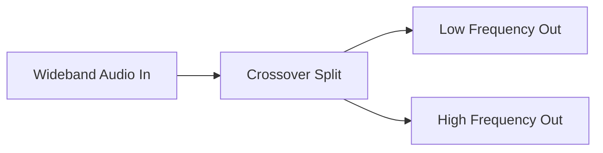

# Crossover Architecture

This directory contains the Crossover filter component.

## Overview

The Crossover splits an audio signal into multiple frequency bands (e.g., Low, Mid, High) so they can be processed or routed independently (like to a woofer and a tweeter).

## Architecture Diagram

## Configuration and Scripts

- **Kconfig**: Selects the Crossover Filter (`COMP_CROSSOVER`), which splits signals into driver-specific frequencies. Also automatically selects `COMP_BLOB` and `MATH_IIR_DF2T` math functions for its internal filters.
- **CMakeLists.txt**: Handles modular builds (`llext`). Selects `crossover.c` and generic implementations, and chooses the correct IPC file (`crossover_ipc3.c` or `crossover_ipc4.c`) based on the active IPC major version.
- **crossover.toml**: Topology parameters for the Crossover module. For IPC4, it sets `init_config = 1` so that `base_cfg_ext` is appended to the IPC payload, which is required up-front to identify output pin indices. Defines UUID, pins, and memory requirements.
- **Topology (.conf)**: `tools/topology/topology2/include/components/crossover.conf` defines the `crossover` widget object. It sets basic widget requirements and defaults to type `effect` with UUID `d1:9a:8c:94:6a:80:31:41:ad:6c:b2:bd:a9:e3:5a:9f`.
- **MATLAB Tuning (`tune/`)**: The `tune` directory holds MATLAB/Octave scripts (like `sof_example_crossover.m`) that convert mathematical frequency split parameters (e.g., 200 Hz, 1000 Hz, 3000 Hz cutoffs) into binary, ALSA, and `.conf` payloads suitable for 2-way, 3-way, or 4-way driver crossover configurations.
