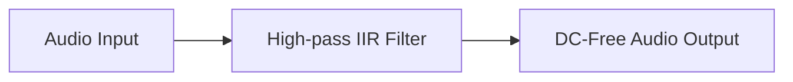

# DC Block Architecture

This directory contains the DC Blocking filter.

## Overview

The DC Blocker removes the DC offset (0 Hz component) from an audio signal, avoiding speaker damage and maximizing dynamic range.

## Architecture Diagram

## Configuration and Scripts

- **Kconfig**: Enables the DC Blocking Filter component (`COMP_DCBLOCK`) which filters out DC offsets often from a microphone's output. Includes selectable HIFI optimization levels (Max, HIFI4, HIFI3, Generic).
- **CMakeLists.txt**: Manages local build sources including generic and HIFI optimized versions (`dcblock_generic.c`, `dcblock_hifi3.c`, etc.) and determines the valid IPC abstraction (`dcblock_ipc3.c` vs `dcblock_ipc4.c`). Supports loadable extension generation via `llext`.
- **dcblock.toml**: Topology parameters for the DCBlock module. Defines UUID, pins, and memory limits for IPC integration.
- **Topology (.conf)**: Derived from `tools/topology/topology2/include/components/dcblock.conf`, it defines the `dcblock` widget object for topology generation. It defaults to type `effect` with UUID `af:ef:09:b8:81:56:b1:42:9e:d6:04:bb:01:2d:d3:84` and enforces input/output pins configuration.
- **MATLAB Tuning (`tune/`)**: The included `.m` scripts (e.g., `sof_example_dcblock.m`) automatically determine the optimal R coefficients to achieve various high-pass cutoff frequencies (-3dB point) across supported sample rates (like 16kHz and 48kHz). These coefficients are then packed into configuration blobs.
