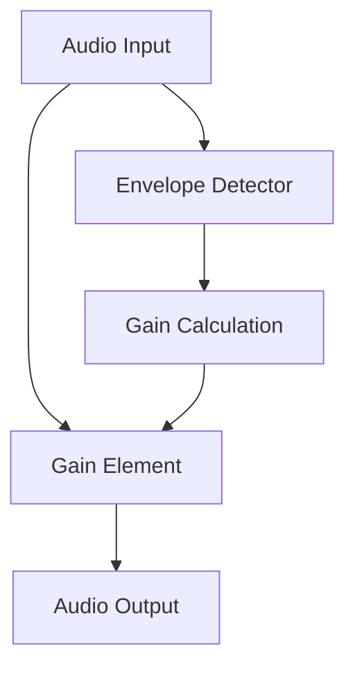

# Dynamic Range Compressor (DRC) Architecture

This directory contains the DRC component.

## Overview

The Dynamic Range Compressor reduces the volume of loud sounds or amplifies quiet sounds by narrowing or "compressing" an audio signal's dynamic range.

## Architecture Diagram

## Configuration and Scripts

- **Kconfig**: Enables the Dynamic Range Compressor component (`COMP_DRC`). It relies on various math features like `CORDIC_FIXED`, `MATH_LUT_SINE_FIXED`, and `MATH_EXP`. The maximum number of pre-delay frames is tunable via `DRC_MAX_PRE_DELAY_FRAMES` (defaults to 512).
- **CMakeLists.txt**: Manages local base sources and generic/HIFI specific files such as `drc_hifi4.c` and `drc_math_hifi3.c`. Adds logging capabilities if compiled in (`drc_log.c`).
- **drc.toml**: Topology parameters for the DRC module definition, exposing UUID and standard buffer sizes and processing capabilities.
- **Topology (.conf)**: `tools/topology/topology2/include/components/drc.conf` configures the `drc` widget object, providing switch controls by binding a mixer control to switch get/put handlers (`259`). Defaults to type `effect` with UUID `da:e4:6e:b3:6f:00:f9:47:a0:6d:fe:cb:e2:d8:b6:ce`.
- **MATLAB Tuning (`tune/`)**: Contains `.m` scripts (e.g., `sof_example_drc.m`) capable of tuning compressor parameters (threshold, knee, ratio, attack, release) and visualizing their gain reaction curves. The outputs are exported as `.conf` configurations, M4 macros, and ALSA `alsactl` payload blobs for preset instantiation defaults (e.g., speaker or DMIC presets).
