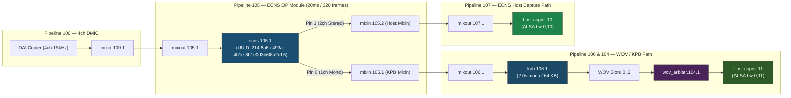

# ECNS (Echo Cancellation & Noise Suppression) Processing Module

## Overview

The `ecns` component is an IPC4 Data Processing (DP) module operating at a 20 ms period (320 samples at 16 kHz). It consumes a 4-channel audio stream comprising:
- **Channels 0 & 1**: Primary microphone inputs.
- **Channels 2 & 3**: Far-end echo reference inputs.

The module performs echo cancellation and noise suppression, delivering two distinct output streams via separate output pins:
1. **Output Pin 0 (Mono Clean Mic)**: Provides a single-channel, echo-canceled and noise-suppressed speech stream intended for keyword detection and pre-roll buffering in the Key Phrase Buffer (`kpb`).
2. **Output Pin 1 (Stereo Clean Mic)**: Provides a two-channel clean speech stream routed directly or via a host mixin/mixout bridge to a standard ALSA capture device (e.g. `hw:0,10`).

---

## Topology Architecture



---

## Specifications

| Parameter | Specification |
|---|---|
| Module UUID | `214f8a6c-493a-4b1e-8b1e0d3b6f8a2c15` |
| Processing Domain | DP (Data Processing) thread |
| Execution Period | 20 ms (320 samples at 16 kHz) |
| Input Channels | 4 (Ch 0,1: Microphones; Ch 2,3: Echo Reference) |
| Input Format | 16 kHz · 16-bit signed little-endian (`S16_LE`) |
| Output Pin 0 | 1 channel (Mono clean mic) · 16 kHz · `S16_LE` · OBS = 640 bytes (20ms) |
| Output Pin 1 | 2 channels (Stereo clean mic) · 16 kHz · `S16_LE` · OBS = 1280 bytes (20ms) |
| Sinks Acceptance | Independent sink buffer limit checks (`kpb_frames` vs `host_frames`) |
| Dynamic Pipeline | Compatible (`dynamic_pipeline 1`) |

---

## Verification & Usage

### 1. Recording Clean Stereo Audio (Pin 1 / PCM 10)
```bash
arecord -D hw:0,10 -c 2 -r 16000 -f S16_LE -d 3 /tmp/ecns_stereo.wav
```

### 2. Recording Keyword Detection Pre-Roll Audio (Pin 0 / PCM 11)
```bash
arecord -D hw:0,11 -c 1 -r 16000 -f S16_LE -d 3 /tmp/wov_mono.wav
```

---

## Further Reading
- [Developer Integration Guide: Custom WOV & ECNS Algorithms](../../../doc/developer_guides/wov_ecns_integration_guide.md)

