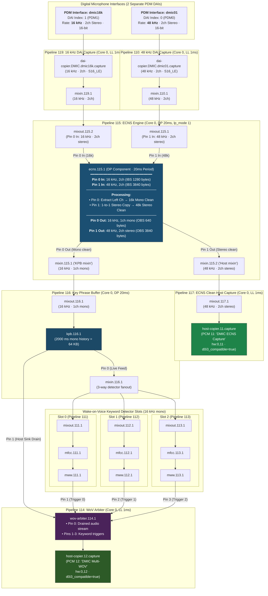

# ECNS (Echo Cancellation & Noise Suppression) Processing Module

## Overview

The `ecns` component is an IPC4 Data Processing (DP) module operating at a 20 ms period. It supports dual-stream, dual-rate microphone capture and preprocessing, connecting directly to physical PDM digital microphone interfaces:
- **Input Pin 0 (`dmic16k` on PDM1)**: 16 kHz stereo (2-channel, 16-bit `S16_LE`) dedicated speech capture stream.
- **Input Pin 1 (`dmic01` on PDM0)**: 48 kHz stereo (2-channel, 16-bit `S16_LE`) high-resolution capture stream.

The module performs echo cancellation, noise suppression, and channel routing, delivering two distinct output streams via separate output pins:
1. **Output Pin 0 (Mono Clean Speech / Keyword Stream)**: Operates at 16 kHz. Extracts the Left channel from Input Pin 0 and delivers a single-channel mono clean stream to the Key Phrase Buffer (`kpb.116.1`) and downstream microWakeWord (`mww`) keyword detection slots. Triggers deliver pre-roll and live speech to the host via the WOV Arbiter (`PCM 12`, `hw:0,12`).
2. **Output Pin 1 (Stereo Clean Speech Stream)**: Operates at 48 kHz. Performs a direct 1-to-1 copy of Input Pin 1 and delivers a 2-channel stereo clean stream to host capture (`host-copier.11.capture`, `PCM 11`, `hw:0,11`).

Both capture endpoints support low-power D0i3 listening and wake (`capture_compatible_d0i3: true`).

---

## Topology Architecture


```mermaid
flowchart TD
    %% Hardware PDM Interfaces
    subgraph PDM_INTERFACES ["Digital Microphone Interfaces (2 Separate PDM DAIs)"]
        direction LR
        PDM_48K["<b>PDM Interface: dmic01</b><br/>DAI Index: 0 (PDM0)<br/>Rate: <b>48 kHz</b> · 2ch Stereo · 16-bit"]
        PDM_16K["<b>PDM Interface: dmic16k</b><br/>DAI Index: 1 (PDM1)<br/>Rate: <b>16 kHz</b> · 2ch Stereo · 16-bit"]
    end

    %% Pipeline 110: 48 kHz DAI Capture
    subgraph P110 ["Pipeline 110: 48 kHz DAI Capture (Core 0, LL 1ms)"]
        DAI_48K["dai-copier.DMIC.dmic01.capture<br/>(48 kHz · 2ch · S16_LE)"]
        MIXIN_110["mixin.110.1<br/>(48 kHz · 2ch)"]
        DAI_48K --> MIXIN_110
    end

    %% Pipeline 119: 16 kHz DAI Capture
    subgraph P119 ["Pipeline 119: 16 kHz DAI Capture (Core 0, LL 1ms)"]
        DAI_16K["dai-copier.DMIC.dmic16k.capture<br/>(16 kHz · 2ch · S16_LE)"]
        MIXIN_119["mixin.119.1<br/>(16 kHz · 2ch)"]
        DAI_16K --> MIXIN_119
    end

    PDM_48K --> DAI_48K
    PDM_16K --> DAI_16K

    %% Pipeline 115: Dual-Rate ECNS DP Pipeline
    subgraph P115 ["Pipeline 115: ECNS Engine (Core 0, DP 20ms, lp_mode 1)"]
        direction TB

        MIXOUT_115_2["mixout.115.2<br/>(Pin 0 In: 16 kHz · 2ch stereo)"]
        MIXOUT_115_1["mixout.115.1<br/>(Pin 1 In: 48 kHz · 2ch stereo)"]

        ECNS["ecns.115.1 (DP Component · 20ms Period)<br/>━━━━━━━━━━━━━━━━━━━━━━━━━━━━━<br/><b>Pin 0 In:</b> 16 kHz, 2ch (IBS 1280 bytes)<br/><b>Pin 1 In:</b> 48 kHz, 2ch (IBS 3840 bytes)<br/>─────────────────────────────<br/><b>Processing:</b><br/>• Pin 0: Extract Left Ch → 16k Mono Clean<br/>• Pin 1: 1-to-1 Stereo Copy → 48k Stereo Clean<br/>─────────────────────────────<br/><b>Pin 0 Out:</b> 16 kHz, 1ch mono (OBS 640 bytes)<br/><b>Pin 1 Out:</b> 48 kHz, 2ch stereo (OBS 3840 bytes)"]

        MIXIN_115_1["mixin.115.1 ('KPB mixin')<br/>(16 kHz · 1ch mono)"]
        MIXIN_115_2["mixin.115.2 ('Host mixin')<br/>(48 kHz · 2ch stereo)"]

        MIXOUT_115_2 -->|"Pin 0 In (16k)"| ECNS
        MIXOUT_115_1 -->|"Pin 1 In (48k)"| ECNS

        ECNS -->|"Pin 0 Out (Mono clean)"| MIXIN_115_1
        ECNS -->|"Pin 1 Out (Stereo clean)"| MIXIN_115_2
    end

    MIXIN_119 --> MIXOUT_115_2
    MIXIN_110 --> MIXOUT_115_1

    %% Pipeline 117: Host Capture PCM 11
    subgraph P117 ["Pipeline 117: ECNS Clean Host Capture (Core 0, LL 1ms)"]
        MIXOUT_117["mixout.117.1<br/>(48 kHz · 2ch stereo)"]
        HOST_11["host-copier.11.capture<br/>(PCM 11: 'DMIC ECNS Capture'<br/>hw:0,11 · d0i3_compatible=true)"]
        MIXOUT_117 --> HOST_11
    end

    MIXIN_115_2 --> MIXOUT_117

    %% Pipeline 116: KPB History Buffer
    subgraph P116 ["Pipeline 116: Key Phrase Buffer (Core 0, DP 20ms)"]
        MIXOUT_116["mixout.116.1<br/>(16 kHz · 1ch mono)"]
        KPB["kpb.116.1<br/>(2000 ms mono history = 64 KB)"]
        MIXIN_116["mixin.116.1<br/>(3-way detector fanout)"]
        MIXOUT_116 --> KPB
        KPB -->|"Pin 0 (Live Feed)"| MIXIN_116
    end

    MIXIN_115_1 --> MIXOUT_116

    %% WoV 3-Slot Detector Subgraph
    subgraph SLOTS ["Wake-on-Voice Keyword Detector Slots (16 kHz mono)"]
        subgraph S1 ["Slot 0 (Pipeline 111)"]
            M1["mixout.111.1"] --> MF1["mfcc.111.1"] --> MW1["mww.111.1"]
        end
        subgraph S2 ["Slot 1 (Pipeline 112)"]
            M2["mixout.112.1"] --> MF2["mfcc.112.1"] --> MW2["mww.112.1"]
        end
        subgraph S3 ["Slot 2 (Pipeline 113)"]
            M3["mixout.113.1"] --> MF3["mfcc.113.1"] --> MW3["mww.113.1"]
        end
    end

    MIXIN_116 --> M1
    MIXIN_116 --> M2
    MIXIN_116 --> M3

    %% Pipeline 114: WoV Arbiter & Host Capture PCM 12
    subgraph P114 ["Pipeline 114: WoV Arbiter (Core 0, LL 1ms)"]
        ARB["wov-arbiter.114.1<br/>• Pin 0: Drained audio stream<br/>• Pins 1-3: Keyword triggers"]
        HOST_12["host-copier.12.capture<br/>(PCM 12: 'DMIC Multi-WOV'<br/>hw:0,12 · d0i3_compatible=true)"]
        ARB --> HOST_12
    end

    KPB -->|"Pin 1 (Host Sink Drain)"| ARB
    MW1 -->|"Pin 1 (Trigger 0)"| ARB
    MW2 -->|"Pin 2 (Trigger 1)"| ARB
    MW3 -->|"Pin 3 (Trigger 2)"| ARB

    style ECNS fill:#1b4f72,stroke:#555,color:#fff
    style KPB fill:#1c4966,stroke:#555,color:#fff
    style ARB fill:#4a235a,stroke:#555,color:#fff
    style HOST_11 fill:#1e8449,stroke:#555,color:#fff
    style HOST_12 fill:#2d5a27,stroke:#555,color:#fff
```

---

## Specifications

| Parameter | Specification |
|---|---|
| Module UUID | `6c:8a:4f:21:3a:49:1e:4b:8b:1e:0d:3b:6f:8a:2c:15` |
| Processing Domain | DP (Data Processing) thread (`lp_mode 1`) |
| Execution Period | 20 ms (320 frames at 16 kHz / 960 frames at 48 kHz) |
| Input Pin 0 | 16 kHz · 2 channels (Stereo from `dmic16k`) · `S16_LE` · IBS = 1280 bytes (20ms) |
| Input Pin 1 | 48 kHz · 2 channels (Stereo from `dmic01`) · `S16_LE` · IBS = 3840 bytes (20ms) |
| Output Pin 0 | 16 kHz · 1 channel (Mono left channel clean) · `S16_LE` · OBS = 640 bytes (20ms) |
| Output Pin 1 | 48 kHz · 2 channels (Stereo clean copy) · `S16_LE` · OBS = 3840 bytes (20ms) |
| Sinks Acceptance | Independent sink buffer limit checks (`kpb_frames` vs `host_frames`) |
| Dynamic Pipeline | Compatible (`dynamic_pipeline 1`) |
| Power States | S0 active streaming and D0i3 low-power listening supported |

---

## Verification & Usage

### 1. Recording Clean Stereo Audio (Output Pin 1 / PCM 11)
Capture the continuous 48 kHz clean stereo microphone stream:
```bash
arecord -D hw:0,11 -c 2 -r 48000 -f S16_LE -d 3 /tmp/ecns_stereo_48k.wav
```

### 2. Recording Keyword Detection & History Buffer Audio (Output Pin 0 / PCM 12)
Capture the gated 16 kHz mono speech stream delivered by the WOV Arbiter upon keyword trigger:
```bash
arecord -D hw:0,12 -c 1 -r 16000 -f S16_LE -d 3 /tmp/wov_mono_16k.wav
```

---

## Further Reading
- [Topology2 Architecture & Verification Runbook](../../../tools/topology/topology2/README.md)
- [WOV Arbiter Architecture & State Machine](../wov_arbiter/README.md)
- [Developer Integration Guide: Custom WOV & ECNS Algorithms](../../../doc/developer_guides/wov_ecns_integration_guide.md)
