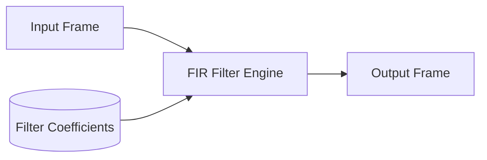

# FIR Equalizer Architecture

This directory contains the Finite Impulse Response (FIR) EQ component.

## Overview

FIR equalizers implement linear-phase (or minimal-phase) audio frequency shaping over a specified set of taps.

## Architecture Diagram

## Configuration and Scripts

- **Kconfig**: Enables the FIR component (`COMP_FIR`), which automatically imports `MATH_FIR` and `COMP_BLOB`. Relies on compiler capabilities to leverage DSP MAC instructions for optimal performance.
- **CMakeLists.txt**: Integrates generic and architecture-specific (`eq_fir_hifi2ep.c`, `eq_fir_hifi3.c`) files into the build, picking the correct IPC wrapper (`ipc3` or `ipc4`), and supports `llext`.
- **eq_fir.toml**: Topology parameters for the EQFIR module, defining UUIDs, memory parameters (like 4096 bytes limits) and pin layouts.
- **Topology (.conf)**: Constrained by `tools/topology/topology2/include/components/eqfir.conf`, assigning it widget type `effect` and UUID `e7:0c:a9:43:a5:f3:df:41:ac:06:ba:98:65:1a:e6:a3`.
- **MATLAB Tuning (`tune/`)**: `sof_example_fir_eq.m` utilizes the Parks-McClellan (or related) algorithms to model loudness or mid-boost curves, iterating length variables to determine optimal FIR phase behaviors. It outputs quantized binary arrays containing the calculated taps necessary for topology population.
