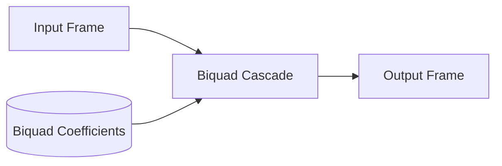

# IIR Equalizer Architecture

This directory contains the Infinite Impulse Response (IIR) EQ component.

## Overview

IIR equalizers provide frequency shaping (like parametric EQs, shelves, high/low passes) typically using arrays of biquad filters.

## Architecture Diagram

## Configuration and Scripts

- **Kconfig**: Activates the IIR component (`COMP_IIR`), selecting `MATH_IIR_DF1` and depending on the module adapter.
- **CMakeLists.txt**: Compiles generic logic (`eq_iir_generic.c`) and IPC-specific files depending on the Zephyr IPC configuration.
- **eq_iir.toml**: Topology parameters tailored by platform. Defines custom `mod_cfg` arrays with varying constraints based on `CONFIG_METEORLAKE` versus `CONFIG_LUNARLAKE` and ACE SOCs.
- **Topology (.conf)**: Dictated by `tools/topology/topology2/include/components/eqiir.conf`, representing an `effect` widget object with UUID `e6:c0:50:51:f9:27:c8:4e:83:51:c7:05:b6:42:d1:2f`.
- **MATLAB Tuning (`tune/`)**: `sof_example_iir_eq.m` and associated scripts can design parametric biquad presets (e.g., loudness, bass boost, bandpass, flat). These scripts compute the IIR coefficients, calculate precise scaling values, quantize mathematically, and bundle the permutations into binaries and configuration fragments suitable for SOF IPC messages.
