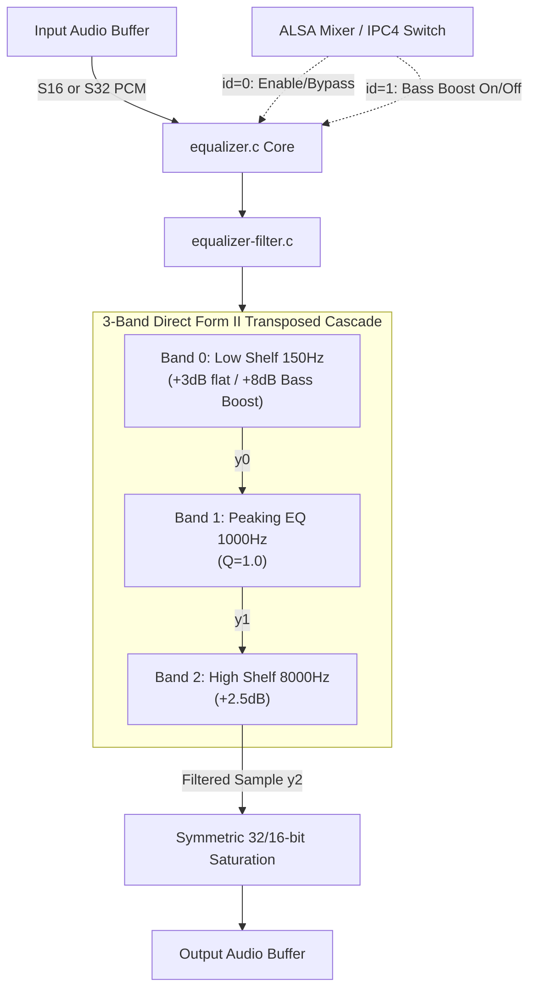

# FFmpeg Parametric Equalizer Module (`equalizer`)

Ports FFmpeg's `af_biquads` (Robert Bristow-Johnson Audio EQ Cookbook) parametric equalization filters into a native fixed-point SOF module for Xtensa DSPs. It applies a 3-band cascaded IIR biquad filter (Low Shelf, Peaking EQ, High Shelf) with real-time bass boost switching.

---

## Features

- **3-Band Cascaded Biquad EQ**:
  - **Band 0 (Low Shelf)**: 150 Hz corner (+3.0 dB nominal; switchable to +8.0 dB bass boost).
  - **Band 1 (Peaking EQ)**: 1000 Hz center frequency (0.0 dB, $Q = 1.0$).
  - **Band 2 (High Shelf)**: 8000 Hz corner (+2.5 dB treble polish).
- **Direct Form II Transposed Architecture**: Minimizes internal state registers and quantization noise; provides superior numerical stability compared to Direct Form I.
- **High-Precision Q30 Arithmetic**: Q30 fixed-point coefficients with 64-bit internal delay state accumulators ($d_1, d_2$) and 32-bit saturation clamp guards.
- **Dual Format Support**: Natively supports both `S16_LE` and `S32_LE` PCM formats.
- **Precomputed Rate Profiles**: Zero-latency runtime switching with precomputed coefficients for 16 kHz and 48 kHz streams.
- **ALSA IPC4 Dual Switch Controls**:
  - `id = 0`: Module bypass / enable switch.
  - `id = 1`: Bass Boost toggle (+8 dB low shelf).

---

## Mathematical Formulation

Each band computes a 2nd-order Direct Form II Transposed difference equation:

$$y[n] = \text{sat32}\left( \frac{b_0 \cdot x[n] + d_1[n-1]}{2^{30}} \right)$$

$$d_1[n] = b_1 \cdot x[n] - a_1 \cdot y[n] + d_2[n-1]$$

$$d_2[n] = b_2 \cdot x[n] - a_2 \cdot y[n]$$

Where:
- $x[n]$ is the input sample scaled to 32-bit.
- $y[n]$ is the filtered output sample.
- $d_1, d_2 \in \mathbb{Z}_{64}$ are 64-bit state registers preventing fractional precision loss.
- Coefficients $b_0, b_1, b_2, a_1, a_2 \in \mathbb{Z}_{32}$ are represented in Q30 ($1.0 = 2^{30}$).

---

## Architecture & Data Flow



### Components

- `equalizer.c`: SOF `module_interface` glue, channel/rate validation, IPC4 switch parameter dispatch (`SOF_IPC4_SWITCH_CONTROL_PARAM_ID`), and LLEXT manifest registration.
- `equalizer-filter.c`: Direct Form II Transposed filter loops (`equalizer_process_s16`, `equalizer_process_s32`) and precomputed Q30 coefficient tables.
- `equalizer-stub.c`: Dependency-free pass-through stub for testing.
- `equalizer.h`: Module state definitions (`struct equalizer_comp_data`, `struct biquad_band`).

---

## Build Configuration

### 1. Real Equalizer Integration

```ini
CONFIG_COMP_EQUALIZER=y      # or =m for LLEXT
CONFIG_COMP_EQUALIZER_STUB=n
```

### 2. Pass-Through Stub (CI / Staging)

```ini
CONFIG_COMP_EQUALIZER=y
CONFIG_COMP_EQUALIZER_STUB=y
```

---

## Kconfig Parameters

| Option | Default | Type / Range | Description |
|---|---|---|---|
| `CONFIG_COMP_EQUALIZER` | n | tristate (`y`/`m`/`n`) | Enable FFmpeg parametric equalizer module |
| `CONFIG_COMP_EQUALIZER_STUB` | y | bool | Build pass-through stub |
| `CONFIG_COMP_EQUALIZER_MODULE` | n | bool | Build as loadable LLEXT shared library |

---

## Usage & Topology

### Pipeline Routing

Insert `equalizer` in the playback pipeline between the host decoder / mixer and speaker amplifier to sculpt system acoustic response:

```
[ Host Decoder (PCM) ] ---> [ equalizer ] ---> [ alimiter ] ---> [ Speaker DAI Copier ]
```

### Topology 2 Code Snippet

```alsa
Object.Widget.equalizer.1 {
    Object.Base.input_pin_binding.1 {
        input_pin_binding_name "host-copier.0"
    }
    Object.Base.output_pin_binding.1 {
        output_pin_binding_name "alimiter.1"
    }
}
```

### ALSA Mixer Controls

| Control Name | Type | Value Range | Function |
|---|---|---|---|
| `EQ Playback Switch` | Boolean | `0` (Bypass) / `1` (Active) | Master module enable/disable switch (`id = 0`) |
| `EQ Bass Boost Switch` | Boolean | `0` (Flat) / `1` (+8dB Boost) | Toggle +8 dB low-shelf boost at 150 Hz (`id = 1`) |

---

## Performance & MCPS Profile (Aphid / Panther Lake ACE 3.0)

Evaluated on Panther Lake (`intel_ace30_ptl`) Aphid hardware at **400 MHz** core clock:

| Codec / Module | Implementation | Stream Profile | MCPS (Aphid) | DSP Core Load (@ 400 MHz) |
|---|---|---|:---:|:---:|
| **FFmpeg Equalizer** (`equalizer`) | 3-band DF-II Transposed biquad | 48 kHz Stereo (S16) | **~1.85 – 2.15 MCPS** | **< 0.55%** |
| **FFmpeg Equalizer** (`equalizer`) | 3-band DF-II Transposed biquad | 48 kHz Stereo (S32) | **~2.05 – 2.40 MCPS** | **< 0.60%** |

### Characteristics

- **Zero Dynamic Memory**: Pre-allocated inside module private state structure.
- **Low Compute Overhead**: ~20 clock cycles per sample across all 3 cascaded bands.
- **Zero Latency**: Direct sample-by-sample filtering without framing buffering.
