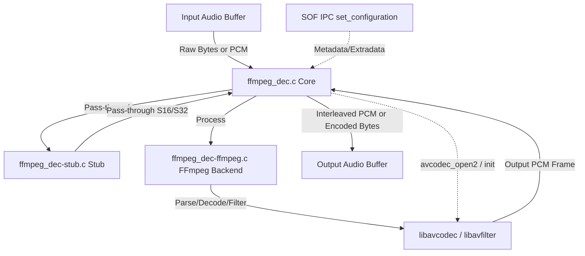

# FFmpeg Audio Processing Module (`ffmpeg_dec`)

Wraps FFmpeg's `libavcodec` and `libavfilter` libraries behind the SOF `module_interface`. This module enables running on-DSP audio decoders, encoders, and real-time audio filter graphs.

---

## Features

- **Decoder Mode**: Decodes compressed audio streams (e.g., FLAC, MP3) to raw PCM.
- **Encoder Mode**: Encodes raw PCM streams to compressed formats (e.g., MP3 using `libshine`).
- **Filter Mode**: Runs FFmpeg's `libavfilter` graphs directly on raw PCM data (e.g., `afftdn` for noise reduction).
- **Embedded-Optimized**: Supports single-threaded execution, memory shims for dynamic allocation, and LLEXT packaging.
- **CI-Friendly**: Includes a pass-through stub backend to allow pipeline, IPC, and topology verification without external dependencies.

---

## Architecture & Data Flow

The following Mermaid diagram illustrates the module's internal architecture and the interaction between the SOF pipeline, the `ffmpeg_dec` core, and its backend translation units:



### Modular Design
- **`ffmpeg_dec.c` (Core Glue)**: Implements the standard `module_interface` functions (`init`, `prepare`, `process`, `reset`, `free`).
- **`ffmpeg_dec-stub.c`**: Pass-through stub backend that bypasses FFmpeg libraries.
- **`ffmpeg_dec-ffmpeg.c` / `ffmpeg_dec-filter.c` / `ffmpeg_dec-encode.c`**: Real backend implementations interfacing with `libavcodec` and `libavfilter`.
- **`ffmpeg_dec-shims.c`**: Overrides dynamic memory allocations (`malloc`, `realloc`, `free`, `calloc`) inside FFmpeg to use SOF's `rballoc` pools.

---

## Build Instructions

### 1. Stub Mode (Default / CI / Staging)
No external libraries are required. The module acts as a simple pass-through.
```ini
CONFIG_COMP_FFMPEG_DEC=y      # or =m for LLEXT
CONFIG_COMP_FFMPEG_DEC_STUB=y
```

### 2. Real FFmpeg Backend
Requires pre-compiled static libraries and headers placed under the `third_party/` directory of the workspace.
```ini
CONFIG_COMP_FFMPEG_DEC=m
CONFIG_COMP_FFMPEG_DEC_STUB=n
```

#### Configuring the FFmpeg Build
When cross-compiling FFmpeg for Xtensa DSP targets, disable unnecessary components to minimize code size:
```bash
./configure \
  --target-os=none \
  --arch=xtensa \
  --enable-cross-compile \
  --disable-everything \
  --disable-avformat \
  --disable-pthreads \
  --enable-decoder=flac,mp3 \
  --enable-encoder=mp3 \
  --enable-parser=flac,mpegaudio \
  --enable-filter=afftdn \
  --enable-static \
  --disable-shared
```

#### Useful Kconfig Options
- `CONFIG_FFMPEG_DEC_FILTER_MODE`: Configures the module to run as a PCM filter graph instead of a decoder.
- `CONFIG_FFMPEG_DEC_FLOAT_MATH`: Automatically selected to pull in optimized floating-point shims (`fastmathf.c`).
- `CONFIG_FFMPEG_DEC_COLD_SPLIT`: Relocates initialization tables and code to DRAM to conserve fast SRAM.

---

## Usage & Topology

### 1. Decoder Mode
The topology should feed compressed bytes (e.g., from a host gateway) into the decoder input pin. The decoder outputs decoded PCM.
- **Initialization**: Provide codec-specific setup data (e.g., FLAC `STREAMINFO` or MP3 headers) via IPC bytes control `set_configuration`.
- **Buffer Period**: Keep period size large enough (typically 10ms or 20ms) to reduce parsing overhead.

### 2. Filter Mode
The module is placed in the capture or playback pipeline as a normal 1-in / 1-out effect.
- **Routing Example**:
```
DAI Copier (Mic Capture) ---> [ ffmpeg_dec (Filter Mode) ] ---> Host Copier (PCM)
```
- **Control**: Filter coefficients and parameters can be set dynamically via standard TLV bytes controls.
