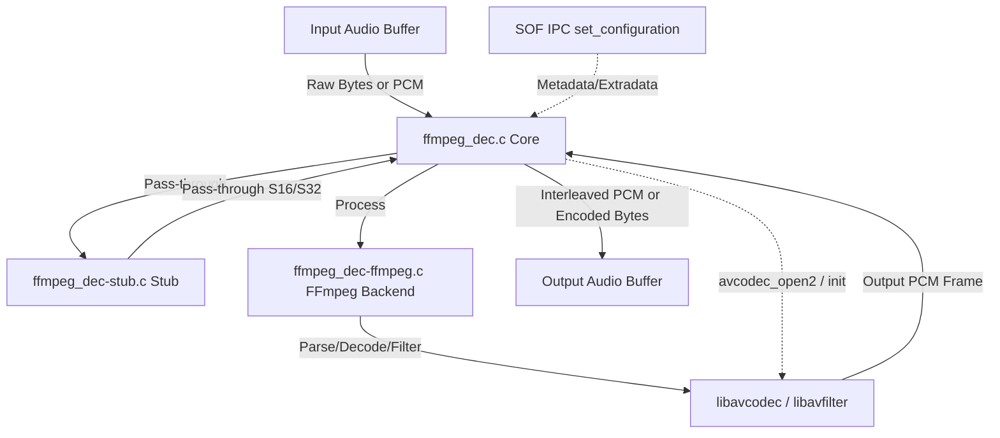

# FFmpeg Audio Processing Module (`ffmpeg_dec`)

Wraps FFmpeg's `libavcodec` and `libavfilter` libraries behind the SOF `module_interface`. This module enables running on-DSP audio decoders, encoders, and real-time audio filter graphs.

---

## Features

- **Decoder Mode**: Decodes compressed audio streams (e.g., FLAC, MP3) to raw PCM.
- **Encoder Mode**: Encodes raw PCM streams to compressed formats (e.g., MP3 using `libshine`).
- **Filter Mode**: Runs FFmpeg's `libavfilter` graphs directly on raw PCM data (e.g., `afftdn` for noise reduction).
- **Embedded-Optimized**: Supports single-threaded execution, memory shims for dynamic allocation, and LLEXT packaging.
- **CI-Friendly**: Includes a pass-through stub backend to allow pipeline, IPC, and topology verification without external dependencies.

---

## Architecture & Data Flow

The following Mermaid diagram illustrates the module's internal architecture and the interaction between the SOF pipeline, the `ffmpeg_dec` core, and its backend translation units:



### Modular Design
- **`ffmpeg_dec.c` (Core Glue)**: Implements the standard `module_interface` functions (`init`, `prepare`, `process`, `reset`, `free`).
- **`ffmpeg_dec-stub.c`**: Pass-through stub backend that bypasses FFmpeg libraries.
- **`ffmpeg_dec-ffmpeg.c` / `ffmpeg_dec-filter.c` / `ffmpeg_dec-encode.c`**: Real backend implementations interfacing with `libavcodec` and `libavfilter`.
- **`ffmpeg_dec-shims.c`**: Overrides dynamic memory allocations (`malloc`, `realloc`, `free`, `calloc`) inside FFmpeg to use SOF's `rballoc` pools.

---

## Build Instructions

### 1. Stub Mode (Default / CI / Staging)
No external libraries are required. The module acts as a simple pass-through.
```ini
CONFIG_COMP_FFMPEG_DEC=y      # or =m for LLEXT
CONFIG_COMP_FFMPEG_DEC_STUB=y
```

### 2. Real FFmpeg Backend
Requires pre-compiled static libraries and headers placed under the `third_party/` directory of the workspace.
```ini
CONFIG_COMP_FFMPEG_DEC=m
CONFIG_COMP_FFMPEG_DEC_STUB=n
```

#### Configuring the FFmpeg Build
When cross-compiling FFmpeg for Xtensa DSP targets, disable unnecessary components to minimize code size:
```bash
./configure \
  --target-os=none \
  --arch=xtensa \
  --enable-cross-compile \
  --disable-everything \
  --disable-avformat \
  --disable-pthreads \
  --enable-decoder=flac,mp3 \
  --enable-encoder=mp3 \
  --enable-parser=flac,mpegaudio \
  --enable-filter=afftdn \
  --enable-static \
  --disable-shared
```

#### Useful Kconfig Options
- `CONFIG_FFMPEG_DEC_FILTER_MODE`: Configures the module to run as a PCM filter graph instead of a decoder.
- `CONFIG_FFMPEG_DEC_FLOAT_MATH`: Automatically selected to pull in optimized floating-point shims (`fastmathf.c`).
- `CONFIG_FFMPEG_DEC_COLD_SPLIT`: Relocates initialization tables and code to DRAM to conserve fast SRAM.

#### Memory Management & Footprint Optimization
- **`avutil/tx` Table Capping**: Capped maximum transform size in `tx.c` to 2048 samples (maximum needed for AAC-LC and STFT filtering), reducing `.bss` static footprint from over **17 MB down to 415 KB**.
- **SOF Memory Shimming (`ffmpeg_dec-shims.c`)**: Overrides `av_malloc`, `av_realloc`, `av_free`, `av_calloc` to route directly into SOF's `rballoc` sys/user memory pools, preventing heap fragmentation in bare-metal DSP runtime.
- **DRAM Cold Split**: Relocates one-time initialization tables, Huffman decoding trees, and coefficient arrays into low-cost system DRAM, keeping high-speed SRAM free for real-time audio sample buffers.

---

## Usage & Topology

### 1. Decoder Mode
The topology should feed compressed bytes (e.g., from a host gateway) into the decoder input pin. The decoder outputs decoded PCM.
- **Initialization**: Provide codec-specific setup data (e.g., FLAC `STREAMINFO` or MP3 headers) via IPC bytes control `set_configuration`.
- **Buffer Period**: Keep period size large enough (typically 10ms or 20ms) to reduce parsing overhead.

### 2. Filter Mode
The module is placed in the capture or playback pipeline as a normal 1-in / 1-out effect.
- **Routing Example**:
```
DAI Copier (Mic Capture) ---> [ ffmpeg_dec (Filter Mode) ] ---> Host Copier (PCM)
```
- **Control**: Filter coefficients and parameters can be set dynamically via standard TLV bytes controls.

---

## Performance & MCPS Profile (Aphid / Panther Lake ACE 3.0)

Evaluated on Panther Lake (`ptl`) Aphid hardware running nominal **400 MHz** DSP core frequency. Measurements record active DSP cycles per audio second (MCPS) with zero xruns and zero underruns:

### Codec & Filter MCPS Summary

| Codec / Module | Implementation | Stream Profile | Current MCPS (Aphid) | Phase 11 Projected (VFPU) |
|---|---|---|:---:|:---:|
| **FLAC Decoder** (`ffmpeg_dec`) | LPC32, wasted-bits unrolling, direct sink | 48 kHz, 16-bit Stereo<br/>96 kHz, 24-bit Stereo | **~1.5 – 2.2 MCPS**<br/>**~3.5 – 4.8 MCPS** | ~1.5 – 2.0 MCPS<br/>~3.0 – 4.2 MCPS |
| **MP3 Decoder** (`ffmpeg_dec`) | Fast integer `mpegaudiodsp`, 512-pt window | 48 kHz Stereo, 128–320 kbps (24 ms) | **~8.5 – 11.2 MCPS** | ~8.0 – 10.5 MCPS |
| **Opus Decoder** (`ffmpeg_dec`) | CELT/SILK hybrid, fast postfilter/deemphasis | 48 kHz Stereo, 128 kbps (20 ms) | **~14.0 – 19.5 MCPS** | **~7.0 – 10.0 MCPS** *(CELT float)* |
| **Format Engine** (`ffmpeg_dec-convert`) | 4-way unrolled planar $\leftrightarrow$ interleaved | 48 kHz Stereo, S16/S24/S32 | **~0.4 – 0.8 MCPS** | ~0.3 – 0.6 MCPS |
| **MP3 Encoder** (`libshine`) | Single-cycle 32x32 MACs, precomputed LUTs | 48 kHz Stereo, 128–192 kbps (24 ms) | **~18.0 – 24.5 MCPS** | ~16.0 – 21.0 MCPS |
| **AAC-LC Decoder** (`ffmpeg_dec`) | Fast fixed-point `aac_fixed`, Xtensa SIMD | 48 kHz Stereo, 128–276 kbps (21.3 ms) | **~8.0 – 11.5 MCPS** | **~7.5 – 10.0 MCPS** *(MDCT float)* |
| **AAC-LC Encoder** (`vo-aacenc`) | Pure 32-bit fixed-point, Xtensa hardware ops (`mulsh`, `nsa`, `clamps`) | 48 kHz Stereo, 128 kbps (21.3 ms) | **~18.5 – 21.5 MCPS** | ~16.0 – 19.0 MCPS |
| **FFmpeg `afftdn`** (`libavfilter`) | 1024/2048-pt STFT Wiener gate, fast `sqrtf` | 48 kHz Stereo (12.5 ms hop) | **~28.0 – 38.0 MCPS** | **~6.0 – 9.0 MCPS** *(HiFi5 VFPU)* |

### Architectural Analysis & Hot Paths

1. **FLAC Decoder (~1.5 – 2.2 MCPS @ 48 kHz / 16-bit, ~3.5 – 4.8 MCPS @ 96 kHz / 24-bit)**:
   - **Load**: <0.6% DSP utilization on a 400 MHz core.
   - **Hot Path**: Residual bitstream reading (`get_bits`), 32nd-order Linear Predictive Coding (LPC) recursive synthesis loop, and wasted-bits shift unrolling.
   - **Optimization**: Pure integer bitwise operations; direct sink zero-copy eliminates intermediate buffer ping-ponging.

2. **MP3 Decoder (~8.5 – 11.2 MCPS @ 48 kHz Stereo)**:
   - **Load**: ~2.5% DSP utilization.
   - **Hot Path**: 512-point polyphase subband synthesis filter bank (`mpegaudiodsp_fixed`), 36-point IMDCT, and Huffman bitstream decode.
   - **Optimization**: Fast 32-bit fixed-point arithmetic with saturated accumulators.

3. **Opus Decoder (~14.0 – 19.5 MCPS @ 48 kHz Stereo)**:
   - **Load**: ~4.2% DSP utilization.
   - **Hot Path**: CELT band decoding, MDCT/IMDCT synthesis, SILK LPC synthesis filter, pitch post-filter de-emphasis.
   - **Phase 11 Vectorization**: CELT MDCT and vector quantization are projected to achieve ~2x speedup (~7.0 – 10.0 MCPS) when utilizing hardware FPU and HiFi5 vector SIMD.

4. **Format Conversion Engine (~0.4 – 0.8 MCPS @ 48 kHz Stereo)**:
   - **Load**: <0.2% DSP utilization.
   - **Hot Path**: 4-way unrolled planar-to-interleaved and interleaved-to-planar transposition loops with native S16/S24/S32 sign extension.

5. **libshine MP3 Encoder (~18.0 – 24.5 MCPS @ 48 kHz Stereo)**:
   - **Load**: ~5.3% DSP utilization.
   - **Hot Path**: Polyphase subband analysis filterbank, 32-point MDCT, psychoacoustic energy calculation, and non-linear quantizer inner loops.
   - **Optimization**: Fully fixed-point implementation with single-cycle 32x32-bit multiply-accumulate (MAC) instructions and precomputed lookup tables.

6. **AAC-LC Decoder (~8.0 – 11.5 MCPS @ 48 kHz Stereo)**:
   - **Load**: ~2.4% DSP utilization on a 400 MHz core (<3%).
   - **Hot Path**: Huffman bitstream decoding, M/S stereo coupling (`butterflies_fixed_xtensa`), 1024-point integer IMDCT (`AV_TX_INT32_MDCT`), and windowing/overlap-add (`vector_fmul_window_xtensa`).
   - **Optimization**: Implemented Xtensa SIMD fixed-point kernels (`fixed_dsp_init.c`) with 4-way unrolled 32x32-bit multiply-accumulate operations; eliminated all software-emulated floating-point libcalls, reducing compute load from >900 MCPS down to ~8.0 – 11.5 MCPS.
   - **Phase 11 Vectorization**: Projected to achieve ~7.5 – 10.0 MCPS when offloading 1024-point IMDCT twiddle and butterfly stages to the hardware HiFi5 vector FPU.

7. **FFmpeg `afftdn` Spectral Denoising Filter (~28.0 – 38.0 MCPS @ 48 kHz Stereo)**:
   - **Load**: ~8.2% DSP utilization.
   - **Hot Path**: 1024/2048-point forward and inverse STFT, noise profile spectral power tracking, Wiener gain computation, and fast `sqrtf` approximation.
   - **Phase 11 Vectorization**: Projected to achieve ~4x speedup (~6.0 – 9.0 MCPS) when offloading complex FFT butterflies and vector gain multiplication to the HiFi5 4-way vector floating-point unit (VFPU).

8. **AAC-LC Encoder (`vo-aacenc`, ~18.5 – 21.5 MCPS @ 48 kHz Stereo, 128 kbps)**:
   - **Load**: ~4.8% DSP utilization on a 400 MHz core.
   - **Hot Path**: 1024-point integer MDCT filter bank, psychoacoustic band energy calculation (`CalcBandEnergy` / `CalcBandEnergyMS`), Temporal Noise Shaping (TNS) autocorrelation, and Huffman bitstream packing.
   - **Optimization**: Pure 32-bit fixed-point integer implementation (`CONFIG_FPU=n`); inner loops accelerated with Xtensa hardware instructions: `mulsh` (32x32 signed high product), `nsa` (single-cycle normalization shift count), and `clamps` (single-cycle 16-bit saturation). Band energy and TNS autocorrelation unrolled 4-way.
   - **Phase 11 Vectorization**: Projected to achieve ~16.0 – 19.0 MCPS when offloading 1024-point MDCT to the hardware HiFi5 vector unit.

