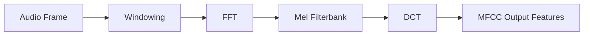

# MFCC Feature Extraction Architecture

This directory contains the Mel-Frequency Cepstral Coefficients (MFCC) feature extractor.

## Overview

MFCC extracts audio features commonly used as inputs for machine learning models, such as wake-word detection or speech recognition.

## Architecture Diagram

## Configuration and Scripts

- **Kconfig**: Enables the MFCC component (`COMP_MFCC`) which selects necessary math libraries (`MATH_FFT`, `MATH_DCT`, `MATH_16BIT_MEL_FILTERBANK`, etc.). Depends on `COMP_MODULE_ADAPTER`.
- **CMakeLists.txt**: Compiles generic, common, and HIFI implementations (`mfcc_hifi3.c`, `mfcc_hifi4.c`). Provides support for Zephyr loadable extensions (`llext`).
- **mfcc.toml**: Specifies the topology configuration for the MFCC module (UUID, affinity, memory parameters, and pin formats).
- **Topology (.conf)**: Derived from `tools/topology/topology2/include/components/mfcc.conf`, configuring a `mfcc` widget object of type `effect` with UUID `73:a7:10:db:a4:1a:ea:4c:a2:1f:2d:57:a5:c9:82:eb`.
