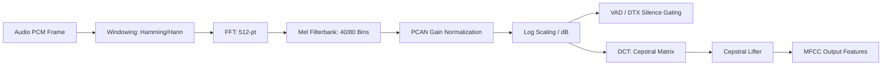

# MFCC & PCAN Feature Extraction Architecture

This directory contains the **Mel-Frequency Cepstral Coefficients (MFCC)** feature extractor and integrated **PCAN (Per-Channel AGC Normalization)** audio pre-processing component for Sound Open Firmware (SOF).

---

## 1. Overview

The MFCC module converts raw streaming time-domain PCM audio into compact acoustic feature representations (e.g. 13-bin cepstral coefficients, 40-bin or 80-bin Mel spectrograms) suitable for on-device machine learning models such as wake-word classifiers (TFLM, microWakeWord) and speech recognition engines (Whisper).

When enabled, **PCAN** applies per-channel adaptive dynamic gain control and piecewise root dynamic range compression across time to suppress stationary background noise and normalize channel energy before feature quantization.

---

## 2. Architecture & Data Flow


```mermaid
graph LR
  In[Audio PCM Frame] --> Win[Windowing: Hamming/Hann]
  Win --> FFT[FFT: 512-pt]
  FFT --> Mel[Mel Filterbank: 40/80 Bins]
  Mel --> PCAN[PCAN Gain Normalization]
  PCAN --> Log[Log Scaling / dB]
  Log --> VAD[VAD / DTX Silence Gating]
  Log --> DCT[DCT: Cepstral Matrix]
  DCT --> Lifter[Cepstral Lifter]
  Lifter --> Out[MFCC Output Features]
```

---

## 3. Dependencies

| Dependency | Purpose |
|---|---|
| **West Manifest (`west.yml`)** | Manages workspace dependencies including `tflite-micro` |
| **`tflite-micro`** | Provides Google's upstream Apache-2.0 `microfrontend` PCAN library (`pcan_gain_control.c`, `noise_reduction.c`) |
| **GNU Octave ($\ge 5.0$)** | Required for topology configuration generation (`tune/setup_mfcc.m`) and reference vector export |
| **CMake ($\ge 3.13$)** | SOF build system |
| **Zephyr SDK / Xtensa XCC** | DSP cross-compilation toolchains for Cadence HiFi3 / HiFi4 SIMD kernels |
| **CMocka** | Host unit testing framework |

---

## 4. Build & Tuning Instructions

### 4.1 Synchronize Dependencies via West
```bash
west update
```

### 4.2 Build Host Unit Tests
```bash
# Configure unit tests
cmake -S sof -B build_ut -DBUILD_UNIT_TESTS=ON -DBUILD_UNIT_TESTS_HOST=ON -DINIT_CONFIG=unit_test_defconfig

# Build all math and MFCC tests
cmake --build build_ut --target pcan
ctest --test-dir build_ut -R "pcan|auditory|dct|matrix|window|fft" --output-on-failure
```

### 4.3 Build Target DSP Firmware
```bash
west build -b intel_adsp_ace15_mtpm app
```

### 4.4 Generate Topology Configurations (Octave)
The tuning script generates binary configuration blobs and ALSA topology configurations:
```bash
cd src/audio/mfcc/tune
octave-cli --eval "setup_mfcc"
```
Available presets generated:
- `ceps13_compress_dtx.conf`: 13-bin cepstral features with VAD and DTX silence suppression.
- `mel80_compress.conf`: 80-bin linear Mel spectrogram features.
- `mel80_compress_dtx.conf`: 80-bin Mel spectrogram with DTX gating.
- `mel80_pcan_compress.conf`: 80-bin Mel spectrogram with Google PCAN dynamic AGC normalization.

---

## 5. Configuration Options

- **`CONFIG_COMP_MFCC`**: Enables the MFCC component and automatically selects required math libraries (`CONFIG_MATH_FFT`, `CONFIG_MATH_AUDITORY`, `CONFIG_MATH_DCT`, `CONFIG_MATH_PCAN`, `CONFIG_MATH_WINDOW`).
- **`CONFIG_COMP_MODULE_ADAPTER`**: Module adapter infrastructure for SOF processing components.
