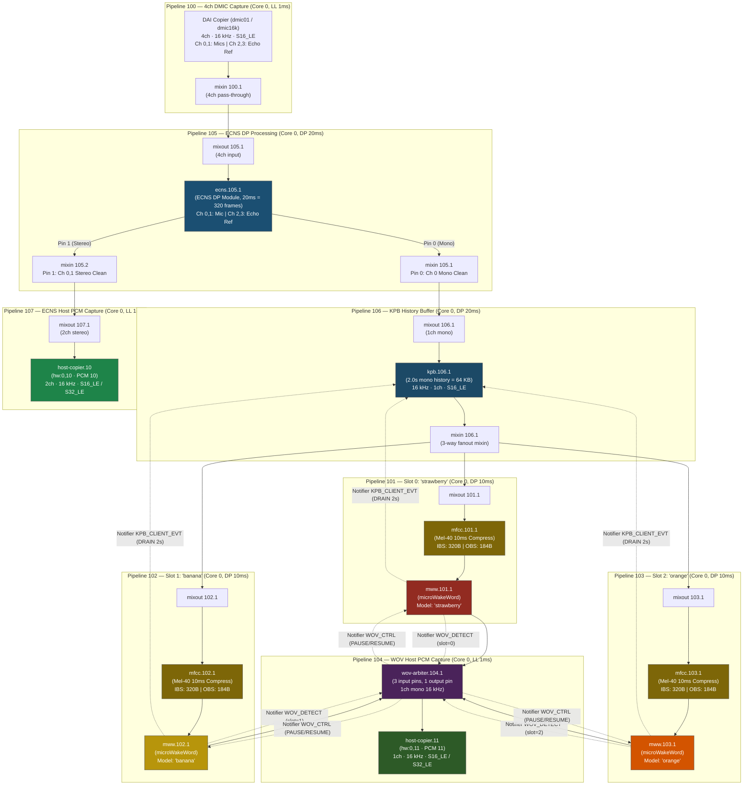

# microWakeWord (MWW) Architecture & Multi-Slot WoV Integration

This directory provides the Sound Open Firmware (SOF) component wrapping [OHF-Voice's
microWakeWord](https://github.com/OHF-Voice/micro-wake-word) streaming
keyword-spotting model, integrated with MFCC feature extraction and the
multi-slot Key Phrase Buffer (KPB) Wake-on-Voice (WoV) arbitration infrastructure.

Unlike standard single-keyword detectors or 4-way softmax classifiers, microWakeWord
executes streaming inference over a stateful TensorFlow Lite Micro (TFLM) graph,
outputting a single sigmoid wake-word probability per keyword model.

In this architecture, **one unified codebase** supports **three concurrent keyword spotter instances**:
- **Slot 0** (Pipeline 101): `"strawberry"`
- **Slot 1** (Pipeline 102): `"banana"`
- **Slot 2** (Pipeline 103): `"orange"`

---

## Architecture & Data Flow

The multi-slot MWW topology is unified across **Tiger Lake (TGL)**, **Panther Lake (PTL)**, and **Wildcat Lake (WCL)**:



---

## Cross-Platform Manifest Targets

| Target Platform | Manifest File | Output Topology Binary | DMIC Driver Version |
|---|---|---|---|
| **Panther Lake (PTL / ACE 3.0)** | [`dmic-wov-multi-ptl-4ch-manifest.conf`](file:///home/lrg/work/sof-tgl/sof-wov/tools/topology/topology2/dmic-wov-multi-ptl-4ch-manifest.conf) | `sof-ptl-dmic-wov-multi-4ch.tplg` | 5 |
| **Tiger Lake (TGL / CAVS 2.5)** | [`dmic-wov-multi-4ch-manifest.conf`](file:///home/lrg/work/sof-tgl/sof-wov/tools/topology/topology2/dmic-wov-multi-4ch-manifest.conf) | `sof-tgl-dmic-wov-multi-4ch.tplg` | 1 |
| **Wildcat Lake (WCL / ACE 3.0)** | [`dmic-wov-multi-wcl-4ch-manifest.conf`](file:///home/lrg/work/sof-tgl/sof-wov/tools/topology/topology2/dmic-wov-multi-wcl-4ch-manifest.conf) | `sof-wcl-dmic-wov-multi-4ch.tplg` | 5 |

---

## Multi-Instance Design & Memory Management

### 1. Single Codebase, Three Isolated Instances
Previous implementations relied on global static variables, limiting execution to one model. The updated `mww_model.cc` introduces explicit instance tracking:

```cpp
constexpr int kMaxSlots = 3;

struct mww_instance {
    const tflite::Model* model = nullptr;
    tflite::MicroInterpreter* interpreter = nullptr;
    TfLiteTensor* input = nullptr;
    TfLiteTensor* output = nullptr;
    float input_scale = 0.0f;
    int32_t input_zero_point = 0;
    bool initialized = false;
};

static struct mww_instance g_instances[kMaxSlots];
```

### 2. Static Arena Pre-Allocation (Zero Runtime Heap Fragmentation)
Each slot is allocated a dedicated 96 KB tensor arena in the DSP BSS section:

```cpp
alignas(16) static uint8_t g_arenas[kMaxSlots][98304];
```
This guarantees deterministic execution, avoids heap fragmentation, and ensures the DSP never encounters runtime out-of-memory errors during multiple wake-word operations.

### 3. Keyword Model Dispatch
Default built-in models are bound automatically by slot/pipeline index:
- **Slot 0** (`pipeline_id == 101`): `mww_model_data_strawberry`
- **Slot 1** (`pipeline_id == 102`): `mww_model_data_banana`
- **Slot 2** (`pipeline_id == 103`): `mww_model_data_orange`

Each instance can also be dynamically customized via SOF IPC4 `LARGE_CONFIG_SET` / bytes control or LLEXT model loading.

---

## Notifier Inter-Module Signaling Contract

The MWW detector participates in SOF's synchronous intra-DSP publish/subscribe notifier bus:

1. **`NOTIFIER_ID_WOV_DETECT`**: Fired by `mww` to `wov_arbiter` on keyword detection (`probability >= MWW_DETECT_THRESHOLD`). Passes payload `{ .slot_id = cd->wov_slot_id }`.
2. **`NOTIFIER_ID_KPB_CLIENT_EVT`**: Fired by `mww` to `kpb` to request immediate draining of the 2.0 s pre-roll history buffer.
3. **`NOTIFIER_ID_WOV_CTRL`**: Received by `mww` from `wov_arbiter`.
   - `WOV_ARB_CMD_PAUSE`: Pauses inference while another slot's keyword audio is streaming to the host.
   - `WOV_ARB_CMD_RESUME`: Re-arms the detector when the host closes or resets the capture stream.

---

## ALSA Kcontrols & Userspace Verification

### 1. Active Slot Status (`wov_active_slot`)
The arbiter exposes a volatile read-only ALSA enum kcontrol:
```bash
amixer -c 0 cget name='wov_active_slot'
# Values: 0 = Listening, 1 = Slot 1 ("strawberry"), 2 = Slot 2 ("banana"), 3 = Slot 3 ("orange")
```

### 2. Audio Capture Endpoints
- **Stereo ECNS Stream** (PCM 10): `arecord -D hw:0,10 -f S16_LE -r 16000 -c 2 -d 5 /tmp/ecns.wav`
- **Mono WOV Capture Stream** (PCM 11): `arecord -D hw:0,11 -f S16_LE -r 16000 -c 1 -d 5 /tmp/wov.wav` (supports both `S16_LE` and `S32_LE`).

---

## Further Reading
- [Developer Integration Guide: Custom WOV & ECNS Algorithms](../../../doc/developer_guides/wov_ecns_integration_guide.md)

