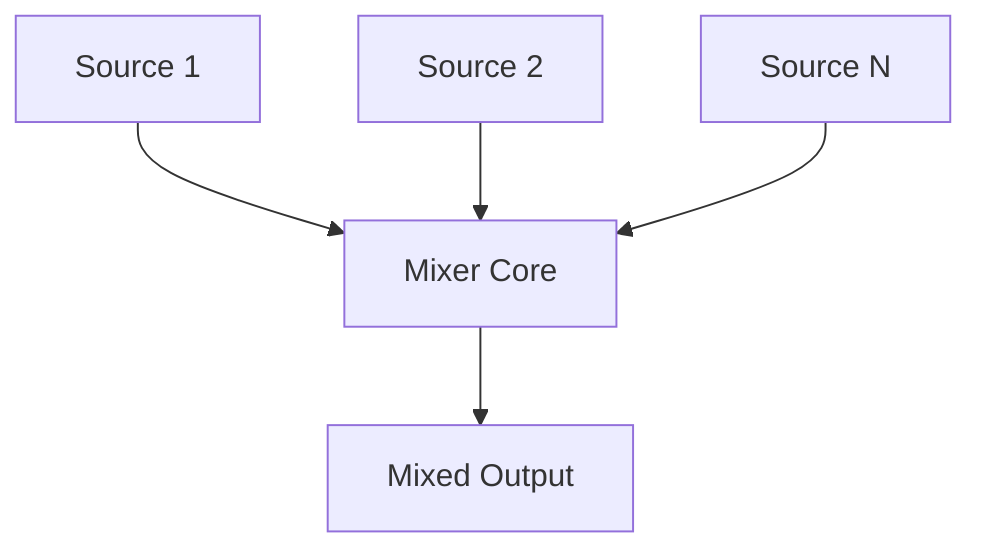

# Mixer Architecture

This directory contains the Mixer component.

## Overview

The Mixer adds together multiple input audio streams into a single output stream, applying required scaling or saturation logic.

## Architecture Diagram

## Configuration and Scripts

- **Kconfig**: Enables the Mixer component (`COMP_MIXER`), which inherently depends on the older IPC framework `IPC_MAJOR_3`.
- **CMakeLists.txt**: Manages local base sources and optimized implementations (`mixer_generic.c`, `mixer_hifi3.c`) alongside the core `mixer.c`.
