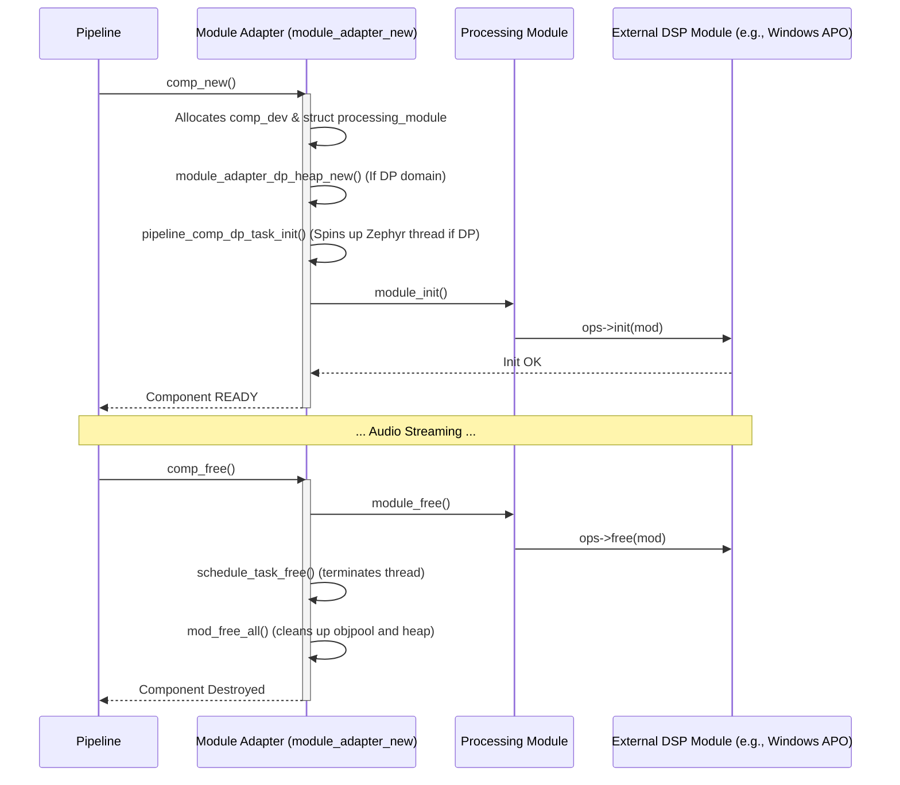
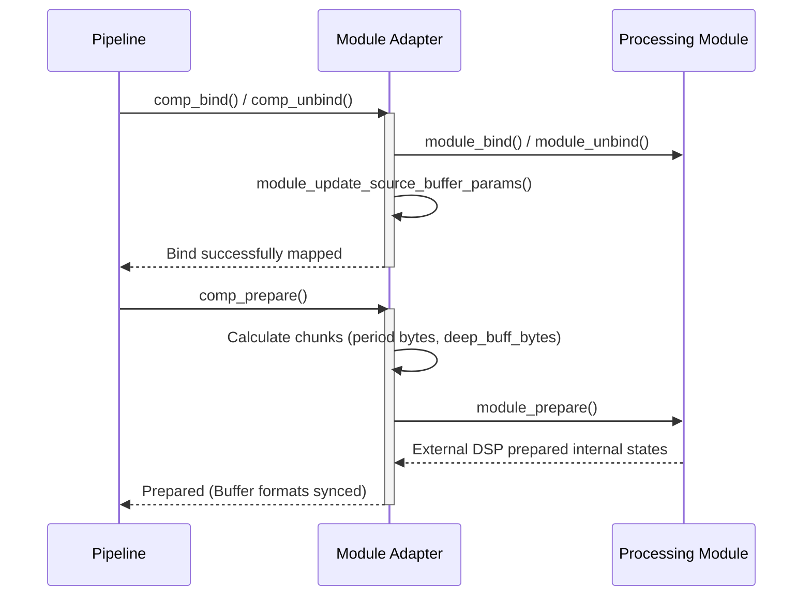
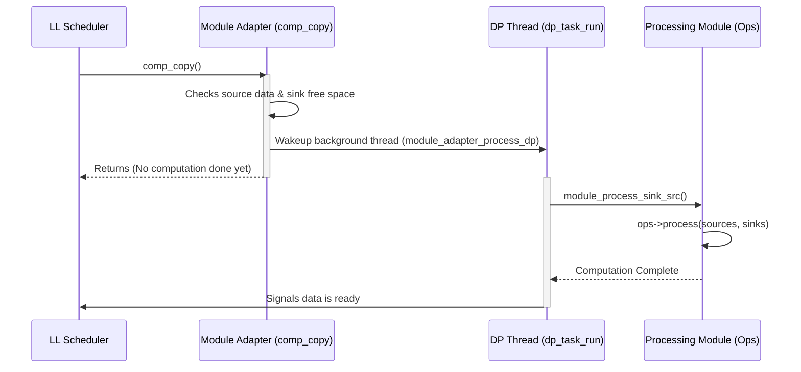

# Module Adapter Architecture

This directory contains the Module Adapter.

## Overview

The Module Adapter is a crucial piece of the IPC4 pipeline, allowing the core SOF graph mechanism to interact with 3rd party processing modules (like Windows APOs or customized vendor DSP engines) through a generic wrapper format.

## Creation and Teardown Flow

The Module Adapter wraps an external DSP processing component and translates standard SOF pipeline calls (like `comp_new`, `comp_free`, `comp_trigger`) into an interface the external module natively understands (`ops->init`, `ops->free`, `ops->reset`, etc.).

## Configuration and Binding Flow

Connection establishes buffer relationships (`comp_buffer`) connecting the component sources and sinks to the rest of the generic pipeline graph.

## Processing Flow (DP and LL Execution)

To unify components operating directly in interrupt boundaries (DMA Low Latency (LL)) with heavy computational blocks executing asynchronously in Zephyr RTOS threads (Data Processing (DP)), the wrapper intercepts `comp_copy()`.

### Low Latency (LL) Execution

For LL modules, processing is fully synchronous within the pipeline tick:

1. `comp_copy()` invokes `module_adapter_copy()`.
2. Data is fetched directly into `module_process_legacy()` or `module_process_sink_src()`.
3. `ops->process()` consumes upstream arrays and produces downstream arrays.

### Data Processing (DP) Execution

For DP modules, a discrete Zephyr thread manages execution asynchronously:

## Error Handling and Memory Sandboxing

* **Sandboxing (`mod_balloc_align`, `z_impl_mod_fast_get`, `z_impl_mod_free`)**: Since third-party DSP code is treated as semi-untrusted in memory lifetimes, module allocations grab slices from a dedicated component `dp_heap_user` heap instead of the global system heap (`mod_heap_info`). The wrapper automatically prunes leaked objects (`mod_free_all(mod)`) during teardown by keeping an `objpool` of all resource containers.
* **Reset Propagation**: Re-initializations via `COMP_TRIGGER_STOP` map down to `module_reset()` clearing the runtime state of the nested DSP module back to `MODULE_INITIALIZED`.

## Configuration and Scripts

* **Kconfig**: Highly customizable environment for "Processing modules" (`COMP_MODULE_ADAPTER`). Provides options for memory allocations, CADENCE codecs (AAC, BSAC, DAB, DRM, MP3, SBC, VORBIS, and their associated libraries), Dolby DAX Audio processing hooks (with stub support), Waves MaxxEffect codec support, and Intel module loaders.
* **CMakeLists.txt**: Handles the sprawling linkage process for the enabled processing modules. Links the core IPC abstraction layers (`module_adapter_ipc3.c` vs `module_adapter_ipc4.c`), external static libraries directly (e.g., `libdax.a`, `libMaxxChrome.a`, arbitrary CADENCE libraries), and includes custom Zephyr build options for `IADK` and `LIBRARY_MANAGER` systems.
