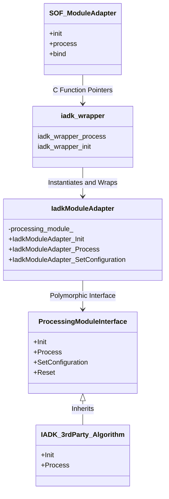
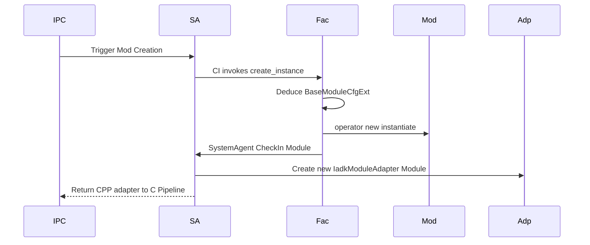

# Intel Audio Development Kit (`module_adapter/iadk`)

The `iadk` directory provides the Module Adapter implementation for external 3rd-party audio algorithms developed using the **Intel Audio Development Kit (IADK)**.

Unlike the native SOF `module_interface` API (written primarily in C), the IADK modules are object-oriented C++ classes that derive from `intel_adsp::ProcessingModuleInterface`. The SOF `IadkModuleAdapter` acts as a C++ to C "glue layer" that wraps these IADK methods so they can be natively plugged into the SOF `module_adapter` pipeline without modification to the module's pre-compiled binary.

## Architecture and Class Hierarchy

The system defines an `IadkModuleAdapter` class which internally holds an instance of the 3rd-party `ProcessingModuleInterface`.

## System Agent and Instantiation Flow

Because the actual module resides in an external binary, it requires a "System Agent" to correctly instantiate the C++ objects during the component's `init` phase.

1. The OS host driver sends an IPC `INIT_INSTANCE` command for the module.
2. The `system_agent_start()` function intercepts this, invokes the dynamic module's `create_instance` entry point (which invokes a `ModuleFactory`).
3. The `SystemAgent` deduces the pin count (interfaces) and initial pipeline configurations using `ModuleInitialSettingsConcrete`.
4. The factory allocates the concrete algorithm and checks it back into SOF through `SystemAgent::CheckIn`.

## Data Buffer Translation

A significant task of `IadkModuleAdapter_Process` is converting SOF's underlying buffer formats to IADK's `InputStreamBuffer` and `OutputStreamBuffer` structures.

Instead of letting the module directly touch the SOF `comp_buffer` (which could change with SOF version updates), the adapter uses the abstraction APIs (`source_get_data` / `sink_get_buffer`) and wraps them:

1. Request raw continuous memory pointers from `source_get_data()`.
2. Construct an `intel_adsp::InputStreamBuffer` pointing to that continuous memory chunk.
3. Call the IADK `processing_module_.Process()`.
4. Release precisely the amount of consumed data using `source_release_data()`.
