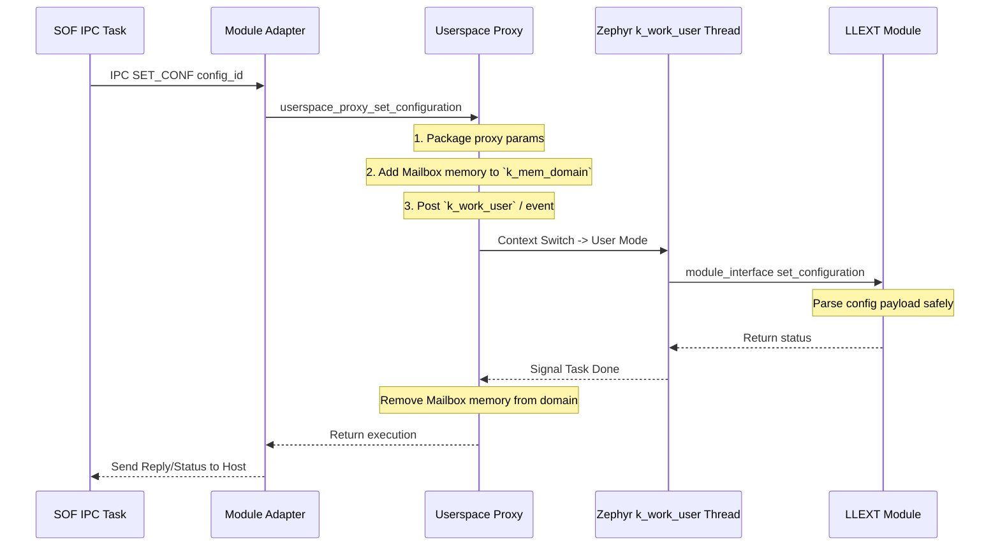

# Loadable Library & Userspace Proxy (`module_adapter/library`)

The `library` directory within the module adapter manages the lifecycle and execution isolation for dynamically loaded algorithms, often referred to as "LLEXT modules" or "Userspace Modules".

It acts as a secure intermediary layer between the native SOF/Zephyr kernel execution mode (supervisor mode) and the 3rd-party module running in an isolated user-mode context. By relying on Zephyr's Userspace mechanisms (`k_mem_domain`, `K_USER` threads), a faulting or misbehaving loadable extension cannot crash the entire firmware.

## Architecture & Userspace Sandbox

The Userspace Proxy architecture involves:

- **`struct userspace_context`**: This encapsulates the memory domain (`k_mem_domain`) mapped exclusively for this module (code, rodata, BSS, and private heap memory).
- **`user_work_item`**: A Zephyr `k_work_user` mechanism. IPC configuration commands and data processing calls are packaged into a work item and executed safely inside the memory boundaries via `userspace_proxy_worker_handler`.

```mermaid
graph TD
    subgraph SOF Supervisor Domain
        P["Pipeline DP Scheduler"]
        MADP["Module Adapter Context"]
        PROXY["Userspace Proxy (userspace_proxy_invoke)"]
    end

    subgraph Zephyr Userspace Domain
        SYSAGENT["LLEXT System Agent"]
        HANDLER["Worker Handler (userspace_proxy_handle_request)"]
        MOD["External Loadable Module (struct module_interface)"]
    end

    P -->|Triggers process| MADP
    MADP -->|Invokes Proxy| PROXY

    PROXY -->|Packages params & k_work| HANDLER

    HANDLER -->|Safe Call Context| MOD
    SYSAGENT -.->|Bootstraps| MOD

    style SOF Supervisor Domain fill:#1d2951,stroke:#333
    style Zephyr Userspace Domain fill:#2e0b1a,stroke:#333
```

## State Transitions & IPC Handling

IPC messages arriving from the host (e.g. `SET_CONF`, `GET_CONF`, `MODULE_INIT`, `MODULE_BIND`) first hit the Module Adapter running in Supervisor Mode. The adapter checks its configuration and invokes the Userspace Proxy. The proxy performs the following context switch:

### Memory Domain Adjustments

A crucial aspect of the userspace proxy is dynamic memory permission elevation:

- Normally, the userspace module can only access its own `heap`, `data`, and `bss` partitions.
- When an IPC like `GET_CONF` requests large IPC buffers, the proxy temporarily adds the hardware `MAILBOX_HOSTBOX` into the module's `k_mem_domain` using `k_mem_domain_add_partition()`.
- Once the userspace thread returns, that hardware window is immediately removed from the memory domain to minimize the vulnerability window.
