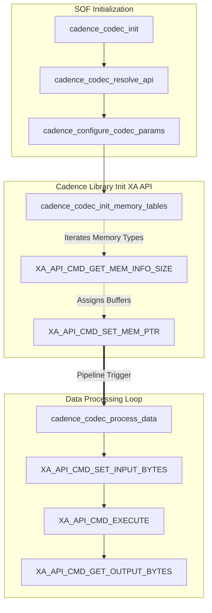

# Module Implementing Interfaces (`module_adapter/module`)

The `module` directory contains the concrete `module_interface` implementations that bridge the core SOF Component API with various audio processing algorithms. These adapters translate the generic initialization, parameter configuration, and process loop calls into the specific operational sequences required by different module frameworks.

The directory primarily houses three distinct module adapters:

1. **Generic Core Adapter (`generic.c`)**
2. **Modules (IADK/Shim) Adapter (`modules.c`)**
3. **Cadence DSP Codec Adapter (`cadence.c`, `cadence_ipc4.c`)**

## 1. Generic Core Adapter (`generic.c`)

The Generic adapter provides the default runtime container for typical native SOF processing modules (e.g., volume, eq, src).

It implements the full `struct module_interface` contract:

* **Memory Management**: It intercepts memory allocation mappings using `mod_balloc_align` and tracks memory requests in a module-specific resource pool (`module_resource`). When the module goes out of scope, the framework garbage-collects any leaked allocations automatically via `mod_free_all()`.
* **Configuration Handling**: Manages large blob configuration messages across multiple IPC fragments (`module_set_configuration`). It allocates memory for `runtime_params` until the blob is fully assembled, then triggers the underlying algorithm with the completed struct.
* **State Machine Enforcement**: It wraps `process_audio_stream` and `process_raw_data` calls to verify the module is in either `MODULE_IDLE` or `MODULE_PROCESSING` states before execution.

## 2. Modules (IADK Shim) Adapter (`modules.c`)

The `modules.c` base is an extension adapter designed specifically to run Intel Audio Development Kit (IADK) 3rd party algorithms.

Unlike the generic modules, the IADK modules are object-oriented C++ architectures linked into a separate library (`module_adapter/iadk`). This file acts as the primary C entry point wrapper.

* It utilizes the `iadk_wrapper_*` C-bridge functions to invoke methods on the C++ `intel_adsp::ProcessingModuleInterface` classes.
* It exposes the standard `DECLARE_MODULE_ADAPTER(processing_module_adapter_interface)` that is bound to the SOF pipeline.

## 3. Cadence Codec Adapter (`cadence.c`)

This is a highly specialized adapter used for integrating Xtensa Audio (XA) codecs from Cadence (e.g., MP3, AAC, Vorbis, SBC, DAB).

The `cadence.c` implementation maps the standard SOF pipeline controls into the Cadence memory buffer management and synchronous execution models.

### Cadence Memory Tables

Unlike standard modules that directly read from a `sof_source` API, Cadence codecs require their memory isolated exclusively into exact predefined chunks categorized by "type". `cadence_codec_init_memory_tables` iterates through the codec's hardware definition to construct these memory areas:

* `XA_MEMTYPE_INPUT`
* `XA_MEMTYPE_OUTPUT`
* `XA_MEMTYPE_SCRATCH`
* `XA_MEMTYPE_PERSIST`

The SOF adapter allocates tracking structures via `mod_alloc_align` for each of these mandatory regions prior to audio playback.

### Execution Wrapper

During `cadence_codec_process()`, the adapter:

1. Performs `source_get_data` and mechanically copies audio bytes into the isolated `XA_MEMTYPE_INPUT` buffer.
2. Invokes the Xtensa Audio codec API (`XA_API_CMD_EXECUTE`).
3. Reads the produced byte count and copies them back out from `XA_MEMTYPE_OUTPUT` into the `sof_sink`.
