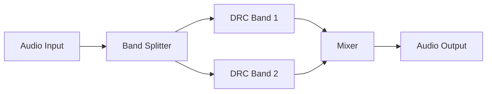

# Multi-Band DRC Architecture

This directory contains the Multi-Band Dynamic Range Compressor.

## Overview

Splits the audio into several discrete frequency bands (e.g., bass, mids, treble) and applies a separate instance of DRC to each band before remixing them.

## Architecture Diagram

## Configuration and Scripts

- **Kconfig**: Enables the Multiband Dynamic Range Compressor component (`COMP_MULTIBAND_DRC`). Has explicit dependencies on standard equalizers and filters: `COMP_IIR && COMP_CROSSOVER && COMP_DRC`.
- **CMakeLists.txt**: Compiles `multiband_drc.c` and generic versions, wrapping with IPC specifics (`multiband_drc_ipc3.c` or `multiband_drc_ipc4.c`). Supports Zephyr loadable extensions (`llext`).
- **multiband_drc.toml**: Defines module topology constraints and mapping (UUID `UUIDREG_STR_MULTIBAND_DRC`, module type 9).
- **Topology (.conf)**: Derived from `tools/topology/topology2/include/components/multiband_drc.conf`, configuring the `multiband_drc` widget object of type `effect` (UUID `56:22:9f:0d:4f:8e:b3:47:84:48:23:9a:33:4f:11:91`). Utilizes an internal switch control for `fc`.
- **MATLAB Tuning (`tune/`)**: Features `sof_example_multiband_drc.m` to generate the complex configuration structures necessary to bind multiple EQs, crossovers, and compressors together. The scripts output the aggregated `.m4`, binary `.bin`, and ALSA `.txt` blobs which define parameter blocks for each individual sub-system active within the multiband processor.
