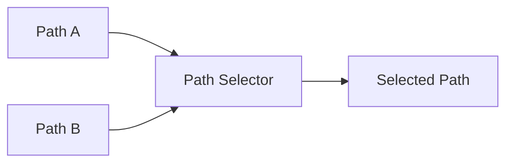

# Multiplexer/Demultiplexer Architecture

This directory contains the Mux/Demux component.

## Overview

Selects between multiple audio paths, routing N inputs to 1 output, or 1 input to N outputs.

## Architecture Diagram

## Configuration and Scripts

- **Kconfig**: Enables the MUX component (`COMP_MUX`), relying on the standard `COMP_MODULE_ADAPTER`.
- **CMakeLists.txt**: Manages `mux.c` and generic code paths alongside IPC abstraction interfaces (`mux_ipc3.c`, `mux_ipc4.c`). Supports `llext` modular integration.
- **mux.toml**: Topology settings defining UUID `UUIDREG_STR_MUX4` and accommodating up to 15 concurrent instances with multiple 10-channel I/O pins.
- **Topology (.conf)**: Found at `tools/topology/topology2/include/components/muxdemux.conf`, which declares a `muxdemux` widget object. Provides flexible process typing such as `DEMUX` with type `effect` (UUID `68:68:b2:c4:30:14:0e:47:a0:89:15:d1:c7:7f:85:1a`).
