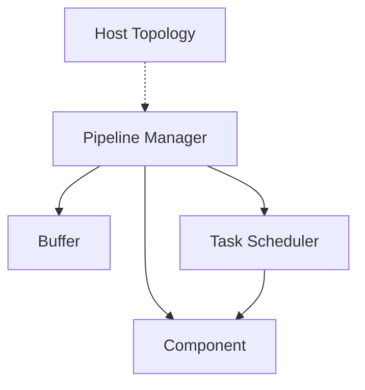
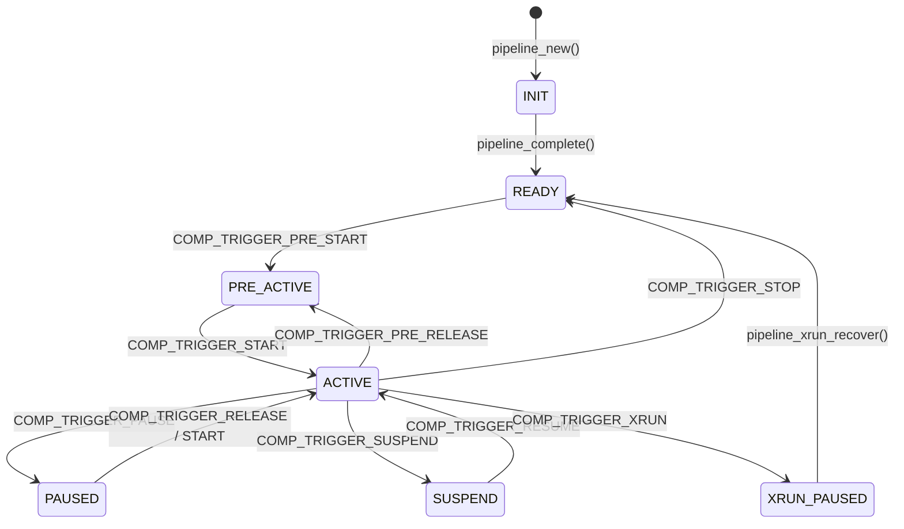
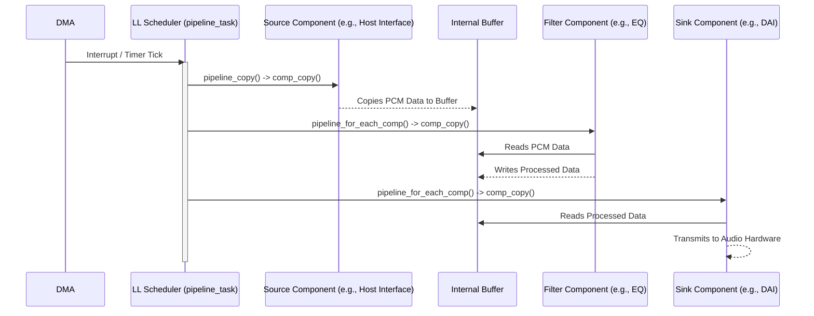
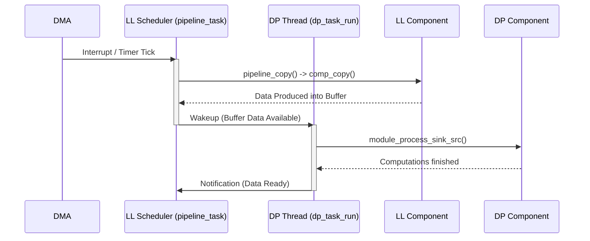
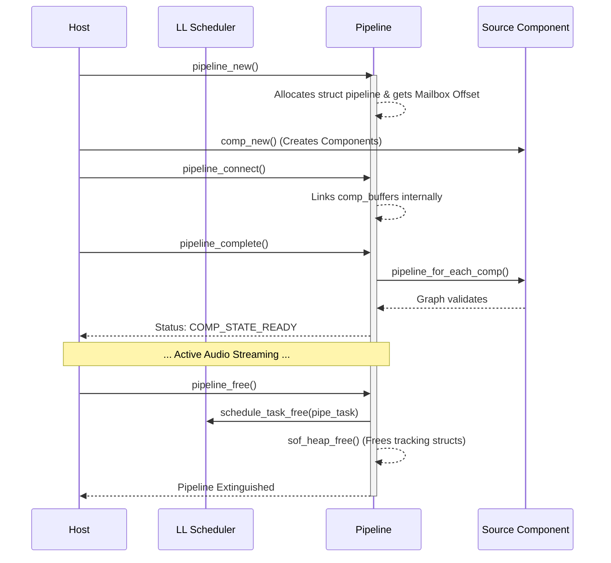
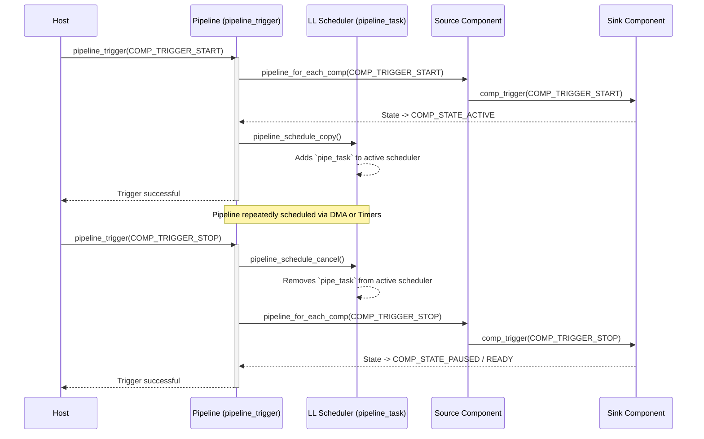
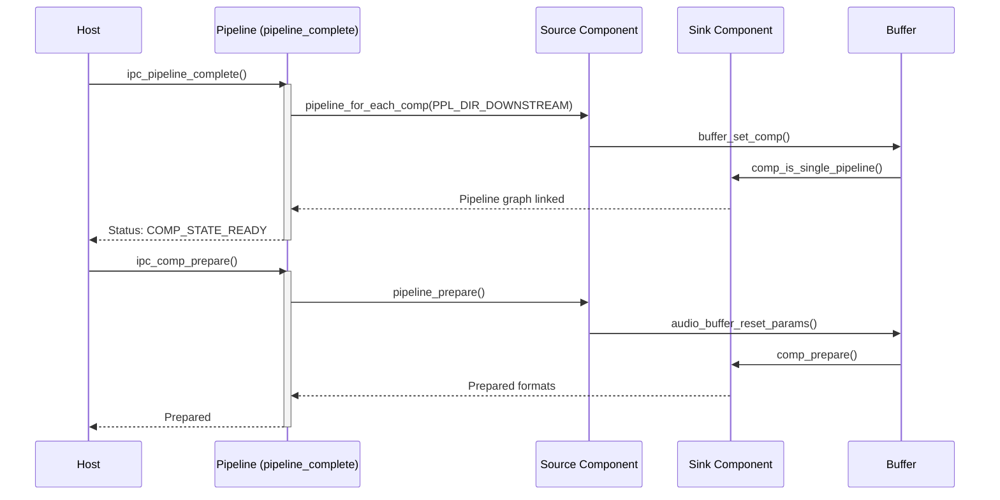
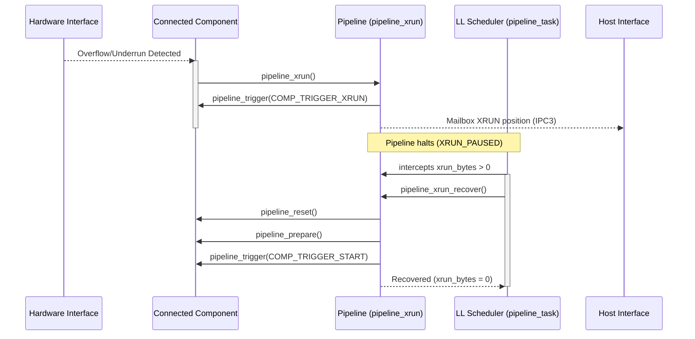

# Pipeline Engine Architecture

This directory contains the core graph/pipeline logic.

## Overview

The Pipeline engine is the heart of the SOF processing architecture. It links `components` together using `buffers`, and provides scheduling execution entities (tasks) to repeatedly trigger these component graphs.

## Architecture Diagram

## State Machine

The pipeline progresses through various states (`COMP_STATE_INIT`, `COMP_STATE_READY`, `COMP_STATE_ACTIVE`, etc.) largely directed by `comp_trigger()` commands cascaded down the graph.

## Processing Flow (LL and DP Modes)

Execution within the SOF pipeline is divided between two primary timing domains depending on the component's `proc_domain` property.

1. **Low Latency (LL) Domain:**
   * **Driven By:** DMA interrupts or precise timers.
   * **Execution:** A single cooperative scheduler task (`pipeline_task`) iterates over the entire connected graph.
   * **Process:** The pipeline scheduler invokes `pipeline_copy()` which calls `comp_copy()` on the source or sink, and then recursively relies on `pipeline_for_each_comp` to pull or push data through the graph synchronously within that single timeslice.

2. **Data Processing (DP) Domain:**
   * **Driven By:** A Zephyr-based discrete RTOS thread (`CONFIG_ZEPHYR_DP_SCHEDULER`).
   * **Execution:** Modules that require extensive computation (especially those leveraging the `module_adapter`) are spun off into their own isolated threads using `pipeline_comp_dp_task_init()`.
   * **Process:** Instead of synchronous execution alongside the DMA, they consume and produce data (`module_process_sink_src`) with their own stack (`TASK_DP_STACK_SIZE`), relying on inter-component buffers and thread synchronization to pass chunks back to the LL domain when ready.

### Mixed LL and DP Execution

## Control and Configuration Flows

The lifecycle of a pipeline graph involves several discrete initialization and connection steps orchestrated by IPC topology commands before streaming begins.

1. **Creation (`pipeline_new`)**: Instantiates the `struct pipeline` object, associates the memory heap, and grabs a mailbox offset for IPC position tracking.
2. **Connection (`pipeline_connect` / `pipeline_disconnect`)**: Establishes the directional edges of the graph by attaching a `comp_buffer` between a source and sink `comp_dev`. It updates the component's internal buffer lists.
3. **Completion (`pipeline_complete`)**: Validates the graph structure. It recursively walks the entire chain from source to sink (`pipeline_for_each_comp`), verifying consistency (e.g., ensuring components aren't part of mismatched pipelines unless properly handled), and transitions the pipeline state to `COMP_STATE_READY`.
4. **Parameter Propagation (`pipeline_params`, `pipeline_prepare`)**: Triggered prior to streaming, `pipeline_prepare()` walks the graph to finalize PCM formats, period sizes, and hardware configurations (like iterating over the audio buffers to `audio_buffer_reset_params`).
5. **Teardown (`pipeline_free`)**: When a stream is closed, after all `comp_dev` objects internal to the pipeline are halted and detached, `pipeline_free` cleans up the `pipe_task` scheduler footprint, IPC messages, and unlinks memory allocations freeing the `struct pipeline` entirely.

### Creation and Teardown Flow

### Triggering Flow

Triggering is fundamentally responsible for transitioning graph states (`COMP_STATE_ACTIVE`, `COMP_STATE_PAUSED`, etc). A trigger (like `COMP_TRIGGER_START` or `COMP_TRIGGER_STOP`) commands an underlying state change and pushes the `pipeline_task` into the `schedule_task` queue.

## Error Handling (XRUNs)

Overruns (host writes too fast/firmware reads too slow) and underruns (host reads too fast/firmware writes too slow) are tracked continuously.

1. **Detection**: Components directly hooked to interfaces (like a host IPC component or a hardware DAI) monitor their `comp_copy` status. If they detect starvation or overflow, they trigger an XRUN event.
2. **Propagation (`pipeline_xrun`)**: The pipeline immediately invokes a broadcast `pipeline_trigger(..., COMP_TRIGGER_XRUN)` forcing all internal components to drop to a halted `XRUN_PAUSED` state. In older IPC3 topologies, it additionally signals the host via mailbox offsets (`ipc_build_stream_posn`).
3. **Recovery (`pipeline_xrun_handle_trigger` / `pipeline_xrun_recover`)**: By default, the `pipeline_task` scheduler will intercept the `xrun_bytes` flag. Unless `NO_XRUN_RECOVERY` is defined, the firmware attempts self-healing:
   * It resets the pipeline downstream of the source (`pipeline_reset`).
   * It prepares it again (`pipeline_prepare`).
   * It issues an internal `COMP_TRIGGER_START` to restart data flow automatically without host intervention.

## Configuration and Scripts

* **CMakeLists.txt**: Straightforward build configuration integrating the fundamental internal execution blocks of the SOF graph: `pipeline-graph.c`, `pipeline-stream.c`, `pipeline-params.c`, `pipeline-xrun.c`, and `pipeline-schedule.c`.
