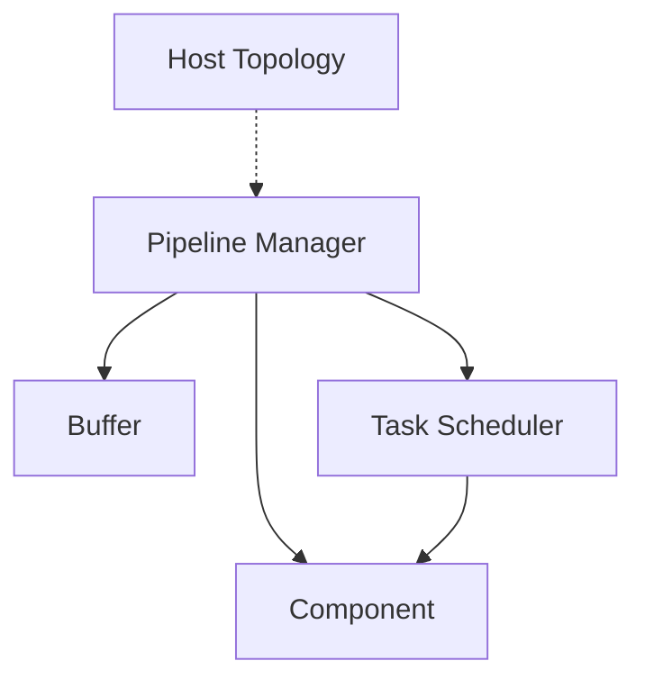
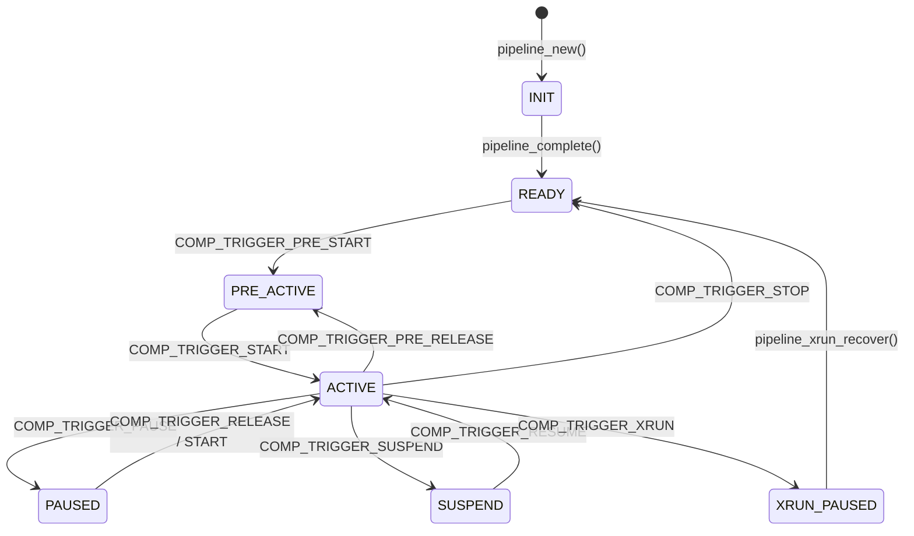
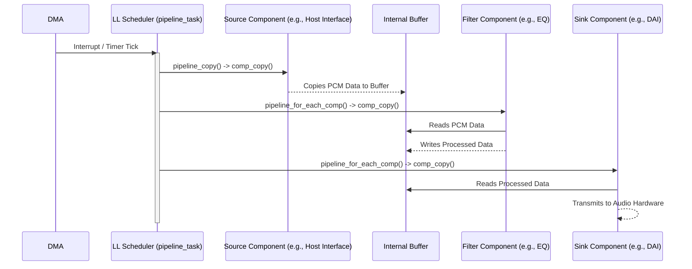
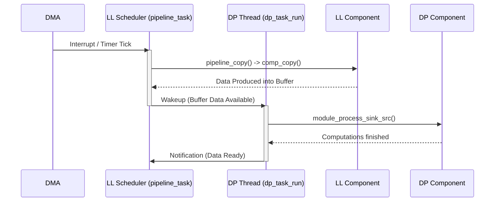
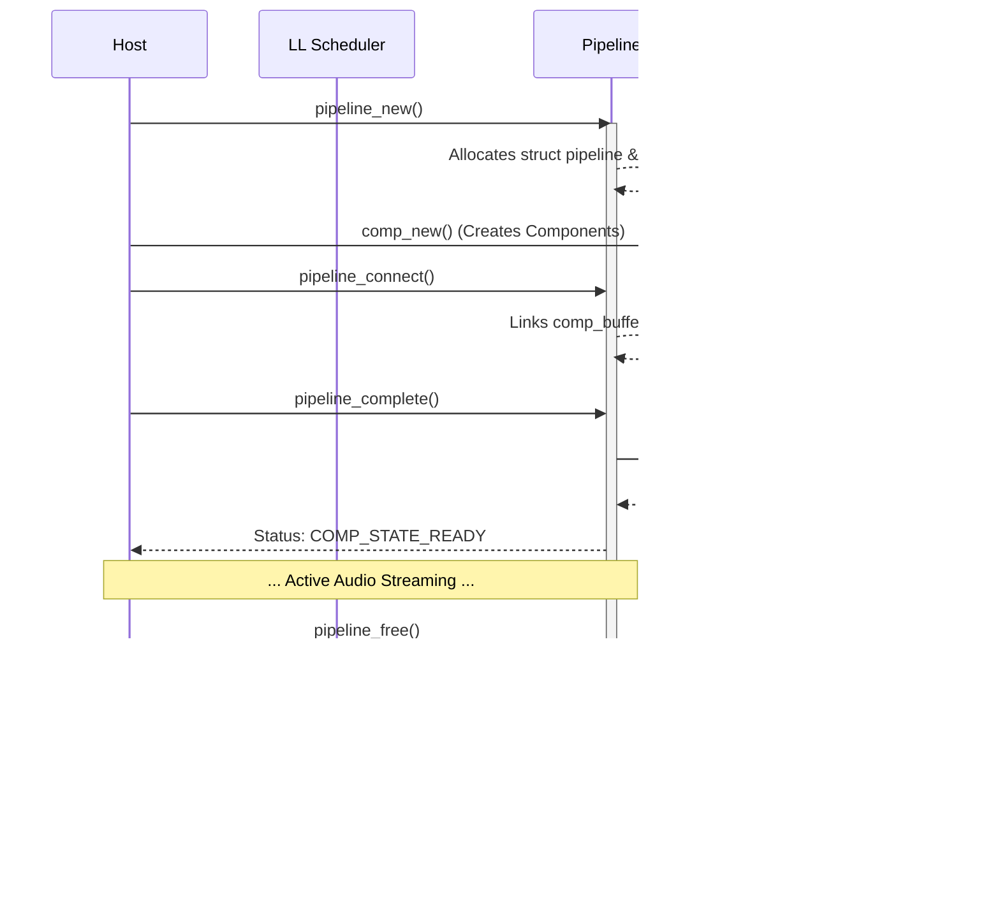
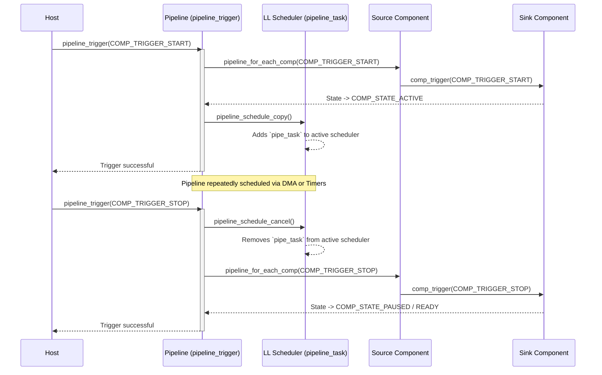
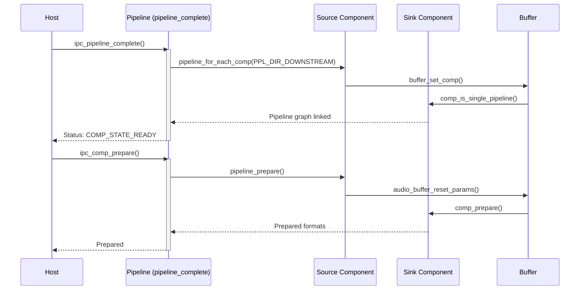
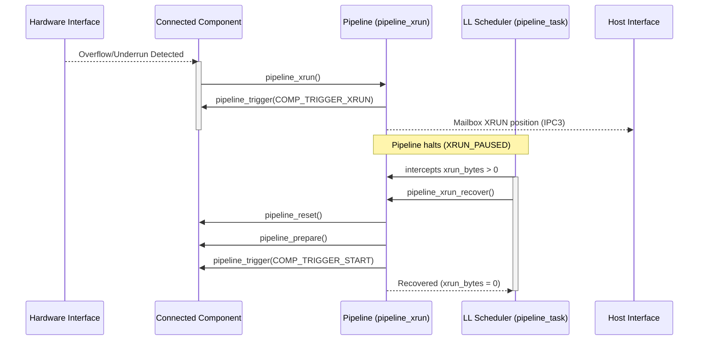
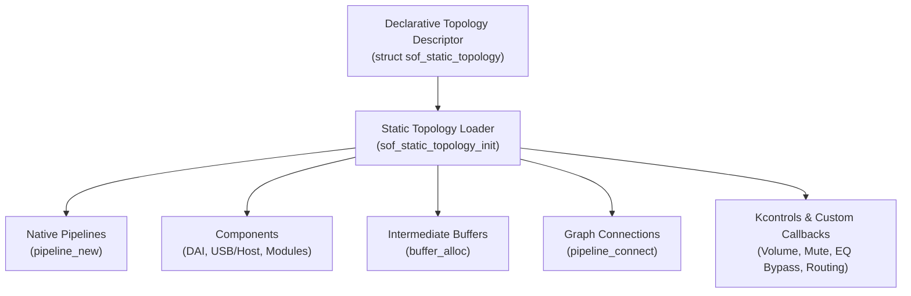

# Pipeline Engine Architecture

This directory contains the core graph/pipeline logic.

## Overview

The Pipeline engine is the heart of the SOF processing architecture. It links `components` together using `buffers`, and provides scheduling execution entities (tasks) to repeatedly trigger these component graphs.

## Architecture Diagram


```mermaid
graph TD
  Host[Host Topology] -.-> Manager[Pipeline Manager]
  Manager --> Buf1[Buffer]
  Manager --> CompA[Component]
  Manager --> Sched[Task Scheduler]
  Sched --> CompA
```

## State Machine

The pipeline progresses through various states (`COMP_STATE_INIT`, `COMP_STATE_READY`, `COMP_STATE_ACTIVE`, etc.) largely directed by `comp_trigger()` commands cascaded down the graph.


```mermaid
stateDiagram-v2
    [*] --> INIT : pipeline_new()
    INIT --> READY : pipeline_complete()
    READY --> PRE_ACTIVE : COMP_TRIGGER_PRE_START
    PRE_ACTIVE --> ACTIVE : COMP_TRIGGER_START
    ACTIVE --> PAUSED : COMP_TRIGGER_PAUSE
    PAUSED --> ACTIVE : COMP_TRIGGER_RELEASE / START
    ACTIVE --> SUSPEND : COMP_TRIGGER_SUSPEND
    SUSPEND --> ACTIVE : COMP_TRIGGER_RESUME
    ACTIVE --> PRE_ACTIVE : COMP_TRIGGER_PRE_RELEASE
    ACTIVE --> READY : COMP_TRIGGER_STOP
    ACTIVE --> XRUN_PAUSED : COMP_TRIGGER_XRUN
    XRUN_PAUSED --> READY : pipeline_xrun_recover()
```

## Processing Flow (LL and DP Modes)

Execution within the SOF pipeline is divided between two primary timing domains depending on the component's `proc_domain` property.

1. **Low Latency (LL) Domain:**
   * **Driven By:** DMA interrupts or precise timers.
   * **Execution:** A single cooperative scheduler task (`pipeline_task`) iterates over the entire connected graph.
   * **Process:** The pipeline scheduler invokes `pipeline_copy()` which calls `comp_copy()` on the source or sink, and then recursively relies on `pipeline_for_each_comp` to pull or push data through the graph synchronously within that single timeslice.

2. **Data Processing (DP) Domain:**
   * **Driven By:** A Zephyr-based discrete RTOS thread (`CONFIG_ZEPHYR_DP_SCHEDULER`).
   * **Execution:** Modules that require extensive computation (especially those leveraging the `module_adapter`) are spun off into their own isolated threads using `pipeline_comp_dp_task_init()`.
   * **Process:** Instead of synchronous execution alongside the DMA, they consume and produce data (`module_process_sink_src`) with their own stack (`TASK_DP_STACK_SIZE`), relying on inter-component buffers and thread synchronization to pass chunks back to the LL domain when ready.


```mermaid
sequenceDiagram
    participant DMA
    participant Sched as LL Scheduler (pipeline_task)
    participant Source as Source Component (e.g., Host Interface)
    participant Buffer as Internal Buffer
    participant Filter as Filter Component (e.g., EQ)
    participant Sink as Sink Component (e.g., DAI)

    DMA->>Sched: Interrupt / Timer Tick
    activate Sched
    Sched->>Source: pipeline_copy() -> comp_copy()
    Source-->>Buffer: Copies PCM Data to Buffer
    Sched->>Filter: pipeline_for_each_comp() -> comp_copy()
    Filter->>Buffer: Reads PCM Data
    Filter-->>Buffer: Writes Processed Data
    Sched->>Sink: pipeline_for_each_comp() -> comp_copy()
    Sink->>Buffer: Reads Processed Data
    Sink-->>Sink: Transmits to Audio Hardware
    deactivate Sched
```

### Mixed LL and DP Execution


```mermaid
sequenceDiagram
    participant DMA
    participant Sched as LL Scheduler (pipeline_task)
    participant DPThread as DP Thread (dp_task_run)
    participant CompLL as LL Component
    participant CompDP as DP Component

    DMA->>Sched: Interrupt / Timer Tick
    activate Sched
    Sched->>CompLL: pipeline_copy() -> comp_copy()
    CompLL-->>Sched: Data Produced into Buffer
    Sched->>DPThread: Wakeup (Buffer Data Available)
    deactivate Sched

    activate DPThread
    DPThread->>CompDP: module_process_sink_src()
    CompDP-->>DPThread: Computations finished
    DPThread->>Sched: Notification (Data Ready)
    deactivate DPThread
```

## Control and Configuration Flows

The lifecycle of a pipeline graph involves several discrete initialization and connection steps orchestrated by IPC topology commands before streaming begins.

1. **Creation (`pipeline_new`)**: Instantiates the `struct pipeline` object, associates the memory heap, and grabs a mailbox offset for IPC position tracking.
2. **Connection (`pipeline_connect` / `pipeline_disconnect`)**: Establishes the directional edges of the graph by attaching a `comp_buffer` between a source and sink `comp_dev`. It updates the component's internal buffer lists.
3. **Completion (`pipeline_complete`)**: Validates the graph structure. It recursively walks the entire chain from source to sink (`pipeline_for_each_comp`), verifying consistency (e.g., ensuring components aren't part of mismatched pipelines unless properly handled), and transitions the pipeline state to `COMP_STATE_READY`.
4. **Parameter Propagation (`pipeline_params`, `pipeline_prepare`)**: Triggered prior to streaming, `pipeline_prepare()` walks the graph to finalize PCM formats, period sizes, and hardware configurations (like iterating over the audio buffers to `audio_buffer_reset_params`).
5. **Teardown (`pipeline_free`)**: When a stream is closed, after all `comp_dev` objects internal to the pipeline are halted and detached, `pipeline_free` cleans up the `pipe_task` scheduler footprint, IPC messages, and unlinks memory allocations freeing the `struct pipeline` entirely.

### Creation and Teardown Flow


```mermaid
sequenceDiagram
    participant Host
    participant Sched as LL Scheduler
    participant Pipe as Pipeline
    participant Source as Source Component

    Host->>Pipe: pipeline_new()
    activate Pipe
    Pipe-->>Pipe: Allocates struct pipeline & gets Mailbox Offset

    Host->>Source: comp_new() (Creates Components)

    Host->>Pipe: pipeline_connect()
    Pipe-->>Pipe: Links comp_buffers internally

    Host->>Pipe: pipeline_complete()
    Pipe->>Source: pipeline_for_each_comp()
    Source-->>Pipe: Graph validates
    Pipe-->>Host: Status: COMP_STATE_READY

    Note over Host,Pipe: ... Active Audio Streaming ...

    Host->>Pipe: pipeline_free()
    Pipe->>Sched: schedule_task_free(pipe_task)
    Pipe-->>Pipe: sof_heap_free() (Frees tracking structs)
    Pipe-->>Host: Pipeline Extinguished
    deactivate Pipe
```

### Triggering Flow

Triggering is fundamentally responsible for transitioning graph states (`COMP_STATE_ACTIVE`, `COMP_STATE_PAUSED`, etc). A trigger (like `COMP_TRIGGER_START` or `COMP_TRIGGER_STOP`) commands an underlying state change and pushes the `pipeline_task` into the `schedule_task` queue.


```mermaid
sequenceDiagram
    participant Host
    participant PPL as Pipeline (pipeline_trigger)
    participant Sched as LL Scheduler (pipeline_task)
    participant Source as Source Component
    participant Sink as Sink Component

    Host->>PPL: pipeline_trigger(COMP_TRIGGER_START)
    activate PPL
    PPL->>Source: pipeline_for_each_comp(COMP_TRIGGER_START)
    Source->>Sink: comp_trigger(COMP_TRIGGER_START)
    Sink-->>PPL: State -> COMP_STATE_ACTIVE

    PPL->>Sched: pipeline_schedule_copy()
    Sched-->>Sched: Adds `pipe_task` to active scheduler
    PPL-->>Host: Trigger successful
    deactivate PPL

    Note over PPL,Sched: Pipeline repeatedly scheduled via DMA or Timers

    Host->>PPL: pipeline_trigger(COMP_TRIGGER_STOP)
    activate PPL
    PPL->>Sched: pipeline_schedule_cancel()
    Sched-->>Sched: Removes `pipe_task` from active scheduler
    PPL->>Source: pipeline_for_each_comp(COMP_TRIGGER_STOP)
    Source->>Sink: comp_trigger(COMP_TRIGGER_STOP)
    Sink-->>PPL: State -> COMP_STATE_PAUSED / READY
    PPL-->>Host: Trigger successful
    deactivate PPL
```


```mermaid
sequenceDiagram
    participant Host
    participant Pipe as Pipeline (pipeline_complete)
    participant Source as Source Component
    participant Sink as Sink Component
    participant Buf as Buffer

    Host->>Pipe: ipc_pipeline_complete()
    activate Pipe
    Pipe->>Source: pipeline_for_each_comp(PPL_DIR_DOWNSTREAM)
    Source->>Buf: buffer_set_comp()
    Buf->>Sink: comp_is_single_pipeline()
    Sink-->>Pipe: Pipeline graph linked
    Pipe-->>Host: Status: COMP_STATE_READY
    deactivate Pipe

    Host->>Pipe: ipc_comp_prepare()
    activate Pipe
    Pipe->>Source: pipeline_prepare()
    Source->>Buf: audio_buffer_reset_params()
    Buf->>Sink: comp_prepare()
    Sink-->>Pipe: Prepared formats
    Pipe-->>Host: Prepared
    deactivate Pipe
```

## Error Handling (XRUNs)

Overruns (host writes too fast/firmware reads too slow) and underruns (host reads too fast/firmware writes too slow) are tracked continuously.

1. **Detection**: Components directly hooked to interfaces (like a host IPC component or a hardware DAI) monitor their `comp_copy` status. If they detect starvation or overflow, they trigger an XRUN event.
2. **Propagation (`pipeline_xrun`)**: The pipeline immediately invokes a broadcast `pipeline_trigger(..., COMP_TRIGGER_XRUN)` forcing all internal components to drop to a halted `XRUN_PAUSED` state. In older IPC3 topologies, it additionally signals the host via mailbox offsets (`ipc_build_stream_posn`).
3. **Recovery (`pipeline_xrun_handle_trigger` / `pipeline_xrun_recover`)**: By default, the `pipeline_task` scheduler will intercept the `xrun_bytes` flag. Unless `NO_XRUN_RECOVERY` is defined, the firmware attempts self-healing:
   * It resets the pipeline downstream of the source (`pipeline_reset`).
   * It prepares it again (`pipeline_prepare`).
   * It issues an internal `COMP_TRIGGER_START` to restart data flow automatically without host intervention.


```mermaid
sequenceDiagram
    participant DAI as Hardware Interface
    participant Comp as Connected Component
    participant PPL as Pipeline (pipeline_xrun)
    participant Sched as LL Scheduler (pipeline_task)
    participant Host as Host Interface

    DAI-->>Comp: Overflow/Underrun Detected
    activate Comp
    Comp->>PPL: pipeline_xrun()
    PPL->>Comp: pipeline_trigger(COMP_TRIGGER_XRUN)
    PPL-->>Host: Mailbox XRUN position (IPC3)
    deactivate Comp

    Note over PPL,Sched: Pipeline halts (XRUN_PAUSED)

    Sched->>PPL: intercepts xrun_bytes > 0
    activate Sched
    Sched->>PPL: pipeline_xrun_recover()
    PPL->>Comp: pipeline_reset()
    PPL->>Comp: pipeline_prepare()
    PPL->>Comp: pipeline_trigger(COMP_TRIGGER_START)
    PPL-->>Sched: Recovered (xrun_bytes = 0)
    deactivate Sched
```

## Static Pipeline Subsystem (Hostless / Standalone Execution)

In microcontroller, hostless, or standalone embedded environments (e.g. ESP32-P4/S3/C6, Teensy 4.1 / i.MX RT1062, Nordic nRF54, RP2350, audio bridge appliances, smart speakers, standalone DSP dongles), there is no dynamic IPC host (Linux ALSA/SoundWire or Windows driver) to construct audio topologies at runtime.

The Static Pipeline subsystem (`CONFIG_STATIC_PIPELINE`) provides a declarative C API (`<sof/audio/pipeline/static_pipeline.h>`) and loader engine (`static_pipeline_loader.c`) that instantiates full SOF processing graphs directly at boot:


```mermaid
graph TD
  Topo["Declarative Topology Descriptor<br/>(struct sof_static_topology)"] --> Loader["Static Topology Loader<br/>(sof_static_topology_init)"]
  Loader --> PPL["Native Pipelines<br/>(pipeline_new)"]
  Loader --> COMPS["Components<br/>(DAI, USB/Host, Modules)"]
  Loader --> BUFS["Intermediate Buffers<br/>(buffer_alloc)"]
  Loader --> ROUTES["Graph Connections<br/>(pipeline_connect)"]
  Loader --> CONTROLS["Kcontrols & Custom Callbacks<br/>(Volume, Mute, EQ Bypass, Routing)"]
```

### Key Capabilities & Architecture

1. **Declarative Definitions**: Topologies describe pipelines, components (modules, DAI, USB/Host endpoints), intermediate buffers, routes, PCMs, and kcontrols using builder macros (`SOF_STATIC_MODULE`, `SOF_STATIC_ENDPOINT_DAI`, `SOF_STATIC_ENDPOINT_USB`, `SOF_STATIC_BUFFER`, `SOF_STATIC_ROUTE`, `SOF_STATIC_KCONTROL_*`).
2. **Ops-Driven Module Architecture**: Generic headers and the loader engine are completely decoupled from individual audio modules. Each audio processing component defines and registers operations (`struct sof_static_module_ops`) providing `.create`, `.apply_volume`, `.apply_switch`, and `.apply_enum` callbacks directly in its own module source file via `DECLARE_STATIC_MODULE_OPS()`.
3. **Explicit Parameter Initialization**: Synchronously negotiates stream parameters and prepares all graph components (`comp_params`, `comp_prepare`) to bring non-host-driven pipelines into ready state before audio streaming begins.
4. **Trigger & State Synchronization**: Provides direct runtime pipeline control (`sof_static_pipeline_trigger()`, `sof_static_pipeline_trigger_by_uac2_term()`) with state validation, synchronous trigger execution, per-component trigger propagation, and scheduler copy task activation/cancellation.
5. **Decoupled Control Callbacks**: Standard kcontrols dispatch directly to module ops (Volume, Mute, Level Multiplier, EQ bypass, DRC compression switch, Selector channel), while custom platform or board-level controls (clock mode switching, hardware routing, DMIC injectors) are handled cleanly via `custom_control_handler` callbacks.

### Usage Guide & Tutorial

#### 1. Defining Components

Declare processing modules, host/USB endpoints, and hardware DAIs using either concise constructor macros or explicit struct declarations:

```c
#include <sof/audio/pipeline/static_pipeline.h>

extern const struct sof_uuid src_uuid;
extern const struct sof_uuid volume_uuid;
extern const struct sof_uuid eq_iir_uuid;

static const struct sof_static_comp s_comps[] = {
    /* Playback Endpoint (USB UAC2 Terminal ID 1) @ 44.1 kHz */
    SOF_STATIC_ENDPOINT_USB(
        1, 1, "USB_PB", SOF_IPC_STREAM_PLAYBACK,
        SOF_IPC_FRAME_S16_LE, 44100, 2, 1
    ),
    /* Sample Rate Converter: 44.1 kHz In -> 48 kHz Out */
    SOF_STATIC_MODULE_RATE_CONV(
        2, 1, "SRC_PB", SOF_IPC_STREAM_PLAYBACK, &src_uuid,
        SOF_IPC_FRAME_S16_LE, 44100, 48000, 2
    ),
    /* Volume Control Module @ 48 kHz */
    SOF_STATIC_MODULE(
        3, 1, "VOL_PB", SOF_IPC_STREAM_PLAYBACK, &volume_uuid,
        SOF_IPC_FRAME_S16_LE, 48000, 2, NULL, 0
    ),
    /* 4-Band Parametric IIR EQ Module @ 48 kHz */
    SOF_STATIC_MODULE(
        4, 1, "EQ_PB", SOF_IPC_STREAM_PLAYBACK, &eq_iir_uuid,
        SOF_IPC_FRAME_S16_LE, 48000, 2, NULL, 0
    ),
    /* Hardware I2S DAI Output @ 48 kHz */
    SOF_STATIC_ENDPOINT_DAI(
        5, 1, "I2S_TX", SOF_IPC_STREAM_PLAYBACK,
        SOF_IPC_FRAME_S16_LE, 48000, 2,
        SOF_DAI_INTEL_SSP, 0, SOF_DAI_FMT_I2S | SOF_DAI_FMT_CBC_CFC
    ),
};
```

#### 2. Defining Intermediate Buffers

Allocate audio buffers connecting consecutive processing blocks. In multi-rate pipelines (such as with SRC / ASRC), buffers can declare their individual sample rates and channel counts or inherit them dynamically from the upstream producer:

```c
static const struct sof_static_buffer s_buffers[] = {
    /* Buffer between USB_PB (1) and SRC_PB (2) @ 44.1 kHz */
    SOF_STATIC_BUFFER(
        .id = 1,
        .size = 45 * 2 * sizeof(int16_t) * 4, /* 4 periods @ 44.1 kHz */
        .fmt = SOF_IPC_FRAME_S16_LE,
        .rate = 44100,
        .channels = 2,
    ),
    /* Buffer between SRC_PB (2) and VOL_PB (3) @ 48 kHz */
    SOF_STATIC_BUFFER(
        .id = 2,
        .size = 48 * 2 * sizeof(int16_t) * 4, /* 4 periods @ 48 kHz */
        .fmt = SOF_IPC_FRAME_S16_LE,
        .rate = 48000,
        .channels = 2,
    ),
    /* Buffer between VOL_PB (3) and EQ_PB (4) @ 48 kHz */
    SOF_STATIC_BUFFER(
        .id = 3,
        .size = 48 * 2 * sizeof(int16_t) * 4,
        .fmt = SOF_IPC_FRAME_S16_LE,
        .rate = 48000,
        .channels = 2,
    ),
    /* Buffer between EQ_PB (4) and I2S_TX (5) @ 48 kHz */
    SOF_STATIC_BUFFER(
        .id = 4,
        .size = 48 * 2 * sizeof(int16_t) * 4,
        .fmt = SOF_IPC_FRAME_S16_LE,
        .rate = 48000,
        .channels = 2,
    ),
};
```

#### 3. Defining Graph Routes

Connect component outputs through intermediate buffers to component inputs:

```c
static const struct sof_static_route s_routes[] = {
    SOF_STATIC_ROUTE(.src_comp_id = 1, .buffer_id = 1, .sink_comp_id = 2),
    SOF_STATIC_ROUTE(.src_comp_id = 2, .buffer_id = 2, .sink_comp_id = 3),
    SOF_STATIC_ROUTE(.src_comp_id = 3, .buffer_id = 3, .sink_comp_id = 4),
    SOF_STATIC_ROUTE(.src_comp_id = 4, .buffer_id = 4, .sink_comp_id = 5),
};
```

#### 4. Defining Top-Level Pipelines

Specify pipeline execution properties, scheduling domains, and boundary endpoints:

```c
static const struct sof_static_pipeline_desc s_pipelines[] = {
    {
        .pipeline_id = 1,
        .name = "Playback Pipeline",
        .direction = SOF_IPC_STREAM_PLAYBACK,
        .priority = 0,
        .core = 0,
        .period = 1000,               /* 1 ms tick */
        .frames_per_sched = 48,       /* 48 frames per ms @ 48 kHz */
        .time_domain = SOF_TIME_DOMAIN_TIMER,
        .default_rate = 48000,        /* Pipeline target rate */
        .default_channels = 2,
        .sched_comp_id = 5,           /* Driven by I2S DAI */
        .source_comp_id = 1,          /* Ingress: USB_PB */
        .sink_comp_id = 5,            /* Egress: I2S_TX */
    },
};
```

#### 5. Defining Kcontrols & Custom Handlers

Declare runtime controls (volume, mute, filter bypass switches) and optional platform callbacks:

```c
static const struct sof_static_kcontrol s_controls[] = {
    SOF_STATIC_KCONTROL_VOLUME(
        .id = 1,
        .name = "Master Playback Volume",
        .target_comp_id = 3,          /* Targets VOL_PB (3) */
        .min = 0,
        .max = 65536,
        .def = 65536,                 /* 0 dB default */
        .channels = 2,
        .uac2_entity_id = 10,         /* Bound to UAC2 Feature Unit 10 */
    ),
    SOF_STATIC_KCONTROL_SWITCH(
        .id = 2,
        .name = "EQ Bypass Switch",
        .target_comp_id = 4,          /* Targets EQ_PB (4, 0=bypass, 1=active) */
        .min = 0,
        .max = 1,
        .def = 1,
        .channels = 1,
    ),
    SOF_STATIC_KCONTROL_SWITCH(
        .id = 3,
        .name = "Hardware Clock Mode",
        .target_comp_id = 0,          /* Custom control (dispatched to callback) */
        .min = 0,
        .max = 1,
        .def = 1,                     /* 1 = Master, 0 = Slave */
        .channels = 1,
    ),
};

static int platform_control_callback(const struct sof_static_kcontrol *ctl,
                                     int32_t val, void *priv)
{
    if (ctl->id == 3) {
        /* Reconfigure physical I2S clock mode between Master and Slave */
        return platform_set_i2s_clock_mode(val == 1);
    }
    return -EINVAL;
}

const struct sof_static_topology g_my_platform_topology = {
    .name = "Demo Playback Topology",
    .num_pipelines = ARRAY_SIZE(s_pipelines),
    .pipelines = s_pipelines,
    .num_comps = ARRAY_SIZE(s_comps),
    .comps = s_comps,
    .num_buffers = ARRAY_SIZE(s_buffers),
    .buffers = s_buffers,
    .num_routes = ARRAY_SIZE(s_routes),
    .routes = s_routes,
    .num_controls = ARRAY_SIZE(s_controls),
    .controls = s_controls,
    .custom_control_handler = platform_control_callback,
    .custom_control_data = NULL,
};
```

#### 6. Instantiating and Running the Topology

At board startup, call `sof_static_topology_init()`:

```c
#include <sof/audio/pipeline/static_pipeline.h>

int my_platform_init(void)
{
    /* Build and prepare audio pipeline graph */
    int ret = sof_static_topology_init(&g_my_platform_topology);
    if (ret < 0) {
        LOG_ERR("Failed to initialize static topology: %d", ret);
        return ret;
    }

    /* Start audio streaming */
    sof_static_pipeline_trigger(1, true);
    return 0;
}
```

#### 7. Runtime Control APIs

- **`sof_static_kcontrol_set(uint32_t ctrl_id, int32_t val)`**: Updates volume, mute, or bypass state at runtime.
- **`sof_static_kcontrol_get(uint32_t ctrl_id, int32_t *val)`**: Reads current control value.
- **`sof_static_pipeline_start(uint32_t pipeline_id)`**: Prepares and starts a pipeline synchronously.
- **`sof_static_pipeline_stop(uint32_t pipeline_id)`**: Stops and pauses an active pipeline synchronously.
- **`sof_static_pipeline_trigger(uint32_t pipeline_id, bool start)`**: Starts or stops a pipeline synchronously.
- **`sof_static_kcontrol_set_by_uac2(uint8_t entity_id, uint8_t ch, int32_t val, bool is_volume)`**: Automatically translates USB UAC2 8.8 dB fader commands to SOF native volume values.

## Configuration and Scripts

* **CMakeLists.txt**: Build configuration integrating internal execution blocks of the SOF graph (`pipeline-graph.c`, `pipeline-stream.c`, `pipeline-params.c`, `pipeline-xrun.c`, `pipeline-schedule.c`) and conditionally compiling `static_pipeline_loader.c`, `static_pipeline_modules.c`, and `static_pipeline_uac2.c` when `CONFIG_STATIC_PIPELINE=y`.
* **Endpoint Callbacks**: Hardware DAI endpoints can attach optional platform-specific clock and hardware configuration callbacks via `SOF_STATIC_ENDPOINT_DAI_CFG()` without polluting the generic loader with SoC-specific code.
