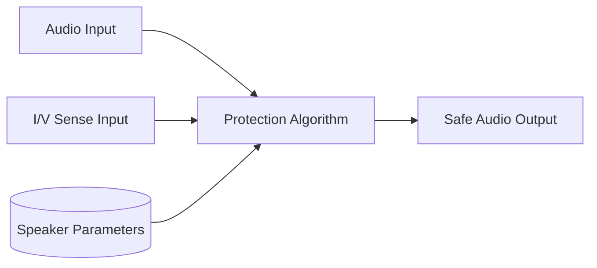

# Smart Amplifier Architecture

This directory contains the Smart Amp Component.

## Overview

Uses predictive speaker models and real-time Current/Voltage (I/V) feedback to push speakers louder without causing thermal damage or physical over-excursion.

## Architecture Diagram

## Configuration and Scripts

- **Kconfig**: Enables the Smart Amplifier component (`COMP_SMART_AMP`). Features selectable architectures depending on third-party supply (defaults to `PASSTHRU_AMP`, or optionally `MAXIM_DSM` utilizing `libdsm.a`). Includes stubs for CI (`MAXIM_DSM_STUB`).
- **CMakeLists.txt**: Manages standard smart amp implementations (`smart_amp.c`, `smart_amp_generic.c`) and vendor-specific paths (`smart_amp_maxim_dsm.c`, `smart_amp_passthru.c`). Uses `zephyr_library_import` to link the Maxim SDK libraries.
- **Topology (.conf)**: Configured in `tools/topology/topology2/include/components/smart_amp.conf`, declaring a `smart_amp` effect component with UUID `1e:96:7a:16:e4:8a:ea:11:89:f1:00:0c:29:ce:16:35` (matching the test module) and hardcoding default configuration payloads into ALSA controls (`tlv_read`/`extctl`).
