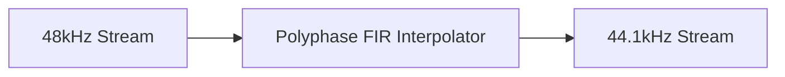

# Synchronous Sample Rate Converter (SRC) Architecture

This directory contains the Synchronous SRC implementation.

## Overview

Converts sample rates by an exact, locked integer or fractional ratio (e.g., 48 kHz to 44.1 kHz) using a polyphase filter bank.

## Architecture Diagram

## Configuration and Scripts

- **Kconfig**: Extensive options for `COMP_SRC`, determining conversion quality targets and memory consumption limitations: standard (`COMP_SRC_STD`), small (`COMP_SRC_SMALL`), and tiny (`COMP_SRC_TINY`) filter sets. Alternatively targets IPC4 full conversions (`COMP_SRC_IPC4_FULL_MATRIX`), and supports lite conversions (`COMP_SRC_LITE`).
- **CMakeLists.txt**: Wraps numerous internal source implementations spanning multiple SIMD platforms (`src_hifi2ep.c`, `src_hifi3.c`, `src_hifi4.c`, `src_hifi5.c`) and connects the required IPC APIs. Allows Zephyr out-of-tree loader configurations (`llext`).
- **src.toml**: Declares massive topology limits under `mod_cfg` per chipset to enforce correct processing behavior of varied rate conversions internally, specifying `UUIDREG_STR_SRC4` and `UUIDREG_STR_SRC_LITE`.
- **Topology (.conf)**: Instantiated via `tools/topology/topology2/include/components/src.conf`, utilizing `rate_in` and `rate_out` attributes to specify integer transformations. Associates as a `src` widget type with UUID `8d:b2:1b:e6:9a:14:1f:4c:b7:09:46:82:3e:f5:f5:ae`.
- **MATLAB Tuning (`tune/`)**: Houses heavily comprehensive scripts like `sof_src_generate.m` which compute optimal polyphase filter bank coefficients for a massive grid of supported input-to-output fractional sample rate conversions. The scripts export these fixed-point (or float) arrays as C header data structs (`.h` code outputs) allowing the DSP to pull static transition parameters depending on memory (`std`, `small`, `tiny`, `lite`) profiles.
