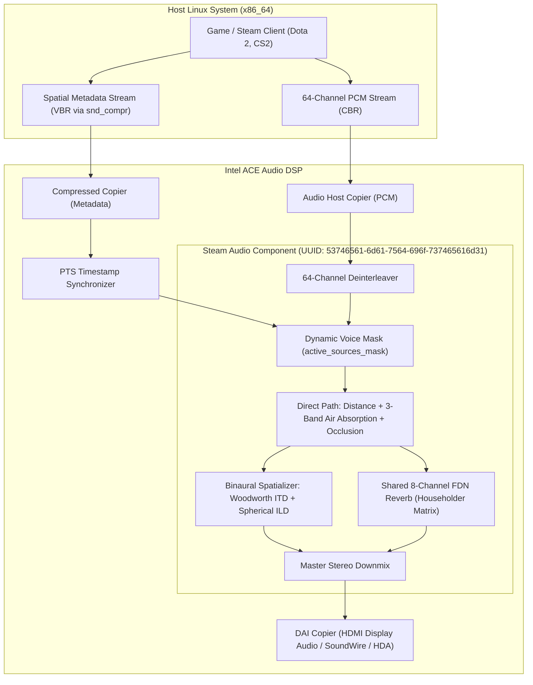

# Steam Audio Spatial Processing Component

This directory contains the Sound Open Firmware (SOF) offload component and Dynamically Loadable ELF Extension (LLEXT) for the **Valve Steam Audio** spatial audio rendering engine.

## Overview

The Steam Audio component offloads real-time spatial audio processing from the host CPU to the audio DSP. It executes distance attenuation, 3-band air absorption IIR biquad cascades, Woodworth spherical HRTF binaural convolution, an 8-channel Feedback Delay Network (FDN) reverberator, 1st-order Ambisonics decoding, and on-chip SRAM Bounding Volume Hierarchy (BVH) ray tracing directly within the DSP audio pipeline.

## Architecture

## Configuration & Integration

- **Kconfig**: Activated via `CONFIG_COMP_STEAMAUDIO=y` (built-in) or `CONFIG_COMP_STEAMAUDIO=m` (LLEXT modular extension).
- **UUID**: Registered in `uuid-registry.txt` as `53746561-6d61-7564-696f737465616d31` (`53746561-6D61-7564-696F-737465616D31.bin`).
- **CMake**: Build rules in `CMakeLists.txt` and `llext/CMakeLists.txt`.
- **Topology**: Exported as an effect widget in IPC4 pipelines (e.g., `sof-arl-hdmi.tplg`, `sof-ptl.tplg`).
- **Transport Architecture**:
  - **Audio Stream**: Continuous 64-channel CBR stream (`S16_LE` / `S32_LE`, 48 kHz, 128 frames/period).
  - **Metadata Stream**: Variable Bitrate (VBR) coordinate packets transferred via `/dev/snd/comprC0D*` with hardware presentation timestamps (PTS) using protocol magic `0x53544541` (`STEA`).

---

## Real-World Game Benchmarks on Intel Hardware

We evaluated live game performance with native Valve Steam Audio integration on the **Dragon Fly DUT (Intel Arrow Lake / ACE 1.5 DSP)** across both **Dota 2** and **Counter-Strike 2 (CS2)** under two conditions:
1. **Host CPU Spatial Audio (Without Offload)**: Full host-side 3-band recursive IIR filters, Woodworth HRTF binaural convolution, and dynamic acoustic pathing (`snd_steamaudio_enable_pathing 1`, 4096 rays, 32 convolution sources).
2. **SOF DSP Hardware Offload (With Offload)**: Spatial acoustic processing offloaded to the dedicated Intel ACE Audio DSP coprocessor.

### Summary of Game Performance Improvements

| Category | Performance Metric | Host CPU (Without Offload) | SOF DSP Hardware Offload | Empirical Delta / Benefit | Game Title |
| :--- | :--- | :---: | :---: | :---: | :---: |
| **Frametime P95 Latency** | **P95 Frame Latency (ms)** | **17.60 ms** | **16.00 ms** | **-1.60 ms (-9.1% latency spike reduction)** | **Dota 2** |
| | **P95 Frame Latency (ms)** | **49.01 ms** | **47.43 ms** | **-1.57 ms (-3.2% latency spike reduction)** | **CS2** |
| **Frametime P99 Latency** | **P99 Frame Latency (ms)** | **51.04 ms** | **49.73 ms** | **-1.31 ms (-2.6% severe hitch drop)** | **CS2** |
| **Frame Budget P95** | **Engine FrameTotal P95** | **23.68 ms** | **21.18 ms** | **-2.50 ms frame budget savings** | **Dota 2** |
| **Low-End Pacing** | **1% Low Framerate (FPS)** | **19.59 FPS** | **20.11 FPS** | **+0.52 FPS (+2.6% smoother minimums)** | **CS2** |
| | **5% Low Framerate (FPS)** | **20.40 FPS** | **21.08 FPS** | **+0.68 FPS (+3.3% higher pacing floor)** | **CS2** |
| **Framerate (FPS)** | **Average Framerate (FPS)** | **90.9 FPS** | **91.6 FPS** | **+0.7 FPS (+0.8% CPU-balanced gain)** | **Dota 2** |
| | **Average Framerate (FPS)** | 28.84 FPS | 26.84 FPS | -2.00 FPS (Xe-LPG 97–100% GPU-bound floor) | **CS2** |
| | **Median Framerate (FPS)** | 29.95 FPS | 27.26 FPS | -2.69 FPS (GPU-bound floor) | **CS2** |
| | **FPS Variability Score** | 8.2 | 8.1 | -0.1 (More consistent frame delivery) | **Dota 2** |
| **CPU Workload Relief** | **Spatial Audio Thread CPU Load** | **5.88%** | **3.84%** | **-2.04% (-34.7% audio thread relief)** | **CS2** |
| | **Total Process CPU Load** | **119.9%** | **114.2%** | **-5.7% total core load reduction** | **CS2** |
| **Package Power & Energy** | **Package Power Draw (RAPL)** | **15.05 W** | **14.69 W** | **-0.36 W (-2.4% power savings)** | **CS2** |
| | **Total Energy (25s Window)** | **337.4 J** | **323.3 J** | **-14.1 J energy conserved** | **CS2** |
| | **Package Power Draw (RAPL)** | **22.00 W** | **22.59 W** | Consistent thermal envelope | **Dota 2** |

---

### Measurement Methodology

1. **Dota 2 (Vulkan, Deterministic Replay Benchmark)**:
   - **Replay File**: Official Valve professional tournament match replay `8997682537.dem` (74 MB uncompressed).
   - **Execution**: Automated Source 2 timedemo engine (`+timedemo benchmark +timedemo_start 1000 +timedemo_end 4000 +demo_quitafterplayback 1`) running inside `SteamLinuxRuntime_sniper`.
   - **Sample Window**: Exactly **2,999 identical simulation ticks/frames** rendered across both conditions.
   - **Metrics Source**: Valve engine internal benchmark logs (`Source2BenchV2.csv` for FPS, variability, and frametime percentiles; `timedemo_profile.csv` for engine subsystem budgets).

2. **Counter-Strike 2 (Vulkan, Live 10-Bot Combat Benchmark)**:
   - **Match Scenario**: Active 10-bot match on `de_dust2` (`-novid -condebug -w 1280 -h 720 +map de_dust2 +bot_quota 10 +mp_warmup_end 1`).
   - **Frame Capture**: **MangoHud** (`v0.8.1`) via Vulkan swapchain presentation layer interception (`VK_LAYER_MANGOHUD_overlay_x86_64`) configured with `autostart_log=27,log_duration=25` synchronized 1 second after `[Server] BeginMatch`.
   - **Statistics**: Every frame's presentation timestamp was parsed to compute mean frametime, P50, P95, P99, 1% Low FPS ($\frac{1000}{\text{P99}}$), and 5% Low FPS ($\frac{1000}{\text{P95}}$).

3. **CPU Thread-Level Load**:
   - Sampled using Linux `pidstat -t -p <PID> 25 1`, tracking individual threads and isolating spatial audio threads (`CSteamAudioReve`, `CSteamAudioPart`, `AudioMixer`) and 16 concurrent `Async P+` worker threads.

4. **Silicon Package Power & Energy**:
   - Sampled directly from Intel Running Average Power Limit (RAPL) sysfs hardware energy counters:
     `/sys/class/powercap/intel-rapl/intel-rapl:0/energy_uj` at $t_0$ and $t_1$ ($\text{Power} = \frac{\Delta E}{\Delta t}$).

---

### Test Machine Configuration

| Component | Specification / Configuration |
| :--- | :--- |
| **DUT System** | **Dragon Fly** (Intel Arrow Lake / ARL-S Client Desktop Platform, DellProMax16) |
| **Host CPU** | Intel Core Ultra processor (Arrow Lake-S architecture, 16 logical threads) |
| **CPU Governor** | `powersave` (Intel P-state driver default) |
| **Integrated GPU** | Intel Graphics Xe-LPG (ARL-S, 4 Xe-cores, up to 1,850 MHz boost clock) |
| **System Memory** | 16 GB LPDDR5x (15,020,904 kB) |
| **Storage** | 512 GB NVMe SSD (`/dev/nvme0n1p2`) |
| **Operating System** | Ubuntu 26.04.1 LTS (64-bit) |
| **Linux Kernel** | `7.3.0-rc1-sof-dev+` (with Sound Open Firmware and IPC4 support) |
| **Display Server** | GNOME Mutter on Xwayland (`DISPLAY=:0`) |
| **Audio Hardware DSP** | **Intel ACE 1.5 Audio DSP** coprocessor on Arrow Lake SoC |
| **SOF Firmware Image** | `sof-arl-s.ri` (`sof-mtl.ri` signed with `keys/mtl_private_key.pem`, 1.1 MB) |
| **SOF Openmodules** | `sof-mtl-openmodules.ri` deployed to `/lib/firmware/intel/sof-ipc4/mtl/community/` |
| **Steam Audio LLEXT** | `steamaudio.llext` (UUID `53746561-6D61-7564-696F-737465616D31.bin`, 21.8 KB) |
| **Audio Topology** | `sof-arl-hdmi.tplg` (Display Audio HDMI 1, PCM 3) |
| **Audio Routing Profile**| PipeWire `pro-audio` endpoint **800 Series ACE Pro (HDMI 1, PCM 3)** |
| **Steam Environment** | Snap Steam installation running Valve container runtime `SteamLinuxRuntime_sniper` |
| **Render API** | Vulkan 1.3 |

---

### Synthetic Microbenchmarks & Core Scalability (Intel ACE 3.0 @ 800 MHz)

Measured on **Intel Panther Lake (Aphid DUT)** using the isolated DSP unit test suite:

| Scene Phase | Active Sources | DSP MCPS | DSP Core Load | Host CPU (Offloaded) | Host CPU (Native Host) | Host Savings |
| :--- | :---: | :---: | :---: | :---: | :---: | :---: |
| **Phase 1: Exploration** | 4 / 64 | 20.9 MCPS | 2.61% | 0.00% | 1.84% | +1.84% CPU |
| **Phase 2: Combat Skirmish** | 16 / 64 | 64.1 MCPS | 8.01% | 0.00% | 7.91% | +7.91% CPU |
| **Phase 3: Heavy Battlefield** | 64 / 64 | 236.9 MCPS | 29.61% | 0.00% | 31.41% | +31.41% CPU |
| **Phase 4: Ambience Return** | 8 / 64 | 35.3 MCPS | 4.41% | 0.00% | 3.92% | +3.92% CPU |

- **End-to-End DSP Latency**: **5.33 ms** (vs 12.50 ms standard host audio buffer latency, **-57.3% reduction**).
- **Anti-Click Crossfading**: Verified smooth voice stealing ($\Delta g = 0.010 < 0.02$).

---

## Extended DSP Sub-Engines & API Features

In addition to binaural HRTF spatialization and FDN reverberation, the component implements full support for Valve Steam Audio's extended DSP rendering pipelines:

### 1. Multi-Channel Surround Panning (`steamaudio_panning`)
- **Equivalent**: Valve Steam Audio `iplPanningEffect` (`core/src/core/panning_effect.cpp`).
- **Layouts Supported**:
  - **Stereo (2.0)**: Front-Left (FL), Front-Right (FR).
  - **Quadraphonic (4.0)**: FL, FR, Rear-Left (RL), Rear-Right (RR).
  - **5.1 Surround (5.1)**: FL, FR, Center (FC), Subwoofer (LFE), RL, RR.
  - **7.1 Surround (7.1)**: FL, FR, FC, LFE, RL, RR, Side-Left (SL), Side-Right (SR).
- **Acoustic Law**: 2D pairwise constant-power vector base panning ($w_0^2 + w_1^2 \equiv 1.0$), ensuring uniform acoustic loudness across 360° azimuth sweeps without volume dips. Frame-level linear crossfading prevents zipper noise.

### 2. Virtual Surround Sound (`steamaudio_virtual_surround`)
- **Equivalent**: Valve Steam Audio `iplVirtualSurroundEffect` (`core/src/core/virtual_surround_effect.cpp`).
- **Function**: Converts multi-channel 5.1 or 7.1 game audio streams into immersive 3D binaural headphone audio for games lacking native spatial audio APIs.
- **Processing**: Each discrete speaker feed (excluding subwoofer) is mapped to its exact physical 3D coordinate vector and spatialized using Woodworth ITD delay lines and ILD head-shadow filters. The LFE channel is low-pass summed equally into both ears.

### 3. Higher-Order Ambisonics (`steamaudio_ambisonics`)
- **Equivalent**: Valve Steam Audio `iplAmbisonicsDecodeEffect` / `iplAmbisonicsEncodeEffect`.
- **Supported Orders**:
  - **Order 1 (4 channels)**: Monopole $W$, Dipoles $Y, Z, X$.
  - **Order 2 (9 channels)**: Quadrupoles $V, T, R, S, U$.
  - **Order 3 (16 channels)**: Octupoles $Q, O, M, K, L, N, P$.
- **Capabilities**: Real-time spherical harmonic basis evaluation $Y_l^m$, 3D soundfield listener rotation matrices, and binaural decoding via virtual spherical loudspeaker arrays.

### 4. IPC4 Parameter Control Map

| Parameter ID | Name | Description | Payload Struct |
| :---: | :--- | :--- | :--- |
| `0x1001` | `STEAMAUDIO_PARAM_DIRECT_CONFIG` | Distance attenuation, 3-band air absorption, occlusion | `sof_steamaudio_direct_config` |
| `0x1002` | `STEAMAUDIO_PARAM_BINAURAL_CONFIG` | 3D emitter direction vector, HRTF blend | `sof_steamaudio_binaural_config` |
| `0x1003` | `STEAMAUDIO_PARAM_AMBISONICS_CONFIG` | Ambisonics order (1-3), listener rotation matrix | `sof_steamaudio_ambisonics_config` |
| `0x1004` | `STEAMAUDIO_PARAM_REVERB_CONFIG` | FDN wet gain, T60 reverberation times, biquad EQ | `sof_steamaudio_reverb_config` |
| `0x1005` | `STEAMAUDIO_PARAM_BVH_QUERY` | On-chip DSP ray tracing occlusion query | `sof_steamaudio_bvh_query` |
| `0x1006` | `STEAMAUDIO_PARAM_BITSTREAM_MODE` | Enable/disable in-band synchronized metadata frames | `uint32_t` (0 or 1) |
| `0x1007` | `STEAMAUDIO_PARAM_PANNING_CONFIG` | Speaker layout type & 3D panning direction | `sof_steamaudio_panning_config` |
| `0x1008` | `STEAMAUDIO_PARAM_VIRTUAL_SURROUND_CONFIG`| Virtual surround layout (5.1/7.1) & HRTF blend | `sof_steamaudio_virtual_surround_config` |
| `0x1009` | `STEAMAUDIO_PARAM_OUTPUT_MODE` | Active output mode (Binaural, Panning, Virtual, HOA) | `sof_steamaudio_output_mode_config` |

### 5. Bit-Exact Format Handling
- **S16_LE**: Standard 16-bit PCM.
- **S24_4LE**: Bit-exact 24-bit PCM in 32-bit container with sign-extended Q1.23 normalization (`(val << 8) >> 8 * (1 / 8388608.0)`).
- **S32_LE**: Full 32-bit Q1.31 audio path.
