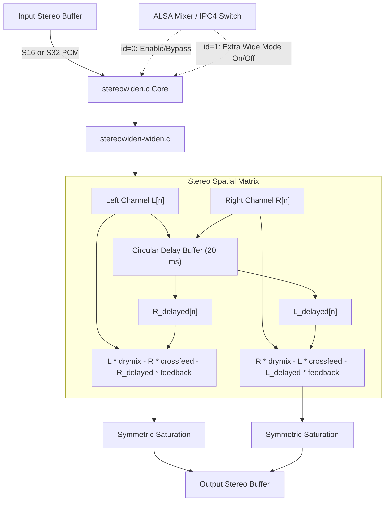

# FFmpeg Stereo Widener Module (`stereowiden`)

Ports FFmpeg's `af_stereowiden` stereo spatial enhancement algorithm into a native fixed-point SOF module for Xtensa DSPs. It expands the perceived acoustic width of stereo audio signals through frequency-dependent crossfeed cancellation and delayed negative feedback.

---

## Features

- **Acoustic Soundstage Expansion**: Widens narrow stereo mixes without destroying center vocal localization.
- **Delayed Negative Feedback**: Configurable circular delay buffer (default 20 ms / 960 frames) adds subtle spatial depth.
- **Pure Fixed-Point Integer**: All matrix mixing operations run in integer Q30/Q31 math with zero floating-point overhead (`CONFIG_FPU=n`).
- **Headroom Protection**: 64-bit accumulators with symmetric saturation clamps (`sat32`, `sat16`) prevent phase-cancellation clipping.
- **Dual Format Support**: Natively processes both `S16_LE` and `S32_LE` stereo streams.
- **ALSA IPC4 Dual Switch Controls**:
  - `id = 0`: Module bypass / enable switch.
  - `id = 1`: Extra Wide mode toggle (enhanced spatial spread).

---

## Mathematical Formulation

The module applies cross-channel subtraction and delayed feedback across left and right channels:

$$\text{out}_L[n] = \text{sat}\left( \frac{L[n] \cdot \text{drymix} - R[n] \cdot \text{crossfeed} - R_{delayed}[n] \cdot \text{feedback}}{2^{30}} \right)$$

$$\text{out}_R[n] = \text{sat}\left( \frac{R[n] \cdot \text{drymix} - L[n] \cdot \text{crossfeed} - L_{delayed}[n] \cdot \text{feedback}}{2^{30}} \right)$$

### Mixing Profiles

| Mode | Dry Mix ($D$) | Crossfeed ($C$) | Feedback ($F$) |
|---|:---:|:---:|:---:|
| **Nominal Width** | `0.80` ($858993459$) | `0.30` ($322122547$) | `0.20` ($214748364$) |
| **Extra Wide** (`id = 1`) | `0.70` ($751619276$) | `0.50` ($536870912$) | `0.35` ($375809638$) |

Where values in parentheses indicate Q30 fixed-point coefficients ($1.0 = 2^{30}$).

---

## Architecture & Data Flow



### Components

- `stereowiden.c`: SOF `module_interface` glue, channel verification, delay sizing, and IPC4 switch parameter handlers.
- `stereowiden-widen.c`: Circular delay management and integer spatial loops (`stereowiden_process_s16`, `stereowiden_process_s32`).
- `stereowiden-stub.c`: Dependency-free pass-through stub for testing.
- `stereowiden.h`: State struct (`struct stereowiden_comp_data`), buffer limits, and function prototypes.

---

## Build Configuration

### 1. Real Widener Integration

```ini
CONFIG_COMP_STEREOWIDEN=y      # or =m for LLEXT
CONFIG_COMP_STEREOWIDEN_STUB=n
```

### 2. Pass-Through Stub (CI / Staging)

```ini
CONFIG_COMP_STEREOWIDEN=y
CONFIG_COMP_STEREOWIDEN_STUB=y
```

---

## Kconfig Parameters

| Option | Default | Type / Range | Description |
|---|---|---|---|
| `CONFIG_COMP_STEREOWIDEN` | n | tristate (`y`/`m`/`n`) | Enable FFmpeg stereo widener module |
| `CONFIG_COMP_STEREOWIDEN_STUB` | y | bool | Build pass-through stub |
| `CONFIG_COMP_STEREOWIDEN_MODULE` | n | bool | Build as loadable LLEXT shared library |

---

## Usage & Topology

### Pipeline Routing

Position `stereowiden` after stereo decoding/mixing and prior to dynamic compression or peak limiting:

```
[ Host Decoder ] ---> [ stereowiden ] ---> [ equalizer ] ---> [ alimiter ] ---> [ Speaker DAI ]
```

### Topology 2 Code Snippet

```alsa
Object.Widget.stereowiden.1 {
    Object.Base.input_pin_binding.1 {
        input_pin_binding_name "host-copier.0"
    }
    Object.Base.output_pin_binding.1 {
        output_pin_binding_name "equalizer.1"
    }
}
```

### ALSA Mixer Controls

| Control Name | Type | Value Range | Function |
|---|---|---|---|
| `Stereo Widen Switch` | Boolean | `0` (Bypass) / `1` (Active) | Master module enable switch (`id = 0`) |
| `Stereo Extra Wide Switch` | Boolean | `0` (Nominal) / `1` (Extra Wide) | Toggle expanded crossfeed matrix (`id = 1`) |

---

## Performance & MCPS Profile (Aphid / Panther Lake ACE 3.0)

Evaluated on Panther Lake (`intel_ace30_ptl`) Aphid hardware at **400 MHz** core clock:

| Codec / Module | Implementation | Stream Profile | MCPS (Aphid) | DSP Core Load (@ 400 MHz) |
|---|---|---|:---:|:---:|
| **FFmpeg Stereo Widener** (`stereowiden`) | Circular delay matrix crossfeed | 48 kHz Stereo (S16) | **~1.25 – 1.45 MCPS** | **< 0.37%** |
| **FFmpeg Stereo Widener** (`stereowiden`) | Circular delay matrix crossfeed | 48 kHz Stereo (S32) | **~1.40 – 1.65 MCPS** | **< 0.42%** |

### Characteristics

- **Compute**: ~14 clock cycles per stereo sample.
- **Memory**: Pre-allocated 7.6 KB delay buffer in module private RAM.
- **Sound Quality**: Preserves center vocal clarity while widening ambient instruments.
