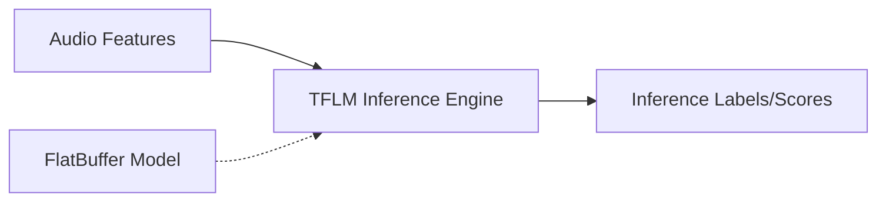

# TensorFlow Lite Micro (TFLM) Architecture

This directory acts as the bridge for running ML models.

## Overview

Integrates TensorFlow Lite for Microcontrollers into the SOF audio pipeline. Evaluates pre-trained neural network topologies inline with the audio stream for tasks like wake-word, noise cancellation, or sound classification.

## Architecture Diagram

## Configuration and Scripts

- **Kconfig**: Enforces requirements for C++17 support and core framework staging logic (`COMP_TENSORFLOW`).
- **CMakeLists.txt**: An intricate build specification linking the Tensilica neural network library block computations (`nn_hifi_lib`) and the TensorFlow Lite micro core engine (`tflm_lib`). Also hooks the `tflm-classify.c` SOF adapter via compiler flags explicitly enforcing memory, precision, and XTENSA optimizations.
- **tflmcly.toml**: Topology definition for the specific TFLM Classifier implementation binding the engine against the UUID `UUIDREG_STR_TFLMCLY`.
