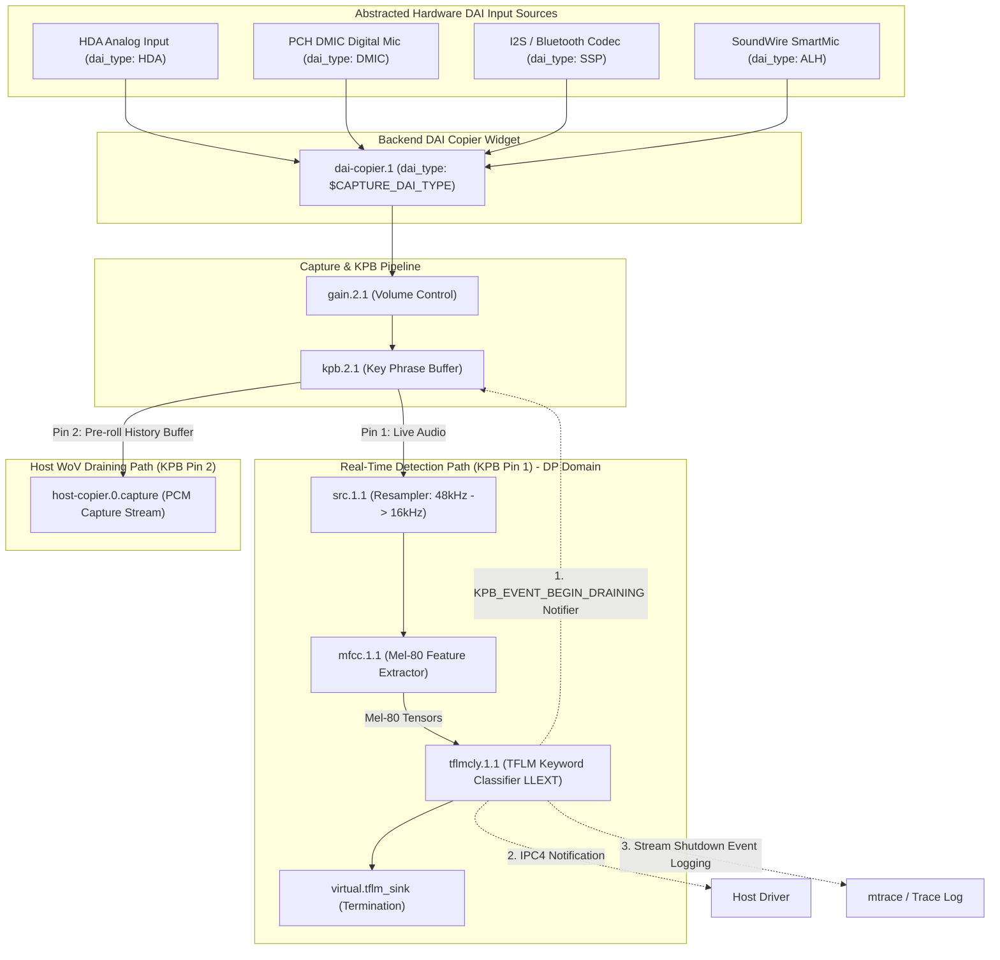

# TensorFlow Lite Micro (TFLM) & Wake-on-Voice (WoV) Architecture

This directory provides the TensorFlow Lite for Microcontrollers (TFLM) classification module (`TFLMCLY`) for Sound Open Firmware (SOF), including integration with MFCC feature extraction, `mtrace` stream shutdown summary logging, IPC host notifications, Key Phrase Buffer (KPB) Wake-on-Voice (WoV) trigger infrastructure, and abstracted audio input sources across **HDA**, **DMIC**, **SSP (I2S)**, and **SoundWire (ALH)**.

---

## Overview

The TFLM module evaluates pre-trained micro speech neural network models inline within the SOF audio processing graph. It receives pre-processed audio feature tensors (e.g. 80-bin mel spectrograms from the `mfcc` component), runs model inference in the **Data Processing (DP) domain**, logs keyword detections and stream shutdown event summaries to `mtrace`, issues IPC4 notifications to the host audio driver, and signals the KPB module to drain pre-roll audio history upon keyword detection.

---

## Architecture & Data Flow

### Dual-Path Wake-on-Voice (WoV) Architecture

To allow continuous keyword evaluation without streaming audio to the host until a keyword is detected, the pipeline separates real-time keyword detection from host PCM draining via KPB:


```mermaid
graph TD
    subgraph Audio_Inputs ["Abstracted Hardware DAI Input Sources"]
        HDA["HDA Analog Input (dai_type: HDA)"]
        DMIC["PCH DMIC Digital Mic (dai_type: DMIC)"]
        SSP["I2S / Bluetooth Codec (dai_type: SSP)"]
        SDW["SoundWire SmartMic (dai_type: ALH)"]
    end

    subgraph DAI_Abstraction ["Backend DAI Copier Widget"]
        DAI["dai-copier.1 (dai_type: $CAPTURE_DAI_TYPE)"]
    end

    subgraph KPB_Pipeline ["Capture & KPB Pipeline"]
        Gain["gain.2.1 (Volume Control)"]
        KPB["kpb.2.1 (Key Phrase Buffer)"]
    end

    subgraph Detect_Pipeline ["Real-Time Detection Path (KPB Pin 1) - DP Domain"]
        SRC["src.1.1 (Resampler: 48kHz -> 16kHz)"]
        MFCC["mfcc.1.1 (Mel-80 Feature Extractor)"]
        TFLM["tflmcly.1.1 (TFLM Keyword Classifier LLEXT)"]
        VSink["virtual.tflm_sink (Termination)"]
    end

    subgraph Host_Pipeline ["Host WoV Draining Path (KPB Pin 2)"]
        Host["host-copier.0.capture (PCM Capture Stream)"]
    end

    HDA --> DAI
    DMIC --> DAI
    SSP --> DAI
    SDW --> DAI

    DAI --> Gain
    Gain --> KPB
    KPB -- Pin 1: Live Audio --> SRC
    SRC --> MFCC
    MFCC -- Mel-80 Tensors --> TFLM
    TFLM --> VSink

    TFLM -.->|1. KPB_EVENT_BEGIN_DRAINING Notifier| KPB
    TFLM -.->|2. IPC4 Notification| Host_Driver[Host Driver]
    TFLM -.->|3. Stream Shutdown Event Logging| MTrace[mtrace / Trace Log]

    KPB -- Pin 2: Pre-roll History Buffer --> Host
```

---

## Domain Execution Model (LL vs. DP)

- **Low Latency (LL) Domain (Timer Task / 1ms tick loop)**:
  - Components: `dai-copier`, `eqiir`, `tdfb`, `drc`, `host-copier`
  - Purpose: Fixed 1 ms tick loop executed on Core 0 to meet hard real-time audio hardware deadlines.
  - Metrics: Reported via `ll_schedule.stats_report` (e.g. `ll core 0 timer avg 22,049 cycles (~56 µs)`).

- **Data Processing (DP) Domain (Asynchronous Task)**:
  - Components: `src`, `micsel`, `mfcc`, `tflmcly` (`tflm.llext`)
  - Purpose: Runs asynchronously in background thread whenever 344-byte feature frames are produced by `mfcc`.
  - **Separation**: Because TFLM runs in the DP domain, model inference cycles take place outside the 1 ms LL tick loop, guaranteeing zero impact on real-time LL audio latency or buffer overruns.

---

## Stream Shutdown Summary Event Logging

Upon stream reset or module destruction (`tflm_reset()` / `tflm_free()`), TFLM emits a comprehensive summary log to `printk` and DSP trace logs detailing total event occurrences:

```text
[TFLM STREAM SHUTDOWN SUMMARY] Total Inferences=142 | Keyword Events: Silence=120, Unknown=18, Yes=3, No=1 | Total KPB Triggers=4
```

### Log Fields:
- `Total Inferences`: Cumulative number of classification inferences completed during the stream session.
- `Keyword Events`: Per-category classification breakdown (`silence`, `unknown`, `yes`, `no`).
- `Total KPB Triggers`: Number of high-confidence keyword detections that triggered pre-roll audio history draining (`KPB_EVENT_BEGIN_DRAINING`).

---

## Abstracted Audio Input Sources in Topology v2

The TFLM Keyword Detection and KPB pre-roll pipeline is decoupled from the physical DAI input source using the generic `dai-copier` widget:

```conf
Object.Widget.dai-copier.1 {
    dai_type    $CAPTURE_DAI_TYPE     # "HDA", "DMIC", "SSP", or "ALH" (SoundWire)
    copier_type $CAPTURE_COPIER_TYPE  # "HDA", "DMIC", "SSP", or "ALH"
    stream_name $CAPTURE_DAI_NAME    # "Analog", "DMIC01", "SSP0", "SDW0-Capture"
    node_type   $CAPTURE_NODE_TYPE    # $HDA_LINK_INPUT_CLASS, $DMIC_LINK_INPUT_CLASS, etc.
}
```

Platform wrappers select the input source cleanly via configuration defines:
```conf
Define {
    CAPTURE_SOURCE "hda" # Options: "hda", "dmic", "ssp", "soundwire"
}

IncludeByKey.CAPTURE_SOURCE {
    "hda"       "platform/intel/capture-hda.conf"
    "dmic"      "platform/intel/capture-dmic.conf"
    "ssp"       "platform/intel/capture-ssp.conf"
    "soundwire" "platform/intel/capture-sdw.conf"
}
```

---

## Topology v2 Integration & Usage

### 1. Component Widget Definition (`include/components/tflm.conf`)

Defines `Class.Widget."tflmcly"`:
- **UUID**: `42:c6:1d:c5:e1:a2:df:48:a4:90:e2:74:8c:b6:36:3e` (`c51dc642-a2e1-48df-a490e2748cb6363e`)
- **Type**: `effect`

### 2. Detection Pipeline Template (`include/pipelines/cavs/host-gateway-src-mfcc-tflm-capture.conf`)

Instantiates the real-time detection graph:
```conf
Object.Widget {
    virtual."1" { name "virtual.tflm_sink" }
    src."1"     { ... }
    mfcc."1"    { ... }
    tflmcly."1" { ... }
}
```

### 3. Top-Level Topology Configuration (`sof-hda-tflm.conf`)

Instantiates the complete HDA Mic WoV topology with dual-path KPB routing:
```conf
Object.Base.route [
    # DAI -> Gain -> KPB
    { source "dai-copier.HDA.Analog.capture"; sink "gain.2.1" }
    { source "gain.2.1"; sink "kpb.2.1" }

    # KPB Pin 1 -> Real-time Detection Path (DP Domain)
    { source "kpb.2.1"; sink "src.1.1" }

    # KPB Pin 2 -> Host WoV Draining Path
    { source "kpb.2.1"; sink "host-copier.0.capture" }
]
```

---

## Building and Testing Topologies

### 1. Building Topology Targets with Ninja

From `sof/tools/build_tools`:

```bash
# Build HDA TFLM KPB Topologies (MTL / PTL)
ninja topology2_prod_sof-mtl-hda-tflm-kpb
ninja topology2_prod_sof-ptl-hda-tflm-kpb

# Build SoundWire TFLM Topology (ARL-S)
ninja topology2_dev_sof-arl-cs42l43-l0-cs35l56-l23-mfcc-mel-normal
```

### 2. Streaming & Capturing Performance / Trace Logs on Target DUT

Run `arecord` with standard mandatory timeouts:

```bash
# Record 10s audio stream to trigger TFLM pipeline execution
ssh root@dragon-fly 'timeout 10s arecord -D hw:0,4 -f S32_LE -r 48000 -c 2 -d 10 /tmp/test_stream.wav'

# Read DSP mtrace logs to observe inferences and shutdown summary
ssh root@dragon-fly 'timeout 10s /usr/local/bin/mtrace-reader.py'
```

---

## Source Files

- **[tflm-classify.c](file:///home/lrg/work/sof-ptl/sof/src/audio/tensorflow/tflm-classify.c)**: SOF module adapter implementation for TFLM.
- **[speech.cc](file:///home/lrg/work/sof-ptl/sof/src/audio/tensorflow/speech.cc)** / **[speech.h](file:///home/lrg/work/sof-ptl/sof/src/audio/tensorflow/speech.h)**: TFLM C++ API bridge & micro speech tensor wrapper.
- **[tflm.conf](file:///home/lrg/work/sof-ptl/sof/tools/topology/topology2/include/components/tflm.conf)**: Topology v2 widget class definition.
- **[host-gateway-src-mfcc-tflm-capture.conf](file:///home/lrg/work/sof-ptl/sof/tools/topology/topology2/include/pipelines/cavs/host-gateway-src-mfcc-tflm-capture.conf)**: Detection pipeline template.
- **[sof-hda-tflm.conf](file:///home/lrg/work/sof-ptl/sof/tools/topology/topology2/sof-hda-tflm.conf)**: Top-level WoV topology configuration.
