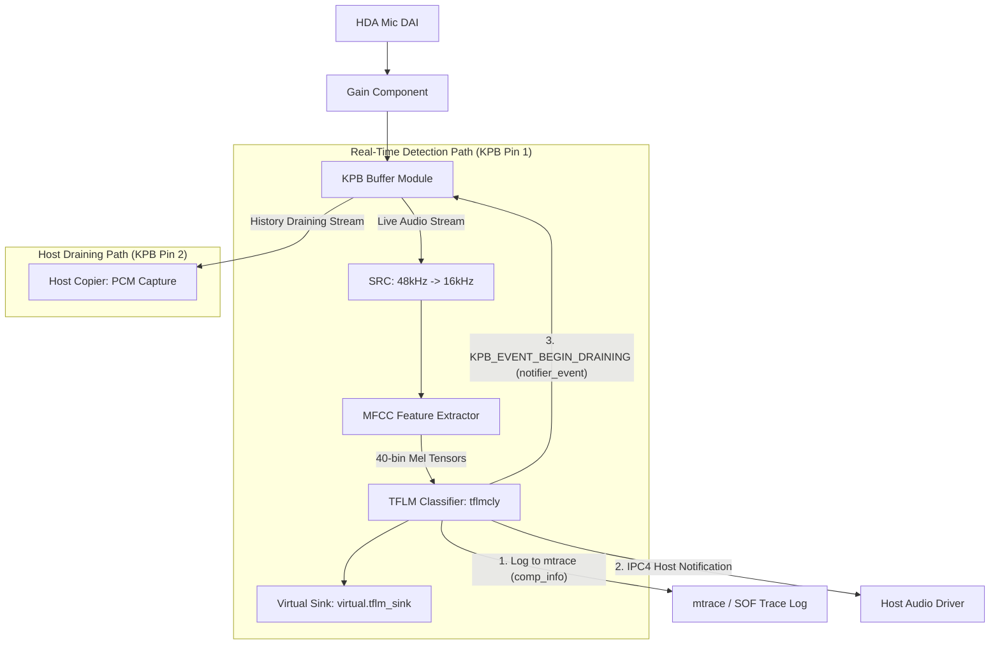

# TensorFlow Lite Micro (TFLM) & Wake-on-Voice (WoV) Architecture

This directory provides the TensorFlow Lite for Microcontrollers (TFLM) classification module (`TFLMCLY`) for Sound Open Firmware (SOF), including integration with MFCC feature extraction, mtrace logging, IPC host notifications, and Key Phrase Buffer (KPB) Wake-on-Voice (WoV) trigger infrastructure.

---

## Overview

The TFLM module evaluates pre-trained micro speech neural network models inline within the SOF audio processing graph. It receives pre-processed audio feature tensors (e.g. 40-bin mel spectrograms from the MFCC component), runs model inference, logs keyword detections to `mtrace`, issues IPC4 notifications to the host audio driver, and signals the KPB module to drain buffered pre-keyword audio for Wake-on-Voice.

---

## Architecture & Data Flow

### Dual-Path Wake-on-Voice (WoV) Architecture

To allow continuous keyword evaluation without streaming audio to the host until a keyword is detected, the pipeline separates real-time keyword detection from host PCM draining via KPB:


```mermaid
graph TD
    DAI[HDA Mic DAI] --> Gain[Gain Component]
    Gain --> KPB[KPB Buffer Module]

    subgraph "Real-Time Detection Path (KPB Pin 1)"
        KPB -- Live Audio Stream --> SRC[SRC: 48kHz -> 16kHz]
        SRC --> MFCC[MFCC Feature Extractor]
        MFCC -- 40-bin Mel Tensors --> TFLM[TFLM Classifier: tflmcly]
        TFLM --> VSink[Virtual Sink: virtual.tflm_sink]
    end

    subgraph "Host Draining Path (KPB Pin 2)"
        KPB -- History Draining Stream --> Host[Host Copier: PCM Capture]
    end

    TFLM -- "1. Log to mtrace (comp_info)" --> MTrace[mtrace / SOF Trace Log]
    TFLM -- "2. IPC4 Host Notification" --> IPC[Host Audio Driver]
    TFLM -- "3. KPB_EVENT_BEGIN_DRAINING (notifier_event)" --> KPB
```

---

## Pipeline Execution & Event Flow

1. **Continuous Real-Time Listening**:
   - Live microphone audio is captured by the HDA DAI and passed into `KPB` (`kpb.2.1`).
   - KPB Output Pin 1 continuously streams audio to `SRC` (resampling 48kHz $\to$ 16kHz), `MFCC` (generating 40-bin `int8_t` mel spectrogram features), and `TFLM` (`tflmcly.1.1`).
   - KPB stores the raw PCM audio continuously in its circular history buffer (e.g. 2100ms – 3000ms history).

2. **Inference & Keyword Detection**:
   - `tflm_process()` feeds 1960-byte feature tensors ($40 \text{ features} \times 49 \text{ windows}$) into the Micro Speech TFLM interpreter (`[1, 49, 40]` `int8_t` input tensor).
   - Upon `TF_ProcessClassify()`, predictions are evaluated across categories:
     - `0`: `silence`
     - `1`: `unknown`
     - `2`: `yes` (Keyword)
     - `3`: `no` (Keyword)

3. **Wake-on-Voice Trigger & Notification**:
   When a keyword (`yes` or `no`) is detected with $\ge 0.70$ confidence:
   - **mtrace Logging**: Logs detection with keyword label and confidence score via `comp_info()`:
     `"TFLM keyword detected: yes (confidence 0.852)"`
   - **Host IPC Notification**: Sends an IPC4 module notification (`SOF_IPC4_MODULE_NOTIFICATION`) to inform the host driver.
   - **KPB Draining Signal**: Fires a system notification event (`NOTIFIER_ID_KPB_CLIENT_EVT`) with `KPB_EVENT_BEGIN_DRAINING`.
   - **Host PCM Draining**: KPB opens Output Pin 2 to `host-copier`, draining pre-keyword history buffer audio followed by live mic audio to the host capture stream.

---

## Topology v2 Integration & Usage

### 1. Component Widget (`include/components/tflm.conf`)

Defines `Class.Widget."tflmcly"`:
- **UUID**: `42:c6:1d:c5:e1:a2:df:48:a4:90:e2:74:8c:b6:36:3e` (`c51dc642-a2e1-48df-a490e2748cb6363e`)
- **Type**: `effect`

### 2. Detection Pipeline Template (`include/pipelines/cavs/host-gateway-src-mfcc-tflm-capture.conf`)

Instantiates the real-time detection graph:
```conf
Object.Widget {
    virtual."1" { name "virtual.tflm_sink" }
    src."1"     { ... }
    mfcc."1"    { ... }
    tflmcly."1" { ... }
}
```

### 3. Top-Level Topology Configuration (`sof-hda-tflm.conf`)

Instantiates the complete HDA Mic WoV topology with dual-path KPB routing:
```conf
Object.Base.route [
    # DAI -> Gain -> KPB
    { source "dai-copier.HDA.Analog.capture"; sink "gain.2.1" }
    { source "gain.2.1"; sink "kpb.2.1" }

    # KPB Pin 1 -> Real-time Detection Path
    { source "kpb.2.1"; sink "src.1.1" }

    # KPB Pin 2 -> Host WoV Draining Path
    { source "kpb.2.1"; sink "host-copier.0.capture" }
]
```

---

## Building and Testing Topologies

### Pre-processing and Compiling with `alsatplg`

Build `sof-hda-tflm.tplg` using the Topology v2 pre-processor:

```bash
ALSA_CONFIG_DIR=tools/topology/topology2 \
  tools/bin/alsatplg \
  -I tools/topology/topology2/ \
  -p -c tools/topology/topology2/sof-hda-tflm.conf \
  -o build/sof-hda-tflm.tplg
```

### Inspecting Decoded Topology Graphs

Decode and verify the compiled `.tplg` binary:

```bash
tools/bin/alsatplg -d build/sof-hda-tflm.tplg -o decoded.txt
grep -A 20 "SectionGraph" decoded.txt
```

Expected graph output:
```text
SectionGraph {
    set0 {
        gain.2.1 <- dai-copier.HDA.Analog.capture
        kpb.2.1 <- gain.2.1
        src.1.1 <- kpb.2.1                 (Real-Time Detection Path)
        host-copier.0.capture <- kpb.2.1   (Host WoV Draining Path)
    }
    set1 {
        mfcc.1.1 <- src.1.1
        tflmcly.1.1 <- mfcc.1.1
        virtual.tflm_sink <- tflmcly.1.1   (Detection Sink Termination)
    }
}
```

---

## Source Files

- **[tflm-classify.c](file:///home/lrg/work/sof-ptl/sof/src/audio/tensorflow/tflm-classify.c)**: SOF module adapter implementation for TFLM.
- **[speech.cc](file:///home/lrg/work/sof-ptl/sof/src/audio/tensorflow/speech.cc)** / **[speech.h](file:///home/lrg/work/sof-ptl/sof/src/audio/tensorflow/speech.h)**: TFLM C++ API bridge & micro speech tensor wrapper.
- **[tflm.conf](file:///home/lrg/work/sof-ptl/sof/tools/topology/topology2/include/components/tflm.conf)**: Topology v2 widget class definition.
- **[host-gateway-src-mfcc-tflm-capture.conf](file:///home/lrg/work/sof-ptl/sof/tools/topology/topology2/include/pipelines/cavs/host-gateway-src-mfcc-tflm-capture.conf)**: Detection pipeline template.
- **[sof-hda-tflm.conf](file:///home/lrg/work/sof-ptl/sof/tools/topology/topology2/sof-hda-tflm.conf)**: Top-level WoV topology configuration.
