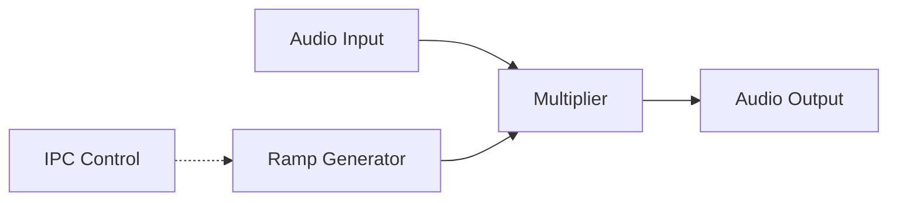

# Volume Component Architecture

This directory contains the Volume control component.

## Overview

Applies amplitude modifications to the stream, supporting smooth ramping and muting interfaces configurable by the host.

## Architecture Diagram

## Configuration and Scripts

- **Kconfig**: Extensive tuning for the standard volume framework (`COMP_VOLUME`), selecting underlying algorithms (e.g., `COMP_VOLUME_WINDOWS_FADE`, `COMP_VOLUME_LINEAR_RAMP`). Manages sub-settings like querying host telemetry (`COMP_PEAK_VOL`, `PEAK_METER_UPDATE_PERIOD_CHOICE`).
- **CMakeLists.txt**: Extremely versatile linkage resolving general pathways (`volume_generic.c`), custom optimized builds across HIFI pipelines (`volume_hifi3.c`, `volume_hifi4.c`, `volume_hifi5.c`), and dual-path execution logic (`*_with_peakvol.c`).
- **volume.toml**: Registers independent modules `PEAKVOL` (`UUIDREG_STR_VOLUME4`) and `GAIN` (`UUIDREG_STR_GAIN`), outlining explicit memory mapping parameters via platform-dependent constraints.
- **Topology (.conf)**: Derived from `tools/topology/topology2/include/components/volume.conf`, configuring a standard `pga` widget (UUID `7e:67:7e:b7:f4:5f:88:41:af:14:fb:a8:bd:bf:86:82`). Outlines parameters for ramp steps interpolation methods and binds specific ALSA interface elements.
