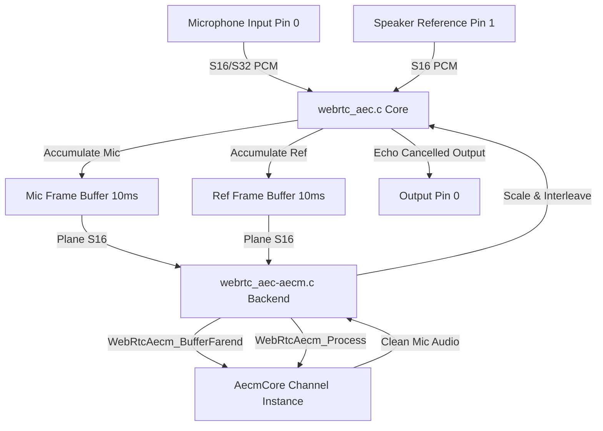

# WebRTC Acoustic Echo Cancellation Module (`webrtc_aec`)

Wraps the fixed-point mobile echo canceller (AECm) from [webrtc-audio-processing](https://gitlab.freedesktop.org/gstreamer/webrtc-audio-processing) behind the SOF `module_interface`.

---

## Features

- **Dual-Input Processing**: Connects both the microphone capture stream (Pin 0) and the speaker playback reference stream (Pin 1).
- **AECm Algorithm**: Highly optimized Q15 fixed-point echo cancellation; runs in real-time on low-power embedded DSPs without an FPU.
- **Dynamic Routing**: Automatic stream alignment using SOF pipeline-ID mapping.
- **Multichannel Independent Filtering**: Allocates one `AecmCore` handle per channel, supporting independent echo cancellation across multiple microphone paths.
- **Rate Options**: Natively supports 8 kHz and 16 kHz sample rates (requires matching rates for both microphone and speaker reference inputs).
- **Frame Buffer**: Synchronizes inputs and processes audio in 10 ms blocks.

---

## Architecture & Data Flow

The following Mermaid diagram explains how the dual input pins (Microphone and Speaker Reference) are processed and aligned inside the module:



### Components
- `webrtc_aec.c`: Core SOF wrapper handling dual-source mapping, preparing format layouts, and period accumulator synchronization.
- `webrtc_aec-aecm.c`: Real AECm library integration translation unit.
- `webrtc_aec-stub.c`: Dependency-free pass-through stub.
- `webrtc_aec.cmake`: CMake compiler scripting pulling the WebRTC AECm codebase from the `webrtc-apm` dependency.

---

## Build Instructions

### 1. Stub Mode (CI / Staging)
```ini
CONFIG_COMP_WEBRTC_AEC=y      # or =m for LLEXT
CONFIG_COMP_WEBRTC_AEC_STUB=y
```

### 2. Real AECm Integration
Integrates the WebRTC AECm engine:
```ini
CONFIG_COMP_WEBRTC_AEC=m
CONFIG_COMP_WEBRTC_AEC_STUB=n
```
*Note: Make sure to run `west update` to retrieve `modules/audio/webrtc-apm` before compiling.*

---

## Kconfig Parameters

| Option | Default | Range / Value | Description |
|---|---|---|---|
| `CONFIG_COMP_WEBRTC_AEC` | n | y / m / n | Enable WebRTC AECm module |
| `CONFIG_COMP_WEBRTC_AEC_STUB` | y | y / n | Use pass-through stub |
| `CONFIG_WEBRTC_AEC_CHANNELS_MAX` | 2 | 1 - 8 | Maximum channels supported |
| `CONFIG_WEBRTC_AEC_ROUTING_HEURISTIC` | y | y / n | Use pipeline-ID matching |

---

## Usage & Topology

### Topology Connections
AEC requires two input pin bindings:
1. **Pin 0 (Capture)**: Fed by the Microphone SSP DAI.
2. **Pin 1 (Reference)**: Fed by the Speaker SSP DAI (cross-pipeline).

#### Example Topology Code snippet:
```
Object.Widget.webrtc-aec.1 {
    # Pin 0: Microphone Capture
    Object.Base.input_pin_binding.1 {
        input_pin_binding_name "dai-copier.SSP.NoCodec-0.capture"
    }
    # Pin 1: Speaker Reference
    Object.Base.input_pin_binding.2 {
        input_pin_binding_name "dai-copier.SSP.NoCodec-2.capture"
    }
}
```

Both input streams must be active and running at the same sample rate (8 kHz or 16 kHz) for the echo canceller to align and filter the signals.
