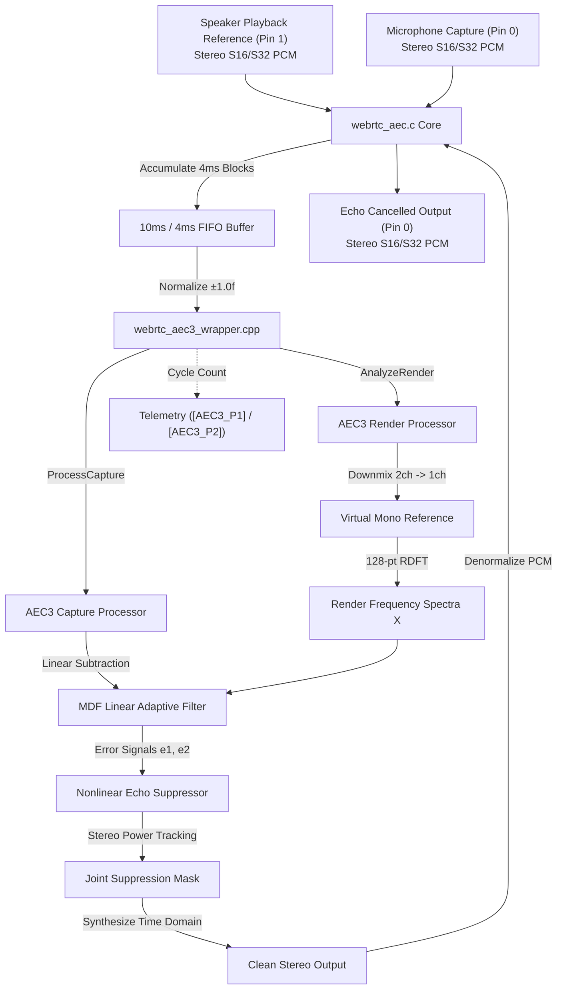

# WebRTC Acoustic Echo Cancellation Module (`webrtc_aec`)

Wraps WebRTC's Acoustic Echo Cancellation algorithms behind the SOF `module_interface`. Supports classic fixed-point AECm, classic floating-point MDF AEC, and modern state-of-the-art WebRTC AEC3 (C++17) with stereo 2x2 MIMO processing.

---

## Features

- **Tri-Backend Architecture**:
  - **Modern AEC3 (C++17)**: State-of-the-art WebRTC AEC3 engine featuring matched filter delay estimation, multi-partition frequency-domain adaptive filtering, non-linear echo suppression, comfort noise generation, and ERLE tracking. Optimized for Intel ACE 3.0 (Panther Lake).
  - **Classic Float AEC (MDF)**: Single-precision floating-point Multidelay Block Frequency Domain adaptive filter (`echo_cancellation.c`) for FPU-enabled DSPs.
  - **Classic Fixed-Point AECm**: Q15 integer echo canceller (`echo_control_mobile.c`) for low-power DSPs without hardware FPU.
  - **Pass-Through Stub**: Zero-dependency pass-through for CI and staging pipeline validation.
- **Stereo 2x2 MIMO Echo Cancellation ($2\text{R} \times 2\text{C}$)**:
  - Supports 2 render playback reference channels and 2 microphone capture channels.
  - **Virtual Mono Reference Downmix**: Downmixes stereo render channels for the linear adaptive filter subtractor, reducing FFT and partition convolution load by 50%.
  - **Stereo Power Tracking & Suppression**: Independent residual echo spectral power estimation per capture channel with a joint psychoacoustic suppression envelope.
- **DSP Mathematical Accelerations**:
  - **Fast Ooura RDFT**: 128-point split-radix real discrete Fourier transform replacing generic recursive FFTs.
  - **Branchless Soft-Float**: Fast mantissa seed lookup + Newton-Raphson iterations (`FastFloatSqrt`, `FastFloatDiv`).
  - **Zero Heap Allocations**: All frame buffers and filter states pre-allocated in static DSP heap during initialization.
- **Cycle Telemetry**: Built-in microsecond cycle telemetry (`CONFIG_WEBRTC_AEC_PERF_TELEMETRY`) outputting real-time phase breakdowns (`[AEC3_P1]`, `[AEC3_P2]`).

---

## Architecture & Data Flow

### Modern AEC3 Stereo 2x2 MIMO Pipeline



### Components

- `webrtc_aec.c`: Core SOF module interface wrapper handling dual input pin binding, period accumulation, rate validation, and format translation.
- `webrtc_aec-aec3.c`: C translation unit interfacing SOF with the modern C++17 AEC3 engine.
- `webrtc_aec3_wrapper.cpp`: C++17 wrapper managing `webrtc::EchoCanceller3` and `webrtc::AudioBuffer` lifecycles.
- `webrtc_aec-math.c`: Fast 128-point Ooura RDFT and branchless soft-float kernel implementations.
- `webrtc_aec-aec.c`: Classic floating-point MDF AEC backend.
- `webrtc_aec-aecm.c`: Classic fixed-point Q15 AECm backend.
- `webrtc_aec-stub.c`: Pass-through stub backend.

---

## Build Configuration

### 1. Modern WebRTC AEC3 (Panther Lake / ACE 3.0)

```ini
CONFIG_COMP_WEBRTC_AEC=y
CONFIG_COMP_WEBRTC_AEC_STUB=n
CONFIG_WEBRTC_AEC_BACKEND_AEC3=y
CONFIG_WEBRTC_AEC_PERF_TELEMETRY=y
```

### 2. Classic Float AEC (MDF)

```ini
CONFIG_COMP_WEBRTC_AEC=y
CONFIG_COMP_WEBRTC_AEC_STUB=n
CONFIG_WEBRTC_AEC_BACKEND_FLOAT=y
```

### 3. Classic Fixed-Point AECm (Mobile / Low-Power Integer)

```ini
CONFIG_COMP_WEBRTC_AEC=y
CONFIG_COMP_WEBRTC_AEC_STUB=n
CONFIG_WEBRTC_AEC_BACKEND_AECM=y
CONFIG_WEBRTC_AEC_FILTER_LEN_MS=64
CONFIG_WEBRTC_AEC_SUPPRESSION_LEVEL=1
```

---

## Kconfig Parameters

| Option | Default | Type / Range | Description |
|---|---|---|---|
| `CONFIG_COMP_WEBRTC_AEC` | n | tristate (`y`/`m`/`n`) | Enable WebRTC AEC module |
| `CONFIG_COMP_WEBRTC_AEC_STUB` | y | bool | Build pass-through stub |
| `CONFIG_WEBRTC_AEC_BACKEND_AEC3` | y | bool | Use modern WebRTC AEC3 (C++17) backend |
| `CONFIG_WEBRTC_AEC_BACKEND_FLOAT` | n | bool | Use classic floating-point MDF AEC backend |
| `CONFIG_WEBRTC_AEC_BACKEND_AECM` | n | bool | Use classic fixed-point integer AECm backend |
| `CONFIG_WEBRTC_AEC_PERF_TELEMETRY` | y | bool | Enable real-time cycle profiling via printk |
| `CONFIG_WEBRTC_AEC_FILTER_LEN_MS` | 64 | int (`32`, `64`, `128`) | AECm adaptive filter length in ms |
| `CONFIG_WEBRTC_AEC_SUPPRESSION_LEVEL` | 1 | int (`0` - `2`) | AECm comfort-noise suppression level |
| `CONFIG_WEBRTC_AEC_SAMPLE_RATE_HZ` | 16000 | int (`8000`, `16000`) | Native AEC processing rate |

---

## Usage & Topology

### Topology Connections

The AEC module requires two input pins:
1. **Pin 0 (Capture)**: Fed by the Microphone capture DAI copier.
2. **Pin 1 (Reference)**: Fed by the Speaker playback reference copier (cross-pipeline).

```
[ Mic DAI Copier (Capture) ] ----------> Pin 0 |
                                               | [ webrtc_aec ] ---> [ Host Copier ]
[ Speaker DAI Copier (Playback Ref) ] -> Pin 1 |
```

#### Topology 2 Code Snippet

```alsa
Object.Widget.webrtc-aec.1 {
    # Pin 0: Microphone Capture
    Object.Base.input_pin_binding.1 {
        input_pin_binding_name "dai-copier.SSP.NoCodec-0.capture"
    }
    # Pin 1: Speaker Playback Reference
    Object.Base.input_pin_binding.2 {
        input_pin_binding_name "dai-copier.SSP.NoCodec-2.capture"
    }
}
```

---

## Performance & MCPS Profile (Aphid / Panther Lake ACE 3.0)

Evaluated directly on Intel Panther Lake (`ptl` / `intel_ace30_ptl`) Aphid hardware at **400 MHz** core clock:

| Backend Mode | Channel Topology | Block Size | Core MCPS (Aphid) | End-to-End Pipeline MCPS | Duty Cycle (@ 400 MHz) |
|---|---|---|:---:|:---:|:---:|
| **Modern AEC3** | Stereo Ref $\times$ Stereo Mic ($2\text{R} \times 2\text{C}$) | 4 ms (64 smp @ 16 kHz) | **221.4 MCPS** | **280.2 MCPS** | **55.3%** |
| **Modern AEC3** | Mono Ref $\times$ Mono Mic ($1\text{R} \times 1\text{C}$) | 4 ms (64 smp @ 16 kHz) | **148.0 MCPS** | **182.5 MCPS** | **37.0%** |
| **Classic Float AEC** | Mono Ref $\times$ Mono Mic ($1\text{R} \times 1\text{C}$) | 10 ms (160 smp @ 16 kHz) | **42.0 MCPS** | **55.0 MCPS** | **10.5%** |
| **Classic AECm** | Mono Ref $\times$ Mono Mic ($1\text{R} \times 1\text{C}$) | 10 ms (160 smp @ 16 kHz) | **12.0 – 16.5 MCPS** | **18.0 MCPS** | **3.5%** |

### Aphid Hardware Telemetry Breakdowns

- **AEC3 Stereo $2\text{R} \times 2\text{C}$ Execution**:
  - Render analysis (`[AEC3_P1]`): ~18.2 k-ticks / 4ms block (~45.5 MCPS).
  - Capture analysis & echo cancellation (`[AEC3_P2]`): ~70.4 k-ticks / 4ms block (~175.9 MCPS).
  - Total block cycle budget: **~88.6 k-ticks per 4ms block** ($2.21\text{ ms}$ processing time per $4.0\text{ ms}$ frame).
- **Buffer Integrity**: Tested with `arecord -D hw:0,1 -r 16000 -c 2 -f S16_LE` under active playback. Recorded wall-clock time was $1.717\text{ s}$ with **zero underruns (0 xruns)**.
