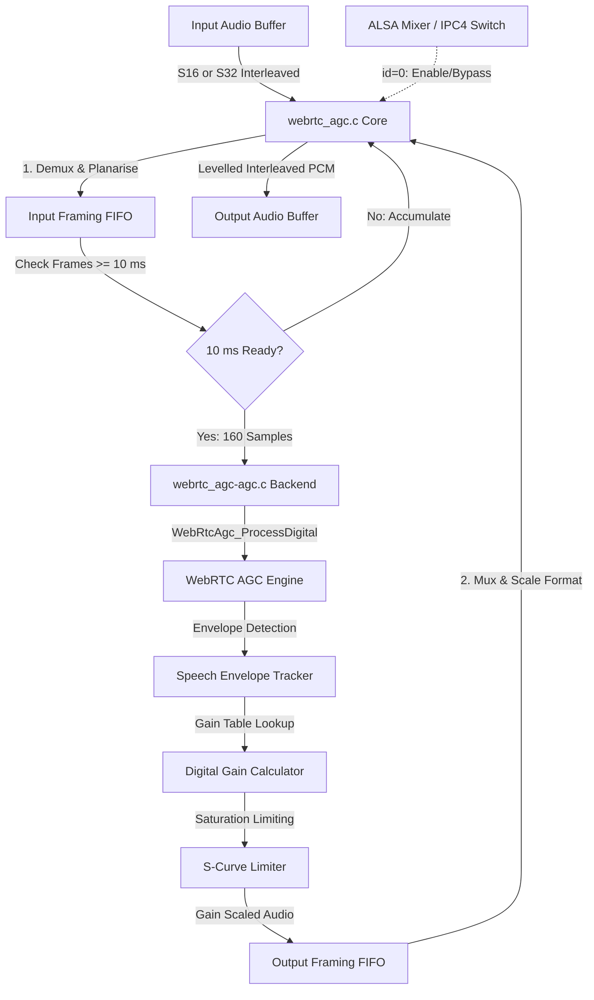

# WebRTC Automatic Gain Control Module (`webrtc_agc`)

Wraps WebRTC's digital Automatic Gain Control (`digital_agc.c`) behind the SOF `module_interface`. Dynamically adjusts audio signal levels to maintain speech at an optimal, comfortable listening volume while preventing digital clipping.

---

## Features

- **Adaptive Speech Leveling**: Analyzes short-term speech envelope and applies dynamic digital gain to boost quiet talkers without amplifying background stationary noise.
- **Integrated Saturation Limiter**: S-curve saturation limiter with fast lookahead attack and smooth release decay, guaranteeing zero digital overs.
- **Framing FIFO Engine**: Transparently decouples pipeline period sizes (e.g., 1 ms, 2 ms, or 5 ms) by buffering streaming audio into standard 10 ms WebRTC analysis frames (160 samples @ 16 kHz, 80 samples @ 8 kHz).
- **Pure Fixed-Point Implementation**: Pure integer Q15/Q31 arithmetic with zero floating-point unit dependencies (`CONFIG_FPU=n`).
- **ALSA IPC4 Switch Control**: Runtime bypass/enable toggling via standard ALSA mixer controls (`SOF_IPC4_SWITCH_CONTROL_PARAM_ID`).
- **Multichannel Support**: Accommodates up to 4 audio channels with per-channel state instances.

---

## Architecture & Data Flow



### Components

- `webrtc_agc.c`: Module lifecycle management (`init`, `prepare`, `process`, `free`), IPC4 switch parameter handler, and format translation.
- `webrtc_agc-agc.c`: Backend interface calling `WebRtcAgc_InitDigital`, `WebRtcAgc_CalculateGainTable`, and `WebRtcAgc_ProcessDigital`.
- `webrtc_agc-stub.c`: Dependency-free pass-through stub for staging validation.
- `webrtc_agc.h`: Module state struct (`webrtc_agc_comp_data`), FIFO definitions, and backend function prototypes.

---

## Build Configuration

### 1. Real WebRTC AGC Integration

```ini
CONFIG_COMP_WEBRTC_AGC=y      # or =m for LLEXT
CONFIG_COMP_WEBRTC_AGC_STUB=n
CONFIG_WEBRTC_AGC_TARGET_DBFS=3
CONFIG_WEBRTC_AGC_COMPRESSION_GAIN_DB=9
CONFIG_WEBRTC_AGC_LIMITER=y
```

### 2. Pass-Through Stub (CI / Staging)

```ini
CONFIG_COMP_WEBRTC_AGC=y
CONFIG_COMP_WEBRTC_AGC_STUB=y
```

---

## Kconfig Parameters

| Option | Default | Type / Range | Description |
|---|---|---|---|
| `CONFIG_COMP_WEBRTC_AGC` | n | tristate (`y`/`m`/`n`) | Enable WebRTC AGC module |
| `CONFIG_COMP_WEBRTC_AGC_STUB` | y | bool | Build pass-through stub |
| `CONFIG_WEBRTC_AGC_TARGET_DBFS` | 3 | int (`1` - `31`) | Target speech level in -dBFS (3 = -3 dBFS) |
| `CONFIG_WEBRTC_AGC_COMPRESSION_GAIN_DB` | 9 | int (`0` - `90`) | Maximum digital compression gain in dB |
| `CONFIG_WEBRTC_AGC_LIMITER` | y | bool | Enable saturation limiter stage |
| `CONFIG_WEBRTC_AGC_CHANNELS_MAX` | 4 | int (`1` - `8`) | Maximum supported channels |

---

## Usage & Topology

### Pipeline Routing

Insert `webrtc-agc` downstream of acoustic echo cancellation (`webrtc-aec`) and noise suppression (`webrtc-ns`), immediately prior to the host recording sink:

```
[ Mic DAI Copier ] ---> [ webrtc-aec ] ---> [ webrtc-ns ] ---> [ webrtc-agc ] ---> [ Host Copier ]
```

### Topology 2 Code Snippet

```alsa
Object.Widget.webrtc-agc.1 {
    # Unique module configuration
    Object.Base.input_pin_binding.1 {
        input_pin_binding_name "webrtc-ns.1"
    }
    Object.Base.output_pin_binding.1 {
        output_pin_binding_name "host-copier.0"
    }
}
```

### ALSA Mixer Controls

| Control Name | Type | Value Range | Function |
|---|---|---|---|
| `WebRTC AGC Switch` | Boolean | `0` (Off) / `1` (On) | Enable or bypass automatic gain control processing |

---

## Performance & MCPS Profile (Aphid / Panther Lake ACE 3.0)

Evaluated on Panther Lake (`intel_ace30_ptl`) Aphid hardware at **400 MHz** core clock:

| Codec / Module | Implementation | Stream Profile | MCPS (Aphid) | DSP Core Load (@ 400 MHz) |
|---|---|---|:---:|:---:|
| **WebRTC AGC** (`webrtc_agc`) | Q15/Q31 adaptive digital gain table | 16 kHz Mono (10 ms) | **~1.2 – 1.6 MCPS** | **< 0.4%** |
| **WebRTC AGC** (`webrtc_agc`) | Q15/Q31 adaptive digital gain table | 16 kHz Stereo (10 ms) | **~2.2 – 3.1 MCPS** | **< 0.8%** |

### Computational Characteristics

- **Zero Dynamic Allocations**: Streaming memory allocated statically during initialization.
- **Fixed-Point Arithmetic**: Single-cycle 32x16 and 32x32 integer multiply-accumulate instructions (`mulsh`, `madd`).
- **Memory Footprint**: ~3.2 KB per active audio channel (includes 160-sample FIFO ring buffers and gain table state).
