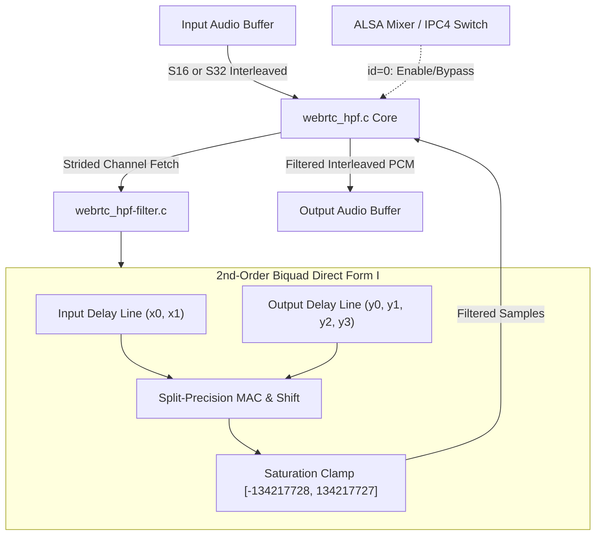

# WebRTC High-Pass Filter Module (`webrtc_hpf`)

Wraps WebRTC's cascaded 2nd-order biquad High-Pass Filter (HPF) behind the SOF `module_interface`. Eliminates DC bias, mechanical handling noise, wind rumble, and low-frequency electrical hum from microphone capture streams prior to speech processing.

---

## Features

- **DC & Rumble Rejection**: Sharp 2nd-order high-pass cutoff (80 Hz at 8 kHz sample rate; 100 Hz at 16 kHz sample rate) removing non-acoustic low-frequency energy.
- **Zero Lookahead Latency**: Operates sample-by-sample in-place without framing FIFOs or pipeline buffering latency.
- **Dual Format Support**: Natively processes both `S16_LE` and `S32_LE` PCM audio streams.
- **Split-Accumulator High-Precision Math**: Utilizes split-word integer math (13-bit primary shift and 2-bit fractional remainder) to achieve 24-bit equivalent filtering accuracy on 16-bit registers without 64-bit division.
- **Pure Fixed-Point Integer**: Requires zero floating-point support (`CONFIG_FPU=n`), consuming negligible DSP power.
- **ALSA IPC4 Switch Control**: Supports runtime bypass/enable toggling via standard ALSA mixer controls.
- **Minimal Memory Footprint**: Requires only 16 bytes of state (`y[4]`, `x[2]`) per channel.

---

## Mathematical Formulation

The module evaluates a Direct Form I cascaded biquad difference equation:

$$y[n] = b_0 x[n] + b_1 x[n-1] + b_2 x[n-2] - a_1 y[n-1] - a_2 y[n-2]$$

### Fixed-Point Coefficient Tables

Filter coefficients are represented in Q12/Q13 fixed-point format:

| Sample Rate | $b_0$ | $b_1$ | $b_2$ | $a_1$ | $a_2$ |
|---|:---:|:---:|:---:|:---:|:---:|
| **8000 Hz** (Cutoff ~80 Hz) | `+3798` | `-7596` | `+3798` | `+7807` | `-3733` |
| **16000 Hz** (Cutoff ~100 Hz) | `+4012` | `-8024` | `+4012` | `+8002` | `-3913` |

### Overflow & Saturation Protection

The accumulated response is clamped to 28-bit signed range before shifting:

$$\text{tmp} = \text{clamp}(\text{tmp} + 2048, -134217728, 134217727)$$

$$y[n] = \text{sat16}(\text{tmp} \gg 12)$$

---

## Architecture & Data Flow



### Components

- `webrtc_hpf.c`: Core SOF wrapper handling module initialization, configuration parameters, stream format parsing, and IPC4 commands.
- `webrtc_hpf-filter.c`: Real fixed-point biquad implementation with split-word accumulator loops for S16 and S32.
- `webrtc_hpf-stub.c`: Zero-overhead pass-through stub for testing.
- `webrtc_hpf.h`: State struct (`webrtc_hpf_comp_data`, `webrtc_hpf_state`), function declarations, and constants.

---

## Build Configuration

### 1. Real WebRTC HPF Filter

```ini
CONFIG_COMP_WEBRTC_HPF=y      # or =m for LLEXT
CONFIG_COMP_WEBRTC_HPF_STUB=n
CONFIG_WEBRTC_HPF_CHANNELS_MAX=4
```

### 2. Pass-Through Stub (CI / Staging)

```ini
CONFIG_COMP_WEBRTC_HPF=y
CONFIG_COMP_WEBRTC_HPF_STUB=y
```

---

## Kconfig Parameters

| Option | Default | Type / Range | Description |
|---|---|---|---|
| `CONFIG_COMP_WEBRTC_HPF` | n | tristate (`y`/`m`/`n`) | Enable WebRTC High-Pass Filter module |
| `CONFIG_COMP_WEBRTC_HPF_STUB` | y | bool | Build pass-through stub |
| `CONFIG_WEBRTC_HPF_CHANNELS_MAX` | 4 | int (`1` - `8`) | Maximum supported channels |

---

## Usage & Topology

### Pipeline Routing

Position `webrtc-hpf` as the very first widget immediately after the Microphone DAI copier to strip DC offset before nonlinear processors (AEC, VAD, NS):

```
[ Mic DAI Copier ] ---> [ webrtc-hpf ] ---> [ webrtc-aec ] ---> [ webrtc-ns ] ---> [ Host Copier ]
```

### Topology 2 Code Snippet

```alsa
Object.Widget.webrtc-hpf.1 {
    Object.Base.input_pin_binding.1 {
        input_pin_binding_name "dai-copier.SSP.NoCodec-0.capture"
    }
    Object.Base.output_pin_binding.1 {
        output_pin_binding_name "webrtc-aec.1"
    }
}
```

### ALSA Mixer Controls

| Control Name | Type | Value Range | Function |
|---|---|---|---|
| `WebRTC HPF Switch` | Boolean | `0` (Off) / `1` (On) | Enable or bypass high-pass filtering |

---

## Performance & MCPS Profile (Aphid / Panther Lake ACE 3.0)

Evaluated on Panther Lake (`intel_ace30_ptl`) Aphid hardware at **400 MHz** core clock:

| Codec / Module | Implementation | Stream Profile | MCPS (Aphid) | DSP Core Load (@ 400 MHz) |
|---|---|---|:---:|:---:|
| **WebRTC HPF** (`webrtc_hpf`) | Direct Form I split-accumulator biquad | 16 kHz Mono | **~0.22 – 0.28 MCPS** | **< 0.07%** |
| **WebRTC HPF** (`webrtc_hpf`) | Direct Form I split-accumulator biquad | 16 kHz Stereo | **~0.44 – 0.55 MCPS** | **< 0.14%** |

### Characteristics

- **Compute**: Under 18 clock cycles per audio sample.
- **Memory**: 16 bytes of state RAM per audio channel.
- **Reliability**: Clamped saturation logic prevents digital overflow under DC step impulses.
