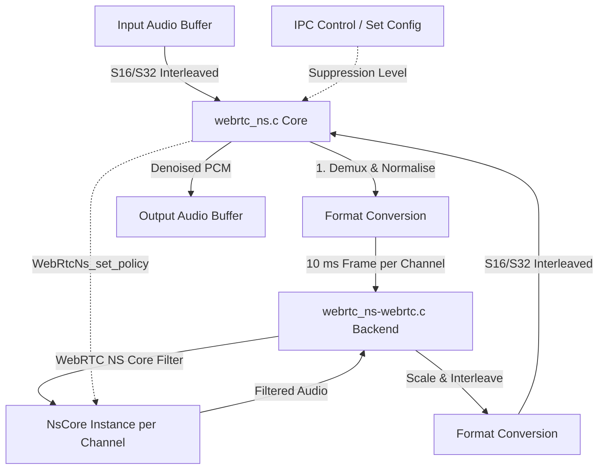

# WebRTC Noise Suppression Module (`webrtc_ns`)

Wraps the classic fixed-point WebRTC Noise Suppression (NS) algorithm (spectral Wiener filter) from [webrtc-audio-processing](https://gitlab.freedesktop.org/gstreamer/webrtc-audio-processing) behind the SOF `module_interface`.

---

## Features

- **Wiener Filter Suppression**: Fixed-point spectral subtraction to isolate stationary noise.
- **Low Complexity**: Highly optimized for low-power embedded DSPs; requires no FPU.
- **Multiple Modes**: Supports four levels of suppression (Mild, Medium, Aggressive, Very Aggressive).
- **Per-Channel Processing**: Allocates one NS instance per audio channel, processing them independently.
- **8 kHz and 16 kHz Support**: Natively supports 8 kHz and 16 kHz sample rates (requires resampling upstream if running at higher rates).
- **Frame Size**: Operates on 10 ms audio frames (80 samples at 8 kHz, 160 samples at 16 kHz).

---

## Architecture & Data Flow

The following Mermaid diagram outlines the internal architecture of the `webrtc_ns` module:



### Components
- `webrtc_ns.c`: Core SOF wrapper logic, handling format parsing, period buffering, and interleaved-to-planar copying.
- `webrtc_ns-webrtc.c`: Integration backend interfacing directly with the WebRTC NS codebase.
- `webrtc_ns-stub.c`: Standard pass-through stub for testing.
- `webrtc_ns-shims.c`: Platform-specific macros and memory mapping layers.
- `webrtc_ns.cmake`: Downloads and extracts the `webrtc-audio-processing` 0.3.1 source and compiles the necessary C files.

---

## Build Instructions

### 1. Stub Mode (CI / Staging)
```ini
CONFIG_COMP_WEBRTC_NS=y      # or =m for LLEXT
CONFIG_COMP_WEBRTC_NS_STUB=y
```

### 2. Real NS Integration
Pulls the classic WebRTC codebase via West and builds the fixed-point Wiener filter:
```ini
CONFIG_COMP_WEBRTC_NS=m
CONFIG_COMP_WEBRTC_NS_STUB=n
```
*Note: Make sure to run `west update` to retrieve `modules/audio/webrtc-apm` before compiling.*

---

## Kconfig Parameters

| Option | Default | Range / Value | Description |
|---|---|---|---|
| `CONFIG_COMP_WEBRTC_NS` | n | y / m / n | Enable WebRTC Noise Suppressor |
| `CONFIG_COMP_WEBRTC_NS_STUB` | y | y / n | Use pass-through stub |
| `CONFIG_WEBRTC_NS_POLICY` | 2 | 0 - 3 | Severity (0: Mild, 3: Very Aggressive) |
| `CONFIG_WEBRTC_NS_CHANNELS_MAX` | 2 | 1 - 8 | Maximum channels supported |

---

## Usage & Topology

### Pipeline Integration
The module is integrated as a normal 1-in / 1-out effect widget. It should be run in a pipeline configured for either **8000 Hz** or **16000 Hz**.

#### Example Topology Pipeline
```
DAI Copier (SSP RX) ---> [ webrtc-ns ] ---> Host Copier (PCM)
```

For applications requiring higher rates (e.g. 48 kHz mic capture), place an ASRC component upstream to downsample to 16 kHz before running the `webrtc-ns` widget.
