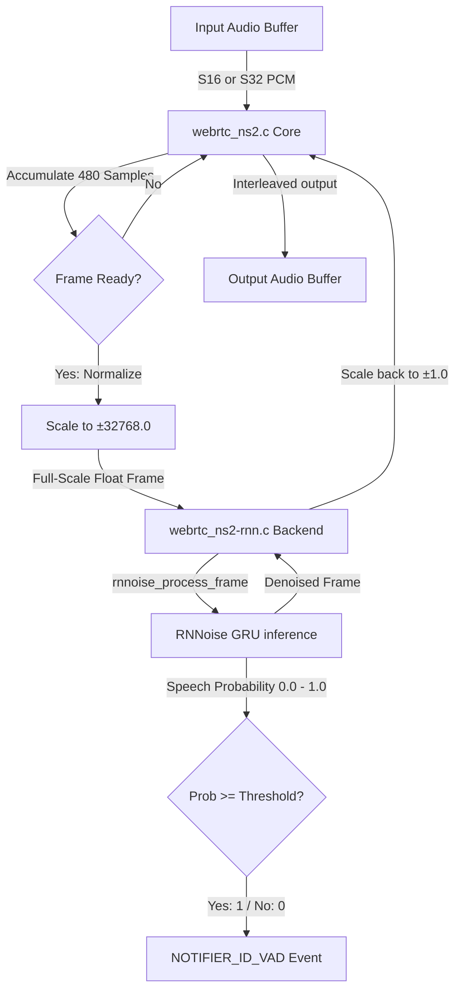

# WebRTC Noise Suppression 2 Module (`webrtc_ns2` / RNNoise)

Wraps Xiph's [RNNoise](https://github.com/xiph/rnnoise) — a recurrent neural network (RNN/GRU) based noise suppression algorithm — behind the SOF `module_interface`.

---

## Features

- **Deep Learning Suppression**: Uses a hybrid DSP + deep recurrent neural network structure (GRU) for suppressing non-stationary noise (such as keyboard clicks, speech babble, or music).
- **VAD Output**: Calculates speech probability per frame and broadcasts binary voice activity events via `NOTIFIER_ID_VAD`.
- **Locked Rate (48 kHz)**: Runs exclusively at **48000 Hz** (requires an ASRC upstream if the DAI runs at another rate).
- **10 ms Process Window**: Accumulates pipeline periods to process complete 480-sample mono frames.
- **Float Scaled**: normalizes standard SOF float pipelines to the internal full-scale float representation ($\pm 32768.0$) used during training.
- **Low Memory / Fast Math**: Employs a 201-entry lookup table for sigmoid and tanh functions; eliminates hot-path `expf` calls.

---

## Architecture & Data Flow

The following Mermaid diagram outlines the data normalization, period accumulator, and deep-learning inference flow inside the module:



### Components
- `webrtc_ns2.c`: Handles format conversions, period packing, and the VAD event notifier.
- `webrtc_ns2-rnn.c`: Real RNNoise library integration backend.
- `webrtc_ns2-stub.c`: Pass-through stub that always outputs `1.0` VAD probability.
- `webrtc_ns2.cmake`: Controls downloading the `rnnoise` Git repository and building its files.

---

## Build Instructions

### 1. Stub Mode (CI / Staging)
```ini
CONFIG_COMP_WEBRTC_NS2=y      # or =m for LLEXT
CONFIG_COMP_WEBRTC_NS2_STUB=y
```

### 2. Real RNNoise Integration
Cross-compiles the neural networks:
```ini
CONFIG_COMP_WEBRTC_NS2=m
CONFIG_COMP_WEBRTC_NS2_STUB=n
```
Requires `west update` to retrieve `modules/audio/rnnoise` (SHA `70f1d256`).

*Important: The target DSP board must support floating-point compilation. Although a hardware FPU is not strictly mandatory, software-float emulation will impose a severe CPU bottleneck.*

---

## Kconfig Parameters

| Option | Default | Range / Value | Description |
|---|---|---|---|
| `CONFIG_COMP_WEBRTC_NS2` | n | y / m / n | Enable RNNoise module |
| `CONFIG_COMP_WEBRTC_NS2_STUB` | y | y / n | Use pass-through stub |
| `CONFIG_WEBRTC_NS2_CHANNELS_MAX` | 2 | 1 - 8 | Maximum channels supported |
| `CONFIG_WEBRTC_NS2_VAD_NOTIFY` | y | y / n | Emit NOTIFIER_ID_VAD events |
| `CONFIG_WEBRTC_NS2_VAD_THRESHOLD_PCT` | 50 | 0 - 100 | VAD speech threshold percentage |

---

## Usage & Topology

### Pipeline Integration
The module is integrated as a normal 1-in / 1-out effect widget. **The sample rate must be exactly 48000 Hz**.

#### Example Topology Route
```
DAI Copier (SSP RX @ 48kHz) ---> [ webrtc-ns2 ] ---> Host Copier (PCM @ 48kHz)
```

If the capture microphone or stream runs at 16 kHz, you must insert an ASRC widget upstream of `webrtc-ns2` to upsample the stream to 48 kHz before processing.
