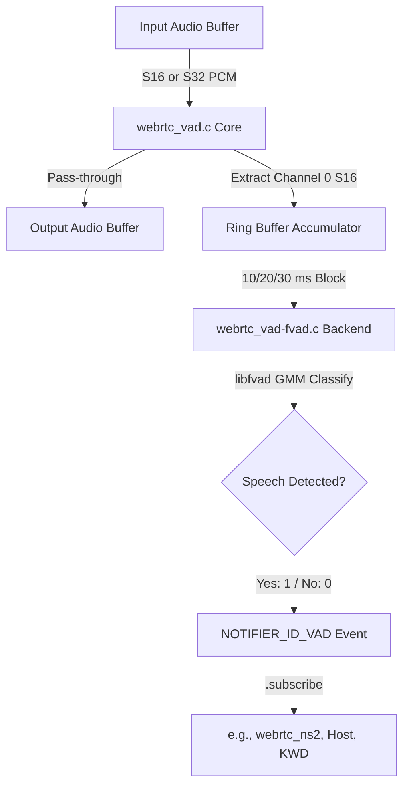

# WebRTC Voice Activity Detection Module (`webrtc_vad`)

Wraps [libfvad](https://github.com/dpirch/libfvad) — a standalone, pure-C, BSD-3 licensed extraction of the WebRTC GMM Voice Activity Detection algorithm — behind the SOF `module_interface`.

---

## Features

- **GMM Classifier**: Uses Gaussian Mixture Models (GMM) for robust speech vs. noise classification.
- **Pass-through Data Flow**: Does not modify PCM audio; passes it through untouched.
- **Notifier Integration**: Broadcasts binary speech/silence decisions (`1` or `0`) via SOF's `NOTIFIER_ID_VAD` event channel.
- **Low Power & Fixed-Point**: Operates entirely in Q15 fixed-point; requires no floating-point hardware (FPU).
- **Flexible Frame Sizes**: Supports 10 ms, 20 ms, and 30 ms classification frame windows.
- **Multichannel Support**: Classifies channel-0 and copies remaining channels.
- **LLEXT Packaging**: Full support for loading as a shared library module.

---

## Architecture & Data Flow

The following Mermaid diagram outlines how audio data flows through the pipeline and how the classification events are broadcast to other modules:



### Components
- `webrtc_vad.c`: SOF module interface glue (handles pipeline buffers and state transitions).
- `webrtc_vad-fvad.c`: Standard libfvad execution backend.
- `webrtc_vad-stub.c`: Pass-through stub that always reports `1` (speech) to satisfy CI validation.
- `webrtc_vad-shims.c`: Cross-compilation memory wrapper mappings.
- `webrtc_vad.cmake`: External build driving the download and build of the `libfvad` library.

---

## Build Instructions

### 1. Stub Mode (CI / Staging)
Building without external repository dependencies:
```ini
CONFIG_COMP_WEBRTC_VAD=y      # or =m for LLEXT
CONFIG_COMP_WEBRTC_VAD_STUB=y
```

### 2. Real VAD Integration
Pulls `libfvad` automatically via West and compiles the full GMM detector:
```ini
CONFIG_COMP_WEBRTC_VAD=m
CONFIG_COMP_WEBRTC_VAD_STUB=n
```
Ensure you run `west update` after updating `west.yml` to retrieve `modules/audio/libfvad`.

---

## Kconfig Parameters

| Option | Default | Range / Value | Description |
|---|---|---|---|
| `CONFIG_COMP_WEBRTC_VAD` | n | y / m / n | Enable WebRTC GMM VAD module |
| `CONFIG_COMP_WEBRTC_VAD_STUB` | y | y / n | Use pass-through stub |
| `CONFIG_WEBRTC_VAD_MODE` | 2 | 0 - 3 | Aggressiveness (3 = most restrictive) |
| `CONFIG_WEBRTC_VAD_FRAME_MS` | 10 | 10, 20, 30 | Window size for classification (ms) |

---

## Usage & Topology

### Pipeline Integration
The module functions as a simple 1-in / 1-out effect widget. Connect it directly in your capture stream path.

#### Example Topology Route
```
DAI Copier (Mic) ---> [ webrtc-vad ] ---> [ webrtc-ns ] ---> Host Copier
```

In this routing model, `webrtc-vad` runs first. Any downstream module or host application subscribing to the `NOTIFIER_ID_VAD` event will receive real-time classification changes instantly without querying the module adapter.
