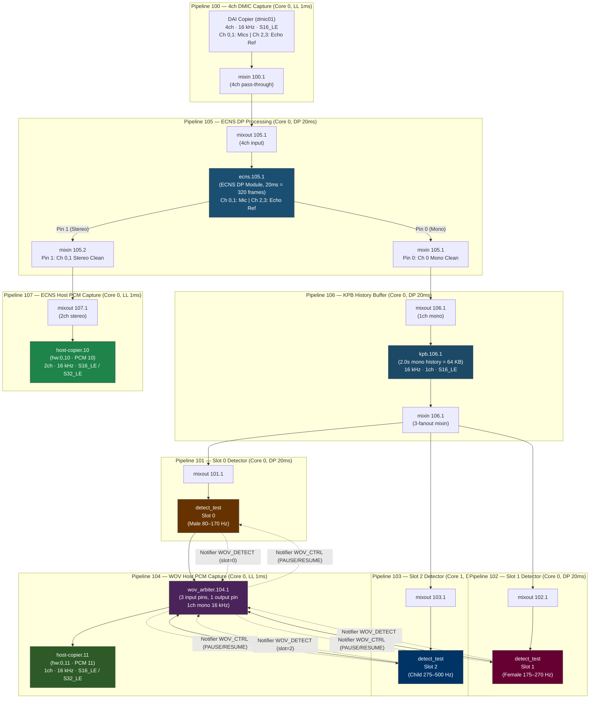
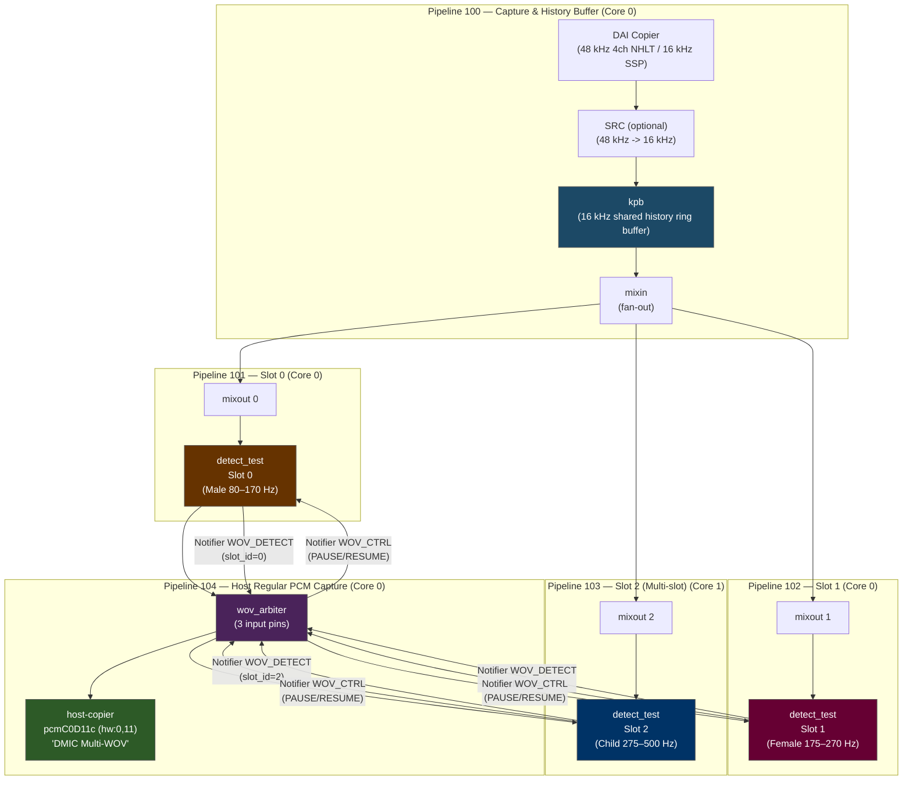
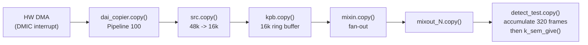
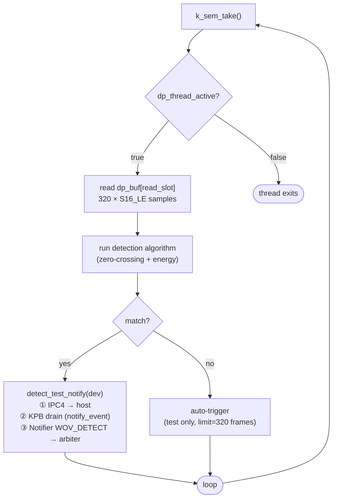
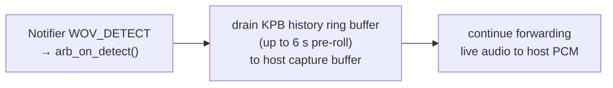
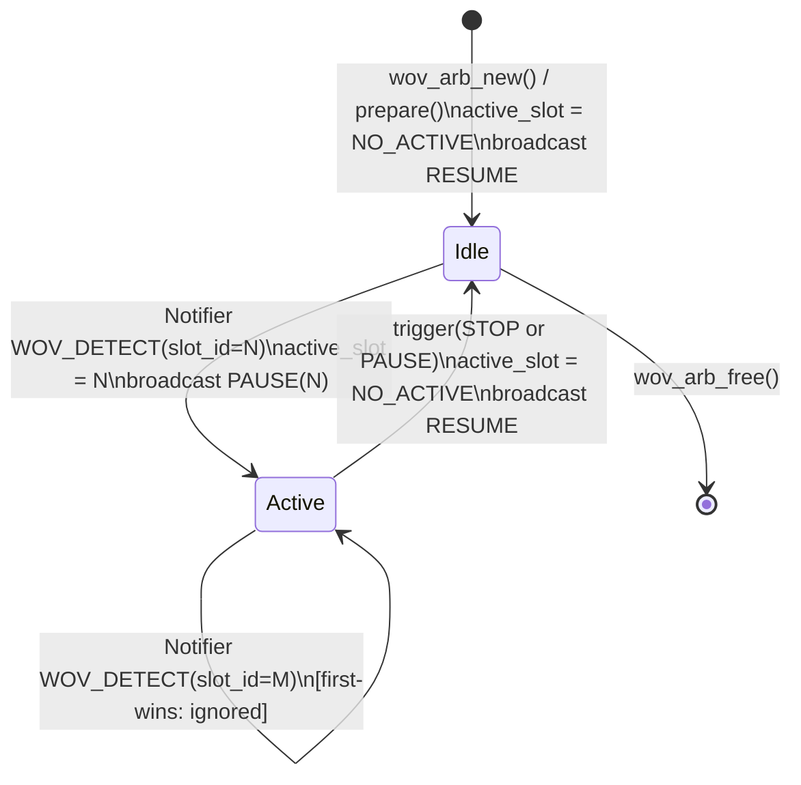

# Multi-Slot Wake-On-Voice (WOV) Architecture & Arbitration

## Overview

The Multi-Slot WOV subsystem lets a single DMIC feed concurrent keyword detectors
running on the DSP. Audio is captured directly over a standard ALSA PCM capture device
(`hw:0,11`, 16 kHz, 2-channel, S16_LE / S32_LE).

Audio stream capture and device verification are executed using direct Linux ALSA UAPI ioctls
(`tools/wov_capture/wov_capture_app`) or standard ALSA tools (`arecord`).

---

## Table of Contents

1. [System Architecture](#system-architecture)
2. [Signal Processing Flow](#signal-processing-flow)
3. [Arbiter State Machine](#arbiter-state-machine)
4. [Pipeline State Transitions & Re-Arm Cycle](#pipeline-state-transitions--re-arm-cycle)
5. [SOF Notifier Inter-Module Signaling](#sof-notifier-inter-module-signaling)
6. [Firmware API Reference](#firmware-api-reference)
7. [Linux Host API Reference](#linux-host-api-reference)
8. [Adding a New WOV Algorithm](#adding-a-new-wov-algorithm)
9. [Topology: Build and Deploy](#topology-build-and-deploy)
10. [Build System Configuration](#build-system-configuration)
11. [Testing and Verification](#testing-and-verification)

---

## System Architecture

The Multi-Slot WOV subsystem supports two primary topology architectures:
1. **4-Channel Native 16 kHz DMIC with ECNS & Multi-Slot WOV** (PTL, TGL, WCL 4ch native manifests).
2. **2-Channel DMIC / SSP Direct Multi-Slot WOV** (2ch manifests).

---

### Architecture A: 4-Channel Native 16 kHz DMIC with ECNS & Multi-Slot WOV

In this architecture, a 4-channel 16 kHz DMIC stream (Channels 0, 1 = physical microphones; Channels 2, 3 = echo reference) feeds the **ECNS DP module** running at a 20 ms period (320 samples). The ECNS module outputs:
- **Pin 0 (mono clean mic)**: routes to KPB (2.0s history depth = 64 KB mono buffer), then fans out via mixin to 3 concurrent WOV detector slots. Upon keyword detection, the WOV arbiter routes the active slot audio (pre-roll + live) to ALSA PCM 11 (`hw:0,11`).
- **Pin 1 (stereo clean mic)**: routes via a host mixin/mixout bridge to Host Copier 10 (ALSA PCM 10, `hw:0,10`, stereo 16 kHz).



#### 4-Channel Architecture Specifications

| Property | ECNS Stream (PCM 10) | WOV Stream (PCM 11) |
|---|---|---|
| ALSA Device | `hw:0,10` (`pcmC0D10c`) | `hw:0,11` (`pcmC0D11c`) |
| Sample Rate | 16 kHz | 16 kHz |
| Channels | 2 (Stereo clean mic) | 1 (Mono clean mic) |
| Sample Format | S16_LE / S32_LE | S16_LE / S32_LE |
| History / Pre-roll | Live streaming | 2.0 s (64 KB mono buffer in KPB) |
| Scheduling | Core 0 (LL 1ms) | Core 0 (LL 1ms arbiter + DP 20ms KPB) |
| Processing Source | ECNS Pin 1 | ECNS Pin 0 via KPB & WOV Arbiter |

---

### Architecture B: 2-Channel Direct DMIC / SSP Multi-Slot WOV

For 2-channel capture topologies (`dmic-wov-multi-manifest.conf`, `sspX-wov-multi-manifest.conf`):



#### 2-Channel Architecture Specifications

| Property | Value |
|---|---|
| Audio format | 16 kHz · 2ch · S16_LE / S32_LE |
| KPB pre-roll (TigerLake) | 6 000 ms (192 000 bytes) |
| KPB pre-roll (other) | 2 100 ms |
| Max arbiter slots | 3 (topology), 8 (header constant) |
| Arbitration policy | First-wins; subsequent detections ignored until RESUME |
| Slot 2 core affinity | DSP Core 1 (cross-core scheduling validation) |
| Host capture device | card 0, device 11 — `hw:0,11` / `pcmC0D11c` (ALSA PCM) |
| Audio Delivery | Standard ALSA PCM capture stream (16 kHz, 2-channel, 16-bit / 32-bit) |
| D0i3 / S0iX | Supported — `capture_compatible_d0i3 1` on host-copier and PCM widget |

---

## Signal Processing Flow

### LL Thread Path (every 1 ms)



### DP Thread Path (every 20 ms per slot)

Each slot has its own `k_thread` at `K_PRIO_PREEMPT(12)` executing batch processing.



### KPB Drain Sequence (triggered by Notifier)



---

## Arbiter State Machine



### `wov_arb_copy()` Routing Logic

| Condition | Active slot buffer | Idle slot buffers | Sink output |
|---|---|---|---|
| `active_slot == NO_ACTIVE` | — | drained and discarded | filled with silence (memset 0) |
| `active_slot == N` | copied frame-aligned to sink | drained and discarded | pre-roll + live audio |

The first-wins guard in `arb_on_detect()`:

```c
if (cd->active_slot != WOV_ARB_NO_ACTIVE) {
    comp_warn(dev, "wov_arb: slot %u fired but slot %u already active, ignoring",
              det->slot_id, cd->active_slot);
    return;
}
```

---

## Pipeline State Transitions & Re-Arm Cycle

### Usage Flow (PCM Capture Stream Lifecycle)

The PCM capture stream can be opened at startup or on-demand:

```text
Host                        Kernel / ASoC               Firmware
────                        ─────────────               ────────
open pcmC0D11c          ──► SET_PIPELINE_STATE(RUNNING) ──► KPBs: KPB_STATE_BUFFERING (filling history)
                                                              detect_tests: dp_thread running, listening

─────────────────────── Listening / Capture ───────────────────────────
arecord / wov_capture_app captures frames at 16 kHz 2-channel from hw:0,11
```

### State Transition Summary

| State | Transition | Trigger | PCM Capture device |
|---|---|---|---|
| Listening → Active | WOV_DETECT | detect_test fires | Stays OPEN |
| Active → Listening | STOP/PAUSE | host or driver closes/re-arms | Stays OPEN (re-armed) |
| Any → closed | close() | host exits | Closed |

---

## SOF Notifier Inter-Module Signaling

The SOF Notifier system (`src/include/sof/lib/notifier.h`) is SOF's intra-DSP
publish/subscribe bus.  It works on all platforms (no `CONFIG_AMS` required) and
is already used for KPB client events.  Signals are delivered synchronously to
all registered listeners on the calling core.

### Signal Catalog

| Notifier ID | Direction | Payload struct | Purpose |
|---|---|---|---|
| `NOTIFIER_ID_WOV_DETECT` | detector → arbiter | `struct wov_detect_notif { uint8_t slot_id; }` | Announce keyword detection |
| `NOTIFIER_ID_WOV_CTRL` | arbiter → all detectors | `struct wov_ctrl_notif { uint8_t cmd; }` | Pause/resume detectors |

`cmd` values: `WOV_ARB_CMD_PAUSE`, `WOV_ARB_CMD_RESUME` (defined in `wov_arbiter.h`).

### Full Detect-to-Drain Sequence


---

## Firmware API Reference

### IPC4 Module Parameters (`LARGE_CONFIG_SET`)

#### `detect_test` — automatic slot assignment via pipeline ID

Each `detect_test` instance is automatically assigned its slot ID in `test_keyword_new()`
based on its pipeline ID:

| Pipeline ID | Target module | Core | Assigned Slot |
|---|---|---|---|
| 101 | `wov.101.1` | Core 0 | Slot 0 |
| 102 | `wov.102.1` | Core 0 | Slot 1 |
| 103 | `wov.103.1` | Core 1 | Slot 2 |

No user-space initialization kcontrols are required.

#### `wov_arbiter` — active slot status via `wov_active_slot` enum kcontrol

The `wov_arbiter` instance exposes a volatile read-only ALSA enum kcontrol named `wov_active_slot`
that reports the current arbitration and keyword detection state:

| Enum Index | Item Name | Meaning |
|---|---|---|
| `0` | `Listening` | No keyword detected / idle / listening |
| `1` | `Slot 1` | Slot 0 (Pipeline 101 / `wov.101.1`) triggered and active |
| `2` | `Slot 2` | Slot 1 (Pipeline 102 / `wov.102.1`) triggered and active |
| `3` | `Slot 3` | Slot 2 (Pipeline 103 / `wov.103.1`) triggered and active |

When a keyword detector fires, the arbiter updates `cd->active_slot` and automatically sends an
ALSA control change notification (`SOF_IPC4_MODULE_NOTIFICATION` with `SOF_IPC4_ENUM_CONTROL_PARAM_ID`)
to notify the kernel / ALSA mixer of the state transition. When the capture stream is stopped or reset,
the arbiter transitions back to `Listening` (`0`) and sends a notification.

Query the control from userspace:

```bash
amixer -c 0 cget name='wov_active_slot'
```

#### `detect_test` — per-slot mute via `wov_mute_1NN` switch kcontrol

Each `detect_test` instance also exposes a boolean switch kcontrol that gates
detection at runtime without tearing down the pipeline.

| ALSA kcontrol name | numid (TGL) | Default | Effect when set |
|---|---|---|---|
| `wov_mute_101` | 13 | `off` | `off` = muted (no detection), `on` = detection active |
| `wov_mute_102` | 16 | `off` | `off` = muted (no detection), `on` = detection active |
| `wov_mute_103` | 19 | `off` | `off` = muted (no detection), `on` = detection active |

The default at pipeline open is `off` (muted). Userspace must explicitly write `on`
to arm a slot. When muted, `test_keyword_copy` drains the source buffer and returns
without running the detection algorithm, keeping the LL scheduler running at zero
detection cost. When re-enabled, detection resumes immediately on the next LL tick.

Wire format: `LARGE_CONFIG_SET` with `PARAM_ID = 200`
(`SOF_IPC4_SWITCH_CONTROL_PARAM_ID`), payload
`struct sof_ipc4_control_msg_payload { .id=0, .num_elems=1, .chanv[0].value=0|1 }`.

```bash
# Arm slot 1 for detection (numid=16 = wov_mute_102)
amixer -c 0 cset numid=16 on

# Mute slot 1 again
amixer -c 0 cset numid=16 off
```

#### `detect_test` — momentary test trigger via `wov_test_1NN` switch kcontrol

Each `detect_test` instance exposes a momentary boolean switch kcontrol that forces an
immediate keyword detection trigger on the slot.

| ALSA kcontrol name | numid (TGL) | Default | Effect when set |
|---|---|---|---|
| `wov_test_101` | 14 | `off` | Write `on` to trigger detection for slot 0; auto-resets to `off` |
| `wov_test_102` | 17 | `off` | Write `on` to trigger detection for slot 1; auto-resets to `off` |
| `wov_test_103` | 20 | `off` | Write `on` to trigger detection for slot 2; auto-resets to `off` |

Wire format: `LARGE_CONFIG_SET` with `PARAM_ID = 200` (`SOF_IPC4_SWITCH_CONTROL_PARAM_ID`),
payload `struct sof_ipc4_control_msg_payload { .id=1, .num_elems=1, .chanv[0].value=1 }`.

When `wov_test_1NN` receives a write of value `1`:
1. The firmware logs `kd_test: TEST SWITCH TRIGGER for slot N!`.
2. It sets `cd->detected = 1` and calls `detect_test_notify(dev)` to trigger KPB history buffer drain and notify the WOV arbiter.
3. The firmware sends an IPC4 module notification (`SOF_IPC4_MODULE_NOTIFICATION` with `SOF_IPC4_NOTIFY_MODULE_EVENTID_ALSA_MAGIC_VAL | SOF_IPC4_SWITCH_CONTROL_PARAM_ID`) to reset the ALSA mixer switch value back to `0` (`off`) on the host.

```bash
# Trigger detection on slot 0 (numid=14 = wov_test_101)
amixer -c 0 cset numid=14 on

# Trigger detection on slot 1 (numid=17 = wov_test_102)
amixer -c 0 cset numid=17 on

# Trigger detection on slot 2 (numid=20 = wov_test_103)
amixer -c 0 cset numid=20 on
```


### `wov_arbiter` — slot count from `nb_input_pins`

The arbiter reads the number of active slots from `ipc4_base_module_cfg_ext.nb_input_pins`
(set in `wov-arbiter.conf` via `num_input_pins = 3`).

### Notifier Registration

A WOV detector must register for `WOV_CTRL` notifications during `prepare()`:

```c
notifier_register(dev, NULL, NOTIFIER_ID_WOV_CTRL, on_wov_ctrl, 0);
```

Unregister in `free()`:

```c
notifier_unregister(dev, NULL, NOTIFIER_ID_WOV_CTRL);
```

### `detect_test_notify(dev)` — Detection Announcement

Call this from your detection algorithm when a keyword is confirmed:

```c
void detect_test_notify(const struct comp_dev *dev);
```

Internally executes three steps:
1. Sends `SOF_IPC4_NOTIFY_PHRASE_DETECTED` IPC4 notification to host
2. Sends `kpb_client` notifier event to KPB → triggers pre-roll drain on `host_sink`
3. Fires `notifier_event(NOTIFIER_ID_WOV_DETECT)` → `wov_arbiter.arb_on_detect()` activates this slot

### DP Thread Ping-Pong Buffer Contract

| Field | Type | Semantics |
|---|---|---|
| `dp_buf[2][320]` | `int16_t` | ping-pong accumulation buffer |
| `dp_buf_frames` | `uint32_t` | frames in write slot (0 to 319) |
| `dp_write_slot` | `uint8_t` | index (0 or 1) LL writes into |
| `dp_read_slot` | `uint8_t` | index DP thread reads from |
| `dp_sem` | `struct k_sem` | binary semaphore, max count = 1 |
| `dp_thread_active` | `bool` | false → thread exits on next wake |

LL thread gives semaphore after every 320 accumulated frames.
DP thread takes semaphore and processes `dp_buf[dp_read_slot]`.
Missing a give (while thread is still processing) drops that batch silently
(semaphore max count = 1 prevents accumulation).

---

## Linux Host API Reference

### ALSA Regular PCM Capture

The WOV audio is exposed as a standard **ALSA PCM** capture device (`hw:0,11` or `/dev/snd/pcmC0D11c`).
Standard tools like `arecord` and the zero-dependency C capture utility `wov_capture_app` interact directly with this endpoint:

```text
Card: 0   PCM device: 11   Name: "DMIC Multi-WOV"   (/dev/snd/pcmC0D11c)
Formats:  S16_LE / S32_LE (raw PCM)
Rate:     16000 Hz
Channels: 2 (stereo)
```

Capture using `arecord`:

```bash
arecord -D hw:0,11 -f S16_LE -r 16000 -c 2 -d 3 /tmp/wov_capture.wav
```

Zero-dependency C API flow using direct Linux ALSA kernel UAPI ioctls:

```c
#include <sound/asound.h>
#include <fcntl.h>
#include <sys/ioctl.h>
#include <unistd.h>

int fd = open("/dev/snd/pcmC0D11c", O_RDWR);

/* 1. Configure HW parameters (rate, channels, format, periods) */
struct snd_pcm_hw_params params;
snd_pcm_hw_params_any(&params);
/* ... set rate=16000, channels=2, format=SNDRV_PCM_FORMAT_S16_LE ... */
ioctl(fd, SNDRV_PCM_IOCTL_HW_PARAMS, &params);

/* 2. Configure SW parameters and prepare */
ioctl(fd, SNDRV_PCM_IOCTL_PREPARE);

/* 3. Start stream and capture frames via SNDRV_PCM_IOCTL_READI_FRAMES */
struct snd_xferi xfer = { .buf = audio_buffer, .frames = period_size };
ioctl(fd, SNDRV_PCM_IOCTL_READI_FRAMES, &xfer);

/* 4. Stop and close */
ioctl(fd, SNDRV_PCM_IOCTL_DROP);
close(fd);
```

### Voice Detection Notification from Firmware

When a keyword is detected, the `detect_test` DP thread calls `detect_test_notify()` which:

1. Sends `SOF_IPC4_NOTIFY_PHRASE_DETECTED` (IPC4 global notification, type=4) to the host.
2. Fires the KPB notifier to stream audio on the host capture pipeline.
3. Fires the `NOTIFIER_ID_WOV_DETECT` SOF notifier to the `wov_arbiter`.

The `word_id` field (bits 15:0 of the primary DW) carries the `wov_slot_id` (0, 1, or 2).

### D0i3 / S0iX Support

The WOV capture stream supports D0i3 runtime PM autosuspend and wake-up transitions:

```text
# dmic-wov-multi-manifest.conf
Object.Widget.host-copier."...":
    capture_compatible_d0i3  1   # host-copier allows D0i3

Object.PCM.pcm."$DMIC_PCM_ID":
    capture_compatible_d0i3  1   # PCM object allows D0i3
```

### IPC4 Module Control via `sof-ctl`

Override the slot assignment for a `detect_test` instance using the SOF IPC4
LARGE_CONFIG_SET path (requires `sof-ctl` tool or equivalent hwdep ioctl):

```bash
# Set detect_test in pipeline 102 to use slot_id = 1
sof-ctl -c hw:0 -t large_config_set \
    -m <module_id> -i <instance_id> \
    -p 202 -b 00000000 01   # param_id=202 (SOF_IPC4_BYTES_CONTROL_PARAM_ID), slot_id=1
```

---

## Adding a New WOV Algorithm

The reference implementation (`detect_test.c`) is intentionally simple — it looks for
zero-crossing rate and signal energy in fixed frequency bands. Replace it with any
algorithm by following one of the approaches below.

### Approach A — Modify `detect_test.c` directly

This is simplest for prototyping. The DP thread calls `default_detect_test_buf()` on
every 320-frame batch. Replace its body with your algorithm:

```c
/* src/samples/audio/detect_test.c */

static void default_detect_test_buf(struct comp_dev *dev,
                                    const int16_t *samples, uint32_t frames)
{
    struct comp_data *cd = comp_get_drvdata(dev);

    if (cd->detected || cd->paused)
        return;

    /* === YOUR ALGORITHM HERE ===
     * Input:  samples — pointer to 'frames' interleaved S16_LE samples
     *         frames  — always KD_DP_FRAMES (320) = 20 ms @ 16 kHz
     * Output: call detect_test_notify(dev) when keyword is confirmed.
     * ===========================
     */
    bool keyword_found = my_algorithm_process(cd->algo_state, samples, frames);

    if (keyword_found) {
        comp_err(dev, "KWD detected on slot %u", cd->wov_slot_id);
        if (!cd->drain_req)
            cd->drain_req = cd->config.drain_req ? cd->config.drain_req : 5000;
        detect_test_notify(dev);
        cd->detected = 1;
    }
}
```

Store per-slot algorithm state in `struct comp_data` (add fields to the struct).
The slot index is available as `cd->wov_slot_id` (0, 1, or 2) so each KPB pipeline's
detector can hold independent model state.

### Approach B — New Native SOF Module

For a production algorithm create a new SOF module following the standard
`src/audio/template/` skeleton and integrate it with the arbiter via SOF notifier:

**Step 1: Create the module files**

```
src/audio/my_kwd/
├── CMakeLists.txt
├── my_kwd.c
└── my_kwd.h
```

**Step 2: Implement the module driver**

```c
/* src/audio/my_kwd/my_kwd.c */
#include <sof/audio/component.h>
#include <sof/lib/notifier.h>
#include <sof/audio/wov_arbiter.h>
#include <sof/audio/kpb.h>

struct my_kwd_data {
    uint8_t  wov_slot_id;
    bool     paused;
    bool     detected;
    /* ... algorithm state ... */
};

/* Called by arbiter when a sibling slot fires (NOTIFIER_ID_WOV_CTRL) */
static void on_wov_ctrl(void *arg, enum notify_id id, void *data)
{
    struct comp_dev *dev = arg;
    struct my_kwd_data *cd = comp_get_drvdata(dev);
    const struct wov_ctrl_notif *ctrl = data;

    if (ctrl->cmd == WOV_ARB_CMD_PAUSE)
        cd->paused = true;
    else if (ctrl->cmd == WOV_ARB_CMD_RESUME) {
        cd->paused   = false;
        cd->detected = 0;
    }
}

/* Notify arbiter + KPB + host that this slot fired */
static void my_kwd_notify(struct comp_dev *dev)
{
    struct my_kwd_data *cd = comp_get_drvdata(dev);

    /* 1. IPC4 notification to host */
    struct ipc4_voice_cmd_notification notif = {};
    notif.primary.r.word_id    = cd->wov_slot_id;
    notif.primary.r.notif_type = SOF_IPC4_NOTIFY_PHRASE_DETECTED;
    notif.primary.r.type       = SOF_IPC4_GLB_NOTIFICATION;
    /* ... fill in module_id / instance_id ... */
    ipc_msg_send(cd->msg, &notif, true);

    /* 2. Tell KPB to start draining */
    /* (re-use existing kpb_client notifier path) */

    /* 3. Tell arbiter slot fired */
    struct wov_detect_notif det = { .slot_id = cd->wov_slot_id };
    notifier_event(dev, NOTIFIER_ID_WOV_DETECT, NOTIFIER_TARGET_CORE_ALL_MASK,
                    &det, sizeof(det));
}

static int my_kwd_prepare(struct comp_dev *dev)
{
    struct my_kwd_data *cd = comp_get_drvdata(dev);

    /* Derive slot from pipeline ID */
    uint32_t ppl = dev->ipc_config.pipeline_id;
    cd->wov_slot_id = (ppl == 101 || ppl == 1) ? 0 :
                      (ppl == 102 || ppl == 3) ? 1 :
                      (ppl == 103 || ppl == 4) ? 2 : WOV_SLOT_INVALID;

    if (cd->wov_slot_id != WOV_SLOT_INVALID)
        notifier_register(dev, NULL, NOTIFIER_ID_WOV_CTRL, on_wov_ctrl, 0);

    return comp_set_state(dev, COMP_TRIGGER_PREPARE);
}

static int my_kwd_copy(struct comp_dev *dev)
{
    struct my_kwd_data *cd = comp_get_drvdata(dev);
    struct comp_buffer *source = comp_dev_get_first_data_producer(dev);

    if (!audio_stream_get_avail(&source->stream))
        return PPL_STATUS_PATH_STOP;

    uint32_t frames    = audio_stream_get_avail_frames(&source->stream);
    uint32_t avail_b   = audio_stream_get_avail_bytes(&source->stream);
    buffer_stream_invalidate(source, avail_b);

    /* Pass-through to arbiter input */
    struct comp_buffer *sink = comp_dev_get_first_data_consumer(dev);
    if (sink && audio_stream_get_free_bytes(&sink->stream) >= avail_b) {
        audio_stream_copy(&source->stream, 0, &sink->stream, 0,
                          frames * audio_stream_get_channels(&source->stream));
        buffer_stream_writeback(sink, avail_b);
        comp_update_buffer_produce(sink, avail_b);
    }

    if (!cd->paused && !cd->detected) {
        /* Run your algorithm on the frames */
        if (my_algorithm_run(cd, &source->stream, frames)) {
            my_kwd_notify(dev);
            cd->detected = 1;
        }
    }

    comp_update_buffer_consume(source, avail_b);
    return 0;
}
```

**Step 3: Register the UUID**

Add to `uuid-registry.txt`:

```
MY_KWD_UUID_HEX    my_kwd
```

Add to `src/audio/my_kwd/CMakeLists.txt`:

```cmake
add_local_sources(sof my_kwd.c)
```

Add to `src/audio/CMakeLists.txt`:

```cmake
if(CONFIG_COMP_MY_KWD)
    add_subdirectory(my_kwd)
endif()
```

Add `src/audio/Kconfig`:

```kconfig
config COMP_MY_KWD
    bool "My keyword detector"
    depends on COMP_KPB && IPC_MAJOR_4
    # no AMS required (uses SOF notifier)
```

**Step 4: Update the topology**

In `dmic-wov-multi.conf`, replace `KWD_TEST_UUID` with the UUID bytes for `my_kwd`
in the `wov.101.1`, `wov.102.1`, `wov.103.1` widgets.

### Approach C — IADK / LLEXT loadable module

For algorithms that must ship as separate binaries (third-party IP, updatable
without reflashing), use the SOF IADK module adapter framework. The algorithm
is compiled as an LLEXT `.so` and loaded at runtime from the kernel filesystem.
See `src/audio/module_adapter/README.md` for the full IADK API.

The notifier signaling path (steps 2 and 3 of `my_kwd_notify`) remains the same;
only the binary delivery mechanism changes.

### Algorithm State Isolation

Each pipeline instance (101/102/103) creates its own `comp_dev` with independent
`comp_data`. Detector state is never shared between slots. The `wov_slot_id` field
identifies which pipeline a given instance belongs to:

```
Pipeline 101  →  wov_slot_id=0  →  kd_dp_stack_0 / kd_dp_threads[0]
Pipeline 102  →  wov_slot_id=1  →  kd_dp_stack_1 / kd_dp_threads[1]
Pipeline 103  →  wov_slot_id=2  →  kd_dp_stack_2 / kd_dp_threads[2] (Core 1)
```

---

## Topology: Build and Deploy

### Topology Source Layout

```
tools/topology/topology2/
├── platform/intel/
│   └── dmic-wov-multi.conf          ← main topology (edit here)
├── include/components/
│   ├── wov.conf                     ← detect_test widget class (wov_mute + wov_test kcontrols)
│   └── wov-arbiter.conf             ← wov_arbiter widget class definition
├── include/controls/
│   └── mixer.conf                   ← Class.Control.mixer definition (required by wov.conf)
└── dmic-wov-multi-manifest.conf     ← top-level manifest (includes above)
```

### Compile Topology to `.tplg`

From the root of the SOF repository:

```bash
# Run from the repo root (e.g. ~/work/sof-tgl/sof-wov)
TPLG2=$(pwd)/tools/topology/topology2
ALSA_TMP=/tmp/alsa-tplg-wov

mkdir -p $ALSA_TMP
cp /usr/share/alsa/alsa.conf $ALSA_TMP/
ln -sf $TPLG2/include  $ALSA_TMP/include
ln -sf $TPLG2/platform $ALSA_TMP/platform

# 1. Standard 2-Channel Multi-WOV Topology (with SRC 48k -> 16k)
ALSA_CONFIG_DIR=$ALSA_TMP ALSA_TOPOLOGY_PLUGIN_DIR=/usr/lib/alsa-topology alsatplg \
    -I $TPLG2 -p \
    -c tools/topology/topology2/dmic-wov-multi-manifest.conf \
    -o /tmp/sof-tgl-dmic-wov-multi.tplg

# 2. Native 16 kHz 4-Channel Multi-WOV Topology (No SRC, with embedded NHLT)
ALSA_CONFIG_DIR=$ALSA_TMP ALSA_TOPOLOGY_PLUGIN_DIR=/usr/lib/alsa-topology alsatplg \
    -I $TPLG2 -p \
    -c tools/topology/topology2/dmic-wov-multi-4ch-manifest.conf \
    -o /tmp/sof-tgl-dmic-wov-multi-4ch.tplg
```

`ALSA_CONFIG_DIR` must point to a directory that contains `alsa.conf` plus
`include/` and `platform/` symlinks into `topology2/`. `ALSA_TOPOLOGY_PLUGIN_DIR` points to
the directory containing `libalsatplg_module_nhlt.so` so the NHLT preprocessor plugin can
generate and embed the hardware ACPI NHLT table into the manifest binary.

Copy the compiled topology to the DUT:

```bash
scp /tmp/sof-tgl-dmic-wov-multi-4ch.tplg \
    root@<dut>:/lib/firmware/intel/sof-ipc4-tplg/sof-tgl-dmic-wov-multi-4ch.tplg
```

### BIOS NHLT Table Override (`sof_use_tplg_nhlt=1`)

On development DUTs (such as Spider / Tiger Lake), the BIOS ACPI NHLT table may have
corrupted checksums or lack endpoint descriptors for non-standard DMIC clock rates
(such as opening DMIC natively at 16 kHz across 4 channels without an SRC downsampler).

The SOF Linux kernel driver supports **overriding the BIOS NHLT table** using the NHLT
table embedded in the topology manifest binary.

#### 1. How Topology NHLT is Embedded
In the topology manifest (`dmic-wov-multi-4ch-manifest.conf`):
- `Define { PREPROCESS_PLUGINS "nhlt" }` enables the NHLT compiler plugin.
- `Object.Dai.DMIC` defines the DAI parameters (`sample_rate 16000`, `num_pdm_active 2`, 4 active mics).
- `Object.Base.manifest.1 { nhlt "true" }` packages the NHLT table into a `SOF_MANIFEST_DATA_TYPE_NHLT` (1) TLV data block inside the compiled `.tplg` binary.

#### 2. Enabling NHLT Override in the SOF Driver
Set `sof_use_tplg_nhlt=1` for the `snd_sof_intel_hda_common` kernel module.

Edit `/etc/modprobe.d/sof.conf` on the DUT:

```ini
# /etc/modprobe.d/sof.conf
options snd_sof tplg_path=intel/sof-ipc4-tplg tplg_filename=sof-tgl-dmic-wov-multi-4ch.tplg
options snd_sof_intel_hda_common sof_use_tplg_nhlt=1
```

#### 3. Reloading Driver Stack with NHLT Override
Because `snd_sof_intel_hda_common` is referenced by child modules, unload the SOF stack in dependency order, then reload with `sof_use_tplg_nhlt=1`:

```bash
ssh root@<dut> '
  rmmod snd_sof_probes snd_sof_ipc_msg_injector snd_sof_fw_gdb \
        snd_soc_skl_hda_dsp snd_sof_pci_intel_tgl snd_sof_pci_intel_cnl \
        snd_sof_intel_hda_generic soundwire_intel snd_sof_intel_hda_sdw_bpt \
        snd_sof_intel_hda_common snd_sof_intel_hda_mlink snd_sof_intel_hda \
        snd_sof_pci snd_sof_xtensa_dsp snd_sof
  modprobe snd_sof_intel_hda_common sof_use_tplg_nhlt=1
  modprobe snd_sof_pci_intel_tgl
'
```

#### 4. Verifying NHLT Override on DUT
```bash
# Verify kernel parameter is active
cat /sys/module/snd_sof_intel_hda_common/parameters/sof_use_tplg_nhlt
# Output: Y

# Verify 4-channel DMIC audio capture
arecord -D hw:0,11 -c 4 -r 16000 -f S16_LE -d 3 /tmp/wov_4ch.wav
```

### Build Firmware with WOV Arbiter

Configure a build directory with the required Kconfig options (see
[Build System Configuration](#build-system-configuration)), then build:

```bash
ninja -C <build-dir>
```

Copy the firmware image to the DUT (path varies by platform):

```bash
# TigerLake example
scp <build-dir>/zephyr/zephyr.ri \
    root@<dut>:/lib/firmware/intel/sof-ipc4/tgl/community/sof-tgl.ri
```

Reload the driver on the DUT:

```bash
rmmod snd_sof_pci_intel_tgl && modprobe snd_sof_pci_intel_tgl
```

### Kernel Requirements & Build

The Multi-Slot WOV and ALSA regular PCM pipeline requires:

- **Kernel Repository**: `git@github.com:lgirdwood/linux.git`
- **Kernel Branch**: `feature/wov-multi-kpb-v2`
- **Firmware Repository**: `git@github.com:lgirdwood/sof.git`
- **Firmware Branch**: `feature/wov-multi-kpb-v2`

#### Checkout and Build Kernel

```bash
# Clone or fetch the kernel branch
git clone -b feature/wov-multi-kpb-v2 git@github.com:lgirdwood/linux.git linux-wov
cd linux-wov

# Configure for x86_64 with SOF audio support
make x86_64_defconfig
# Ensure CONFIG_SND_SOC_SOF=m, CONFIG_SND_SOC_SOF_INTEL_TOPLEVEL=y,
# CONFIG_SND_SOC_SOF_HDA=m

# Build kernel and modules
make -j$(nproc) bzImage modules

# Install modules and kernel to DUT (e.g. TigerLake DUT)
INSTALL_MOD_PATH=/tmp/modules make modules_install
scp -r /tmp/modules/lib/modules/* root@<dut>:/lib/modules/
scp arch/x86/boot/bzImage root@<dut>:/boot/vmlinuz-wov
```

### Topology Configuration Reference

Key parameters in `dmic-wov-multi.conf`:

| Constant | Default | Description |
|---|---|---|
| `DMIC_PCM_ID` | `11` | ALSA PCM device index |
| `DMIC_DAI_INDEX` | `1` | HDA DAI instance |
| `KWD_CPC` | `100000` | cycles per chunk for detector widgets |
| `WOV_ARB_CPC` | `20000` | cycles per chunk for arbiter |
| `FORMAT` | `s32le` (TGL/CAVS2.5) | audio format; `s16le` on other platforms |

> **KPB history depth is configurable via topology.** Set `KPB_BUFF_TIME_MS` in the topology
> manifest (e.g. `dmic-wov-multi-manifest.conf`) to override `CONFIG_KPB_MAX_BUFF_TIME` at
> runtime — no firmware rebuild required.  Omit the define or set it to `0` to fall back to
> the Kconfig default (6000 ms on TGL/CAVS2.5, 2100 ms on other platforms).

Slot 2 (`Pipeline 103`) is deliberately placed on Core 1 (`core_id = 1`) to validate
cross-core scheduling. Set all three to `core_id = 0` if a single-core topology is needed.

### Adding a Fourth Slot

1. Add `Pipeline 104` (new KPB + detector) following the pattern of pipelines 101–103.
   Route the new `wov.104.1 → wov-arbiter.105.1`.
2. Update `wov_arbiter.conf`: set `num_input_pins = 4`.
3. Update `wov_arbiter.h`: `WOV_ARB_MAX_SLOTS 8` already supports it.
4. Add the new `pipeline_id → wov_slot_id` mapping in `test_keyword_new()`.
5. Add a fourth `K_THREAD_STACK_DEFINE` and update `kd_dp_stacks[]`.

---

## Build System Configuration

### Kconfig (minimum required set)

```kconfig
# Mandatory
CONFIG_COMP_WOV_ARBITER=y
CONFIG_COMP_KPB=y
CONFIG_COMP_MIXIN_MIXOUT=y
CONFIG_IPC_MAJOR_4=y

# For the detect_test reference detector
CONFIG_COMP_KWD_DETECT=y

# Multi-core scheduling (required for slot 2 on Core 1)
CONFIG_SMP=y
CONFIG_MP_MAX_NUM_CPUS=4       # TGL has 4 DSP cores
CONFIG_SCHED_CPU_MASK_PIN_ONLY=y

# KPB history buffer length — compile-time floor; topology can override at runtime.
# Default: 6000 ms on CAVS2.5+ (TigerLake), 2100 ms on all other platforms.
CONFIG_KPB_MAX_BUFF_TIME=6000  # TGL / CAVS2.5
```

The KPB history depth can be set **per-platform in the topology manifest** without a
firmware rebuild.  The buffer size is computed at prepare time from whichever source wins:

| Source | Priority | How to set |
|---|---|---|
| Topology `KPB_BUFF_TIME_MS` | **highest** | `Define { KPB_BUFF_TIME_MS "6000" }` in manifest |
| `CONFIG_KPB_MAX_BUFF_TIME` | fallback | `west build -- -DCONFIG_KPB_MAX_BUFF_TIME=4000` |

Buffer byte formula (16 kHz S16LE mono):

```
buffer_bytes = 16 x 2 x buff_time_ms x channels
             = 16 x 2 x 6000 x 1  =  192 000 bytes   (TGL, S16LE mono, 6000 ms)
             = 16 x 2 x 2100 x 1  =   67 200 bytes   (other platforms, 2100 ms)
```

The topology kcontrol `kpb_cfg_<N>` carries a 36-byte SOF ABI blob with
`type = KP_BUF_CFG_BUFF_TIME_MS = 2` and a 4-byte `uint32_t` payload.  It is sent
automatically to the firmware LARGE_CONFIG_SET handler when the pipeline is first opened;
no userspace script is required.  Supported values in `kpb.conf`: `6000`, `4000`, `2100`.
To add a new value, compute the 4-byte LE payload and add an `IncludeByKey` entry.

To change the compile-time fallback, rebuild with `-DCONFIG_KPB_MAX_BUFF_TIME=<ms>`.

These can be set via `west build -- -DCONFIG_...=y` or by editing the build directory's `zephyr/.config`.

### Module UUIDs

| Component | UUID |
|---|---|
| `detect_test` (KWD_TEST) | `1f:d5:a8:eb:27:78:b5:47:82:ee:de:6e:77:43:af:67` |
| `wov_arbiter` | `4a5b6c7d-8e9f-4a1b-2c3d-4e5f60718293` |

---

## Testing and Verification

### Quick Start (TigerLake / spider DUT)

```bash
# 0. Load the driver with the WOV firmware and topology
rmmod snd_sof_pci_intel_tgl
modprobe snd_sof_pci_intel_tgl \
    fw_path=intel/sof-ipc4/tgl/community \
    tplg_filename=intel/sof-ipc4-tplg/sof-tgl-dmic-4ch.tplg

# 1. Verify the PCM capture device is visible
arecord -l                                # expect: card 0, device 11: DMIC Multi-WOV
cat /proc/asound/card0/pcm11c/info

# 2. Run capture test with arecord or wov_capture_app
arecord -D hw:0,11 -f S16_LE -r 16000 -c 2 -d 3 /tmp/wov_test.wav
wov_capture_app -c 0 -d 11 -r 16000 -C 2 -t 3.0 -o /tmp
```

---

### kcontrol numid reference

After driver load with the deployed single-KPB topology (`sof-tgl-dmic-4ch.tplg` / `dmic-wov-multi-manifest.conf`), the WOV kcontrol set is:

| numid | name | type | Purpose |
|---|---|---|---|
| 11 | `kpb_cfg_100` | bytes TLV | Shared KPB 0 buffer config in Pipeline 100 (history depth in ms) |
| 12 | `wov_mute_101` | boolean switch | Arm (`on`) / mute (`off`) detection for slot 0 (Core 0) |
| 13 | `wov_test_101` | boolean switch | Momentary trigger switch for slot 0 (auto-resets to `off`) |
| 14 | `wov_mute_102` | boolean switch | Arm (`on`) / mute (`off`) detection for slot 1 (Core 0) |
| 15 | `wov_test_102` | boolean switch | Momentary trigger switch for slot 1 (auto-resets to `off`) |
| 16 | `wov_mute_103` | boolean switch | Arm (`on`) / mute (`off`) detection for slot 2 (Core 1) |
| 17 | `wov_test_103` | boolean switch | Momentary trigger switch for slot 2 (auto-resets to `off`) |
| 18 | `wov_active_slot` | enumerated | Read-only arbiter active slot state (`Listening`, `Slot 1`, `Slot 2`, `Slot 3`) |

> **Note:** numids are assigned in ALSA registration order. Run `amixer -c 0 controls`
> to confirm actual numids on your sound card.

**Runtime usage summary:**

| kcontrol | When to use |
|---|---|
| `kpb_cfg_100` (11) | Written automatically by the kernel from topology at pipeline open. Sets history depth (e.g. 6000 ms). |
| `wov_mute_1NN` (12/14/16) | Write `on` to arm a slot for detection. Default is `off` (muted). |
| `wov_test_1NN` (13/15/17) | Write `on` to immediately force a keyword trigger for testing. The control auto-resets to `off`. |
| `wov_active_slot` (18) | Query with `amixer` to check currently active slot (`Listening` or `Slot 1`..`Slot 3`). |

---

### Reading Active Slot Status via `wov_active_slot` Enum Control

The arbiter updates `wov_active_slot` to reflect the active triggered detector slot:

```bash
# Query current state (returns 'Listening', 'Slot 1', 'Slot 2', or 'Slot 3')
amixer -c 0 cget name='wov_active_slot'
```

---

### Per-Slot Trigger Test

The `detect_test` DP thread auto-triggers after accumulating **320 frames** (one 20 ms
batch, `frames_total >= KD_DP_FRAMES`).  The first batch fires the trigger approximately
14–25 ms after pipeline RUNNING.  No physical audio source is required.

#### Test all three slots simultaneously

```bash
dmesg -C
arecord -D hw:0,11 -r 16000 -c 2 -f S16_LE -d 10 /tmp/wov_all.wav &
AREC=$!
# Arm all three slots
amixer -c 0 cset numid=12 on   # wov_mute_101
amixer -c 0 cset numid=14 on   # wov_mute_102
amixer -c 0 cset numid=16 on   # wov_mute_103
wait $AREC
echo "rc=$?"
```

Expected: `rc=0`. Slot 0 fires first (timing-dependent); the arbiter pauses slots 1 and 2
via `NOTIFIER_ID_WOV_CTRL` and sets `wov_active_slot` to `Slot 1`.

#### Test manual trigger via `wov_test_1NN` kcontrol switch

```bash
# Start capture without auto-trigger wait
arecord -D hw:0,11 -r 16000 -c 2 -f S16_LE -d 10 /tmp/wov_manual.wav &
AREC=$!
# Arm slots
amixer -c 0 cset numid=12 on
amixer -c 0 cset numid=14 on
amixer -c 0 cset numid=16 on

# Force trigger Slot 1 on demand:
amixer -c 0 cset numid=15 on   # wov_test_102 triggers detection and auto-resets to off

# Check active slot in arbiter:
amixer -c 0 cget name='wov_active_slot'  # Returns 'Item #1 Slot 2'

wait $AREC
echo "rc=$?"
```

#### Test a single slot in isolation

```bash
arecord -D hw:0,11 -r 16000 -c 2 -f S16_LE -d 8 /tmp/wov_s2.wav &
AREC=$!
# Arm only Slot 2 (Core 1)
amixer -c 0 cset numid=16 on    # arm wov_mute_103
wait $AREC
echo "rc=$?"
```

---

### Per-Slot Mute Test

Verify that `wov_mute_1NN` suppresses detection when `off` and restores it when `on`.

```bash
# Reload driver for a clean state
rmmod snd_sof_pci_intel_tgl && modprobe snd_sof_pci_intel_tgl && sleep 4

# Open PCM capture device (keeps DSP in D0)
arecord -D hw:0,11 -f S16_LE -r 16000 -c 2 -d 30 /dev/null &
AREC=$!
sleep 2

# Leave all wov_mute controls at default (off = muted)
# Arm slot 1
amixer -c 0 cset numid=14 on
echo "Slot 1 armed for detection"

kill $AREC
```

#### Multi-Slot Automated Test Suite (`wov_multi_slot_test.py`)

`tools/wov_capture/wov_multi_slot_test.py` runs an automated multi-cycle test verifying all 3 detector slots, momentary test trigger switches (`wov_test_101`, `wov_test_102`, `wov_test_103`), automatic switch reset to `off`, and `wov_active_slot` enum transitions (`Listening` -> `Slot N` -> `Listening`):

```bash
# Run 10-cycle automated test suite across all 3 slots
python3 tools/wov_capture/wov_multi_slot_test.py --cycles 10
```

Example output:
```
================================================================
  WOV 3-Slot Automated Trigger & Arbitration 10-Cycle Suite
================================================================

[Cycle 01] Testing Slot 1 (wov_test_101)...
  Active Slot during trigger : 1 (Expected: 1)
  Test Switch state          : off (Expected: off)
  Active Slot after stop     : 0 (Expected: 0)
  Captured WAV File          : /tmp/wov_slot_test_cyc1_1.wav (192044 bytes, 3.10s)
  [Cycle 01 - Slot 1] => PASSED
...
================================================================
  RESULTS: 10/10 passed (100.0%)
================================================================
```

#### Verify audio content

Silence precedes the trigger; real DMIC audio follows.
The silence-to-audio boundary marks the trigger point (∼20 ms into the file).

```python
import struct, math, sys

for fname in sys.argv[1:]:
    data = open(fname, 'rb').read()[44:]   # skip 44-byte WAV header
    n    = len(data) // 2
    samp = struct.unpack_from(f'<{n}h', data)
    nz   = next((i for i, x in enumerate(samp) if x != 0), n)
    rms  = math.sqrt(sum(x*x for x in samp[800:]) / max(len(samp) - 800, 1))
    print(f'{fname}: first_nz={nz*1000/16000:.1f}ms  post_trigger_RMS={rms:.0f}')

# Expected on TGL (silent room):
#   first_nz=14-25 ms      (arbiter activates after first DP batch)
#   post_trigger_RMS > 100 (ambient DMIC noise -- not silence)
```

---

### Reading Firmware Trace (mtrace)

The mtrace ring is at `/sys/kernel/debug/sof/mtrace/core{0,1}`.  Each `dd` call
advances the FIFO read pointer; start reading **before** the arecord session to
capture pipeline-prepare and trigger messages.

```bash
# Capture ~1 MB of firmware trace concurrently with an arecord session
dd if=/sys/kernel/debug/sof/mtrace/core0 bs=65536 count=16 of=/tmp/mt.bin &
arecord -D hw:0,11 -f S16_LE -r 16000 -c 2 -d 8 /tmp/wov.wav &
amixer -c 0 cset numid=12 on && amixer -c 0 cset numid=14 on
amixer -c 0 cset numid=13 on && amixer -c 0 cset numid=16 on
wait

# strings works because SOF embeds full format strings in the binary
grep -a 'kd_test\|wov_arb\|AUTO-TRIGGER\|TRIGGERED' /tmp/mt.bin
```

---

### Expected Trace Events

After opening `/dev/snd/pcmC0D11c` (`hw:0,11`) (pipeline prepare + RUNNING):

```
kd_test.test_keyword_prepare: comp:4 0x2000d  kd_dp thread started for slot 0
kd_test.test_keyword_prepare: comp:3 0x1000d  kd_dp thread started for slot 1
wov_arbiter.wov_arb_trigger:  comp:2 0x10     wov_arb_trigger cmd 1
```

On auto-trigger (slot 0 fires first):

```
kd_test.default_detect_test_buf: comp:4 0x2000d  kd_test dp: AUTO-TRIGGER slot=0
kd_test.notify_host:             comp:4 0x2000d  notify_host: WOV module_id=0x2 instance_id=0xd slot_id=0 detected
wov_arbiter.arb_on_detect:      comp:2 0x10     wov_arb: activating slot 0
kd_test.on_wov_ctrl:             comp:3 0x1000d  kd: paused (slot 0 active)
kd_test.on_wov_ctrl:             comp:4 0x2000d  kd: resumed by arbiter
```

On stream stop (arecord exits):

```
wov_arbiter.wov_arb_trigger: comp:2 0x10    wov_arb_trigger cmd 0
kd_test.on_wov_ctrl:          comp:3 0x1000d kd: resumed by arbiter
kd_test.on_wov_ctrl:          comp:4 0x2000d kd: resumed by arbiter
```


---

### Real-Audio Frequency Sweep Test

Inject tones at known frequencies to trigger specific slots. Run `arecord` or `wov_capture_app` on the
DUT and `speaker-test` on a test machine whose audio output is wired to the DUT mic input:

```bash
# On the DUT: start capture and arm all slots
arecord -D hw:0,11 -f S16_LE -r 16000 -c 2 -d 8 /tmp/wov_sweep.wav &
amixer -c 0 cset numid=12 on && amixer -c 0 cset numid=14 on
amixer -c 0 cset numid=13 on && amixer -c 0 cset numid=16 on

# On test machine: drive tone sweep (one frequency band per slot)
speaker-test -c 1 -t sine -f 120 -l 3   # -> slot 0 (Male 80-170 Hz)
speaker-test -c 1 -t sine -f 220 -l 3   # -> slot 1 (Female 175-270 Hz)
wait
```

---

### Multi-Cycle PCM Verification Daemon (`wov_daemon.py`)

`tools/wov_capture/wov_daemon.py` runs an automated multi-cycle regular PCM capture loop on the
DUT (`hw:0,11` at 16 kHz 2-channel S16_LE) with integrated audio signal verification.

```bash
# Basic usage — 3 cycles of 2.0s capture with audio signal analysis
python3 wov_daemon.py

# Multi-cycle test with DSP runtime PM D3 autosuspend verification between cycles
python3 wov_daemon.py --cycles 5 --duration 3.0 --test-pm

# Options
python3 wov_daemon.py --help
```

```
usage: wov_daemon.py [-h] [--cycles CYCLES] [--duration DURATION]
                     [--delay DELAY] [--card CARD] [--device DEVICE]
                     [--rate RATE] [--channels CHANNELS] [--format FORMAT]
                     [--out OUT] [--test-pm] [--verify]

  --cycles N      Number of capture cycles to run (0=unlimited, default: 3)
  --duration S    Duration per cycle in seconds (default: 2.0)
  --delay S       Delay between cycles in seconds (default: 0.5)
  --card N        Sound card number (default: 0)
  --device N      PCM device number (default: 11)
  --rate N        Sample rate in Hz (default: 16000)
  --channels N    Number of channels (default: 2)
  --format FMT    ALSA format (default: S16_LE)
  --out PATH      Output WAV file or pattern (default: /tmp/wov_daemon_cycle_{n}.wav)
  --test-pm       Sleep 3.0s between cycles to verify DSP D3 autosuspend / wake
  --verify        Perform deep audio signal energy analysis (default: True)
```

---

### C Host Application (`wov_capture_app`)

`tools/wov_capture/wov_capture_app.c` is a self-contained, zero-dependency C host application
that captures regular PCM audio via direct Linux ALSA kernel UAPI ioctls (`/dev/snd/pcmC0D11c`).
It writes valid RIFF WAV files with exact byte headers and calculates per-channel DC offset,
AC RMS, Peak amplitude, and Peak dBFS metrics.

#### Build

```bash
cd tools/wov_capture

# Builds wov_capture_app locally with standard GCC (no external libraries needed)
make

# Install to DUT (scp)
make install DUT=root@spider
```

#### Usage

```
Usage: wov_capture_app [options]

Options:
  -c CARD      Sound card number (default: 0)
  -d DEV       PCM device number (default: 11)
  -r RATE      Sample rate in Hz (default: 16000)
  -C CHANS     Number of channels (default: 2)
  -f FORMAT    Sample format: S16_LE (default) or S32_LE
  -t DURATION  Capture duration in seconds (default: 3.0, 0 = unlimited)
  -n CYCLES    Number of capture cycles (default: 1, 0 = unlimited)
  -w DELAY     Delay between cycles in seconds (default: 0.5)
  -o DIR       Output directory for WAV files (default: /tmp)
  -F FILE      Explicit output WAV file path
  -v           Verbose output (print extra debug info)
  -h           Show help
```

**Quick start on spider:**

```bash
# Capture 3 seconds of 16 kHz stereo audio to /tmp
wov_capture_app -c 0 -d 11 -r 16000 -C 2 -t 3.0 -o /tmp

# Multi-cycle repeat test (5 consecutive cycles with 1s delay)
wov_capture_app -c 0 -d 11 -n 5 -t 2.0 -w 1.0
```

#### Log Format

All output is prefixed with a timestamp tag:

```
[YYYY-MM-DD HH:MM:SS.mmm] [INFO ] Starting WOV PCM Capture App (Card=0, Dev=11, Rate=16000, Ch=2, Format=S16_LE)
[YYYY-MM-DD HH:MM:SS.mmm] [STATE] Cycle 1: Opening capture device /dev/snd/pcmC0D11c (rate=16000, ch=2)
[YYYY-MM-DD HH:MM:SS.mmm] [STATE] Cycle 1: Capturing audio -> /tmp/wov_20260905_120000_cyc001.wav
[YYYY-MM-DD HH:MM:SS.mmm] [STATE] Cycle 1: Captured 48000 frames (3.00s, 192000 bytes) -> /tmp/wov_20260905_120000_cyc001.wav
[YYYY-MM-DD HH:MM:SS.mmm] [INFO ]   Channel 0: Min=-1245  Max=1432  DC=-12.4   RMS=432.1  (-37.6 dBFS) Peak=1432.0 (-27.2 dBFS)
[YYYY-MM-DD HH:MM:SS.mmm] [INFO ]   Channel 1: Min=-1180  Max=1390  DC=-10.1   RMS=418.6  (-37.9 dBFS) Peak=1390.0 (-27.4 dBFS)
```

