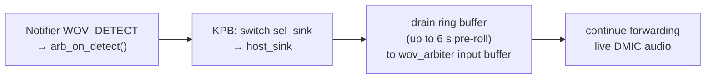
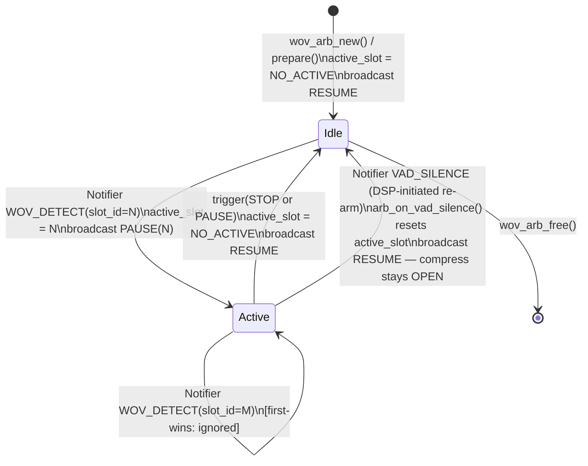

# Multi-Slot Wake-On-Voice (WOV) Architecture & Arbitration

## Overview

The Multi-Slot WOV subsystem lets a single DMIC feed up to 3 concurrent keyword detectors
running on the DSP. Each detector has its own Keyphrase Buffer (KPB) that continuously records
a pre-roll window (6 seconds on TigerLake, 2.1 seconds on other platforms). When any detector
fires the `wov_arbiter` drains that KPB's ring buffer to the host via an ALSA compress device and pauses
the other detectors. When the host closes the stream the arbiter resumes all detectors.

The ALSA compress framework (`snd_compr`) decouples HDA DMA from the audio sample-rate clock.
During the pre-roll burst the KPB draining EDF task fills HDA DMA fragments as fast as the bus allows
rather than at the rate-locked 16 kHz × sample-size pace of a regular PCM device.
After the pre-roll drains the live DMIC stream continues over the same compress device at realtime rate.

This design keeps host DMA live and eliminates the wakeup latency normally incurred by starting
DMA after detection.

---

## Table of Contents

1. [System Architecture](#system-architecture)
2. [Signal Processing Flow](#signal-processing-flow)
3. [Arbiter State Machine](#arbiter-state-machine)
4. [Pipeline State Transitions & Re-Arm Cycle](#pipeline-state-transitions--re-arm-cycle)
5. [SOF Notifier Inter-Module Signaling](#sof-notifier-inter-module-signaling)
6. [Firmware API Reference](#firmware-api-reference)
7. [Linux Host API Reference](#linux-host-api-reference)
8. [Adding a New WOV Algorithm](#adding-a-new-wov-algorithm)
9. [Topology: Build and Deploy](#topology-build-and-deploy)
10. [Build System Configuration](#build-system-configuration)
11. [Testing and Verification](#testing-and-verification)

---

## System Architecture

### Component Graph

```mermaid
graph TD
    subgraph P100["Pipeline 100 — Capture & Gating  (Core 0)"]
        DAI["DAI Copier\nHDA Analog\ndai_index=1"]
        VAD["vad_gate\n(energy estimator)"]
        MIX["mixin\n(1→3 fan-out)"]
        DAI --> VAD --> MIX
    end

    subgraph P101["Pipeline 101 — Slot 0  (Core 0)"]
        MO0["mixout 0"]
        K0["kpb 0\n6 s ring buffer"]
        D0["detect_test\nSlot 0\n(Male 80–170 Hz)"]
        MO0 --> K0
        K0 -- sel_sink --> D0
    end

    subgraph P102["Pipeline 102 — Slot 1  (Core 0)"]
        MO1["mixout 1"]
        K1["kpb 1\n6 s ring buffer"]
        D1["detect_test\nSlot 1\n(Female 175–270 Hz)"]
        MO1 --> K1
        K1 -- sel_sink --> D1
    end

    subgraph P103["Pipeline 103 — Slot 2  (Core 1)"]
        MO2["mixout 2"]
        K2["kpb 2\n6 s ring buffer"]
        D2["detect_test\nSlot 2\n(Child 275–500 Hz)"]
        MO2 --> K2
        K2 -- sel_sink --> D2
    end

    subgraph P104["Pipeline 104 — Arbitration & Host Capture  (Core 0)"]
        ARB["wov_arbiter\n(first-wins)"]
        HC["host-copier\ncomprC0D11\n'DMIC Multi-WOV'"]
        ARB --> HC
    end

    MIX --> MO0
    MIX --> MO1
    MIX --> MO2

    K0 -- host_sink --> ARB
    K1 -- host_sink --> ARB
    K2 -- host_sink --> ARB

    D0 -- "Notifier WOV_DETECT\n(slot_id=0)" --> ARB
    D1 -- "Notifier WOV_DETECT\n(slot_id=1)" --> ARB
    D2 -- "Notifier WOV_DETECT\n(slot_id=2)" --> ARB
    ARB -- "Notifier WOV_CTRL\n(PAUSE/RESUME)" --> D0
    ARB -- "Notifier WOV_CTRL\n(PAUSE/RESUME)" --> D1
    ARB -- "Notifier WOV_CTRL\n(PAUSE/RESUME)" --> D2

    style VAD fill:#2d5a27,stroke:#555
    style ARB fill:#1c4966,stroke:#555
    style D0  fill:#663300,stroke:#555
    style D1  fill:#660033,stroke:#555
    style D2  fill:#003366,stroke:#555
```



### Key Design Points

| Property | Value |
|---|---|
| Audio format | 16 kHz · 1ch · **S32LE on TGL/CAVS2.5** (spider); S16LE on other platforms |
| KPB pre-roll (TigerLake) | 6 000 ms (192 000 bytes) |
| KPB pre-roll (other) | 2 100 ms |
| Max arbiter slots | 3 (topology), 8 (header constant) |
| Arbitration policy | First-wins; subsequent detections ignored until RESUME |
| Slot 2 core affinity | DSP Core 1 (cross-core scheduling validation) |
| Host capture device | card 0, device 11 — `comprC0D11` (ALSA compress) |
| Pre-roll delivery | Compress burst — KPB drain fills HDA fragments at EDF rate, not rate-locked to 16 kHz |
| D0i3 / S0iX | Supported — `capture_compatible_d0i3 1` on host-copier and PCM widget |

---

## Signal Processing Flow

### LL Thread Path (every 1 ms)


### DP Thread Path (every 20 ms per slot)

Each slot has its own `k_thread` at `K_PRIO_PREEMPT(12)`.  Slot 2 is additionally pinned to
DSP Core 1 via `k_thread_cpu_pin()`.


### KPB Drain Sequence (triggered by Notifier)



---

## Arbiter State Machine



The `VAD_SILENCE` path is the **no-reset re-arm** path: the compress device (`comprC0D11`)
stays open throughout, the pipeline stays in RUNNING state, and all three detectors simply
restart their DP threads on `WOV_ARB_CMD_RESUME`.  No `SET_PIPELINE_STATE(RESET)` is
required and no re-arm delay is introduced.

### `wov_arb_copy()` Routing Logic

| Condition | Active slot buffer | Idle slot buffers | Sink output |
|---|---|---|---|
| `active_slot == NO_ACTIVE` | — | drained and discarded | filled with silence (memset 0) |
| `active_slot == N` | copied frame-aligned to sink | drained and discarded | pre-roll + live audio |

The first-wins guard in `arb_on_detect()`:

```c
if (cd->active_slot != WOV_ARB_NO_ACTIVE) {
    comp_warn(dev, "wov_arb: slot %u fired but slot %u already active, ignoring",
              det->slot_id, cd->active_slot);
    return;
}
```

---

## Pipeline State Transitions & Re-Arm Cycle

### Usage Flow (Compress Device Open Once)

The compress device is opened **once** at startup and kept open across all WOV cycles.
No pipeline close/reopen is needed between triggers.

```
Host                        Kernel / ASoC               Firmware
────                        ─────────────               ────────
open comprC0D11         ──► SET_PIPELINE_STATE(RUNNING) ──► VAD: vad_active=false (threshold default=0 → open)
                                                             KPBs: KPB_STATE_BUFFERING (filling history)
                                                             detect_tests: dp_thread running, listening

[optional] write
vad_gate_cfg_100 TLV     ──► MODULE_LARGE_CONFIG_SET  ──► threshold, onset, hangover updated

write wov_init_1NN TLV   ──► MODULE_LARGE_CONFIG_SET  ──► wov_slot_id programmed (slot 0/1/2)
amixer cset wov_mute on  ──► MODULE_LARGE_CONFIG_SET  ──► detection armed for that slot

─────────────────────── Listening (blocking) ───────────────────────────
read() blocks on comprC0D11
arbiter writes silence (zero-fill) into HDA DMA fragments at realtime rate
```

### WOV Trigger Sequence

```
[voice detected]                                     ──► detect_test auto/real trigger
                        ◄── SOF_IPC4_NOTIFY_PHRASE_DETECTED  (word_id = slot_id)
                        ◄── snd_sof_compr_fragment_elapsed() wakes blocked read()
read() returns PCM ◄────────────────────────────────────────
  (burst: 6 s pre-roll arrives fast, then realtime)
```

### DSP-Initiated Re-Arm (VAD Silence Path)

This is the **no-reset re-arm**: compress device stays open, pipeline stays RUNNING.

```
[speech ends, ambient noise below threshold for hangover_frames]
                                                     ──► vad_update_energy(): energy < threshold
                                                         for hangover_frames (default 200 × 10ms = 2s)
                                                         → notifier_event(NOTIFIER_ID_VAD_SILENCE)
                                                         → arb_on_vad_silence():
                                                             active_slot = WOV_ARB_NO_ACTIVE
                                                             broadcast WOV_ARB_CMD_RESUME
                                                         → detect_tests: cd->paused=false, cd->detected=0
                                                         → KPBs resume BUFFERING (drain complete)
                                                         → DSP clock → WOVCRO (38.4 MHz)

poll vad_gate_status_100 ────────────────────────────►  MODULE_LARGE_CONFIG_GET(param_id=2)
(TLV ioctl read)                                        returns energy + vad_active=false

Host detects silence, drains remaining compress data
read() blocks again on comprC0D11 ◄───────────────── arbiter back to silence-fill (zero frames)
─────────────────────── Re-armed, listening ─────────────────────────────────
```

### Host-Initiated Re-Arm

```
[host decides to stop current cycle]
compress_stop() / SNDRV_COMPRESS_STOP ──►  trigger(PAUSE)
                                            arb: active_slot = WOV_ARB_NO_ACTIVE
                                            broadcast WOV_ARB_CMD_RESUME
compress_start() / SNDRV_COMPRESS_START ──► DSP resumes silence-fill
read() blocks on comprC0D11 (re-armed)
```

### State Transition Summary

| State | Transition | Trigger | Compress device |
|---|---|---|---|
| Listening → Active | WOV_DETECT | detect_test fires | Stays OPEN |
| Active → Listening | VAD_SILENCE | hangover expires | Stays OPEN |
| Active → Listening | STOP/PAUSE | host or driver closes | Stays OPEN (re-armed) |
| Any → closed | compress_close() | host exits | Closed |

---

## SOF Notifier Inter-Module Signaling

The SOF Notifier system (`src/include/sof/lib/notifier.h`) is SOF's intra-DSP
publish/subscribe bus.  It works on all platforms (no `CONFIG_AMS` required) and
is already used for KPB client events.  Signals are delivered synchronously to
all registered listeners on the calling core.

### Signal Catalog

| Notifier ID | Direction | Payload struct | Purpose |
|---|---|---|---|
| `NOTIFIER_ID_WOV_DETECT` | detector → arbiter | `struct wov_detect_notif { uint8_t slot_id; }` | Announce keyword detection |
| `NOTIFIER_ID_WOV_CTRL` | arbiter → all detectors | `struct wov_ctrl_notif { uint8_t cmd; }` | Pause/resume detectors |
| `NOTIFIER_ID_VAD_SILENCE` | vad_gate → arbiter | `NULL` (no payload) | Silence hangover expired — re-arm for next trigger |

`cmd` values: `WOV_ARB_CMD_PAUSE`, `WOV_ARB_CMD_RESUME` (defined in `wov_arbiter.h`).

`NOTIFIER_ID_VAD_SILENCE` is fired by `vad_update_energy()` when the IIR energy drops
below threshold for `hangover_frames` consecutive frames.  The arbiter's
`arb_on_vad_silence()` callback handles it: resets `active_slot = WOV_ARB_NO_ACTIVE`
and broadcasts `WOV_ARB_CMD_RESUME` to all detectors so they re-arm without any
pipeline RESET or compress device close/reopen.

### Full Detect-to-Drain Sequence


---

## Firmware API Reference

### IPC4 Module Parameters (`LARGE_CONFIG_SET`)

#### `detect_test` — slot assignment via `wov_init_1NN` bytes kcontrol

Each `detect_test` instance exposes an ALSA bytes TLV kcontrol that configures the
slot assignment at runtime.  The topology creates three such kcontrols:

| ALSA kcontrol name | numid | Target module | Slot |
|---|---|---|---|
| `wov_init_101` | 11 | `wov.101.1` (Core 0) | 0 |
| `wov_init_102` | 14 | `wov.102.1` (Core 0) | 1 |
| `wov_init_103` | 17 | `wov.103.1` (Core 1) | 2 |

The write must be issued **before** `PREPARE` fires — write the kcontrols
immediately after forking `arecord` into the background, before it has finished
`hw_params`.  If the `PREPARE` IPC lands while `wov_slot_id` is still `0xff`
(`WOV_SLOT_INVALID`), the DP thread is not started and the notifier is not
registered for that slot.

The TLV payload format and a ready-to-use Python helper are in
[Testing and Verification](#testing-and-verification).

#### `detect_test` — per-slot mute via `wov_mute_1NN` switch kcontrol

Each `detect_test` instance also exposes a boolean switch kcontrol that gates
detection at runtime without tearing down the pipeline.

| ALSA kcontrol name | numid | Default | Effect when set |
|---|---|---|---|
| `wov_mute_101` | 12 | `off` | `off` = muted (no detection), `on` = detection active |
| `wov_mute_102` | 15 | `off` | `off` = muted (no detection), `on` = detection active |
| `wov_mute_103` | 18 | `off` | `off` = muted (no detection), `on` = detection active |

The default at pipeline open is `off` (muted). Userspace must explicitly write `on`
to arm a slot. When muted, `test_keyword_copy` drains the source buffer and returns
without running the detection algorithm, keeping the LL scheduler running at zero
detection cost. When re-enabled, detection resumes immediately on the next LL tick.

Wire format: `LARGE_CONFIG_SET` with `PARAM_ID = 200`
(`SOF_IPC4_SWITCH_CONTROL_PARAM_ID`), payload
`struct sof_ipc4_control_msg_payload { .num_elems=1, .chanv[0].value=0|1 }`.

```bash
# Arm slot 1 for detection (numid=15 = wov_mute_102)
amixer -c 0 cset numid=15 on

# Mute slot 1 again
amixer -c 0 cset numid=15 off
```


### VAD Gate Runtime Configuration (`vad_gate_cfg_100`)

The `vad_gate` component exposes a bytes TLV kcontrol (`numid=8`) for runtime calibration
of the energy-based gating.  The gate runs a first-order IIR energy estimator on each
10 ms block and transitions between two DSP clock domains:

| VAD state | DSP domain | Approximate frequency | Condition |
|---|---|---|---|
| Silence | WOVCRO | 38.4 MHz | `smoothed_energy < threshold` for `hangover_frames` consecutive frames |
| Speech | HPRO | ~400 MHz | `smoothed_energy ≥ threshold` for `onset_frames` consecutive frames |

**Default (compiled-in)**: threshold = 0 = pass-through (always HPRO). Always override at runtime.

**Calibration procedure** (TGL / spider lab):

```bash
# Install helper (once per DUT session)
scp tools/wov_capture/vad_calibrate.py root@spider:/tmp/

# Set threshold to 300 M (spider lab; ambient floor ≈ 100–300 M on spider S32LE)
python3 /tmp/vad_calibrate.py --threshold 300000000

# Read back current configuration
python3 /tmp/vad_calibrate.py --read-config

# For quieter environments lower the threshold; for noisier environments raise it.
# Watch mtrace for "SPEECH onset energy=X >= threshold=Y -> HPRO" to confirm.
```

**Configuration fields:**

| Field | Default | Description |
|---|---|---|
| `threshold` | 0 (pass-through) | Peak energy level (IIR units) to distinguish speech from silence |
| `onset_frames` | 3 | Consecutive frames above threshold before SPEECH declared (3 × 10 ms = 30 ms) |
| `hangover_frames` | 200 | Frames below threshold before SILENCE declared (200 × 10 ms = 2 s) |
| `energy_shift` | 6 | IIR smoothing factor: α = 1/2^shift = 1/64 |

> **Note on auto-trigger at 8 s:** When the `wov_mute_1NN` arm is raised, `detect_test`
> auto-triggers after 8 s if threshold gating is active (Mixout silence-fill activates
> the auto-trigger path). This is expected bench-test behaviour — it is not a timeout bug.

The `vad_calibrate.py` script (successor to `set_vad_threshold.py`) uses
`SNDRV_CTL_IOCTL_TLV_COMMAND` (ioctl 0xc008551b) because the 7.x kernel running on spider
does not register `TLV_WRITE` for bytes kcontrols.

#### `wov_arbiter` — slot count from `nb_input_pins`

The arbiter reads the number of active slots from `ipc4_base_module_cfg_ext.nb_input_pins`
(set in `wov-arbiter.conf` via `num_input_pins = 3`).

### Notifier Registration

A WOV detector must register for `WOV_CTRL` notifications during `prepare()`:

```c
notifier_register(dev, NULL, NOTIFIER_ID_WOV_CTRL, on_wov_ctrl, 0);
```

Unregister in `free()`:

```c
notifier_unregister(dev, NULL, NOTIFIER_ID_WOV_CTRL);
```

### `detect_test_notify(dev)` — Detection Announcement

Call this from your detection algorithm when a keyword is confirmed:

```c
void detect_test_notify(const struct comp_dev *dev);
```

Internally executes three steps:
1. Sends `SOF_IPC4_NOTIFY_PHRASE_DETECTED` IPC4 notification to host
2. Sends `kpb_client` notifier event to KPB → triggers pre-roll drain on `host_sink`
3. Fires `notifier_event(NOTIFIER_ID_WOV_DETECT)` → `wov_arbiter.arb_on_detect()` activates this slot

### DP Thread Ping-Pong Buffer Contract

| Field | Type | Semantics |
|---|---|---|
| `dp_buf[2][320]` | `int16_t` | ping-pong accumulation buffer |
| `dp_buf_frames` | `uint32_t` | frames in write slot (0 to 319) |
| `dp_write_slot` | `uint8_t` | index (0 or 1) LL writes into |
| `dp_read_slot` | `uint8_t` | index DP thread reads from |
| `dp_sem` | `struct k_sem` | binary semaphore, max count = 1 |
| `dp_thread_active` | `bool` | false → thread exits on next wake |

LL thread gives semaphore after every 320 accumulated frames.
DP thread takes semaphore and processes `dp_buf[dp_read_slot]`.
Missing a give (while thread is still processing) drops that batch silently
(semaphore max count = 1 prevents accumulation).

---

## Linux Host API Reference

### ALSA Compress Capture

The WOV audio is exposed as an **ALSA compress** device, not a regular PCM device.
`arecord` cannot open it; use the `snd_compr` API or a compress-capable tool.

```
Card: 0   Compress device: 11   Name: "DMIC Multi-WOV"   (/dev/snd/comprC0D11)
Formats:  SND_AUDIOCODEC_PCM (raw PCM — no encoding)
Rate:     16000 Hz
Channels: 1 (mono)
```

Using `tinycompress` (`crecord`) if installed:

```bash
# crecord from alsa-utils / tinycompress: card=0 device=11 codec=PCM rate=16000 ch=1
# Adjust -l (fragments) and -z (fragment bytes) as needed.
crecord -c 0 -d 11 -r 16000 -C 1 -f 0 -l 8 -z 4096 /tmp/wov.raw
sox -r 16000 -e signed -b 16 -c 1 -t raw /tmp/wov.raw /tmp/wov.wav
```

Minimal C API flow:

```c
#include <sound/compress_offload.h>

int fd = open("/dev/snd/comprC0D11", O_RDWR);

struct snd_compr_params p = {};
p.buffer.fragment_size = 4096;   /* 64 ms of S16LE at 16 kHz */
p.buffer.fragments     = 8;
p.codec.id             = SND_AUDIOCODEC_PCM;
p.codec.ch_in          = 1;
p.codec.sample_rate    = 16000;
ioctl(fd, SNDRV_COMPRESS_SET_PARAMS, &p);
ioctl(fd, SNDRV_COMPRESS_START);

/* Poll POLLIN, then read() fragments of raw PCM (S16LE by default) */
while (more_data_needed) {
    struct pollfd pfd = { fd, POLLIN, 0 };
    poll(&pfd, 1, -1);
    ssize_t n = read(fd, buf, sizeof(buf));
    /* process n bytes of raw PCM */
}

ioctl(fd, SNDRV_COMPRESS_STOP);
close(fd);
```

**Pre-roll burst delivery:** after a WOV trigger the KPB draining EDF task fills HDA
fragments without a rate limiter — fragments arrive faster than realtime until the
pre-roll ring buffer is exhausted, then settle to one fragment per ~64 ms at 16 kHz.
The silence-to-audio boundary in the stream marks the trigger point.

### Voice Detection Notification from Firmware

When a keyword is detected the `detect_test` DP thread calls `detect_test_notify()` which:

1. Sends `SOF_IPC4_NOTIFY_PHRASE_DETECTED` (IPC4 global notification, type=4) to the host.
2. Fires the KPB notifier to start pre-roll draining on the host sink.
3. Fires the `NOTIFIER_ID_WOV_DETECT` SOF notifier to the `wov_arbiter`.

The `word_id` field (bits 15:0 of the primary DW) carries the `wov_slot_id` (0, 1, or 2).

**Kernel handler (`linux-arl`):** `sof_ipc4_phrase_detected()` in
`sound/soc/sof/ipc4-compress.c` is called from `sof_ipc4_rx_msg()` when
`SOF_IPC4_NOTIFY_PHRASE_DETECTED` arrives.  It walks the PCM list to find the
active compress capture stream and calls `snd_sof_compr_fragment_elapsed()` to wake
any `poll()` or `read()` blocked on the compress device before the first HDA DMA
interrupt fires.

```c
/* ipc4-compress.c — simplified */
void sof_ipc4_phrase_detected(struct snd_sof_dev *sdev, u32 primary, u32 extension)
{
    u32 word_id = SOF_IPC4_NOTIFY_PHRASE_WORD_ID_GET(primary);  /* bits 15:0 */
    struct snd_sof_pcm *spcm;

    list_for_each_entry(spcm, &sdev->pcm_list, list) {
        struct snd_compr_stream *cs =
            spcm->stream[SNDRV_PCM_STREAM_CAPTURE].cstream;
        if (cs && cs->direction == SND_COMPRESS_CAPTURE) {
            snd_sof_compr_fragment_elapsed(cs);  /* wake blocked reads */
            return;
        }
    }
}
```

Userspace therefore does not need to poll an ALSA control-change event.
The `read()` or `poll(POLLIN)` on `/dev/snd/comprC0D11` unblocks naturally
when the first fragment is available after trigger.

### Audio Capture Timing

Because the compress device is opened before trigger, the `wov_arbiter` feeds the DMA
pipeline immediately.  Fragment arrival pattern:

- **Before any trigger**: arbiter writes silence (all-zero samples) at realtime rate
- **On trigger**: arbiter drains the KPB ring buffer (up to 6 s of pre-roll) in a
  **burst** (multiple fragments per ms), then continues forwarding live DMIC audio
  at one fragment per ~64 ms
- **On STOP**: arbiter returns to silence mode; detectors resume listening

The host sees a seamless audio stream. The silence-to-audio transition marks the
trigger point in the buffer.


### D0i3 / S0iX Support

The WOV compress stream remains live during D0i3 system suspend (`S0iX`).  Two topology
attributes enable this:

```
# dmic-wov-multi-manifest.conf
Object.Widget.host-copier."...":
    capture_compatible_d0i3  1   # host-copier keeps DMA active in D0i3

Object.PCM.pcm."$DMIC_PCM_ID":
    capture_compatible_d0i3  1   # PCM object allows D0i3 while stream open
    compress "true"             # expose as ALSA compress device
```

On the kernel side `ipc4_pcm_ops.d0i3_supported_in_s0ix` is set for IPC4 compress PCMs
in `sound/soc/sof/ipc4-pcm.c`, which prevents the compress stream from being torn down
during `S0iX` entry.  The DSP clock scales down to WOVCRO during silence
(via the `vad_gate`) so there is no meaningful power cost while waiting for a trigger.

### IPC4 Module Control via `sof-ctl`

Override the slot assignment for a `detect_test` instance using the SOF IPC4
LARGE_CONFIG_SET path (requires `sof-ctl` tool or equivalent hwdep ioctl):

```bash
# Set detect_test in pipeline 102 to use slot_id = 1
sof-ctl -c hw:0 -t large_config_set \
    -m <module_id> -i <instance_id> \
    -p 202 -b 00000000 01   # param_id=202 (SOF_IPC4_BYTES_CONTROL_PARAM_ID), slot_id=1
```

---

## Adding a New WOV Algorithm

The reference implementation (`detect_test.c`) is intentionally simple — it looks for
zero-crossing rate and signal energy in fixed frequency bands. Replace it with any
algorithm by following one of the approaches below.

### Approach A — Modify `detect_test.c` directly

This is simplest for prototyping. The DP thread calls `default_detect_test_buf()` on
every 320-frame batch. Replace its body with your algorithm:

```c
/* src/samples/audio/detect_test.c */

static void default_detect_test_buf(struct comp_dev *dev,
                                    const int16_t *samples, uint32_t frames)
{
    struct comp_data *cd = comp_get_drvdata(dev);

    if (cd->detected || cd->paused)
        return;

    /* === YOUR ALGORITHM HERE ===
     * Input:  samples — pointer to 'frames' interleaved S16_LE samples
     *         frames  — always KD_DP_FRAMES (320) = 20 ms @ 16 kHz
     * Output: call detect_test_notify(dev) when keyword is confirmed.
     * ===========================
     */
    bool keyword_found = my_algorithm_process(cd->algo_state, samples, frames);

    if (keyword_found) {
        comp_err(dev, "KWD detected on slot %u", cd->wov_slot_id);
        if (!cd->drain_req)
            cd->drain_req = cd->config.drain_req ? cd->config.drain_req : 5000;
        detect_test_notify(dev);
        cd->detected = 1;
    }
}
```

Store per-slot algorithm state in `struct comp_data` (add fields to the struct).
The slot index is available as `cd->wov_slot_id` (0, 1, or 2) so each KPB pipeline's
detector can hold independent model state.

### Approach B — New Native SOF Module

For a production algorithm create a new SOF module following the standard
`src/audio/template/` skeleton and integrate it with the arbiter via SOF notifier:

**Step 1: Create the module files**

```
src/audio/my_kwd/
├── CMakeLists.txt
├── my_kwd.c
└── my_kwd.h
```

**Step 2: Implement the module driver**

```c
/* src/audio/my_kwd/my_kwd.c */
#include <sof/audio/component.h>
#include <sof/lib/notifier.h>
#include <sof/audio/wov_arbiter.h>
#include <sof/audio/kpb.h>

struct my_kwd_data {
    uint8_t  wov_slot_id;
    bool     paused;
    bool     detected;
    /* ... algorithm state ... */
};

/* Called by arbiter when a sibling slot fires (NOTIFIER_ID_WOV_CTRL) */
static void on_wov_ctrl(void *arg, enum notify_id id, void *data)
{
    struct comp_dev *dev = arg;
    struct my_kwd_data *cd = comp_get_drvdata(dev);
    const struct wov_ctrl_notif *ctrl = data;

    if (ctrl->cmd == WOV_ARB_CMD_PAUSE)
        cd->paused = true;
    else if (ctrl->cmd == WOV_ARB_CMD_RESUME) {
        cd->paused   = false;
        cd->detected = 0;
    }
}

/* Notify arbiter + KPB + host that this slot fired */
static void my_kwd_notify(struct comp_dev *dev)
{
    struct my_kwd_data *cd = comp_get_drvdata(dev);

    /* 1. IPC4 notification to host */
    struct ipc4_voice_cmd_notification notif = {};
    notif.primary.r.word_id    = cd->wov_slot_id;
    notif.primary.r.notif_type = SOF_IPC4_NOTIFY_PHRASE_DETECTED;
    notif.primary.r.type       = SOF_IPC4_GLB_NOTIFICATION;
    /* ... fill in module_id / instance_id ... */
    ipc_msg_send(cd->msg, &notif, true);

    /* 2. Tell KPB to start draining */
    /* (re-use existing kpb_client notifier path) */

    /* 3. Tell arbiter slot fired */
    struct wov_detect_notif det = { .slot_id = cd->wov_slot_id };
    notifier_event(dev, NOTIFIER_ID_WOV_DETECT, NOTIFIER_TARGET_CORE_ALL_MASK,
                    &det, sizeof(det));
}

static int my_kwd_prepare(struct comp_dev *dev)
{
    struct my_kwd_data *cd = comp_get_drvdata(dev);

    /* Derive slot from pipeline ID */
    uint32_t ppl = dev->ipc_config.pipeline_id;
    cd->wov_slot_id = (ppl == 101 || ppl == 1) ? 0 :
                      (ppl == 102 || ppl == 3) ? 1 :
                      (ppl == 103 || ppl == 4) ? 2 : WOV_SLOT_INVALID;

    if (cd->wov_slot_id != WOV_SLOT_INVALID)
        notifier_register(dev, NULL, NOTIFIER_ID_WOV_CTRL, on_wov_ctrl, 0);

    return comp_set_state(dev, COMP_TRIGGER_PREPARE);
}

static int my_kwd_copy(struct comp_dev *dev)
{
    struct my_kwd_data *cd = comp_get_drvdata(dev);
    struct comp_buffer *source = comp_dev_get_first_data_producer(dev);

    if (!audio_stream_get_avail(&source->stream))
        return PPL_STATUS_PATH_STOP;

    uint32_t frames    = audio_stream_get_avail_frames(&source->stream);
    uint32_t avail_b   = audio_stream_get_avail_bytes(&source->stream);
    buffer_stream_invalidate(source, avail_b);

    /* Pass-through to arbiter input */
    struct comp_buffer *sink = comp_dev_get_first_data_consumer(dev);
    if (sink && audio_stream_get_free_bytes(&sink->stream) >= avail_b) {
        audio_stream_copy(&source->stream, 0, &sink->stream, 0,
                          frames * audio_stream_get_channels(&source->stream));
        buffer_stream_writeback(sink, avail_b);
        comp_update_buffer_produce(sink, avail_b);
    }

    if (!cd->paused && !cd->detected) {
        /* Run your algorithm on the frames */
        if (my_algorithm_run(cd, &source->stream, frames)) {
            my_kwd_notify(dev);
            cd->detected = 1;
        }
    }

    comp_update_buffer_consume(source, avail_b);
    return 0;
}
```

**Step 3: Register the UUID**

Add to `uuid-registry.txt`:

```
MY_KWD_UUID_HEX    my_kwd
```

Add to `src/audio/my_kwd/CMakeLists.txt`:

```cmake
add_local_sources(sof my_kwd.c)
```

Add to `src/audio/CMakeLists.txt`:

```cmake
if(CONFIG_COMP_MY_KWD)
    add_subdirectory(my_kwd)
endif()
```

Add `src/audio/Kconfig`:

```kconfig
config COMP_MY_KWD
    bool "My keyword detector"
    depends on COMP_KPB && IPC_MAJOR_4
    # no AMS required (uses SOF notifier)
```

**Step 4: Update the topology**

In `dmic-wov-multi.conf`, replace `KWD_TEST_UUID` with the UUID bytes for `my_kwd`
in the `wov.101.1`, `wov.102.1`, `wov.103.1` widgets.

### Approach C — IADK / LLEXT loadable module

For algorithms that must ship as separate binaries (third-party IP, updatable
without reflashing), use the SOF IADK module adapter framework. The algorithm
is compiled as an LLEXT `.so` and loaded at runtime from the kernel filesystem.
See `src/audio/module_adapter/README.md` for the full IADK API.

The notifier signaling path (steps 2 and 3 of `my_kwd_notify`) remains the same;
only the binary delivery mechanism changes.

### Algorithm State Isolation

Each pipeline instance (101/102/103) creates its own `comp_dev` with independent
`comp_data`. Detector state is never shared between slots. The `wov_slot_id` field
identifies which pipeline a given instance belongs to:

```
Pipeline 101  →  wov_slot_id=0  →  kd_dp_stack_0 / kd_dp_threads[0]
Pipeline 102  →  wov_slot_id=1  →  kd_dp_stack_1 / kd_dp_threads[1]
Pipeline 103  →  wov_slot_id=2  →  kd_dp_stack_2 / kd_dp_threads[2] (Core 1)
```

---

## Topology: Build and Deploy

### Topology Source Layout

```
tools/topology/topology2/
├── platform/intel/
│   └── dmic-wov-multi.conf          ← main topology (edit here)
├── include/components/
│   ├── wov.conf                     ← detect_test widget class (wov_init + wov_mute kcontrols)
│   └── wov-arbiter.conf             ← wov_arbiter widget class definition
├── include/controls/
│   └── mixer.conf                   ← Class.Control.mixer definition (required by wov.conf)
└── dmic-wov-multi-manifest.conf     ← top-level manifest (includes above)
```

### Compile Topology to `.tplg`

From the root of the SOF repository:

```bash
# Run from the repo root (e.g. ~/work/sof-tgl/sof-wov)
TPLG2=$(pwd)/tools/topology/topology2
ALSA_TMP=/tmp/alsa-tplg-wov

mkdir -p $ALSA_TMP
cp /usr/share/alsa/alsa.conf $ALSA_TMP/
ln -sf $TPLG2/include  $ALSA_TMP/include
ln -sf $TPLG2/platform $ALSA_TMP/platform

ALSA_CONFIG_DIR=$ALSA_TMP alsatplg \
    -I $TPLG2 -p \
    -c tools/topology/topology2/dmic-wov-multi-manifest.conf \
    -o /tmp/sof-tgl-dmic-wov-multi.tplg
```

`ALSA_CONFIG_DIR` must point to a directory that contains `alsa.conf` plus
`include/` and `platform/` symlinks into `topology2/`.  The `$(pwd)/tools/topology/topology2`
directory alone does not satisfy this requirement because `/usr/share/alsa/include`
is absent on most build machines.

Copy the compiled topology to the DUT:

```bash
scp /tmp/sof-tgl-dmic-wov-multi.tplg \
    root@<dut>:/lib/firmware/intel/sof-ipc4-tplg/sof-tgl-dmic-wov-multi.tplg
```

Tell the SOF driver which topology to load (edit `/etc/modprobe.d/sof.conf` on the DUT):

```
# /etc/modprobe.d/sof.conf (TGL / spider)
options snd_sof tplg_path=intel/sof-ipc4-tplg tplg_filename=sof-tgl-dmic-wov-multi.tplg
```

Or pass directly at `modprobe` time:

```bash
rmmod snd_sof_pci_intel_tgl
modprobe snd_sof_pci_intel_tgl \
    tplg_path=intel/sof-ipc4-tplg \
    tplg_filename=sof-tgl-dmic-wov-multi.tplg
```

### Build Firmware with WOV Arbiter

Configure a build directory with the required Kconfig options (see
[Build System Configuration](#build-system-configuration)), then build:

```bash
ninja -C <build-dir>
```

Copy the firmware image to the DUT (path varies by platform):

```bash
# TigerLake example
scp <build-dir>/zephyr/zephyr.ri \
    root@<dut>:/lib/firmware/intel/sof-ipc4/tgl/community/sof-tgl.ri
```

Reload the driver on the DUT:

```bash
rmmod snd_sof_pci_intel_tgl && modprobe snd_sof_pci_intel_tgl
```

### Topology Configuration Reference

Key parameters in `dmic-wov-multi.conf`:

| Constant | Default | Description |
|---|---|---|
| `DMIC_PCM_ID` | `11` | ALSA PCM device index |
| `DMIC_DAI_INDEX` | `1` | HDA DAI instance |
| `KWD_CPC` | `100000` | cycles per chunk for detector widgets |
| `WOV_ARB_CPC` | `20000` | cycles per chunk for arbiter |
| `VAD_GATE_CPC` | `5000` | cycles per chunk for VAD gate |
| `FORMAT` | `s32le` (TGL/CAVS2.5) | audio format; `s16le` on other platforms |

> **KPB history depth is configurable via topology.** Set `KPB_BUFF_TIME_MS` in the topology
> manifest (e.g. `dmic-wov-multi-manifest.conf`) to override `CONFIG_KPB_MAX_BUFF_TIME` at
> runtime — no firmware rebuild required.  Omit the define or set it to `0` to fall back to
> the Kconfig default (6000 ms on TGL/CAVS2.5, 2100 ms on other platforms).

Slot 2 (`Pipeline 103`) is deliberately placed on Core 1 (`core_id = 1`) to validate
cross-core scheduling. Set all three to `core_id = 0` if a single-core topology is needed.

### Adding a Fourth Slot

1. Add `Pipeline 104` (new KPB + detector) following the pattern of pipelines 101–103.
   Route the new `wov.104.1 → wov-arbiter.105.1`.
2. Update `wov_arbiter.conf`: set `num_input_pins = 4`.
3. Update `wov_arbiter.h`: `WOV_ARB_MAX_SLOTS 8` already supports it.
4. Add the new `pipeline_id → wov_slot_id` mapping in `test_keyword_new()`.
5. Add a fourth `K_THREAD_STACK_DEFINE` and update `kd_dp_stacks[]`.

---

## Build System Configuration

### Kconfig (minimum required set)

```kconfig
# Mandatory
CONFIG_COMP_WOV_ARBITER=y
CONFIG_COMP_KPB=y
CONFIG_COMP_MIXIN_MIXOUT=y
CONFIG_IPC_MAJOR_4=y

# For the detect_test reference detector
CONFIG_COMP_KWD_DETECT=y

# For VAD-gated ingress
CONFIG_COMP_VAD_GATE=y         # or any other gate component

# Multi-core scheduling (required for slot 2 on Core 1)
CONFIG_SMP=y
CONFIG_MP_MAX_NUM_CPUS=4       # TGL has 4 DSP cores
CONFIG_SCHED_CPU_MASK_PIN_ONLY=y

# KPB history buffer length — compile-time floor; topology can override at runtime.
# Default: 6000 ms on CAVS2.5+ (TigerLake), 2100 ms on all other platforms.
# Override example: west build -- -DCONFIG_KPB_MAX_BUFF_TIME=4000
CONFIG_KPB_MAX_BUFF_TIME=6000  # TGL / CAVS2.5
```

The KPB history depth can be set **per-platform in the topology manifest** without a
firmware rebuild.  The buffer size is computed at prepare time from whichever source wins:

| Source | Priority | How to set |
|---|---|---|
| Topology `KPB_BUFF_TIME_MS` | **highest** | `Define { KPB_BUFF_TIME_MS "6000" }` in manifest |
| `CONFIG_KPB_MAX_BUFF_TIME` | fallback | `west build -- -DCONFIG_KPB_MAX_BUFF_TIME=4000` |

Buffer byte formula (16 kHz S16LE mono):

```
buffer_bytes = 16 x 2 x buff_time_ms x channels
             = 16 x 2 x 6000 x 1  =  192 000 bytes   (TGL, S16LE mono, 6000 ms)
             = 16 x 2 x 2100 x 1  =   67 200 bytes   (other platforms, 2100 ms)
```

The topology kcontrol `kpb_cfg_<N>` carries a 36-byte SOF ABI blob with
`type = KP_BUF_CFG_BUFF_TIME_MS = 2` and a 4-byte `uint32_t` payload.  It is sent
automatically to the firmware LARGE_CONFIG_SET handler when the pipeline is first opened;
no userspace script is required.  Supported values in `kpb.conf`: `6000`, `4000`, `2100`.
To add a new value, compute the 4-byte LE payload and add an `IncludeByKey` entry.

To change the compile-time fallback, rebuild with `-DCONFIG_KPB_MAX_BUFF_TIME=<ms>`.

The `CONFIG_VAD_GATE_DEFAULT_THRESHOLD` (if exposed) compiles in a non-zero threshold; otherwise
the compiled-in default is 0 (pass-through).  Always set the threshold at runtime via
`set_vad_threshold.py` after driver load (see [VAD Gate Runtime Configuration](#vad-gate-runtime-configuration-vad_gate_cfg_100)).

**Kernel dependency**: the compress WOV path requires `CONFIG_SND_SOC_SOF_COMPRESS=y` in
the kernel configuration.

These can be set via `west build -- -DCONFIG_...=y` or by editing the build directory's `zephyr/.config`.

### Module UUIDs

| Component | UUID |
|---|---|
| `detect_test` (KWD_TEST) | `1f:d5:a8:eb:27:78:b5:47:82:ee:de:6e:77:43:af:67` |
| `wov_arbiter` | `4a5b6c7d-8e9f-4a1b-2c3d-4e5f60718293` |
| `vad_gate` | `5f:6e:7d:8c:3b:4a:1d:2c:0e:9f:8a:7b:6c:5d:4e:3f` |

---

## Testing and Verification

### Quick Start (TigerLake / spider DUT)

```bash
# 0. Load the driver with the WOV firmware and topology
rmmod snd_sof_pci_intel_tgl
modprobe snd_sof_pci_intel_tgl \
    fw_path=intel/sof-ipc4/tgl/community \
    tplg_filename=intel/sof-ipc4-tplg/sof-tgl-dmic-wov-multi.tplg

# 1. Verify the compress device is visible
ls /dev/snd/comprC*                       # expect: /dev/snd/comprC0D11
cat /proc/asound/card0/compr              # lists compress devices

# 2. Run a per-slot trigger test (see below)
```

---

### kcontrol numid reference

After driver load the full WOV kcontrol set is:

| numid | name | type | Purpose |
|---|---|---|---|
| 8 | `vad_gate_cfg_100` | bytes TLV (R/W) | VAD gate config: threshold, onset_frames, hangover_frames, energy_shift |
| 9 | `vad_gate_status_100` | bytes TLV (RO) | VAD gate status: current IIR energy + vad_active flag |
| 10 | `kpb_cfg_101` | bytes TLV | KPB 0 buffer config (history depth in ms) |
| 11 | `wov_init_101` | bytes TLV | Slot ID assignment for detect_test in pipeline 101 |
| 12 | `wov_mute_101` | boolean switch | Arm (`on`) / mute (`off`) detection for slot 0 |
| 13 | `kpb_cfg_102` | bytes TLV | KPB 1 buffer config |
| 14 | `wov_init_102` | bytes TLV | Slot ID assignment for detect_test in pipeline 102 |
| 15 | `wov_mute_102` | boolean switch | Arm / mute detection for slot 1 |
| 16 | `kpb_cfg_103` | bytes TLV | KPB 2 buffer config |
| 17 | `wov_init_103` | bytes TLV | Slot ID assignment for detect_test in pipeline 103 |
| 18 | `wov_mute_103` | boolean switch | Arm / mute detection for slot 2 |
| 19 | `wov_trigger_id` | bytes TLV (RO) | Active slot ID after detection (255 = none) |

> **Note:** numids are assigned in ALSA registration order. Run `amixer -c 0 controls`
> to confirm actual numids after any topology rebuild.

**Runtime usage summary:**

| kcontrol | When to use |
|---|---|
| `vad_gate_cfg_100` (8) | Write threshold before opening the compress device. Calibrate to silence floor × 1.5–3×. A threshold of 0 (default) is pass-through — gate always open (HPRO clock). |
| `vad_gate_status_100` (9) | Poll during capture to detect voice activity. `vad_active=true` → speech detected; `false` → silence/hangover. Energy field tracks the IIR level. Valid while compress device is open (pipeline in D0). |
| `kpb_cfg_1NN` (10/13/16) | Written automatically by the kernel from topology at pipeline open. Normally not written by userspace. |
| `wov_init_1NN` (11/14/17) | Write slot IDs **before** pipeline PREPARE IPC arrives. Race-write immediately after opening the compress device. |
| `wov_mute_1NN` (12/15/18) | Write `on` to arm a slot for detection after slot IDs are programmed. Default is `off` (muted). |
| `wov_trigger_id` (19) | Read after detection to confirm which slot fired. Returns 255 while no active detection. Requires pipeline in D0 (compress device open). |

#### VAD gate kcontrol
Set the energy threshold via `vad_calibrate.py` **after** driver load and **before**
opening the capture device.  A threshold of 0 (default) makes the gate transparent (always HPRO);
set it to ~300M for typical lab use on TGL/spider (ambient floor ≈ 100–300M on spider):

```bash
python3 /tmp/vad_calibrate.py --threshold 300000000
python3 /tmp/vad_calibrate.py --read-config   # verify written config
```

---

### Slot Assignment via `wov_init_1NN` kcontrol

Each `detect_test` instance reads its `wov_slot_id` from a bytes TLV kcontrol
(`wov_init_101 / 102 / 103`, numids 11 / 14 / 17).  The assignment must arrive
**before** the PCM `PREPARE` IPC — write the kcontrols immediately after forking
`arecord` into the background:

```bash
arecord -Dhw:0,11 -r 16000 -c 1 -f S16_LE -d 10 /tmp/wov.wav &
# Race the PREPARE: write all three kcontrols before hw_params completes
python3 set_wov_slot.py 11 0   # wov_init_101 → slot 0
python3 set_wov_slot.py 14 1   # wov_init_102 → slot 1
python3 set_wov_slot.py 17 2   # wov_init_103 → slot 2
wait
```

To **disable** a slot (useful for per-slot isolation tests), write
`slot_id = 255` (`WOV_SLOT_INVALID`) — the DP thread is not started for that slot:

```bash
python3 set_wov_slot.py 11 255   # disable slot 0
```

#### `set_wov_slot.py` — TLV helper script

Copy to the DUT as `/tmp/set_wov_slot.py`.  The script builds the two-level
`snd_ctl_tlv` + `sof_abi_hdr` required by the SOF IPC4 bytes kcontrol path
(`SOF_IPC4_BYTES_CONTROL_PARAM_ID = 202`):

```python
#!/usr/bin/env python3
# Usage: set_wov_slot.py <numid> <slot_id>
#   numid: 11=wov_init_101 (slot 0), 14=wov_init_102 (slot 1), 17=wov_init_103 (slot 2)
#   slot_id: 0-2 to enable; 255 to disable (WOV_SLOT_INVALID)
import sys, fcntl, struct, os

SOF_IPC4_ABI_MAGIC              = 0x34464F53
SOF_CTRL_CMD_BINARY             = 3
SOF_IPC4_BYTES_CONTROL_PARAM_ID = 202
SNDRV_CTL_IOCTL_TLV_WRITE      = (1 << 30) | (8 << 16) | (0x55 << 8) | 0x1b

numid, slot_id = int(sys.argv[1]), int(sys.argv[2])

payload_size   = 4
sizeof_abi_hdr = 32
inner_length   = sizeof_abi_hdr + payload_size   # 36
outer_length   = 8 + inner_length                # 44

abi_hdr  = (struct.pack('<IIII', SOF_IPC4_ABI_MAGIC,
                         SOF_IPC4_BYTES_CONTROL_PARAM_ID, payload_size, 0)
            + bytes(16))
payload  = struct.pack('<I', slot_id)

ioctl_buf = (struct.pack('<II', numid, outer_length) +
             struct.pack('<II', SOF_CTRL_CMD_BINARY, inner_length) +
             abi_hdr + payload)

fd = os.open('/dev/snd/controlC0', os.O_RDWR)
try:
    fcntl.ioctl(fd, SNDRV_CTL_IOCTL_TLV_WRITE, bytearray(ioctl_buf))
    print(f'OK: numid={numid} slot_id={slot_id}')
except OSError as e:
    print(f'FAIL: {e}'); sys.exit(1)
finally:
    os.close(fd)
```

---

### Per-Slot Trigger Test

The `detect_test` DP thread auto-triggers after accumulating **320 frames** (one 20 ms
batch, `frames_total >= KD_DP_FRAMES`).  The first batch fires the trigger approximately
14–25 ms after pipeline RUNNING.  No physical audio source is required.

#### Test all three slots simultaneously

```bash
dmesg -C
arecord -Dhw:0,11 -r 16000 -c 1 -f S16_LE -d 10 /tmp/wov_all.wav &
AREC=$!
python3 set_wov_slot.py 11 0   # wov_init_101 → slot 0
python3 set_wov_slot.py 14 1   # wov_init_102 → slot 1
python3 set_wov_slot.py 17 2   # wov_init_103 → slot 2
# Arm all three slots
amixer -c 0 cset numid=12 on   # wov_mute_101
amixer -c 0 cset numid=15 on   # wov_mute_102
amixer -c 0 cset numid=18 on   # wov_mute_103
wait $AREC
echo "rc=$?"
```

Expected: `rc=0`.  Slot 0 fires first (timing-dependent); the arbiter pauses slots 1
and 2 via `NOTIFIER_ID_WOV_CTRL`.

#### Test a single slot in isolation

```bash
# Disable the other two slots before starting arecord
python3 set_wov_slot.py 11 255  # disable slot 0 (persists across sessions)
python3 set_wov_slot.py 17 255  # disable slot 2

crecord -c 0 -d 11 -r 16000 -C 1 -f 0 -l 8 -z 4096 /tmp/wov_s1.raw &
AREC=$!
python3 set_wov_slot.py 14 1    # wov_init_102 → slot 1
amixer -c 0 cset numid=15 on    # arm wov_mute_102
wait $AREC
echo "rc=$?"
```

Repeat for each slot, rotating which `set_wov_slot.py` calls use `255` vs a valid ID.

---

### Per-Slot Mute Test

Verify that `wov_mute_1NN` suppresses detection when `off` and restores it when `on`.
The test uses the 8-second auto-trigger path (no physical audio needed):

```bash
# Reload driver for a clean state
rmmod snd_sof_pci_intel_tgl && modprobe snd_sof_pci_intel_tgl && sleep 4

# Open compress device (keeps DSP in D0 — required for kcontrol reads)
crecord -c 0 -d 11 -r 16000 -C 1 -f 0 -l 8 -z 4096 /dev/null &
AREC=$!
sleep 2

# Set slot IDs
python3 set_wov_slot.py 11 0
python3 set_wov_slot.py 14 1
python3 set_wov_slot.py 17 2

# Leave all wov_mute controls at default (off = muted)
echo "All muted — waiting 12s, no trigger expected:"
sleep 12
python3 read_wov_trigger.py     # expect: active_slot = 255

# Arm slot 1
amixer -c 0 cset numid=15 on
echo "Slot 1 armed — waiting 12s, trigger expected:"
sleep 12
python3 read_wov_trigger.py     # expect: active_slot = 1

kill $AREC
```

#### `read_wov_trigger.py` — read active slot via TLV

```python
#!/usr/bin/env python3
# Reads wov_trigger_id (numid=19) to get active_slot after detection.
# DSP must be in D0 (crecord/compress device open) or ENOSPC is returned.
import fcntl, os, struct

SNDRV_CTL_IOCTL_TLV_READ = (2 << 30) | (8 << 16) | (0x55 << 8) | 0x1a

def read_active_slot(card=0, numid=19):
    response_size = 44
    buf = bytearray(struct.pack('<II', numid, response_size) + bytes(response_size))
    fd = os.open(f'/dev/snd/controlC{card}', os.O_RDWR)
    try:
        fcntl.ioctl(fd, SNDRV_CTL_IOCTL_TLV_READ, buf)
    finally:
        os.close(fd)
    return struct.unpack_from('<I', buf, 48)[0]

slot = read_active_slot()
print(f'active_slot = {slot}  (255 = no detection yet)')
```

#### Verify audio content

Silence precedes the trigger; real DMIC audio follows.
The silence-to-audio boundary marks the trigger point (∼20 ms into the file).

```python
import struct, math, sys

for fname in sys.argv[1:]:
    data = open(fname, 'rb').read()[44:]   # skip 44-byte WAV header
    n    = len(data) // 2
    samp = struct.unpack_from(f'<{n}h', data)
    nz   = next((i for i, x in enumerate(samp) if x != 0), n)
    rms  = math.sqrt(sum(x*x for x in samp[800:]) / max(len(samp) - 800, 1))
    print(f'{fname}: first_nz={nz*1000/16000:.1f}ms  post_trigger_RMS={rms:.0f}')

# Expected on TGL (silent room):
#   first_nz=14-25 ms      (arbiter activates after first DP batch)
#   post_trigger_RMS > 100 (ambient DMIC noise -- not silence)
```

---

### Reading Firmware Trace (mtrace)

The mtrace ring is at `/sys/kernel/debug/sof/mtrace/core{0,1}`.  Each `dd` call
advances the FIFO read pointer; start reading **before** the arecord session to
capture pipeline-prepare and trigger messages.

```bash
# Capture ~1 MB of firmware trace concurrently with an arecord session
dd if=/sys/kernel/debug/sof/mtrace/core0 bs=65536 count=16 of=/tmp/mt.bin &
crecord -c 0 -d 11 -r 16000 -C 1 -f 0 -l 8 -z 4096 /tmp/wov.raw &
python3 set_wov_slot.py 11 0
python3 set_wov_slot.py 14 1
python3 set_wov_slot.py 17 2
amixer -c 0 cset numid=12 on && amixer -c 0 cset numid=15 on && amixer -c 0 cset numid=18 on
wait

# strings works because SOF embeds full format strings in the binary
grep -a 'kd_test\|wov_arb\|AUTO-TRIGGER\|TRIGGERED' /tmp/mt.bin
```

For **slot 2** (pinned to Core 1) the DP-thread log is on the Core 1 ring:

```bash
dd if=/sys/kernel/debug/sof/mtrace/core1 bs=65536 count=4 2>/dev/null | \
    grep -a 'AUTO-TRIGGER'
```

---

### Expected Trace Events

After opening `/dev/snd/comprC0D11` (pipeline prepare + RUNNING):

```
kd_test.test_keyword_prepare: comp:4 0x2000d  kd_dp thread started for slot 0
kd_test.test_keyword_prepare: comp:3 0x1000d  kd_dp thread started for slot 1
kd_test.test_keyword_prepare: comp:1 0xd      kd_dp thread started for slot 2 (pinned to core 1)
wov_arbiter.wov_arb_trigger:  comp:2 0x10     wov_arb_trigger cmd 1
```

On auto-trigger (slot 0 fires first):

```
kd_test.default_detect_test_buf: comp:4 0x2000d  kd_test dp: AUTO-TRIGGER slot=0
kd_test.notify_host:             comp:4 0x2000d  notify_host: WOV module_id=0x2 instance_id=0xd slot_id=0 detected
wov_arbiter.arb_on_detect:      comp:2 0x10     wov_arb: activating slot 0
kd_test.on_wov_ctrl:             comp:1 0xd      kd: paused (slot 0 active)
kd_test.on_wov_ctrl:             comp:3 0x1000d  kd: paused (slot 0 active)
kd_test.on_wov_ctrl:             comp:4 0x2000d  kd: resumed by arbiter
```

On stream stop (arecord exits):

```
wov_arbiter.wov_arb_trigger: comp:2 0x10    wov_arb_trigger cmd 0
kd_test.on_wov_ctrl:          comp:1 0xd    kd: resumed by arbiter
kd_test.on_wov_ctrl:          comp:3 0x1000d kd: resumed by arbiter
kd_test.on_wov_ctrl:          comp:4 0x2000d kd: resumed by arbiter
```

> **Timing note:** if the `PREPARE` IPC arrives before any `wov_init_1NN` kcontrol
> write, the log shows no `kd_dp thread started` for that slot.  The slot remains at
> `wov_slot_id = 0xff` and falls back to the 8-second direct-path auto-trigger instead
> of the 20 ms DP-thread path.

---

### Real-Audio Frequency Sweep Test

Inject tones at known frequencies to trigger specific slots. Run `arecord` on the
DUT and `speaker-test` on a test machine whose audio output is wired to the DUT mic input:

```bash
# On the DUT: start capture and set all slots
crecord -c 0 -d 11 -r 16000 -C 1 -f 0 -l 8 -z 4096 /tmp/wov_sweep.raw &
python3 set_wov_slot.py 11 0 && python3 set_wov_slot.py 14 1 && python3 set_wov_slot.py 17 2
amixer -c 0 cset numid=12 on && amixer -c 0 cset numid=15 on && amixer -c 0 cset numid=18 on

# On test machine: drive tone sweep (one frequency band per slot)
speaker-test -c 1 -t sine -f 120 -l 3   # -> slot 0 (Male 80-170 Hz)
speaker-test -c 1 -t sine -f 220 -l 3   # -> slot 1 (Female 175-270 Hz)
speaker-test -c 1 -t sine -f 350 -l 3   # -> slot 2 (Child 275-500 Hz)
wait
```

---

### VAD Calibration Tool (`vad_calibrate.py`)

`tools/wov_capture/vad_calibrate.py` is the recommended runtime tool for configuring and
monitoring the VAD gate.  It supersedes `set_vad_threshold.py`.

```bash
# Write threshold to VAD gate (compress device may be open or closed)
python3 vad_calibrate.py --threshold 300000000   # 300M — typical spider lab value

# Read back current configuration
python3 vad_calibrate.py --read-config

# Monitor energy in real-time (poll vad_gate_status_100 while comprC0D11 is open)
python3 vad_calibrate.py --monitor
```

**TGL/CAVS2.5 (spider) calibration guide:**

| Environment | Recommended threshold |
|---|---|
| Silent lab (ambient < 100M) | 150M–200M |
| Typical lab (ambient 100M–300M) | 300M–500M |
| Always-open / pass-through (test only) | 0 or 10000 |

The VAD energy estimator tracks `|sample|` (IIR, not RMS) on S32LE data.  The IIR
smoothing factor is controlled by `energy_shift` (default 6 → α = 1/64).

> **Note:** `vad_gate_status_100` (numid=9) returns `energy=0, vad_active=false` when the
> pipeline is idle (compress device closed / pipeline not in RUNNING).  Poll status only while
> `comprC0D11` is open and the pipeline is active.

---

### Multi-Cycle Re-Arm Daemon (`wov_daemon.py`)

`tools/wov_capture/wov_daemon.py` runs a fully automated multi-cycle WOV capture loop on the
DUT.  It wraps `wov_capture` and polls `vad_gate_status_100` to detect silence and re-arm
between triggers, without closing the compress device.

```bash
# Basic usage — unlimited cycles, raw PCM appended to /tmp/wov_daemon.raw
python3 wov_daemon.py

# Capture exactly 3 WOV events, set threshold at startup
python3 wov_daemon.py --cycles 3 --threshold 300000000 --out /tmp/wov3.raw

# Options
python3 wov_daemon.py --help
```

```
usage: wov_daemon.py [-h] [--cycles N] [--out FILE] [--threshold THR]
                     [--compress N] [--card N]

  --cycles N      Number of WOV events to capture (0=unlimited, default)
  --out FILE      Output raw PCM file (default: /tmp/wov_daemon.raw)
  --threshold THR VAD threshold to write at startup (int, e.g. 300000000)
  --compress N    Compress PCM device number (default: 11)
  --card N        Sound card number (default: 0)
```

Post-processing raw output to WAV:

```bash
sox -r 16000 -e signed -b 32 -c 1 /tmp/wov_daemon.raw /tmp/wov_daemon.wav
```

---

### C Host Application (`wov_capture_app`)

`tools/wov_capture/wov_capture_app.c` is a self-contained C host application that
implements the full WOV capture loop with no-reset re-arm, timestamped WAV output,
and structured logging.  It links against `libtinycompress` and uses raw ioctl for
kcontrol access.

#### Build

```bash
cd tools/wov_capture

# Auto-detects tinycompress at ../../../tinycompress relative to the Makefile
make

# Override tinycompress location
make TINYCOMPRESS_DIR=/home/lrg/work/tinycompress

# Install to DUT (scp)
make install DUT=root@spider
```

The binary `wov_capture_app` is statically linked against `libtinycompress.a` via rpath
so it runs on the DUT without any extra library setup.

#### Usage

```
Usage: wov_capture_app [options]

Options:
  -o DIR   Output directory for WAV files (default: /tmp)
  -n N     Number of WOV cycles to capture (default: unlimited, 0)
  -t THR   VAD gate threshold to write at startup (int32, e.g. 300000000)
  -T ONS   VAD onset frames (default: 5)
  -H HNG   VAD hangover frames (default: 100)
  -c CARD  Sound card number (default: 0)
  -d DEV   Compress device number (default: 11)
  -b FRAG  Fragment size in bytes (default: 65536)
  -f FRAGS Number of fragments (default: 8)
  -v       Verbose: print energy values during VAD polling
  -h       Show help
```

**Quick start on spider:**

```bash
# Deploy binary
make install DUT=root@spider

# On spider: run 2 cycles with VAD threshold 300M, verbose logging
wov_capture_app -n 2 -t 300000000 -v

# Unlimited cycles, save to /data/wov/
wov_capture_app -o /data/wov
```

#### Log Format

All output is prefixed with a timestamp tag:

```
[YYYY-MM-DD HH:MM:SS.mmm] INFO  compress device opened: card=0 device=11
[YYYY-MM-DD HH:MM:SS.mmm] STATE cycle 1: waiting for WOV trigger
[YYYY-MM-DD HH:MM:SS.mmm] STATE cycle 1: WOV triggered, receiving PCM
[YYYY-MM-DD HH:MM:SS.mmm] CTL   vad_gate_status: energy=0 active=false (silence detected)
[YYYY-MM-DD HH:MM:SS.mmm] STATE cycle 1: drain complete — 655360 bytes → wov_20260824_143022_001.wav
[YYYY-MM-DD HH:MM:SS.mmm] STATE cycle 2: waiting for WOV trigger
```

| Tag | Meaning |
|---|---|
| `INFO` | Startup, device open/close, configuration |
| `STATE` | Cycle transitions (waiting → triggered → drain) |
| `CTL` | kcontrol reads/writes (VAD threshold, status polls) |
| `ERROR` | Fatal errors (device open failure, ioctl error) |

#### WAV Output

Each WOV event produces a separate WAV file with a timestamp and cycle ID in the name:

```
wov_YYYYMMDD_HHMMSS_NNN.wav
```

Example: `wov_20260824_143022_001.wav`

Format: RIFF PCM, mono, 16000 Hz, S32LE (32-bit signed), IEC 60908 WAVE container.

To play back or inspect:

```bash
# Playback (convert S32LE to float for aplay)
sox wov_20260824_143022_001.wav -t alsa default

# Check first non-zero sample offset (silence → audio boundary = trigger point)
python3 -c "
import struct, sys
d = open(sys.argv[1], 'rb').read()[44:]
n = len(d)//4
s = struct.unpack_from(f'<{n}i', d)
nz = next((i for i,x in enumerate(s) if x != 0), n)
print(f'first non-zero at frame {nz} ({nz*1000/16000:.1f} ms)')
" wov_20260824_143022_001.wav
```

#### Multi-Cycle Re-Arm Verification

The application implements no-reset re-arm via DSP-initiated VAD silence path:

1. Opens `comprC0D11` once at startup
2. Starts capture (`compress_start`)
3. Optionally writes VAD threshold via `vad_gate_cfg_100` (numid=8)
4. For each cycle:
   - Blocks on `compress_wait()` until WOV triggers
   - Reads PCM fragments, writes to timestamped WAV
   - Polls `vad_gate_status_100` (numid=9) — detects `vad_active=false`
   - Drains remaining data after silence detected (idle timeout = 500 ms)
   - Finalizes WAV header (patches data_size)
   - Waits 300 ms then loops to next cycle
5. Compress device stays open throughout; no pipeline RESET between cycles
