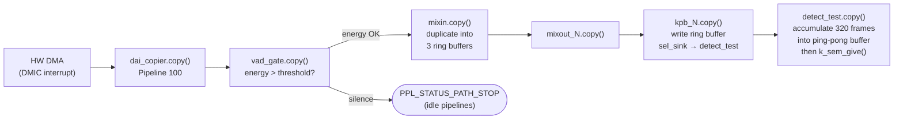
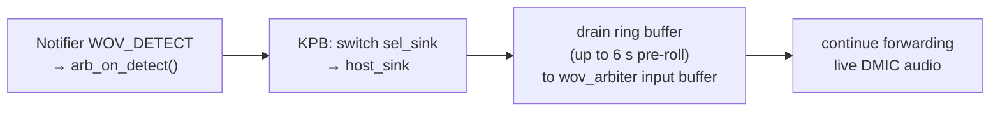
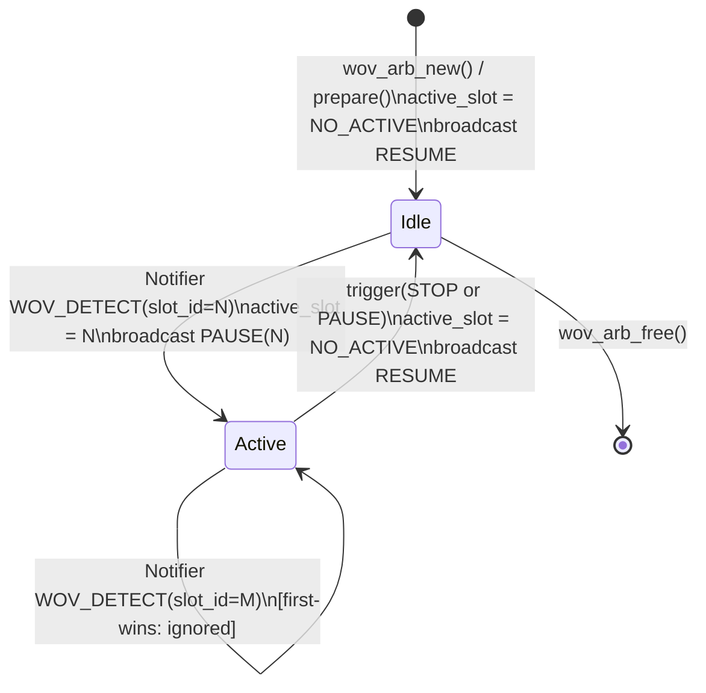
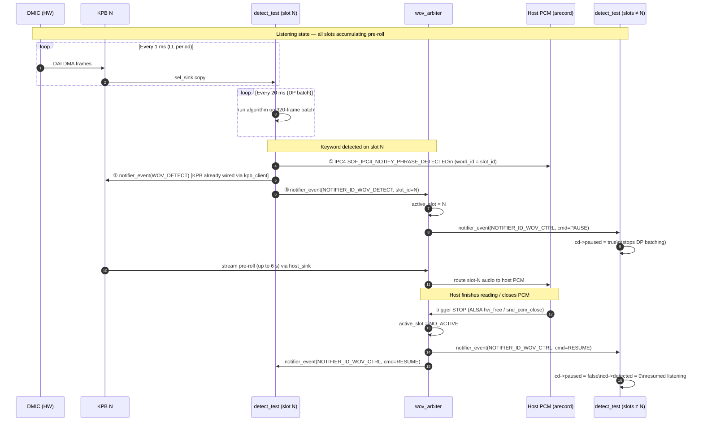

# Multi-Slot Wake-On-Voice (WOV) Architecture & Arbitration

## Overview

The Multi-Slot WOV subsystem lets a single DMIC feed up to 3 concurrent keyword detectors
running on the DSP. Each detector has its own Keyphrase Buffer (KPB) that continuously records
a pre-roll window (6 seconds on TigerLake, 2.1 seconds on other platforms). When any detector
fires the `wov_arbiter` drains that KPB's ring buffer to the single host PCM device and pauses
the other detectors. When the host closes the stream the arbiter resumes all detectors.

This design keeps host DMA live and eliminates the wakeup latency normally incurred by starting
DMA after detection.

---

## Table of Contents

1. [System Architecture](#system-architecture)
2. [Signal Processing Flow](#signal-processing-flow)
3. [Arbiter State Machine](#arbiter-state-machine)
4. [SOF Notifier Inter-Module Signaling](#sof-notifier-inter-module-signaling)
5. [Firmware API Reference](#firmware-api-reference)
6. [Linux Host API Reference](#linux-host-api-reference)
7. [Adding a New WOV Algorithm](#adding-a-new-wov-algorithm)
8. [Topology: Build and Deploy](#topology-build-and-deploy)
9. [Build System Configuration](#build-system-configuration)
10. [Testing and Verification](#testing-and-verification)

---

## System Architecture

### Component Graph


### Key Design Points

| Property | Value |
|---|---|
| Audio format | 16 kHz · 1ch · S16_LE throughout |
| KPB pre-roll (TigerLake) | 6 000 ms (192 000 bytes) |
| KPB pre-roll (other) | 2 100 ms |
| Max arbiter slots | 3 (topology), 8 (header constant) |
| Arbitration policy | First-wins; subsequent detections ignored until RESUME |
| Slot 2 core affinity | DSP Core 1 (cross-core scheduling validation) |
| Host PCM | card 0, device 11 — `hw:0,11` |

---

## Signal Processing Flow

### LL Thread Path (every 1 ms)



### DP Thread Path (every 20 ms per slot)

Each slot has its own `k_thread` at `K_PRIO_PREEMPT(12)`.  Slot 2 is additionally pinned to
DSP Core 1 via `k_thread_cpu_pin()`.


### KPB Drain Sequence (triggered by Notifier)



---

## Arbiter State Machine



### `wov_arb_copy()` Routing Logic

| Condition | Active slot buffer | Idle slot buffers | Sink output |
|---|---|---|---|
| `active_slot == NO_ACTIVE` | — | drained and discarded | filled with silence (memset 0) |
| `active_slot == N` | copied frame-aligned to sink | drained and discarded | pre-roll + live audio |

The first-wins guard in `arb_on_detect()`:

```c
if (cd->active_slot != WOV_ARB_NO_ACTIVE) {
    comp_warn(dev, "wov_arb: slot %u fired but slot %u already active, ignoring",
              det->slot_id, cd->active_slot);
    return;
}
```

---

## SOF Notifier Inter-Module Signaling

The SOF Notifier system (`src/include/sof/lib/notifier.h`) is SOF's intra-DSP
publish/subscribe bus.  It works on all platforms (no `CONFIG_AMS` required) and
is already used for KPB client events.  Signals are delivered synchronously to
all registered listeners on the calling core.

### Signal Catalog

| Notifier ID | Direction | Payload struct | Purpose |
|---|---|---|---|
| `NOTIFIER_ID_WOV_DETECT` | detector → arbiter | `struct wov_detect_notif { uint8_t slot_id; }` | Announce keyword detection |
| `NOTIFIER_ID_WOV_CTRL` | arbiter → all detectors | `struct wov_ctrl_notif { uint8_t cmd; }` | Pause/resume detectors |

`cmd` values: `WOV_ARB_CMD_PAUSE`, `WOV_ARB_CMD_RESUME` (defined in `wov_arbiter.h`).

### Full Detect-to-Drain Sequence



---

## Firmware API Reference

### IPC4 Module Parameters (`LARGE_CONFIG_SET`)

#### `detect_test` — slot assignment via `wov_init_1NN` bytes kcontrol

Each `detect_test` instance exposes an ALSA bytes TLV kcontrol that configures the
slot assignment at runtime.  The topology creates three such kcontrols:

| ALSA kcontrol name | numid | Target module | Slot |
|---|---|---|---|
| `wov_init_101` | 8 | `wov.101.1` (Core 0) | 0 |
| `wov_init_102` | 9 | `wov.102.1` (Core 0) | 1 |
| `wov_init_103` | 10 | `wov.103.1` (Core 1) | 2 |

The write must be issued **before** `PREPARE` fires — write the kcontrols
immediately after forking `arecord` into the background, before it has finished
`hw_params`.  If the `PREPARE` IPC lands while `wov_slot_id` is still `0xff`
(`WOV_SLOT_INVALID`), the DP thread is not started and the notifier is not
registered for that slot.

The TLV payload format and a ready-to-use Python helper are in
[Testing and Verification](#testing-and-verification).

#### `wov_arbiter` — slot count from `nb_input_pins`

The arbiter reads the number of active slots from `ipc4_base_module_cfg_ext.nb_input_pins`
(set in `wov-arbiter.conf` via `num_input_pins = 3`).

### Notifier Registration

A WOV detector must register for `WOV_CTRL` notifications during `prepare()`:

```c
notifier_register(dev, NULL, NOTIFIER_ID_WOV_CTRL, on_wov_ctrl, 0);
```

Unregister in `free()`:

```c
notifier_unregister(dev, NULL, NOTIFIER_ID_WOV_CTRL);
```

### `detect_test_notify(dev)` — Detection Announcement

Call this from your detection algorithm when a keyword is confirmed:

```c
void detect_test_notify(const struct comp_dev *dev);
```

Internally executes three steps:
1. Sends `SOF_IPC4_NOTIFY_PHRASE_DETECTED` IPC4 notification to host
2. Sends `kpb_client` notifier event to KPB → triggers pre-roll drain on `host_sink`
3. Fires `notifier_event(NOTIFIER_ID_WOV_DETECT)` → `wov_arbiter.arb_on_detect()` activates this slot

### DP Thread Ping-Pong Buffer Contract

| Field | Type | Semantics |
|---|---|---|
| `dp_buf[2][320]` | `int16_t` | ping-pong accumulation buffer |
| `dp_buf_frames` | `uint32_t` | frames in write slot (0 to 319) |
| `dp_write_slot` | `uint8_t` | index (0 or 1) LL writes into |
| `dp_read_slot` | `uint8_t` | index DP thread reads from |
| `dp_sem` | `struct k_sem` | binary semaphore, max count = 1 |
| `dp_thread_active` | `bool` | false → thread exits on next wake |

LL thread gives semaphore after every 320 accumulated frames.
DP thread takes semaphore and processes `dp_buf[dp_read_slot]`.
Missing a give (while thread is still processing) drops that batch silently
(semaphore max count = 1 prevents accumulation).

---

## Linux Host API Reference

### ALSA Capture

The WOV audio is exposed as a standard ALSA PCM capture device:

```
Card: 0   Device: 11   Name: "DMIC Multi-WOV"
Formats:  S16_LE, S24_LE, S32_LE
Rate:     16000 Hz
Channels: 1 (mono)
```

Open and capture with `arecord`:

```bash
arecord -Dhw:0,11 -r 16000 -c 1 -f S16_LE -d 10 /tmp/wov_capture.wav
```

Or via libasound in code:

```c
snd_pcm_t *handle;
snd_pcm_open(&handle, "hw:0,11", SND_PCM_STREAM_CAPTURE, 0);
snd_pcm_set_params(handle, SND_PCM_FORMAT_S16_LE,
                   SND_PCM_ACCESS_RW_INTERLEAVED,
                   1, 16000, 1, 100000 /* 100ms latency */);
```

### Voice Detection Notification from Firmware

When a keyword is detected the firmware sends an IPC4 `SOF_IPC4_NOTIFY_PHRASE_DETECTED`
notification. The SOF kernel driver surfaces this as an ALSA control-change event on a
`SOUNDWIRE_DETECT` or `KWD_DETECT` kcontrol (exact name depends on machine driver).

To poll for the notification from userspace:

```c
/* Open ALSA control interface */
snd_ctl_t *ctl;
snd_ctl_open(&ctl, "hw:0", 0);

/* Subscribe to events */
snd_ctl_subscribe_events(ctl, 1);

/* Block until a control change event arrives */
snd_ctl_event_t *event;
snd_ctl_event_alloca(&event);
while (snd_ctl_read(ctl, event) >= 0) {
    if (snd_ctl_event_get_type(event) == SND_CTL_EVENT_ELEM) {
        /* Trigger: start reading from hw:0,11 */
        break;
    }
}
```

The `word_id` field in the IPC4 notification carries the `wov_slot_id` (0, 1, or 2),
identifying which detector fired.

### Audio Capture Timing

Because host DMA is live from the moment `arecord` opens `hw:0,11`, the ALSA
buffer begins filling with `wov_arbiter` output immediately:

- **Before any trigger**: arbiter writes silence (all-zero samples)
- **On trigger**: arbiter drains the KPB ring buffer (up to 6 s of pre-roll) then
  continues forwarding live DMIC audio
- **On STOP**: arbiter returns to silence mode; detectors resume listening

The host sees a seamless audio stream. The silence-to-audio transition marks the
trigger point in the buffer.

### IPC4 Module Control via `sof-ctl`

Override the slot assignment for a `detect_test` instance using the SOF IPC4
LARGE_CONFIG_SET path (requires `sof-ctl` tool or equivalent hwdep ioctl):

```bash
# Set detect_test in pipeline 102 to use slot_id = 1
sof-ctl -c hw:0 -t large_config_set \
    -m <module_id> -i <instance_id> \
    -p 202 -b 00000000 01   # param_id=202 (SOF_IPC4_BYTES_CONTROL_PARAM_ID), slot_id=1
```

---

## Adding a New WOV Algorithm

The reference implementation (`detect_test.c`) is intentionally simple — it looks for
zero-crossing rate and signal energy in fixed frequency bands. Replace it with any
algorithm by following one of the approaches below.

### Approach A — Modify `detect_test.c` directly

This is simplest for prototyping. The DP thread calls `default_detect_test_buf()` on
every 320-frame batch. Replace its body with your algorithm:

```c
/* src/samples/audio/detect_test.c */

static void default_detect_test_buf(struct comp_dev *dev,
                                    const int16_t *samples, uint32_t frames)
{
    struct comp_data *cd = comp_get_drvdata(dev);

    if (cd->detected || cd->paused)
        return;

    /* === YOUR ALGORITHM HERE ===
     * Input:  samples — pointer to 'frames' interleaved S16_LE samples
     *         frames  — always KD_DP_FRAMES (320) = 20 ms @ 16 kHz
     * Output: call detect_test_notify(dev) when keyword is confirmed.
     * ===========================
     */
    bool keyword_found = my_algorithm_process(cd->algo_state, samples, frames);

    if (keyword_found) {
        comp_err(dev, "KWD detected on slot %u", cd->wov_slot_id);
        if (!cd->drain_req)
            cd->drain_req = cd->config.drain_req ? cd->config.drain_req : 5000;
        detect_test_notify(dev);
        cd->detected = 1;
    }
}
```

Store per-slot algorithm state in `struct comp_data` (add fields to the struct).
The slot index is available as `cd->wov_slot_id` (0, 1, or 2) so each KPB pipeline's
detector can hold independent model state.

### Approach B — New Native SOF Module

For a production algorithm create a new SOF module following the standard
`src/audio/template/` skeleton and integrate it with the arbiter via SOF notifier:

**Step 1: Create the module files**

```
src/audio/my_kwd/
├── CMakeLists.txt
├── my_kwd.c
└── my_kwd.h
```

**Step 2: Implement the module driver**

```c
/* src/audio/my_kwd/my_kwd.c */
#include <sof/audio/component.h>
#include <sof/lib/notifier.h>
#include <sof/audio/wov_arbiter.h>
#include <sof/audio/kpb.h>

struct my_kwd_data {
    uint8_t  wov_slot_id;
    bool     paused;
    bool     detected;
    /* ... algorithm state ... */
};

/* Called by arbiter when a sibling slot fires (NOTIFIER_ID_WOV_CTRL) */
static void on_wov_ctrl(void *arg, enum notify_id id, void *data)
{
    struct comp_dev *dev = arg;
    struct my_kwd_data *cd = comp_get_drvdata(dev);
    const struct wov_ctrl_notif *ctrl = data;

    if (ctrl->cmd == WOV_ARB_CMD_PAUSE)
        cd->paused = true;
    else if (ctrl->cmd == WOV_ARB_CMD_RESUME) {
        cd->paused   = false;
        cd->detected = 0;
    }
}

/* Notify arbiter + KPB + host that this slot fired */
static void my_kwd_notify(struct comp_dev *dev)
{
    struct my_kwd_data *cd = comp_get_drvdata(dev);

    /* 1. IPC4 notification to host */
    struct ipc4_voice_cmd_notification notif = {};
    notif.primary.r.word_id    = cd->wov_slot_id;
    notif.primary.r.notif_type = SOF_IPC4_NOTIFY_PHRASE_DETECTED;
    notif.primary.r.type       = SOF_IPC4_GLB_NOTIFICATION;
    /* ... fill in module_id / instance_id ... */
    ipc_msg_send(cd->msg, &notif, true);

    /* 2. Tell KPB to start draining */
    /* (re-use existing kpb_client notifier path) */

    /* 3. Tell arbiter slot fired */
    struct wov_detect_notif det = { .slot_id = cd->wov_slot_id };
    notifier_event(dev, NOTIFIER_ID_WOV_DETECT, NOTIFIER_TARGET_CORE_ALL_MASK,
                    &det, sizeof(det));
}

static int my_kwd_prepare(struct comp_dev *dev)
{
    struct my_kwd_data *cd = comp_get_drvdata(dev);

    /* Derive slot from pipeline ID */
    uint32_t ppl = dev->ipc_config.pipeline_id;
    cd->wov_slot_id = (ppl == 101 || ppl == 1) ? 0 :
                      (ppl == 102 || ppl == 3) ? 1 :
                      (ppl == 103 || ppl == 4) ? 2 : WOV_SLOT_INVALID;

    if (cd->wov_slot_id != WOV_SLOT_INVALID)
        notifier_register(dev, NULL, NOTIFIER_ID_WOV_CTRL, on_wov_ctrl, 0);

    return comp_set_state(dev, COMP_TRIGGER_PREPARE);
}

static int my_kwd_copy(struct comp_dev *dev)
{
    struct my_kwd_data *cd = comp_get_drvdata(dev);
    struct comp_buffer *source = comp_dev_get_first_data_producer(dev);

    if (!audio_stream_get_avail(&source->stream))
        return PPL_STATUS_PATH_STOP;

    uint32_t frames    = audio_stream_get_avail_frames(&source->stream);
    uint32_t avail_b   = audio_stream_get_avail_bytes(&source->stream);
    buffer_stream_invalidate(source, avail_b);

    /* Pass-through to arbiter input */
    struct comp_buffer *sink = comp_dev_get_first_data_consumer(dev);
    if (sink && audio_stream_get_free_bytes(&sink->stream) >= avail_b) {
        audio_stream_copy(&source->stream, 0, &sink->stream, 0,
                          frames * audio_stream_get_channels(&source->stream));
        buffer_stream_writeback(sink, avail_b);
        comp_update_buffer_produce(sink, avail_b);
    }

    if (!cd->paused && !cd->detected) {
        /* Run your algorithm on the frames */
        if (my_algorithm_run(cd, &source->stream, frames)) {
            my_kwd_notify(dev);
            cd->detected = 1;
        }
    }

    comp_update_buffer_consume(source, avail_b);
    return 0;
}
```

**Step 3: Register the UUID**

Add to `uuid-registry.txt`:

```
MY_KWD_UUID_HEX    my_kwd
```

Add to `src/audio/my_kwd/CMakeLists.txt`:

```cmake
add_local_sources(sof my_kwd.c)
```

Add to `src/audio/CMakeLists.txt`:

```cmake
if(CONFIG_COMP_MY_KWD)
    add_subdirectory(my_kwd)
endif()
```

Add `src/audio/Kconfig`:

```kconfig
config COMP_MY_KWD
    bool "My keyword detector"
    depends on COMP_KPB && IPC_MAJOR_4
    # no AMS required (uses SOF notifier)
```

**Step 4: Update the topology**

In `dmic-wov-multi.conf`, replace `KWD_TEST_UUID` with the UUID bytes for `my_kwd`
in the `wov.101.1`, `wov.102.1`, `wov.103.1` widgets.

### Approach C — IADK / LLEXT loadable module

For algorithms that must ship as separate binaries (third-party IP, updatable
without reflashing), use the SOF IADK module adapter framework. The algorithm
is compiled as an LLEXT `.so` and loaded at runtime from the kernel filesystem.
See `src/audio/module_adapter/README.md` for the full IADK API.

The notifier signaling path (steps 2 and 3 of `my_kwd_notify`) remains the same;
only the binary delivery mechanism changes.

### Algorithm State Isolation

Each pipeline instance (101/102/103) creates its own `comp_dev` with independent
`comp_data`. Detector state is never shared between slots. The `wov_slot_id` field
identifies which pipeline a given instance belongs to:

```
Pipeline 101  →  wov_slot_id=0  →  kd_dp_stack_0 / kd_dp_threads[0]
Pipeline 102  →  wov_slot_id=1  →  kd_dp_stack_1 / kd_dp_threads[1]
Pipeline 103  →  wov_slot_id=2  →  kd_dp_stack_2 / kd_dp_threads[2] (Core 1)
```

---

## Topology: Build and Deploy

### Topology Source Layout

```
tools/topology/topology2/
├── platform/intel/
│   └── dmic-wov-multi.conf          ← main topology (edit here)
├── include/components/
│   └── wov-arbiter.conf             ← wov_arbiter widget class definition
└── dmic-wov-multi-manifest.conf     ← top-level manifest (includes above)
```

### Compile Topology to `.tplg`

From the root of the SOF repository:

```bash
ALSA_CONFIG_DIR=tools/topology/topology2 \
alsatplg \
    -I tools/topology/topology2 \
    -p \
    -c tools/topology/topology2/dmic-wov-multi-manifest.conf \
    -o sof-hda-generic-wov.tplg
```

Copy the compiled topology to the DUT:

```bash
scp sof-hda-generic-wov.tplg \
    root@<dut>:/lib/firmware/intel/sof-ipc4-tplg/sof-hda-generic-wov.tplg
```

Tell the SOF driver which topology to load (edit `/etc/modprobe.d/sof.conf` on the DUT):

```
options snd_sof_pci_intel_tgl fw_path=intel/sof-ipc4/tgl \
    tplg_path=intel/sof-ipc4-tplg tplg_filename=sof-hda-generic-wov.tplg
```

Or pass directly at `modprobe` time:

```bash
modprobe snd_sof_pci_intel_tgl \
    tplg_filename=intel/sof-ipc4-tplg/sof-hda-generic-wov.tplg
```

### Build Firmware with WOV Arbiter

Configure a build directory with the required Kconfig options (see
[Build System Configuration](#build-system-configuration)), then build:

```bash
ninja -C <build-dir>
```

Copy the firmware image to the DUT (path varies by platform):

```bash
# TigerLake example
scp <build-dir>/zephyr/zephyr.ri \
    root@<dut>:/lib/firmware/intel/sof-ipc4/tgl/community/sof-tgl.ri
```

Reload the driver on the DUT:

```bash
rmmod snd_sof_pci_intel_tgl && modprobe snd_sof_pci_intel_tgl
```

### Topology Configuration Reference

Key parameters in `dmic-wov-multi.conf`:

| Constant | Default | Description |
|---|---|---|
| `DMIC_PCM_ID` | `11` | ALSA PCM device index |
| `DMIC_DAI_INDEX` | `1` | HDA DAI instance |
| `KWD_CPC` | `100000` | cycles per chunk for detector widgets |
| `WOV_ARB_CPC` | `20000` | cycles per chunk for arbiter |
| `VAD_GATE_CPC` | `5000` | cycles per chunk for VAD gate |
| `FORMAT` | `s16le` | audio format throughout |

Slot 2 (`Pipeline 103`) is deliberately placed on Core 1 (`core_id = 1`) to validate
cross-core scheduling. Set all three to `core_id = 0` if a single-core topology is needed.

### Adding a Fourth Slot

1. Add `Pipeline 104` (new KPB + detector) following the pattern of pipelines 101–103.
   Route the new `wov.104.1 → wov-arbiter.105.1`.
2. Update `wov_arbiter.conf`: set `num_input_pins = 4`.
3. Update `wov_arbiter.h`: `WOV_ARB_MAX_SLOTS 8` already supports it.
4. Add the new `pipeline_id → wov_slot_id` mapping in `test_keyword_new()`.
5. Add a fourth `K_THREAD_STACK_DEFINE` and update `kd_dp_stacks[]`.

---

## Build System Configuration

### Kconfig (minimum required set)

```kconfig
# Mandatory
CONFIG_COMP_WOV_ARBITER=y
CONFIG_COMP_KPB=y
CONFIG_COMP_MIXIN_MIXOUT=y
CONFIG_IPC_MAJOR_4=y

# For the detect_test reference detector
CONFIG_COMP_KWD_DETECT=y

# For VAD-gated ingress
CONFIG_COMP_VAD_GATE=y         # or any other gate component

# Multi-core scheduling (required for slot 2 on Core 1)
CONFIG_SMP=y
CONFIG_MP_MAX_NUM_CPUS=4       # TGL has 4 DSP cores
CONFIG_SCHED_CPU_MASK_PIN_ONLY=y
```

These can be set via `west build -- -DCONFIG_...=y` or by editing the build directory's `zephyr/.config`.

### Module UUIDs

| Component | UUID |
|---|---|
| `detect_test` (KWD_TEST) | `1f:d5:a8:eb:27:78:b5:47:82:ee:de:6e:77:43:af:67` |
| `wov_arbiter` | `4a5b6c7d-8e9f-4a1b-2c3d-4e5f60718293` |
| `vad_gate` | `5f:6e:7d:8c:3b:4a:1d:2c:0e:9f:8a:7b:6c:5d:4e:3f` |

---

## Testing and Verification

### Quick Start (TigerLake / spider DUT)

```bash
# 0. Load the driver with the WOV firmware and topology
rmmod snd_sof_pci_intel_tgl
modprobe snd_sof_pci_intel_tgl \
    fw_path=intel/sof-ipc4/tgl/community \
    tplg_filename=intel/sof-ipc4-tplg/sof-tgl-dmic-wov-multi.tplg

# 1. Verify the capture PCM is visible
arecord -l | grep "DMIC Multi-WOV"   # expect: card 0: device 11

# 2. Run a per-slot trigger test (see below)
```

---

### Slot Assignment via `wov_init_1NN` kcontrol

Each `detect_test` instance reads its `wov_slot_id` from a bytes TLV kcontrol
(`wov_init_101 / 102 / 103`, numids 8 / 9 / 10).  The assignment must arrive
**before** the PCM `PREPARE` IPC — write the kcontrols immediately after forking
`arecord` into the background:

```bash
arecord -Dhw:0,11 -r 16000 -c 1 -f S16_LE -d 10 /tmp/wov.wav &
# Race the PREPARE: write all three kcontrols before hw_params completes
python3 set_wov_slot.py 8 0    # wov_init_101 → slot 0
python3 set_wov_slot.py 9 1    # wov_init_102 → slot 1
python3 set_wov_slot.py 10 2   # wov_init_103 → slot 2
wait
```

To **disable** a slot (useful for per-slot isolation tests), write
`slot_id = 255` (`WOV_SLOT_INVALID`) — the DP thread is not started for that slot:

```bash
python3 set_wov_slot.py 8 255   # disable slot 0
```

#### `set_wov_slot.py` — TLV helper script

Copy to the DUT as `/tmp/set_wov_slot.py`.  The script builds the two-level
`snd_ctl_tlv` + `sof_abi_hdr` required by the SOF IPC4 bytes kcontrol path
(`SOF_IPC4_BYTES_CONTROL_PARAM_ID = 202`):

```python
#!/usr/bin/env python3
# Usage: set_wov_slot.py <numid> <slot_id>
#   numid: 8=wov_init_101 (slot 0), 9=wov_init_102 (slot 1), 10=wov_init_103 (slot 2)
#   slot_id: 0-2 to enable; 255 to disable (WOV_SLOT_INVALID)
import sys, fcntl, struct, os

SOF_IPC4_ABI_MAGIC              = 0x34464F53
SOF_CTRL_CMD_BINARY             = 3
SOF_IPC4_BYTES_CONTROL_PARAM_ID = 202
SNDRV_CTL_IOCTL_TLV_WRITE      = (1 << 30) | (8 << 16) | (0x55 << 8) | 0x1b

numid, slot_id = int(sys.argv[1]), int(sys.argv[2])

payload_size   = 4
sizeof_abi_hdr = 32
inner_length   = sizeof_abi_hdr + payload_size   # 36
outer_length   = 8 + inner_length                # 44

abi_hdr  = (struct.pack('<IIII', SOF_IPC4_ABI_MAGIC,
                         SOF_IPC4_BYTES_CONTROL_PARAM_ID, payload_size, 0)
            + bytes(16))
payload  = struct.pack('<I', slot_id)

ioctl_buf = (struct.pack('<II', numid, outer_length) +
             struct.pack('<II', SOF_CTRL_CMD_BINARY, inner_length) +
             abi_hdr + payload)

fd = os.open('/dev/snd/controlC0', os.O_RDWR)
try:
    fcntl.ioctl(fd, SNDRV_CTL_IOCTL_TLV_WRITE, bytearray(ioctl_buf))
    print(f'OK: numid={numid} slot_id={slot_id}')
except OSError as e:
    print(f'FAIL: {e}'); sys.exit(1)
finally:
    os.close(fd)
```

---

### Per-Slot Trigger Test

The `detect_test` DP thread auto-triggers after accumulating **320 frames** (one 20 ms
batch, `frames_total >= KD_DP_FRAMES`).  The first batch fires the trigger approximately
14–25 ms after pipeline RUNNING.  No physical audio source is required.

#### Test all three slots simultaneously

```bash
dmesg -C
arecord -Dhw:0,11 -r 16000 -c 1 -f S16_LE -d 10 /tmp/wov_all.wav &
AREC=$!
python3 set_wov_slot.py 8 0
python3 set_wov_slot.py 9 1
python3 set_wov_slot.py 10 2
wait $AREC
echo "rc=$?"
```

Expected: `rc=0`.  Slot 0 fires first (timing-dependent); the arbiter pauses slots 1
and 2 via `NOTIFIER_ID_WOV_CTRL`.

#### Test a single slot in isolation

```bash
# Disable the other two slots before starting arecord
python3 set_wov_slot.py 8 255   # disable slot 0 (persists across sessions)
python3 set_wov_slot.py 10 255  # disable slot 2

arecord -Dhw:0,11 -r 16000 -c 1 -f S16_LE -d 5 /tmp/wov_s1.wav &
AREC=$!
python3 set_wov_slot.py 9 1     # enable slot 1 only
wait $AREC
echo "rc=$?"
```

Repeat for each slot, rotating which `set_wov_slot.py` calls use `255` vs a valid ID.

#### Verify audio content

Silence precedes the trigger; real DMIC audio follows.
The silence-to-audio boundary marks the trigger point (∼20 ms into the file).

```python
import struct, math, sys

for fname in sys.argv[1:]:
    data = open(fname, 'rb').read()[44:]   # skip 44-byte WAV header
    n    = len(data) // 2
    samp = struct.unpack_from(f'<{n}h', data)
    nz   = next((i for i, x in enumerate(samp) if x != 0), n)
    rms  = math.sqrt(sum(x*x for x in samp[800:]) / max(len(samp) - 800, 1))
    print(f'{fname}: first_nz={nz*1000/16000:.1f}ms  post_trigger_RMS={rms:.0f}')

# Expected on TGL (silent room):
#   first_nz=14-25 ms      (arbiter activates after first DP batch)
#   post_trigger_RMS > 100 (ambient DMIC noise -- not silence)
```

---

### Reading Firmware Trace (mtrace)

The mtrace ring is at `/sys/kernel/debug/sof/mtrace/core{0,1}`.  Each `dd` call
advances the FIFO read pointer; start reading **before** the arecord session to
capture pipeline-prepare and trigger messages.

```bash
# Capture ~1 MB of firmware trace concurrently with an arecord session
dd if=/sys/kernel/debug/sof/mtrace/core0 bs=65536 count=16 of=/tmp/mt.bin &
arecord -Dhw:0,11 -r 16000 -c 1 -f S16_LE -d 5 /tmp/wov.wav &
python3 set_wov_slot.py 8 0
python3 set_wov_slot.py 9 1
python3 set_wov_slot.py 10 2
wait

# strings works because SOF embeds full format strings in the binary
grep -a 'kd_test\|wov_arb\|AUTO-TRIGGER\|TRIGGERED' /tmp/mt.bin
```

For **slot 2** (pinned to Core 1) the DP-thread log is on the Core 1 ring:

```bash
dd if=/sys/kernel/debug/sof/mtrace/core1 bs=65536 count=4 2>/dev/null | \
    grep -a 'AUTO-TRIGGER'
```

---

### Expected Trace Events

After `arecord` opens `hw:0,11` (pipeline prepare + RUNNING):

```
kd_test.test_keyword_prepare: comp:4 0x2000d  kd_dp thread started for slot 0
kd_test.test_keyword_prepare: comp:3 0x1000d  kd_dp thread started for slot 1
kd_test.test_keyword_prepare: comp:1 0xd      kd_dp thread started for slot 2 (pinned to core 1)
wov_arbiter.wov_arb_trigger:  comp:2 0x10     wov_arb_trigger cmd 1
```

On auto-trigger (slot 0 fires first):

```
kd_test.default_detect_test_buf: comp:4 0x2000d  kd_test dp: AUTO-TRIGGER slot=0
kd_test.notify_host:             comp:4 0x2000d  notify_host: WOV module_id=0x2 instance_id=0xd slot_id=0 detected
wov_arbiter.arb_on_detect:      comp:2 0x10     wov_arb: activating slot 0
kd_test.on_wov_ctrl:             comp:1 0xd      kd: paused (slot 0 active)
kd_test.on_wov_ctrl:             comp:3 0x1000d  kd: paused (slot 0 active)
kd_test.on_wov_ctrl:             comp:4 0x2000d  kd: resumed by arbiter
```

On stream stop (arecord exits):

```
wov_arbiter.wov_arb_trigger: comp:2 0x10    wov_arb_trigger cmd 0
kd_test.on_wov_ctrl:          comp:1 0xd    kd: resumed by arbiter
kd_test.on_wov_ctrl:          comp:3 0x1000d kd: resumed by arbiter
kd_test.on_wov_ctrl:          comp:4 0x2000d kd: resumed by arbiter
```

> **Timing note:** if the `PREPARE` IPC arrives before any `wov_init_1NN` kcontrol
> write, the log shows no `kd_dp thread started` for that slot.  The slot remains at
> `wov_slot_id = 0xff` and falls back to the 8-second direct-path auto-trigger instead
> of the 20 ms DP-thread path.

---

### Real-Audio Frequency Sweep Test

Inject tones at known frequencies to trigger specific slots. Run `arecord` on the
DUT and `speaker-test` on a test machine whose audio output is wired to the DUT mic input:

```bash
# On the DUT: start capture and set all slots
arecord -Dhw:0,11 -r 16000 -c 1 -f S16_LE -d 30 /tmp/wov_sweep.wav &
python3 set_wov_slot.py 8 0 && python3 set_wov_slot.py 9 1 && python3 set_wov_slot.py 10 2

# On test machine: drive tone sweep (one frequency band per slot)
speaker-test -c 1 -t sine -f 120 -l 3   # -> slot 0 (Male 80-170 Hz)
speaker-test -c 1 -t sine -f 220 -l 3   # -> slot 1 (Female 175-270 Hz)
speaker-test -c 1 -t sine -f 350 -l 3   # -> slot 2 (Child 275-500 Hz)
wait
```
