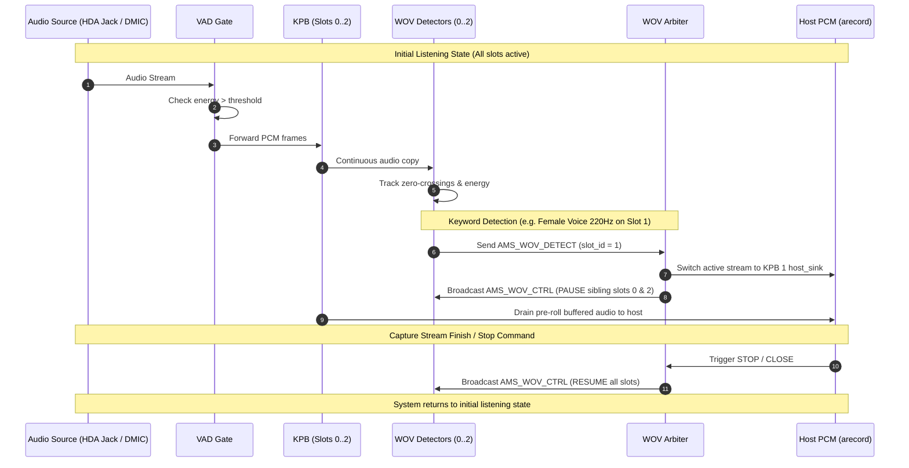

# Multi-Slot Wake-On-Voice (WOV) Architecture & Arbitration

## Overview

The Multi-Slot Wake-On-Voice (WOV) subsystem in Sound Open Firmware (SOF) provides a scalable, low-power architecture for running multiple concurrent keyphrase/voice detectors (e.g., Male, Female, and Child voice frequency profiles) over a shared audio capture source. 

It combines energy-based voice activity gating, multi-channel ring buffering (KPB), frequency-differentiated detectors, and exclusive host PCM stream arbitration.

---

## System Architecture

```mermaid
graph TD
    subgraph Capture_Input["Pipeline 100: Capture & Gating (Core 0)"]
        DAI["DAI Copier (3.5mm HDA Jack / DMIC)"] --> VAD["VAD Gate (Energy Estimator)"]
        VAD --> MIXIN["Mixin (1-to-3 Fan-out)"]
    end

    subgraph Slot0["Pipeline 101: Slot 0 (Core 0)"]
        MIXOUT0["Mixout 0"] --> KPB0["KPB 0 (Ring Buffer)"]
        KPB0 -- "sel_sink" --> WOV0["Detector 0: Male (80-170 Hz)"]
        KPB0 -- "host_sink" --> ARB_IN0["Arbiter Input 0"]
    end

    subgraph Slot1["Pipeline 102: Slot 1 (Core 0)"]
        MIXOUT1["Mixout 1"] --> KPB1["KPB 1 (Ring Buffer)"]
        KPB1 -- "sel_sink" --> WOV1["Detector 1: Female (175-270 Hz)"]
        KPB1 -- "host_sink" --> ARB_IN1["Arbiter Input 1"]
    end

    subgraph Slot2["Pipeline 103: Slot 2 (Core 1)"]
        MIXOUT2["Mixout 2"] --> KPB2["KPB 2 (Ring Buffer)"]
        KPB2 -- "sel_sink" --> WOV2["Detector 2: Child (275-500 Hz)"]
        KPB2 -- "host_sink" --> ARB_IN2["Arbiter Input 2"]
    end

    subgraph Arbiter_Output["Pipeline 104: Arbitration & Host Capture (Core 0)"]
        ARB_IN0 --> ARB["WOV Arbiter"]
        ARB_IN1 --> ARB
        ARB_IN2 --> ARB
        ARB --> HOST["Host Copier (Card 0 PCM 11)"]
    end

    subgraph Messaging["AMS Inter-Module Control"]
        WOV0 -- "AMS_WOV_DETECT (Slot 0)" --> ARB
        WOV1 -- "AMS_WOV_DETECT (Slot 1)" --> ARB
        WOV2 -- "AMS_WOV_DETECT (Slot 2)" --> ARB
        ARB -- "AMS_WOV_CTRL (PAUSE/RESUME)" --> WOV0
        ARB -- "AMS_WOV_CTRL (PAUSE/RESUME)" --> WOV1
        ARB -- "AMS_WOV_CTRL (PAUSE/RESUME)" --> WOV2
    end

    MIXIN --> MIXOUT0
    MIXIN --> MIXOUT1
    MIXIN --> MIXOUT2

    style VAD fill:#2d5a27,stroke:#333,stroke-width:2px
    style ARB fill:#1c4966,stroke:#333,stroke-width:2px
    style WOV0 fill:#663300,stroke:#333,stroke-width:1px
    style WOV1 fill:#660033,stroke:#333,stroke-width:1px
    style WOV2 fill:#003366,stroke:#333,stroke-width:1px
```



---

## Event Sequence & Arbitration Flow



---

## Component Roles & Responsibilities

### 1. `vad_gate` (Voice Activity Detector Gate)
- **File**: `src/audio/vad_gate/vad_gate.c`
- **Role**: First-stage low-power energy estimator. Drains silence to prevent DAI DMA stall while returning `PPL_STATUS_PATH_STOP` during silence to keep downstream DSP pipelines idled.

### 2. `mixin_mixout` (Fan-Out Mixer)
- **File**: `src/audio/mixin_mixout/mixin_mixout.c`
- **Role**: Duplicates input capture audio from Pipeline 100 into parallel detector pipelines 101, 102, and 103.

### 3. `kpb` (Keyphrase Buffer)
- **File**: `src/audio/kpb.c`
- **Role**: Continuous ring-buffer maintaining history (pre-roll). In listening mode, forwards real-time audio to `sel_sink` (`detect_test`). Upon keyword detection, switches to high-speed draining over `host_sink` to host memory.

### 4. `detect_test` (`wov` detector)
- **File**: `src/samples/audio/detect_test.c`
- **Role**: Frequency-differentiated keyphrase detector stub:
  - **Slot 0**: Male voice range (80 Hz – 170 Hz)
  - **Slot 1**: Female voice range (175 Hz – 270 Hz)
  - **Slot 2**: Child voice range (275 Hz – 500 Hz)
- Sends `AMS_WOV_DETECT` message containing `slot_id` to `wov_arbiter` upon match.

### 5. `wov_arbiter` (Arbitration Engine)
- **File**: `src/audio/wov_arbiter/wov_arbiter.c`
- **Role**: Accepts 3 `host_sink` inputs from KPB 0..2 and routes the winning slot's pre-roll buffer to `host-copier`. Broadcasts `AMS_WOV_CTRL` messages (`PAUSE`/`RESUME`) to ensure only one slot drains while preserving listening state.

---

## Topology & Configuration

### Kconfig Options
Enable the required components in `app/prj.conf` or board configuration (`app/boards/intel_adsp_cavs25.conf`):

```kconfig
CONFIG_COMP_WOV_ARBITER=y
CONFIG_COMP_VAD_GATE=y
CONFIG_COMP_KPB=y
CONFIG_COMP_MIXIN_MIXOUT=y
CONFIG_COMP_KWD_DETECT=y
CONFIG_AMS=y
```

### Topology 2 Syntax
Topology configuration file: `tools/topology/topology2/dmic-wov-multi-manifest.conf`

To compile topology into `.tplg` binary:

```bash
ALSA_CONFIG_DIR=tools/topology/topology2 \
alsatplg -I tools/topology/topology2 -p \
-c tools/topology/topology2/dmic-wov-multi-manifest.conf \
-o /lib/firmware/intel/sof-ipc4-tplg/sof-hda-generic-4ch.tplg
```

---

## Testing & Verification Workflow

### 1. Hardware Setup (Spider DUT)
Audio is injected via the 3.5mm HDA Jack Mic input (`Card 0 PCM 11`):

```bash
ssh root@spider 'amixer -c 0 sset Capture 100% cap; amixer -c 0 sset "Mic Boost" 3'
```

### 2. Frequency Sweep Test Execution
Run capture on Spider while generating tone sweeps from testing host:

```bash
# Start capture on DUT
ssh root@spider 'arecord -Dhw:0,11 -r 16000 -c 1 -f S16_LE -d 15 /tmp/wov_multi_capture.wav' &

# Play frequency sweep (Male 120Hz -> Female 220Hz -> Child 350Hz)
speaker-test -Dplughw:1,0 -c 1 -t sine -f 120 -l 2
speaker-test -Dplughw:1,0 -c 1 -t sine -f 220 -l 2
speaker-test -Dplughw:1,0 -c 1 -t sine -f 350 -l 2
```

### 3. Log Inspection (`mtrace`)
Read trace output on Spider to observe frequency evaluations and arbitration events:

```bash
ssh root@spider 'grep -i -E "kd_test|TRIGGERED|wov_arb" /tmp/fw_wov_mtrace.log'
```

**Expected Log Output**:

```text
[ 34.094740] kd_test.test_keyword_new: comp:1 0xd dev_id=0xd pipeline_id=1 (Slot 0 - MALE)
[ 34.096583] kd_test.test_keyword_new: comp:3 0x1000d dev_id=0x1000d pipeline_id=3 (Slot 1 - FEMALE)
[ 34.092470] kd_test.test_keyword_new: comp:4 0x2000d dev_id=0x2000d pipeline_id=4 (Slot 2 - CHILD)

[ 37.014193] kd_test.default_detect_test: comp:1 0xd kd_test eval: slot=0 (MALE), freq=120 Hz
[ 52.000996] kd_test.default_detect_test: comp:4 0x2000d kd_test entry: slot=2 (CHILD), freq=375 Hz

[ 37.257318] wov_arbiter.wov_arb_trigger: comp:2 0x10 wov_arb: stream stopped, resuming all slots
[ 37.257335] kd_test.on_wov_ctrl: comp:4 0x2000d kd: resumed
```
