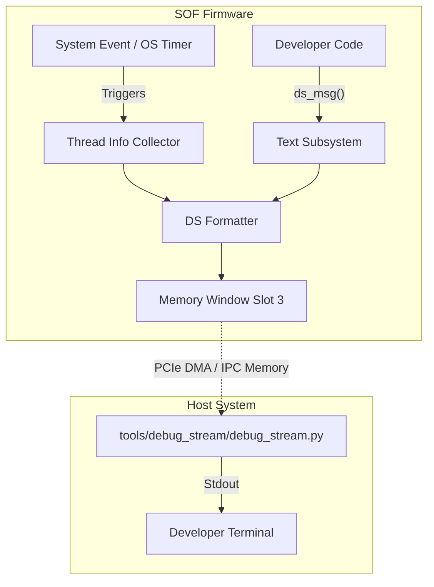

# SOF Debug Stream

The `debug_stream` framework is an abstract logging and live-data streaming mechanism allowing the DSP to asynchronously push structured or freeform diagnostic records immediately out to the host.

## Feature Overview

Unlike standard tracing (`mtrace`), which requires buffering and complex host parsing logic often tied directly to pipeline topologies or ALSA interfaces, the `debug_stream` bypasses the audio framework entirely. It utilizes the dedicated IPC Memory Windows (specifically the debug slot) to write data.

The stream is particularly useful for reporting:

1. **Thread Information:** Real-time data from Zephyr OS threads (like CPU runtime, context switch frequencies, or stack high-water marks).
2. **Text Messages (`ds_msg`):** Lightweight string prints that bypass the standard heavily-formatted logger.

## How to Enable

These features are disabled by default to save firmware footprint. You can enable them via Kconfig:

* `CONFIG_SOF_DEBUG_STREAM_SLOT=y` : Master switch. Reserves exactly one Memory Window 4k block (default Slot 3) mapping to host space.
* `CONFIG_SOF_DEBUG_STREAM_THREAD_INFO=y` : Activates the Zephyr thread statistics compiler integration (`INIT_STACKS`, `THREAD_MONITOR`).
* `CONFIG_SOF_DEBUG_STREAM_TEXT_MSG=y` : Allows calling `ds_msg("...", ...)` scattered throughout DSP C code to emit plain strings.

## Architecture

The architecture revolves around a "Slot" abstraction where data is copied sequentially over a ringbuffer into the ADSP debug window slot used for the debug stream (mapped over PCIe/SPI for the Host to read non-destructively).



## Usage Example

If you enable `CONFIG_SOF_DEBUG_STREAM_TEXT_MSG=y`, developers can insert rapid debug markers without setting up topology traces:

```c
#include <user/debug_stream_text_msg.h>

void my_function() {
    ds_msg("Reached tricky initialization state! Value: %d", some_val);
}
```

On the host machine, you extract this continuous output stream by running the provided SOF tooling:

```bash
python3 tools/debug_stream/debug_stream.py
```
