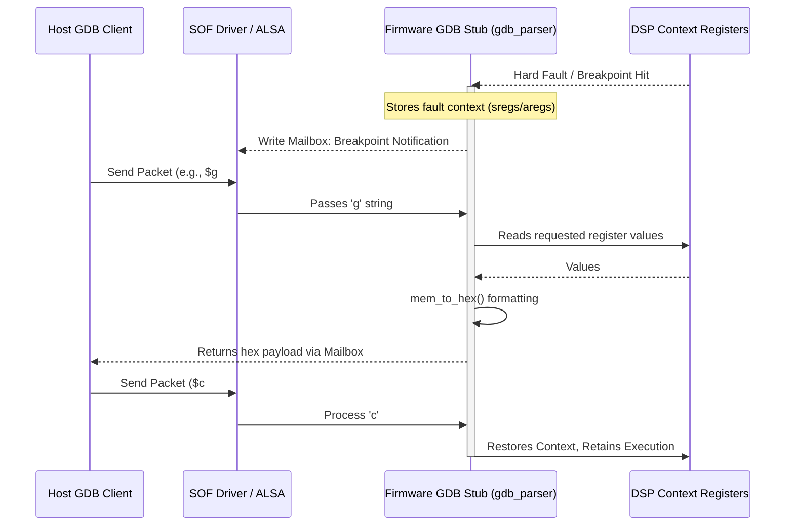

# GDB Remote Debugging Stub

The Sound Open Firmware (SOF) project carries a GNU Debugger (GDB) stub directly integrated with the framework's exception handlers. This translates commands sent by a GDB client (running on the host Linux machine) into architecture-specific logic.

## Feature Overview

Instead of completely relying on complex JTAG setups, developers can use this stub to dynamically introspect panic states, stack traces, and variable states during firmware execution, particularly inside isolated SoC DSP cores.

When the firmware faults or hits a defined breakpoint, the exception vector routes control into this stub. It then waits for GDB Remote Protocol packet streams (ASCII formatted over the SOF mailbox/shared memory window). The Host reads these mailbox slots and pushes/pulls responses to its active GNU Debugger session.

## Architecture

Data moves between the Host GDB environment, the physical mailboxes bounding the DSP domain, the DSP firmware's built-in stub, and the active exception state.

## How to Enable

A basic GDB debugging configuration is exposed via Kconfig and must be explicitly bound:

* `CONFIG_GDB_DEBUG`: Needs to be toggled `=y` to compile `src/debug/gdb/gdb.c` into the main application.

Additionally, the overarching architecture requires the corresponding Exception vectors to be rewritten. In Zephyr OS based builds (which currently drive native architectures), fatal exception handling must be configured to pass register dumps recursively to `gdb_handle_exception()`.

## Usage and Protocols

The protocol adheres precisely to the standard GDB remote serial specification. Each string packet expects the format:

`$<packet-data>#<check-sum>`

Supported Command Handlers inside the Stub:

* `g` (Read all registers) / `G` (Write all registers)
* `m` (Read memory) / `M` (Write memory)
* `p` (Read specific register) / `P` (Write specific register)
* `v` (Query architecture/support details like `vCont`)
* `c` / `s` (Continue execution / Single-step)
* `z` / `Z` (Insert/Remove breakpoints)
