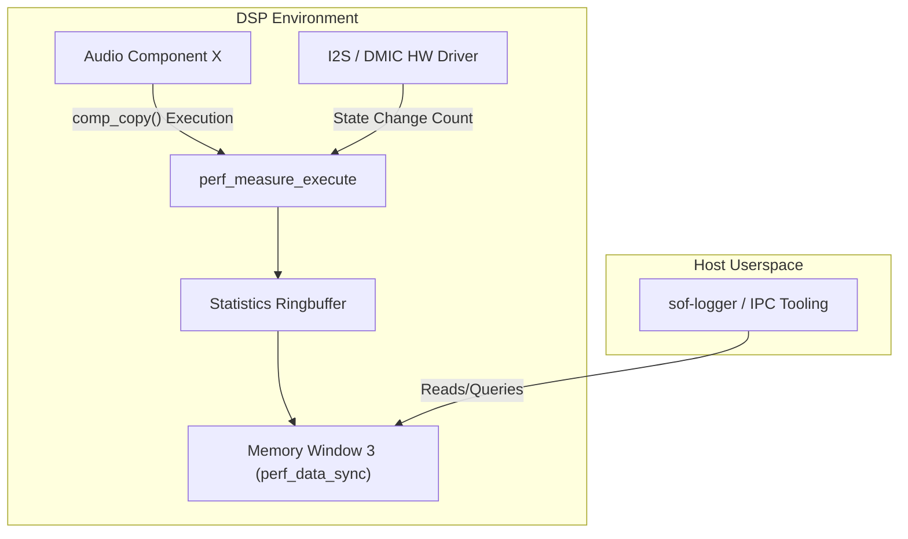

# Telemetry and Performance Measurements

The SOF Telemetry subsystem is a suite of built-in diagnostics measuring code execution efficiencies, cycle overheads, and hardware I/O throughput.

## Feature Overview

Latency and real-time execution bounds are critical in DSP firmware. The telemetry feature provides mechanisms to monitor these bounds accurately without intrusive breakpoints or slowing down the pipeline too aggressively.

Capabilities include:

1. **Component Performance Tracking**: For every instantiated component in the graph, it measures the pure execution time bounds (min/max/average) of that component's `comp_copy()` routines.
2. **I/O Throughput Tracking**: Measures hardware bus speeds or message handling by counting bytes, state changes, or tokens across distinct interfaces: IPC, DMIC, I2S, HD/A, I2C, SPI, etc.
3. **Zephyr Systick Measurement**: Specifically tracks the overall scheduler overhead bounding RTOS ticks.

Measurements are batched into a ringbuffer locally, then synced across mapped ADSP memory windows into user space, limiting the impact on the active instruction cache.

## Architecture

The architecture bridges the component layer (like pure IPC or Audio Component wrappers) directly into independent statistics accumulators.

## How to Enable

Telemetry depends strictly on NOT being built inside a host-userspace environment simulator (`depends on !SOF_USERSPACE_LL`). Ensure your target is a physical or emulated DSP target.

Settings to configure in `Kconfig`:

* `CONFIG_SOF_TELEMETRY=y` : Enable the overarching telemetry interfaces, giving you systick and basic task metrics over Memory Window 2 interfaces.
* `CONFIG_SOF_TELEMETRY_PERFORMANCE_MEASUREMENTS=y` : Adds granular tracking to audio components (creating the explicit `telemetry.c` ringbuffer maps via Memory Window 3 slots). Be aware that only a specific configured amount (`PERFORMANCE_DATA_ENTRIES_COUNT`) can be actively tracked due to RAM constraints.
* `CONFIG_SOF_TELEMETRY_IO_PERFORMANCE_MEASUREMENTS=y` : Instructs hardware and communication buses to start pumping data into the metrics collector.

## Extracting Data

You can fetch these metrics via `sof-logger` or standard IPC interrogation tools that support polling the corresponding debug window slots mapped for your particular platform's `ADSP_MW`.
